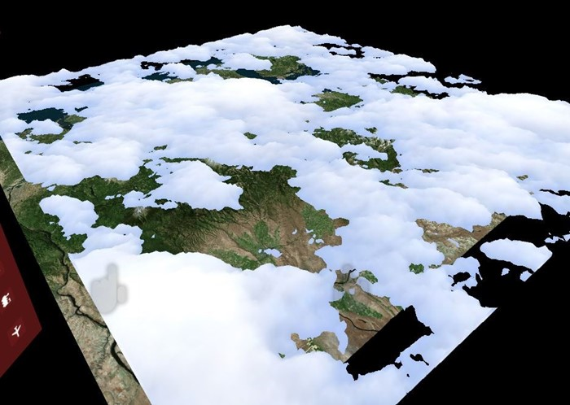
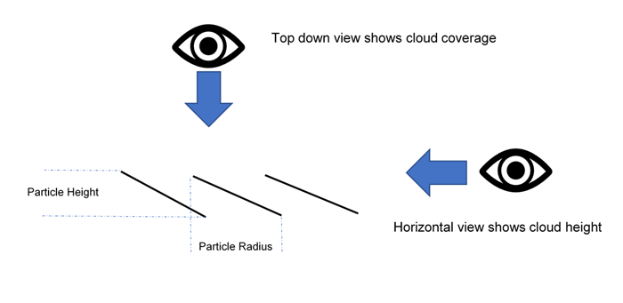

# Case study - Scale apps across devices with different GPU capabilities

This case study describes how a Windows Mixed Reality application can target various platforms with [different hardware capabilities](/windows/mixed-reality/enthusiast-guide/windows-mixed-reality-minimum-pc-hardware-compatibility-guidelines). Datascape is a Windows Mixed Reality application that displays weather data on top of terrain data. The application surrounds users with holographic data visualizations. Users can explore unique insights they gain by discovering data in mixed reality.

The Datascape app targets Microsoft HoloLens, Windows Mixed Reality immersive headsets, lower-powered PCs, and powerful PCs with high-end [graphics processing units (GPUs)](../develop/advanced-concepts/understanding-performance-for-mixed-reality.md#gpu-performance-recommendations). The main challenge was rendering a visually appealing scene, while executing at a high frame rate, on devices with wildly different GPU capabilities.

This case study walks through the process and techniques we used to create some of the more GPU-intensive systems, especially rendering clouds. We describe the problems we encountered and how we overcame them.

For more information about performance considerations for mixed reality and for Unity apps, see:

- [Understand performance for Mixed Reality](../develop/advanced-concepts/understanding-performance-for-mixed-reality.md)
- [Performance recommendations for Unity](../develop/unity/performance-recommendations-for-unity.md)

## Case study overview

Here's some background about the Datascape application and challenges.

### Transparency and overdraw

Our main rendering struggles dealt with transparency, since transparency can be expensive on a GPU.

You can render *solid geometry* front to back while writing to the depth buffer, which stops any future pixels located behind that pixel from rendering. This operation prevents hidden pixels from executing the pixel [shader](../develop/advanced-concepts/understanding-performance-for-mixed-reality.md#shaders), and speeds up rendering significantly. If you sort geometry optimally, each pixel on the screen draws only once.

*Transparent geometry* must be sorted back to front, and relies on blending the output of the pixel shader to the current pixel on the screen. This process can result in each pixel on the screen being drawn multiple times per frame, called [overdraw](../develop/unity/performance-recommendations-for-unity.md#limit-overdraw).

For HoloLens and mainstream PCs, you can only fill the screen a few times, making transparent rendering problematic.

### Datascape scene components

The Datascape scene has three major components: the **UI**, the **map**, and the **weather**. We knew that the weather effects would need all the GPU they could get, so we designed the UI and map to reduce overdraw.

We reworked the UI several times to minimize the amount of overdraw. For components like glowing buttons and map overviews, we chose to use more complex geometry rather than overlaying transparent art.

For the map, we used a custom shader that [stripped out standard Unity features like shadows and complex lighting](../develop/unity/performance-recommendations-for-unity.md#optimal-lighting-settings). The custom shader replaced these features with a simple, single sun lighting model, and a custom fog calculation. This simple pixel shader freed up GPU cycles.

We got both the UI and the map to render at budget, so they didn't need any hardware-dependent changes. The weather visualization, especially the cloud rendering, was more challenging.

### Cloud data

Cloud data downloaded from [NOAA servers](https://nomads.ncep.noaa.gov) in three distinct 2D layers. Each layer had the top and bottom height of the cloud, and density of the cloud, for each cell of the grid. We processed the data into a cloud info texture that stored each component in the red, green, and blue component of the texture for easy GPU access.

## Create geometry clouds

To make sure lower-powered machines could render the clouds, our backup approach used solid geometry to minimize overdraw.

We produced clouds by generating a solid heightmap mesh for each layer. We used the radius of the cloud info texture per vertex to generate the shape. We used a geometry shader to produce the vertices at the tops and bottoms of the clouds, generating solid cloud shapes. We used the density value from the texture to color the cloud with darker colors for denser clouds.

The following shader code creates the vertices:

```cs
v2g vert (appdata v)
{
    v2g o;
    o.height = tex2Dlod(_MainTex, float4(v.uv, 0, 0)).x;
    o.vertex = v.vertex;
    return o;
}
 
g2f GetOutput(v2g input, float heightDirection)
{
    g2f ret;
    float4 newBaseVert = input.vertex;
    newBaseVert.y += input.height * heightDirection * _HeigthScale;
    ret.vertex = UnityObjectToClipPos(newBaseVert);
    ret.height = input.height;
    return ret;
}
 
[maxvertexcount(6)]
void geo(triangle v2g p[3], inout TriangleStream<g2f> triStream)
{
    float heightTotal = p[0].height + p[1].height + p[2].height;
    if (heightTotal > 0)
    {
        triStream.Append(GetOutput(p[0], 1));
        triStream.Append(GetOutput(p[1], 1));
        triStream.Append(GetOutput(p[2], 1));
 
        triStream.RestartStrip();
 
        triStream.Append(GetOutput(p[2], -1));
        triStream.Append(GetOutput(p[1], -1));
        triStream.Append(GetOutput(p[0], -1));
    }
}
fixed4 frag (g2f i) : SV_Target
{
    clip(i.height - 0.1f);
 
    float3 finalColor = lerp(_LowColor, _HighColor, i.height);
    return float4(finalColor, 1);
}
```

We introduced a small noise pattern to get more detail on top of the real data. To produce round cloud edges, we discarded near-zero values by clipping the pixels in the pixel shader when the interpolated radius value hit a threshold.

Since the clouds are solid geometry, they can render before the terrain renders. Hiding the expensive map pixels underneath the clouds further improves frame rate. Because of the solid geometry rendering approach, this solution ran well on all graphics cards, from minimum-spec to high-end graphics cards, and on HoloLens.



## Use solid particle clouds

Our solution produced a decent representation of the cloud data, but was a bit lackluster. The cloud rendering didn't convey the volumetric feel we wanted for our high-end machines. Our next step was to produce a more organic and volumetric look by representing the clouds with approximately 100,000 particles.

If particles stay solid and sort front-to-back, you still benefit from depth buffer culling behind previously rendered particles, reducing overdraw. Also, a particle-based solution can alter the number of particles to target different hardware. However, all pixels still need to be depth tested, which causes more overhead.

First, we created particle positions around the center point of the experience at startup. We distributed the particles more densely around the center and less so in the distance. We pre-sorted all particles from the center to the back, so the closest particles rendered first.

A compute shader sampled the cloud info texture to position each particle at a correct height, and color it based on density.

We used [DrawProcedural](https://docs.unity3d.com/ScriptReference/Graphics.DrawProcedural.html) to render a quad per particle, allowing the particle data to always stay on the GPU.

Each particle contained both a height and a radius. The height was based on the cloud data sampled from the cloud info texture. The radius was based on the initial distribution, which calculated and stored the horizontal distance to its closest neighbor. The quads used this data to orient themselves, angled by the height. When users look at a particle horizontally, it shows the height. When users look at the particle top-down, the area between it and its neighbors is covered.



The following shader code shows the distribution:

```cs
ComputeBuffer cloudPointBuffer = new ComputeBuffer(6, quadPointsStride);
cloudPointBuffer.SetData(new[]
{
    new Vector2(-.5f, .5f),
    new Vector2(.5f, .5f),
    new Vector2(.5f, -.5f),
    new Vector2(.5f, -.5f),
    new Vector2(-.5f, -.5f),
    new Vector2(-.5f, .5f)
});
 
StructuredBuffer<float2> quadPoints;
StructuredBuffer<float3> particlePositions;
v2f vert(uint id : SV_VertexID, uint inst : SV_InstanceID)
{
    // Find the center of the quad, from local to world space
    float4 centerPoint = mul(unity_ObjectToWorld, float4(particlePositions[inst], 1));
 
    // Calculate y offset for each quad point
    float3 cameraForward = normalize(centerPoint - _WorldSpaceCameraPos);
    float y = dot(quadPoints[id].xy, cameraForward.xz);
 
    // Read out the particle data
    float radius = ...;
    float height = ...;
 
    // Set the position of the vert
    float4 finalPos = centerPoint + float4(quadPoints[id].x, y * height, quadPoints[id].y, 0) * radius;
    o.pos = mul(UNITY_MATRIX_VP, float4(finalPos.xyz, 1));
    o.uv = quadPoints[id].xy + 0.5;
 
    return o;
}
```

We sorted the particles front-to-back, and still used a solid style shader to clip transparent pixels, not blend them. This technique handles a large number of particles even on lower-powered machines, avoiding costly overdraw.

## Try transparent particle clouds

The solid particles provided an organic feel to the cloud shapes, but still needed something to capture the fluffiness of clouds. We decided to try a custom solution for high-end graphics cards that introduces transparency. We simply switched the initial sorting order of the particles, and changed the shader to use the textures alpha.


This solution looked great, but proved too heavy for even the toughest machines. Each pixel had to be rendered on the screen hundreds of times.

## Render offscreen with lower resolution

To reduce the number of pixels for rendering the clouds, we rendered them in a buffer that was a quarter of screen resolution. We stretched the end result back onto the screen after drawing all the particles.

The following code shows the offscreen rendering:

```cs
cloudBlendingCommand = new CommandBuffer();
Camera.main.AddCommandBuffer(whenToComposite, cloudBlendingCommand);
 
cloudCamera.CopyFrom(Camera.main);
cloudCamera.rect = new Rect(0, 0, 1, 1);    //Adaptive rendering can set the main camera to a smaller rect
cloudCamera.clearFlags = CameraClearFlags.Color;
cloudCamera.backgroundColor = new Color(0, 0, 0, 1);
 
currentCloudTexture = RenderTexture.GetTemporary(Camera.main.pixelWidth / 2, Camera.main.pixelHeight / 2, 0);
cloudCamera.targetTexture = currentCloudTexture;
 
// Render clouds to the offscreen buffer
cloudCamera.Render();
cloudCamera.targetTexture = null;
 
// Blend low-res clouds to the main target
cloudBlendingCommand.Blit(currentCloudTexture, new RenderTargetIdentifier(BuiltinRenderTextureType.CurrentActive), blitMaterial);
```

This solution sped up processing fourfold, but had a couple of caveats. First, when rendering into an offscreen buffer, we lost all depth information from our main scene. Particles behind mountains rendered on top of the mountain.

Second, stretching the buffer introduced artifacts on the edges of clouds, where the resolution change was noticeable. The next two sections describe how we resolved these issues.

### Use a particle depth buffer

We needed to make the particles co-exist with the world geometry, where a mountain or object covered particles behind it. So we populated the offscreen buffer with a [depth buffer](../develop/unity/performance-recommendations-for-unity.md#optimize-depth-buffer-sharing) that contained the main scene geometry. To produce the depth buffer, we created a second camera that rendered only the solid geometry and depth of the scene.

We used the new texture in the cloud pixel shader to occlude pixels. We used the same texture to calculate the distance to the geometry behind a cloud pixel. By using that distance and applying it to the alpha of the pixel, we achieved the effect of clouds fading out as they get close to terrain. This effect removes any hard cuts where particles and terrain meet.


### Sharpen the edges

The stretched-up clouds looked almost identical to normal-size clouds at the centers of particles, or where they overlapped, but showed some artifacts at the cloud edges. Sharp edges appeared blurry, and camera motion introduced alias effects.

To solve this issue, we:

1. Ran a simple shader on the offscreen buffer, to determine where large changes in contrast occurred.
1. Put the pixels with large changes into a new stencil buffer.
1. Used the stencil buffer to mask out these high-contrast areas when applying the offscreen buffer back to the screen, resulting in holes in and around the clouds.
1. Rendered all the particles again in full-screen mode, using the stencil buffer to mask out everything but the edges, resulting in a minimal set of pixels touched. Since we already created the command buffer to render the particles, we simply rendered it again to the new camera.


The end result was sharp edges with cheap center sections of the clouds. While this solution is much faster than rendering all particles in full screen, there's still a cost to test pixels against the stencil buffer. A massive amount of overdraw is still expensive.

## Cull particles

For the wind effect, we generated long triangle strips in a compute shader, creating many wisps of wind in the world. The wind effect wasn't heavy on fill rate, due to the narrow strips. However, the many hundreds of thousands of vertices caused a heavy load for the vertex shader.

To reduce the load, we introduced append buffers on the compute shader, to feed a subset of the wind strips to be drawn. We used simple [view frustum culling](https://docs.unity3d.com/Manual/OcclusionCulling.html) logic in the compute shader to determine if a strip was outside of camera view, and prevented those strips from being added to the push buffer. This process significantly reduced the number of strips, freeing up needed GPU cycles.

The following code demonstrates an append buffer.

Compute shader:

```cs
AppendStructuredBuffer<int> culledParticleIdx;
 
if (show)
    culledParticleIdx.Append(id.x);
```

C# code:

```cs
protected void Awake() 
{
    // Create an append buffer, setting the maximum size and the contents stride length
    culledParticlesIdxBuffer = new ComputeBuffer(ParticleCount, sizeof(int), ComputeBufferType.Append);
 
    // Set up Args Buffer for Draw Procedural Indirect
    argsBuffer = new ComputeBuffer(4, sizeof(int), ComputeBufferType.IndirectArguments);
    argsBuffer.SetData(new int[] { DataVertCount, 0, 0, 0 });
}
 
protected void Update()
{
    // Reset the append buffer, and dispatch the compute shader normally
    culledParticlesIdxBuffer.SetCounterValue(0);
 
    computer.Dispatch(...)
 
    // Copy the append buffer count into the args buffer used by the Draw Procedural Indirect call
    ComputeBuffer.CopyCount(culledParticlesIdxBuffer, argsBuffer, dstOffset: 1);
    ribbonRenderCommand.DrawProceduralIndirect(Matrix4x4.identity, renderMaterial, 0, MeshTopology.Triangles, dataBuffer);
}
```

We tried this technique on the cloud particles, culling them on the compute shader, and only pushing the visible particles to be rendered. But we didn't save much GPU, because the biggest bottleneck was the number of cloud pixels to render onscreen, not the cost of calculating vertices.

Another problem was that the append buffer populated in random order, due to the parallelized computing of the particles. The sorted particles became unsorted, resulting in flickering cloud particles. There are techniques to sort the push buffer, but the limited amount of performance gain from culling particles would probably be offset by another sort. We decided not to pursue this optimization for the cloud particles.

## Use adaptive rendering

To ensure a steady frame rate on the app with varying rendering conditions, like a cloudy vs. clear view, we introduced adaptive rendering.

The first step of adaptive rendering is to measure GPU. We inserted custom code into the GPU command buffer at the beginning and end of a rendered frame, to capture both the left and right eye screen time.

Compare the rendering time to the desired refresh rate to show how close you come to dropping frames. When you come close to dropping frames, you can adapt rendering to be faster.

One simple way to adapt rendering is to change the screen viewport size so it requires fewer pixels to render. The system uses [UnityEngine.XR.XRSettings.renderViewportScale](https://docs.unity3d.com/ScriptReference/XR.XRSettings-renderViewportScale.html) to shrink the targeted viewport, and automatically stretches the result back up to fit the screen. A small change in scale is barely noticeable on world geometry, and a scale factor of 0.7 requires half the number of pixels to be rendered.


When we detect that we're about to drop frames, we lower the scale by a fixed ratio, and restore it when we're running fast enough again.

In this case study, we decided which cloud technique to use based on the graphics capabilities of the hardware at startup. You could also base this decision on data from GPU measurement, to help prevent the system from staying at low resolution for a long time.

## Recommendations

Targeting different hardware capabilities is challenging and requires planning. Here are some recommendations:

- Start targeting lower-powered machines, to get familiar with the problem space.
- Develop a backup solution that runs on all your machines. You can then layer in more complexity for high end machines, or enhance resolution of the backup solution.
- Design your solution with fill rate in mind, since pixels are your most precious resource.
- Target solid geometry over transparency.
- Design for worst-case scenarios, and consider using adaptive rendering for heavy situations.

## About the authors

<table>
<tr>
<td width="60px"></td>
<td><b>Robert Ferrese</b><br>Software engineer @Microsoft</td>
</tr>
<tr>
<td width="60px"></td>
<td><b>Dan Andersson</b><br>Software engineer @Microsoft</td>
</tr>
</table>


## See also
- [Understand performance for Mixed Reality](../develop/advanced-concepts/understanding-performance-for-mixed-reality.md)
- [Performance recommendations for Unity](../develop/unity/performance-recommendations-for-unity.md)
