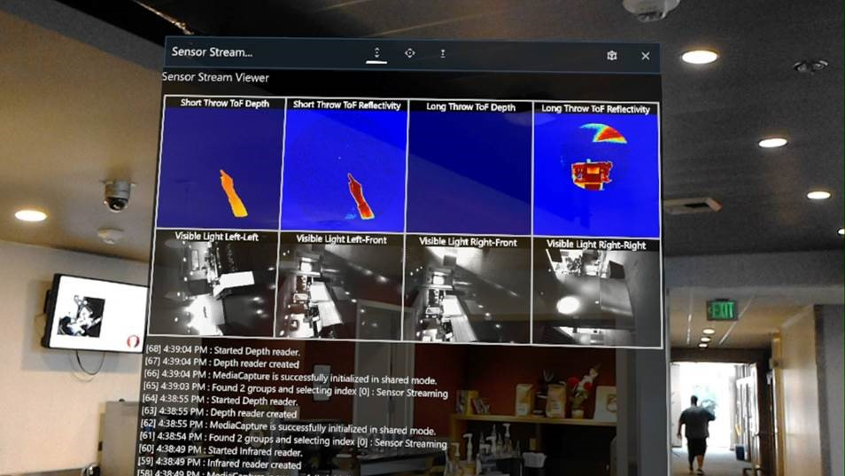

# HoloLens Research Mode tutorial at CVPR 2018
1:30pm - 2:50pm. June 19th, 2018

[CVPR 2018 Conference](https://cvpr2018.thecvf.com/)

## Presenters
* Marc Pollefeys
* Pawel Olszta

## Overview
Microsoft HoloLens is the world’s first self-contained, holographic computer, but it’s also a potent computer vision research device.
Application code can access audio and video streams and surface meshes, all in a world coordinate space maintained by HoloLens’
highly accurate head-tracking. This short tutorial will dive into the new “Research Mode” capability of HoloLens (available with the [Windows 10 April 2018 Update](/windows/mixed-reality/enthusiast-guide/release-notes-april-2018) for HoloLens).

We will show you how to access the raw head-tracking and depth sensor data streams, and make use of the intrinsics and
extrinsics of each stream.  We will also be demonstrating recent advances in time of flight depth-sensing technologies.

*A sample HoloLens application that displays any of the six Research Mode streams in real time.*

## Schedule
Note that this tutorial occurs on the same afternoon as Oral and Spotlight paper sessions, and for that reason we are keeping it short.
It will be done before the papers sessions begin at 2:50 PM.

- 1:30pm   Introduction to HoloLens 
- 1:45pm   Research Mode: getting your hands on the sensor streams 
- 2:15pm   Research Mode in use – demos and videos 
- 2:45pm   Sneak peek at recent advances in time-of-flight depth sensing 

Attendees to this tutorial will leave with a good sense of how HoloLens can be used for a range of Computer Vision research tasks, and materials to quickly get them started using the device.