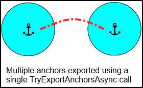

# Local anchor transfers in DirectX

In situations where you cannot use <a href="/azure/spatial-anchors" target="_blank">Azure Spatial Anchors</a>, local anchor transfers enable one HoloLens device to export an anchor to be imported by a second HoloLens device.

>[!NOTE]
>Local anchor transfers provide less robust anchor recall than <a href="/azure/spatial-anchors" target="_blank">Azure Spatial Anchors</a>, and iOS and Android devices are not supported by this approach.

>[!NOTE]
>The code snippets in this article currently demonstrate use of C++/CX rather than C++17-compliant C++/WinRT as used in the [C++ holographic project template](../develop/native/creating-a-holographic-directx-project.md).  The concepts are equivalent for a C++/WinRT project, though you will need to translate the code.

## Transferring spatial anchors

You can transfer spatial anchors between Windows Mixed Reality devices by using the [SpatialAnchorTransferManager](/uwp/api/Windows.Perception.Spatial.SpatialAnchorTransferManager). This API lets you bundle up an anchor with all the supporting sensor data needed to find that exact place in the world, and then import that bundle on another device. Once the app on the second device has imported that anchor, each app can render holograms using that shared spatial anchor's coordinate system, which will then appear in the same place in the real world.

Note that spatial anchors are not able to transfer between different device types, for example a HoloLens spatial anchor may not be locatable using an immersive headset.  Transferred anchors are also not compatible with iOS or Android devices.

## Set up your app to use the spatialPerception capability

Your app must be granted permission to use the SpatialPerception capability before it can use the [SpatialAnchorTransferManager](/uwp/api/Windows.Perception.Spatial.SpatialAnchorTransferManager). This is necessary because transferring a spatial anchor involves sharing sensor images gathered over time in vicinity of that anchor, which might include sensitive information.

Declare this capability in the package.appxmanifest file for your app. Here's an example:

```
<Capabilities>
  <uap2:Capability Name="spatialPerception" />
</Capabilities>
```

The capability comes from the **uap2** namespace. To get access to this namespace in your manifest, include it as an *xlmns* attribute in the &lt;Package> element. Here's an example:

```
<Package
    xmlns="https://schemas.microsoft.com/appx/manifest/foundation/windows10"
    xmlns:mp="https://schemas.microsoft.com/appx/2014/phone/manifest"
    xmlns:uap="https://schemas.microsoft.com/appx/manifest/uap/windows10"
    xmlns:uap2="https://schemas.microsoft.com/appx/manifest/uap/windows10/2"
    IgnorableNamespaces="uap mp"
    >
```

**NOTE:** Your app will need to request the capability at runtime before it can access SpatialAnchor export/import APIs. See [RequestAccessAsync](/uwp/api/Windows.Perception.Spatial.SpatialAnchorTransferManager) in the examples below.

## Serialize anchor data by exporting it with the SpatialAnchorTransferManager

A helper function is included in the code sample to export (serialize) [SpatialAnchor](/uwp/api/Windows.Perception.Spatial.SpatialAnchor) data. This export API serializes all anchors in a collection of key-value pairs associating strings with anchors.

```
// ExportAnchorDataAsync: Exports a byte buffer containing all of the anchors in the given collection.
//
// This function will place data in a buffer using a std::vector<byte>. The ata buffer contains one or more
// Anchors if one or more Anchors were successfully imported; otherwise, it is ot modified.
//
task<bool> SpatialAnchorImportExportHelper::ExportAnchorDataAsync(
    vector<byte>* anchorByteDataOut,
    IMap<String^, SpatialAnchor^>^ anchorsToExport
    )
{
```

First, we need to set up the data stream. This will allow us to 1.) use TryExportAnchorsAsync to put the data in a buffer owned by the app, and 2.) read data from the exported byte buffer stream - which is a WinRT data stream - into our own memory buffer, which is a std::vector&lt;byte>.

```
// Create a random access stream to process the anchor byte data.
InMemoryRandomAccessStream^ stream = ref new InMemoryRandomAccessStream();
// Get an output stream for the anchor byte stream.
IOutputStream^ outputStream = stream->GetOutputStreamAt(0);
```

We need to ask permission to access spatial data, including anchors that are exported by the system.

```
// Request access to spatial data.
auto accessRequestedTask = create_taskSpatialAnchorTransferManager::RequestAccessAsync()).then([anchorsToExport, utputStream](SpatialPerceptionAccessStatus status)
{
    if (status == SpatialPerceptionAccessStatus::Allowed)
    {
        // Access is allowed.
        // Export the indicated set of anchors.
        return create_task(SpatialAnchorTransferManager::TryExportAnchorsAsync(
            anchorsToExport,
            outputStream
            ));
    }
    else
    {
        // Access is denied.
        return task_from_result<bool>(false);
    }
});
```

If we do get permission and anchors are exported, we can read the data stream. Here, we also show how to create the DataReader and InputStream we will use to read the data.

```
// Get the input stream for the anchor byte stream.
IInputStream^ inputStream = stream->GetInputStreamAt(0);
// Create a DataReader, to get bytes from the anchor byte stream.
DataReader^ reader = ref new DataReader(inputStream);
return accessRequestedTask.then([anchorByteDataOut, stream, reader](bool nchorsExported)
{
    if (anchorsExported)
    {
        // Get the size of the exported anchor byte stream.
        size_t bufferSize = static_cast<size_t>(stream->Size);
        // Resize the output buffer to accept the data from the stream.
        anchorByteDataOut->reserve(bufferSize);
        anchorByteDataOut->resize(bufferSize);
        // Read the exported anchor store into the stream.
        return create_task(reader->LoadAsync(bufferSize));
    }
    else
    {
        return task_from_result<size_t>(0);
    }
```

After we read bytes from the stream, we can save them to our own data buffer like so.

```
}).then([anchorByteDataOut, reader](size_t bytesRead)
{
    if (bytesRead > 0)
    {
        // Read the bytes from the stream, into our data output buffer.
        reader->ReadBytes(Platform::ArrayReference<byte>(&(*anchorByteDataOut)[0], bytesRead));
        return true;
    }
    else
    {
        return false;
    }
});
};
```

## Deserialize anchor data by importing it into the system using the SpatialAnchorTransferManager

A helper function is included in the code sample to load previously exported data. This deserialization function provides a collection of key-value pairs, similar to what the SpatialAnchorStore provides - except that we got this data from another source, such as a network socket. You can process and reason about this data before storing it offline, using in-app memory, or (if applicable) your app's SpatialAnchorStore.

```
// ImportAnchorDataAsync: Imports anchors from a byte buffer that was previously exported.
//
// This function will import all anchors from a data buffer into an in-memory ollection of key, value
// pairs that maps String objects to SpatialAnchor objects. The Spatial nchorStore is not affected by
// this function unless you provide it as the target collection for import.
//
task<bool> SpatialAnchorImportExportHelper::ImportAnchorDataAsync(
    std::vector<byte>& anchorByteDataIn,
    IMap<String^, SpatialAnchor^>^ anchorMapOut
    )
{
```

First, we need to create stream objects to access the anchor data. We will be writing the data from our buffer to a system buffer, so we will create a DataWriter that writes to an in-memory data stream in order to accomplish our goal of getting anchors from a byte buffer into the system as SpatialAnchors.

```
// Create a random access stream for the anchor data.
InMemoryRandomAccessStream^ stream = ref new InMemoryRandomAccessStream();
// Get an output stream for the anchor data.
IOutputStream^ outputStream = stream->GetOutputStreamAt(0);
// Create a writer, to put the bytes in the stream.
DataWriter^ writer = ref new DataWriter(outputStream);
```

Once again, we need to ensure the app has permission to export spatial anchor data, which could include private information about the user's environment.

```
// Request access to transfer spatial anchors.
return create_task(SpatialAnchorTransferManager::RequestAccessAsync()).then(
    [&anchorByteDataIn, writer](SpatialPerceptionAccessStatus status)
{
    if (status == SpatialPerceptionAccessStatus::Allowed)
    {
        // Access is allowed.
```

If access is allowed, we can write bytes from the buffer to a system data stream.

```
// Write the bytes to the stream.
        byte* anchorDataFirst = &anchorByteDataIn[0];
        size_t anchorDataSize = anchorByteDataIn.size();
        writer->WriteBytes(Platform::ArrayReference<byte>(anchorDataFirst, anchorDataSize));
        // Store the stream.
        return create_task(writer->StoreAsync());
    }
    else
    {
        // Access is denied.
        return task_from_result<size_t>(0);
    }
```

If we were successful in storing bytes in the data stream, we can try to import that data using the SpatialAnchorTransferManager.

```
}).then([writer, stream](unsigned int bytesWritten)
{
    if (bytesWritten > 0)
    {
        // Try to import anchors from the byte stream.
        return create_task(writer->FlushAsync())
            .then([stream](bool dataWasFlushed)
        {
            if (dataWasFlushed)
            {
                // Get the input stream for the anchor data.
                IInputStream^ inputStream = stream->GetInputStreamAt(0);
                return create_task(SpatialAnchorTransferManager::TryImportAnchorsAsync(inputStream));
            }
            else
            {
                return task_from_result<IMapView<String^, SpatialAnchor^>^>(nullptr);
            }
        });
    }
    else
    {
        return task_from_result<IMapView<String^, SpatialAnchor^>^>(nullptr);
    }
```

If the data is able to be imported, we get a map view of key-value pairs associating strings with anchors. We can load this into our own in-memory data collection, and use that collection to look for anchors that we are interested in using.

```
}).then([anchorMapOut](task<Windows::Foundation::Collections::IMapView<String^, SpatialAnchor^>^>  previousTask)
{
    try
    {
        auto importedAnchorsMap = previousTask.get();
        // If the operation was successful, we get a set of imported anchors.
        if (importedAnchorsMap != nullptr)
        {
            for each (auto& pair in importedAnchorsMap)
            {
                // Note that you could look for specific anchors here, if you know their key values.
                auto const& id = pair->Key;
                auto const& anchor = pair->Value;
                // Append "Remote" to the end of the anchor name for disambiguation.
                std::wstring idRemote(id->Data());
                idRemote += L"Remote";
                String^ idRemoteConst = ref new String (idRemote.c_str());
                // Store the anchor in the current in-memory anchor map.
                anchorMapOut->Insert(idRemoteConst, anchor);
            }
            return true;
        }
    }
    catch (Exception^ exception)
    {
        OutputDebugString(L"Error: Unable to import the anchor data buffer bytes into the in-memory anchor collection.\n");
    }
    return false;
});
}
```

**NOTE:** Just because you can import an anchor, doesn't necessarily mean that you can use it right away. The anchor might be in a different room, or another physical location entirely; the anchor won't be locatable until the device that received it has enough visual information about the environment the anchor was created in, to restore the anchor's position relative to the known current environment. The client implementation should try locating the anchor relative to your local coordinate system or reference frame before continuing on to try to use it for live content. For example, try locating the anchor relative to a current coordinate system periodically until the anchor begins to be locatable.

## Special Considerations

The [TryExportAnchorsAsync](/uwp/api/Windows.Perception.Spatial.SpatialAnchorTransferManager) API allows multiple [SpatialAnchors](/uwp/api/Windows.Perception.Spatial.SpatialAnchor) to be exported into the same opaque binary blob. However, there is a subtle difference in what data the blob will include, depending on whether a single SpatialAnchor or multiple SpatialAnchors are exported in a single call.

### Export of a single SpatialAnchor

The blob contains a representation of the environment in the vicinity of the SpatialAnchor so that the environment can be recognized on the device that imports the SpatialAnchor. After the import completes, the new SpatialAnchor will be available to the device. Assuming the user has recently been in vicinity of the anchor, it will be locatable and holograms attached to the SpatialAnchor can be rendered. These holograms will show up in the same physical location that they did on the original device which exported the SpatialAnchor.


### Export of multiple SpatialAnchors

Like the export of a single SpatialAnchor, the blob contains a representation of the environment in the vicinity of all the specified SpatialAnchors. In addition, the blob contains information about the connections between the included SpatialAnchors, if they are located in the same physical space. This means that if two nearby SpatialAnchors are imported, then a hologram attached to the *second* SpatialAnchor would be locatable even if the device only recognizes the environment around the *first* SpatialAnchor, because enough data to compute transform between the two SpatialAnchors was included in the blob. If the two SpatialAnchors were exported individually (two separate calls to TryExportSpatialAnchors) then there may not be enough data included in the blob for holograms attached to the second SpatialAnchor to be locatable when the first one is located.

 

## Example: Send anchor data using a Windows::Networking::StreamSocket

Here, we provide an example of how to use exported anchor data by sending it across a TCP network. This is from the HolographicSpatialAnchorTransferSample.

The WinRT StreamSocket class uses the PPL task library. In the case of network errors, the error is returned to the next task in the chain using an exception that is re-thrown. The exception contains an HRESULT indicating the error status.

### Use a Windows::Networking::StreamSocketListener with TCP to send exported anchor data

Create a server instance that listens for a connection.

```
void SampleAnchorTcpServer::ListenForConnection()
{
    // Make a local copy to avoid races with Closed events.
    StreamSocketListener^ streamSocketListener = m_socketServer;
    if (streamSocketListener == nullptr)
    {
        OutputDebugString(L"Server listening for client.\n");
        // Create the web socket connection.
        streamSocketListener = ref new StreamSocketListener();
        streamSocketListener->Control->KeepAlive = true;
        streamSocketListener->BindEndpointAsync(
            SampleAnchorTcpCommon::m_serverHost,
            SampleAnchorTcpCommon::m_tcpPort
            );
        streamSocketListener->ConnectionReceived +=
            ref new Windows::Foundation::TypedEventHandler<StreamSocketListener^, StreamSocketListenerConnectionReceivedEventArgs^>(
                std::bind(&SampleAnchorTcpServer::OnConnectionReceived, this, _1, _2)
                );
        m_socketServer = streamSocketListener;
    }
    else
    {
        OutputDebugString(L"Error: Stream socket listener not created.\n");
    }
}
```

When a connection is received, use the client socket connection to send anchor data.

```
void SampleAnchorTcpServer::OnConnectionReceived(StreamSocketListener^ listener, StreamSocketListenerConnectionReceivedEventArgs^ args)
{
    m_socketForClient = args->Socket;
    if (m_socketForClient != nullptr)
    {
        // In this example, when the client first connects, we catch it up to the current state of our anchor set.
        OutputToClientSocket(m_spatialAnchorHelper->GetAnchorMap());
    }
}
```

Now, we can begin to send a data stream that contains the exported anchor data.

```
void SampleAnchorTcpServer::OutputToClientSocket(IMap<String^, SpatialAnchor^>^ anchorsToSend)
{
    m_anchorTcpSocketStreamWriter = ref new DataWriter(m_socketForClient->OutputStream);
    OutputDebugString(L"Sending stream to client.\n");
    SendAnchorDataStream(anchorsToSend).then([this](task<bool> previousTask)
    {
        try
        {
            bool success = previousTask.get();
            if (success)
            {
                OutputDebugString(L"Anchor data sent!\n");
            }
            else
            {
                OutputDebugString(L"Error: Anchor data not sent.\n");
            }
        }
        catch (Exception^ exception)
        {
            HandleException(exception);
            OutputDebugString(L"Error: Anchor data was not sent.\n");
        }
    });
}
```

Before we can send the stream itself, we must first send a header packet. This header packet must be of fixed length, and it must also indicate the length of the variable array of bytes that is the anchor data stream; in the case of this example we have no other header data to send, so our header is 4 bytes long and contains a 32-bit unsigned integer.

```
Concurrency::task<bool> SampleAnchorTcpServer::SendAnchorDataLengthMessage(size_t dataStreamLength)
{
    unsigned int arrayLength = dataStreamLength;
    byte* data = reinterpret_cast<byte*>(&arrayLength);
    m_anchorTcpSocketStreamWriter->WriteBytes(Platform::ArrayReference<byte>(data, SampleAnchorTcpCommon::c_streamHeaderByteArrayLength));
    return create_task(m_anchorTcpSocketStreamWriter->StoreAsync()).then([this](unsigned int bytesStored)
    {
        if (bytesStored > 0)
        {
            OutputDebugString(L"Anchor data length stored in stream; Flushing stream.\n");
            return create_task(m_anchorTcpSocketStreamWriter->FlushAsync());
        }
        else
        {
            OutputDebugString(L"Error: Anchor data length not stored in stream.\n");
            return task_from_result<bool>(false);
        }
    });
}
Concurrency::task<bool> SampleAnchorTcpServer::SendAnchorDataStreamIMap<String^, SpatialAnchor^>^ anchorsToSend)
{
    return SpatialAnchorImportExportHelper::ExportAnchorDataAsync(
        &m_exportedAnchorStoreBytes,
        anchorsToSend
        ).then([this](bool anchorDataExported)
    {
        if (anchorDataExported)
        {
            const size_t arrayLength = m_exportedAnchorStoreBytes.size();
            if (arrayLength > 0)
            {
                OutputDebugString(L"Anchor data was exported; sending data stream length message.\n");
                return SendAnchorDataLengthMessage(arrayLength);
            }
        }
        OutputDebugString(L"Error: Anchor data was not exported.\n");
        // No data to send.
        return task_from_result<bool>(false);
```

Once the stream length, in bytes, has been sent to the client, we can proceed to write the data stream itself to the socket stream. This will cause the anchor store bytes to get sent to the client.

```
}).then([this](bool dataLengthSent)
    {
        if (dataLengthSent)
        {
            OutputDebugString(L"Data stream length message sent; writing exported anchor store bytes to stream.\n");
            m_anchorTcpSocketStreamWriter->WriteBytes(Platform::ArrayReference<byte>(&m_exportedAnchorStoreBytes[0], m_exportedAnchorStoreBytes.size()));
            return create_task(m_anchorTcpSocketStreamWriter->StoreAsync());
        }
        else
        {
            OutputDebugString(L"Error: Data stream length message not sent.\n");
            return task_from_result<size_t>(0);
        }
    }).then([this](unsigned int bytesStored)
    {
        if (bytesStored > 0)
        {
            PrintWstringToDebugConsole(
                std::to_wstring(bytesStored) +
                L" bytes of anchor data written and stored to stream; flushing stream.\n"
                );
        }
        else
        {
            OutputDebugString(L"Error: No anchor data bytes were written to the stream.\n");
        }
        return task_from_result<bool>(false);
    });
}
```

As noted earlier in this topic, we must be prepared to handle exceptions containing network error status messages. For errors that are not expected, we can write the exception info to the debug console like so. This will give us a clue as to what happened if our code sample is unable to complete the connection, or if it is unable to finish sending the anchor data.

```
void SampleAnchorTcpServer::HandleException(Exception^ exception)
{
    PrintWstringToDebugConsole(
        std::wstring(L"Connection error: ") +
        exception->ToString()->Data() +
        L"\n"
        );
}
```

### Use a Windows::Networking::StreamSocket with TCP to receive exported anchor data

First, we have to connect to the server. This code sample shows how to create and configure a StreamSocket, and create a DataReader that you can use to acquire network data using the socket connection.

**NOTE:** If you run this sample code, ensure that you configure and launch the server before starting the client.

```
task<bool> SampleAnchorTcpClient::ConnectToServer()
{
    // Make a local copy to avoid races with Closed events.
    StreamSocket^ streamSocket = m_socketClient;
    // Have we connected yet?
    if (m_socketClient == nullptr)
    {
        OutputDebugString(L"Client is attempting to connect to server.\n");
        EndpointPair^ endpointPair = ref new EndpointPair(
            SampleAnchorTcpCommon::m_clientHost,
            SampleAnchorTcpCommon::m_tcpPort,
            SampleAnchorTcpCommon::m_serverHost,
            SampleAnchorTcpCommon::m_tcpPort
            );
        // Create the web socket connection.
        m_socketClient = ref new StreamSocket();
        // The client connects to the server.
        return create_task(m_socketClient->ConnectAsync(endpointPair, SocketProtectionLevel::PlainSocket)).then([this](task<void> previousTask)
        {
            try
            {
                // Try getting all exceptions from the continuation chain above this point.
                previousTask.get();
                m_anchorTcpSocketStreamReader = ref new DataReader(m_socketClient->InputStream);
                OutputDebugString(L"Client connected!\n");
                m_anchorTcpSocketStreamReader->InputStreamOptions = InputStreamOptions::ReadAhead;
                WaitForAnchorDataStream();
                return true;
            }
            catch (Exception^ exception)
            {
                if (exception->HResult == 0x80072741)
                {
                    // This code sample includes a very simple implementation of client/server
                    // endpoint detection: if the current instance tries to connect to itself,
                    // it is determined to be the server.
                    OutputDebugString(L"Starting up the server instance.\n");
                    // When we return false, we'll start up the server instead.
                    return false;
                }
                else if ((exception->HResult == 0x8007274c) || // connection timed out
                    (exception->HResult == 0x80072740)) // connection maxed at server end
                {
                    // If the connection timed out, try again.
                    ConnectToServer();
                }
                else if (exception->HResult == 0x80072741)
                {
                    // No connection is possible.
                }
                HandleException(exception);
                return true;
            }
        });
    }
    else
    {
        OutputDebugString(L"A StreamSocket connection to a server already exists.\n");
        return task_from_result<bool>(true);
    }
}
```

Once we have a connection, we can wait for the server to send data. We do this by calling LoadAsync on the stream data reader.

The first set of bytes we receive should always be the header packet, which indicates the anchor data stream byte length as described in the previous section.

```
void SampleAnchorTcpClient::WaitForAnchorDataStream()
{
    if (m_anchorTcpSocketStreamReader == nullptr)
    {
        // We have not connected yet.
        return;
    }
    OutputDebugString(L"Waiting for server message.\n");
    // Wait for the first message, which specifies the byte length of the string data.
    create_task(m_anchorTcpSocketStreamReader->LoadAsync(SampleAnchorTcpCommon::c_streamHeaderByteArrayLength)).then([this](unsigned int numberOfBytes)
    {
        if (numberOfBytes > 0)
        {
            OutputDebugString(L"Server message incoming.\n");
            return ReceiveAnchorDataLengthMessage();
        }
        else
        {
            OutputDebugString(L"0-byte async task received, awaiting server message again.\n");
            WaitForAnchorDataStream();
            return task_from_result<size_t>(0);
        }
```

...

```
task<size_t> SampleAnchorTcpClient::ReceiveAnchorDataLengthMessage()
{
    byte data[4];
    m_anchorTcpSocketStreamReader->ReadBytes(Platform::ArrayReference<byte>(data, SampleAnchorTcpCommon::c_streamHeaderByteArrayLength));
    unsigned int lengthMessageSize = *reinterpret_cast<unsigned int*>(data);
    if (lengthMessageSize > 0)
    {
        OutputDebugString(L"One or more anchors to be received.\n");
        return task_from_result<size_t>(lengthMessageSize);
    }
    else
    {
        OutputDebugString(L"No anchors to be received.\n");
        ConnectToServer();
    }
    return task_from_result<size_t>(0);
}
```

After we have received the header packet, we know how many bytes of anchor data we should expect. We can proceed to read those bytes from the stream.

```
}).then([this](size_t dataStreamLength)
    {
        if (dataStreamLength > 0)
        {
            std::wstring debugMessage = std::to_wstring(dataStreamLength);
            debugMessage += L" bytes of anchor data incoming.\n";
            OutputDebugString(debugMessage.c_str());
            // Prepare to receive the data stream in one or more pieces.
            m_anchorStreamLength = dataStreamLength;
            m_exportedAnchorStoreBytes.clear();
            m_exportedAnchorStoreBytes.resize(m_anchorStreamLength);
            OutputDebugString(L"Loading byte stream.\n");
            return ReceiveAnchorDataStream();
        }
        else
        {
            OutputDebugString(L"Error: Anchor data size not received.\n");
            ConnectToServer();
            return task_from_result<bool>(false);
        }
    });
}
```

Here's our code for receiving the anchor data stream. Again, we will first load the bytes from the stream; this operation may take some time to complete as the StreamSocket waits to receive that amount of bytes from the network.

When the loading operation is complete, we can read that number of bytes. If we received the number of bytes that we expect for the anchor data stream, we can go ahead and import the anchor data; if not, there must have been some sort of error. For example, this can happen when the server instance terminates before it can finish sending the data stream, or the network goes down before the entire data stream can be received by the client.

```
task<bool> SampleAnchorTcpClient::ReceiveAnchorDataStream()
{
    if (m_anchorStreamLength > 0)
    {
        // First, we load the bytes from the network socket.
        return create_task(m_anchorTcpSocketStreamReader->LoadAsync(m_anchorStreamLength)).then([this](size_t bytesLoadedByStreamReader)
        {
            if (bytesLoadedByStreamReader > 0)
            {
                // Once the bytes are loaded, we can read them from the stream.
                m_anchorTcpSocketStreamReader->ReadBytes(Platform::ArrayReference<byte>(&m_exportedAnchorStoreBytes[0],
                    bytesLoadedByStreamReader));
                // Check status.
                if (bytesLoadedByStreamReader == m_anchorStreamLength)
                {
                    // The whole stream has arrived. We can process the data.
                    // Informational message of progress complete.
                    std::wstring infoMessage = std::to_wstring(bytesLoadedByStreamReader);
                    infoMessage += L" bytes read out of ";
                    infoMessage += std::to_wstring(m_anchorStreamLength);
                    infoMessage += L" total bytes; importing the data.\n";
                    OutputDebugStringW(infoMessage.c_str());
                    // Kick off a thread to wait for a new message indicating another incoming anchor data stream.
                    WaitForAnchorDataStream();
                    // Process the data for the stream we just received.
                    return SpatialAnchorImportExportHelper::ImportAnchorDataAsync(m_exportedAnchorStoreBytes, m_spatialAnchorHelper->GetAnchorMap());
                }
                else
                {
                    OutputDebugString(L"Error: Fewer than expected anchor data bytes were received.\n");
                }
            }
            else
            {
                OutputDebugString(L"Error: No anchor bytes were received.\n");
            }
            return task_from_result<bool>(false);
        });
    }
    else
    {
        OutputDebugString(L"Warning: A zero-length data buffer was sent.\n");
        return task_from_result<bool>(false);
    }
}
```

Again, we must be prepared to handle unknown network errors.

```
void SampleAnchorTcpClient::HandleException(Exception^ exception)
{
    std::wstring error = L"Connection error: ";
    error += exception->ToString()->Data();
    error += L"\n";
    OutputDebugString(error.c_str());
}
```

That's it! Now, you should have enough information to try locating the anchors received over the network. Again, note that the client must have enough visual tracking data for the space to successfully locate the anchor; if it doesn't work right away, try walking around for a while. If it still doesn't work, have the server send more anchors, and use network communications to agree on one that works for the client. You can try this out by downloading the HolographicSpatialAnchorTransferSample, configuring your client and server IPs, and deploying it to client and server HoloLens devices.

## See also
* [Parallel Patterns Library (PPL)](/cpp/parallel/concrt/parallel-patterns-library-ppl)
* [Windows.Networking.StreamSocket](/uwp/api/Windows.Networking.Sockets.StreamSocket)
* [Windows.Networking.StreamSocketListener](/uwp/api/Windows.Networking.Sockets.StreamSocketListener)