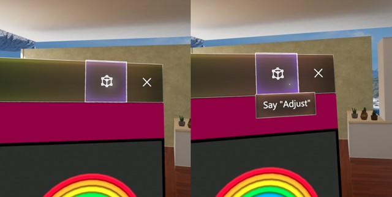

# Voice commanding

When using voice commands, gaze is typically used as the targeting mechanism, whether as a pointer ("select") or to direct your command to an application ("see it, say it"). Of course, some voice commands don't require a target at all, like "go to start" or "Hey, Cortana."

## Device support

<table>
    <colgroup>
    <col width="25%" />
    <col width="25%" />
    <col width="25%" />
    <col width="25%" />
    </colgroup>
    <tr>
        <td><strong>Feature</strong></td>
        <td><a href="/hololens/hololens1-hardware"><strong>HoloLens (1st gen)</strong></a></td>
        <td><a href="https://docs.microsoft.com/hololens/hololens2-hardware"><strong>HoloLens 2</strong></td>
        <td><a href="../discover/immersive-headset-hardware-details.md"><strong>Immersive headsets</strong></a></td>
    </tr>
     <tr>
        <td>Voice commanding</td>
        <td>✔️</td>
        <td>✔️</td>
        <td>✔️ (with headset attached)</td>
    </tr>
</table>

## How to use voice

Consider adding voice commands to any experience that you build. Voice is a powerful and convenient way to control the system and apps. Because users speak with a variety of dialects and accents, proper choice of speech keywords will make sure that your users' commands are interpreted unambiguously.

### Best practices

Below are some practices that will aid in smooth speech recognition.
* **Use concise commands** - When possible, choose keywords of two or more syllables. One-syllable words tend to use different vowel sounds when spoken by persons of different accents. Example: "Play video" is better than "Play the currently selected video"
* **Use simple vocabulary** - Example: "Show note" is better than "Show placard"
* **Make sure commands are non destructive** - Make sure any action that can be taken by a speech command is non destructive and can easily be undone in case another person speaking near the user accidentally triggers a command.
* **Avoid similar sounding commands** - Avoid registering multiple speech commands that sound very similar. Example: "Show more" and "Show store" can be very similar sounding.
* **Unregister your app when not it use** - When your app is not in a state in which a particular speech command is valid, consider unregistering it so that other commands are not confused for that one.
* **Test with different accents** - Test your app with users of different accents.
* **Maintain voice command consistency** - If "Go back" goes to the previous page, maintain this behavior in your applications.
* **Avoid using system commands** - The following voice commands are reserved for the system. These should not be used by applications.
   * "Hey Cortana"
   * "Select"

### "Select"

Saying "select" at any time will activate whatever the gaze cursor is pointing at. 

>Note: In HoloLens 2, the gaze cursor needs to first be invoked by saying the word "select". Say "select" again to activate. To hide the gaze cursor, simply use your hands to airtap or touch an object. 

### See it, say it

Windows Mixed Reality has employed a "see it, say it" voice model where **labels on buttons are identical to the associated voice commands**. Because there isn’t any dissonance between the label and the voice command, users can better understand what to say to control the system. To reinforce this, while dwelling on a button, a **"voice dwell tip"** appears to communicate which buttons are voice enabled.

 
*Examples of "see it, say it"*

### Voice's strengths

Voice input is a natural way to communicate our intents. Voice is especially good at interface **traversals** because it can help users cut through multiple steps of an interface (a user might say "go back" while looking at a Web page, instead of having to go up and click the Back button in the app). This small time savings has a powerful **emotional effect** on a user’s perception of the experience and gives them a small amount of superpower. Using voice is also a convenient input method when we have our arms full or are **multi-tasking**. On devices where typing on a keyboard is difficult, **voice dictation** can be an efficient, alternative way to input. Lastly, in some cases when the **range of accuracy** for gaze and gesture are limited, Voice might be a user’s only trusted method of input.

**How using voice can benefit the user**
* Reduces time - it should make the end goal more efficient.
* Minimizes effort - it should make tasks more fluid and effortless.
* Reduces cognitive load - it's intuitive, easy to learn, and remember.
* It's socially acceptable - it should fit in with societal norms in terms of behavior.
* It's routine - voice can readily become a habitual behavior.

### Voice's weaknesses

Voice also has some weaknesses. Fine-grained control is one of them. (for example, a user might say "louder," but can’t say how much. "A little" is hard to quantify. Moving or scaling things with voice is also difficult (voice does not offer the granularity of control). Voice can also be imperfect. Sometimes a voice system incorrectly hears a command or fails to hear a command. Recovering from such errors is a challenge in any interface. Lastly, voice may not be socially acceptable in public places. There are some things that users can’t or shouldn’t say. These cliffs allow speech to be used for what it is best at.

### Voice feedback states

When Voice is applied properly, the user understands **what they can say and get clear feedback** the system **heard them correctly**. These two signals make the user feel confident in using Voice as a primary input. Below is a diagram showing what happens to the cursor when voice input is recognized and how it communicates that to the user.

 
*Voice feedback states for cursor*

## Top things users should know about "speech" in mixed reality
* Say **"Select"** while targeting a button (you can use this anywhere to click a button).
* You can say the **label name of an app bar button** in some apps to take an action. For example, while looking at an app, a user can say the command "Remove" to remove the app from the world (this saves time from having to click it with your hand).
* You can initiate Cortana listening by saying **"Hey Cortana."** You can ask her questions ("Hey Cortana, how tall is the Eiffel tower?"), tell her to open an app ("Hey Cortana, open Netflix"), or tell her to bring up the Start Menu ("Hey Cortana, take me home") and more.

## Common questions and concerns users have about voice
* What can I say?
* How do I know the system heard me correctly?
   * The system keeps getting my voice commands wrong.
   * It doesn’t react when I give it a voice command.
* It reacts the wrong way when I give it a voice command.
* How do I target my voice to a specific app or app command?
* Can I use voice to command things out the holographic frame on HoloLens?

## See also
* [Gestures](../design/gaze-and-commit.md#composite-gestures)
* [Head-gaze and dwell](../design/gaze-and-dwell.md)