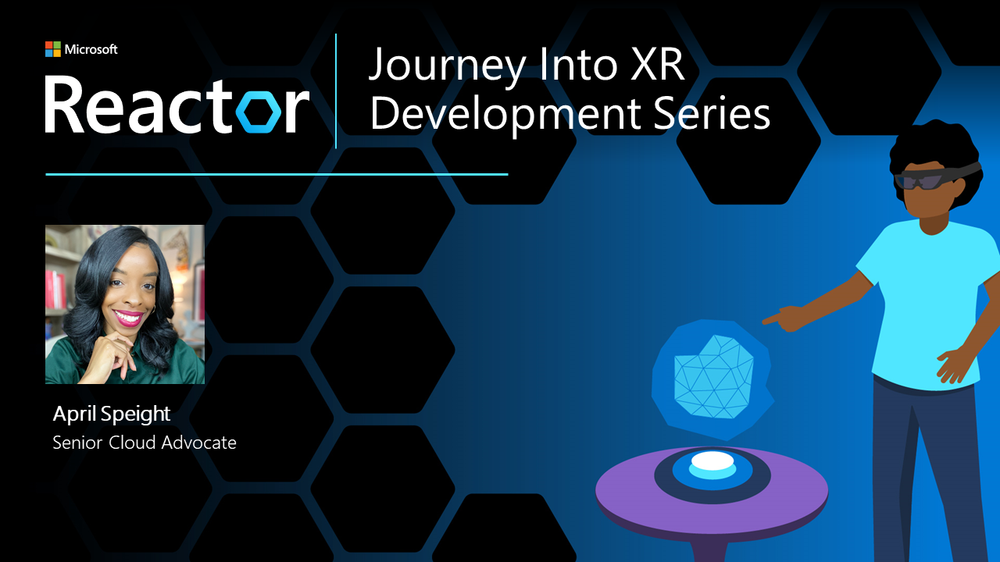

# Journey into Mixed Reality development (for beginners)

Join April Speight, leader of the Spatial Computing Cloud Advocacy team at Microsoft, for a 10-part video series dedicated to helping you get started with your Mixed Reality development journey. Created for the true beginner in mind, this series is ideal for developers and non-developers alike. Register below to attend an event and take part in live Q&A. You can also access the on-demand post-event recordings here shortly after. 

| Session title | Date | Description|
|-------------|-------------|--------|
| [Episode 1: Paths into Mixed Reality development](https://www.youtube.com/watch?v=XNX3gQWOdA0&list=PLlrxD0HtieHg7iAQdchuIls-ATakL9jMZ&index=1) | See [on-demand video](https://www.youtube.com/watch?v=XNX3gQWOdA0&list=PLlrxD0HtieHg7iAQdchuIls-ATakL9jMZ&index=1) | Come learn the lay of the land for getting started with XR development. We'll explore programming languages, engine options, device options, low code/no-code solutions, and general advice for getting started. |
| [Episode 2: Plan & design your Mixed Reality app](https://www.youtube.com/watch?v=67NXMD7tf8s&list=PLlrxD0HtieHg7iAQdchuIls-ATakL9jMZ&index=1) | See [on-demand video](https://www.youtube.com/watch?v=67NXMD7tf8s&list=PLlrxD0HtieHg7iAQdchuIls-ATakL9jMZ&index=1) | So, you have a great idea for an app but now what? Before heading into development, there's a lot to consider to ensure your app experience is well thought out and accessibly sound. Learn techniques and tips on planning and designing your future XR app. |
| Episode 3: Low-code/no-code platforms for AR | Thursday, February 10 from 9am - 10am PST | Did you know that coding isn't a requirement to create augmented reality apps? The number of low-code/no-code platforms for AR development has grown over the past few years - enabling creators of all backgrounds to develop their own AR experiences. Join us to explore various low-code/no-code platforms for AR development, including a demo for Microsoft Power Apps. [**Register here**](https://www.meetup.com/hololens-mr/events/283487520/) |
| Episode 4: Interactions for AR & VR development | Tuesday, February 22 from 10am - 11pm PST  | There are many ways to interact with virtual objects that go beyond using our hands and or motion controllers. Learn various input models that can enable you to interact with XR apps, including a demo for the Mixed Reality Toolkit. [**Register here**](https://www.meetup.com/hololens-mr/events/283487582/) |

New episodes will be posted every other week through May 2022.