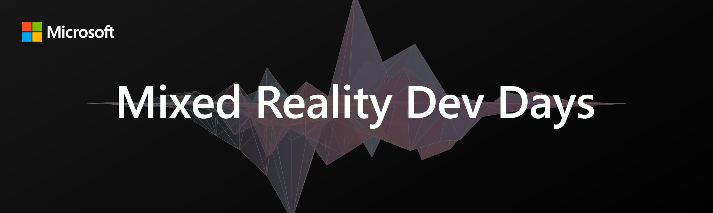

# Mixed Reality Dev Days Japan

For Mixed Reality Dev Day, hear from Microsoft leaders, learn from experts, and connect with the mixed reality developer community. 

## Session Recordings

[Watch all videos - YouTube playlist](https://www.youtube.com/playlist?list=PLQEKit6tfVVIZaQWKTuNMONjPiIKMuJRH)

All videos are archived on our YouTube Channel. Looking forward to seeing you again!

| **Session Title**|**Speaker**|**Language**|**Level**|
|---------|---------|---------|---------|
|[Keynote speech](https://youtu.be/MamMO11TnzY)|Madoka Chiyoda, Jesse McCulloch, Kaoru Nakamura, Tetsu Muranaka|JA/EN|N/A|
|**Break (10 min)**||||
|*Session 1* [Intro to Mixed Reality](https://youtu.be/HqJy91y8Of0)|Atsushi Suzuki|JA|100|
|*Session 2* [Mixed Reality business momentum](https://youtu.be/fJJ9I8UGbio)|Tetsu Muranaka|JA|200|
|*Lunch Session* Panel: Interactive free discussion, Q and A, MRTK + Oculus Quest 2 *update later|Madoka Chiyoda + Microsoft MVPs|JA|200|
|**Break (10 min)**||||
|*Session 3* [Overview of HoloLens 2 development](https://youtu.be/_z0CwAVkbiQ)|Madoka Chiyoda|JA|200|
|*Session 4* [MRTK UX components v2.5.0](https://youtu.be/If5R9diyF50)|Yoon Park|JA|300|
|*Session 5* [Getting started with the HoloLens 2 and Unreal Engine (MRTK-Unreal)](https://youtu.be/AsAuPx0iz3o)|Cameron Micka|EN|300|
|*Session 6* [Making Designing Holograms](https://youtu.be/jHn9yydiRTw)|Daniel Escudero|EN|300|
|**Break (20 min)**||||
|*Session 7* [Azure Object Anchors](https://youtu.be/dZCb6VJlaaU)|Jesse McCulloch|EN|300|
|*Session 8* [Azure Remote Rendering](https://youtu.be/MEhL12WGOW0)|Atsushi Suzuki|JA|300|
|*Session 9* [Aligning Hologram and Real World through Azure Spatial Anchors](https://youtu.be/ApBd_jSHg9Q)|Yingguang Mei|EN|300|
|*Session 10* [Unity + PiXYZ](https://youtu.be/ggRZRRN36VI)|Shinobu Takahashi (Unity Technologies Japan)|JA|200|
|*Session 11* [Azure Kinect DK Deep Dive, Case Study](https://youtu.be/C6gg2jBL3Tw)|Shinji Chiba|JA|400|
|Closing|Madoka Chiyoda|JA|N/A|

#### Contributors (Technical reviewers for the subtitles)

Futo Horio ([@Futo_Horio](https://twitter.com/Futo_Horio)), Takahiro Miyaura ([@takabrz1](https://twitter.com/takabrz1)), Akihiro Ueyama ([@akihiro01051](https://twitter.com/akihiro01051)), Kaoru Nakamura ([@kaorun55](https://twitter.com/kaorun55)), Shinya Tachihara ([@deco_c_](https://twitter.com/deco_c_))

## Frequently Asked Questions
This section will be updated frequently as we get more questions from you!

**Q** - Who should attend Mixed Reality Dev Day

**A** - This event is inclusive of everyone who works or plays in the Mixed Reality space. While most of the content being presented is developer-focused, we also know there's interesting content for a wide variety of roles. Remember to check the schedule for updates to see the kind of content we'll be providing.  

**Q** - I can't find the event in Teams Live Events

**A** - To participate, select the link in the email you'll receive after registering for the event. We recommend watching on the Teams PC app, and you can also participate in the Teams mobile app or in your desktop browser.

If for some reason you're unable to log in to Teams, check the YouTube channel where the event will be broadcast simultaneously. However, you can't participate in QA with the speakers.

**Q** - Will the presentation materials and session videos be available after the event?

**A** - We'll be releasing each video session, but because of the time involved, consider joining us live if you can!

## Code of Conduct and Microsoft Standard Event Guidelines

### Code of Conduct 

Microsoft's mission is to empower every person and every organization on the planet to achieve more. For all Microsoft events and gatherings on digital platforms, we seek to create a respectful, friendly, fun, and inclusive experience for all participants.

We expect all digital event participants to uphold the principles of this Code of Conduct, which covers the main digital event and all related activities. We don't tolerate disruptive or disrespectful behavior, messages, images, or interactions by any party participant, in any form, at any aspect of the program including business and social activities, regardless of location. Microsoft won't tolerate harassment or discrimination based on age, ancestry, color, gender identity or expression, national origin, physical or mental disability, religion, sexual orientation, or any other characteristic protected by applicable local laws, regulations, and ordinances.  

Photography, video, or recording of session content or presentations in any format shared in social channels is prohibited. We encourage everyone to help creating a welcoming and safe environment. Report any concerns, harassing behavior, suspicious, or disruptive activity to Business Conduct Hotline (1-877-320-MSFT or [buscond@microsoft.com](mailto:buscond@microsoft.com)). Microsoft reserves the right to refuse admittance to or remove any person from Mixed Reality Dev Days at any time at its sole discretion. 
