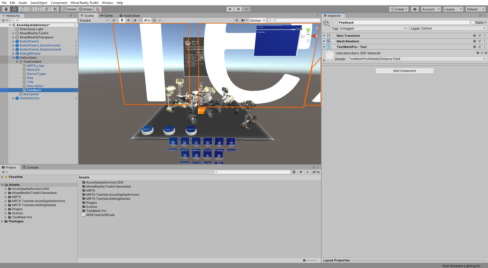
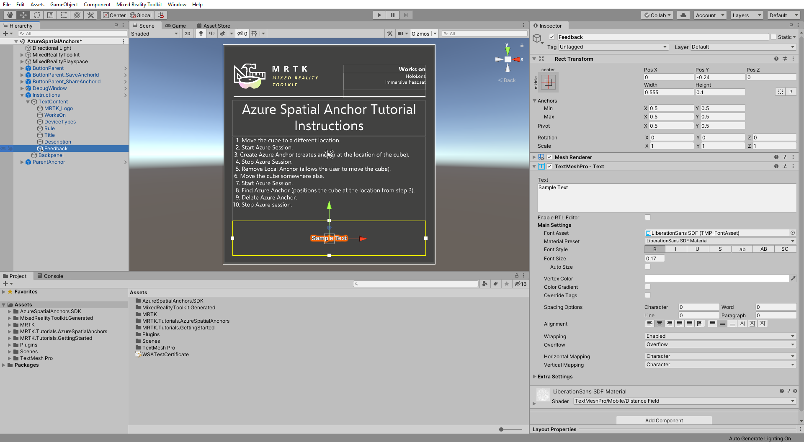
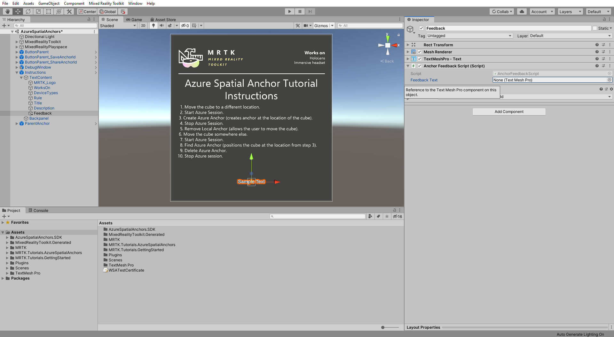
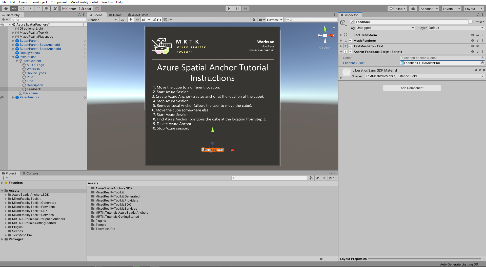

# 4. Displaying feedback from Azure Spatial Anchors

In this tutorial, you will learn how to provide users with feedback about anchors discovery, events, and status when using Azure Spatial Anchors (ASA).

## Objectives

* Learn how to set up a UI panel that displays important information about the current ASA session
* learn about and explore feedback elements that the ASA SDK makes available to users

## Setting up ASA feedback panel

In the Hierarchy window, right-click on the **Instructions** > **TextContent** object and select **3D Object** > **Text - TextMeshPro** to create a TextMeshPro text object as a child of the Instructions > TextContent object and give it a suitable name, for example, **Feedback**:

> [!TIP]
> To make it easier to work with your scene, set the  <a href="https://docs.unity3d.com/Manual/SceneVisibility.html" target="_blank">Scene Visibility</a> for the ParentAnchor object to off by clicking the eye icon to the left of the object. This hides the object in the Scene window without changing their in-game visibility.

With the **Feedback** object still selected, in the Inspector window change its position and size so it is placed neatly underneath the instruction text, for example:

* Change the Rect Transform **Pos Y** to -0.24
* Change the Rect Transform **Width** to 0.555
* Change the Rect Transform **Height** to 0.1

Then choose font properties so the text fits nicely within the text area, for example:

* Change the Text Mesh Pro (Script) **Font Style** to Bold
* Change the Text Mesh Pro (Script) **Font Size** to 0.17
* Change the Text Mesh Pro (Script) **Alignment** to Center and Middle

With the **Feedback** object still selected, in the Inspector window, use the **Add Component** button to add the **Anchor Feedback Script (Script)** component to the Feedback object:

Assign the **Feedback** object itself to the **Anchor Feedback Script (Script)** component's **Feedback Text** field:

## Congratulations

In this tutorial, you learned how to create a UI panel to display the current status of the Azure Spatial Anchors experience for providing users with real-time feedback.

[Next Tutorial: 5. Azure Spatial Anchors for Android and iOS](mr-learning-asa-05.md)
