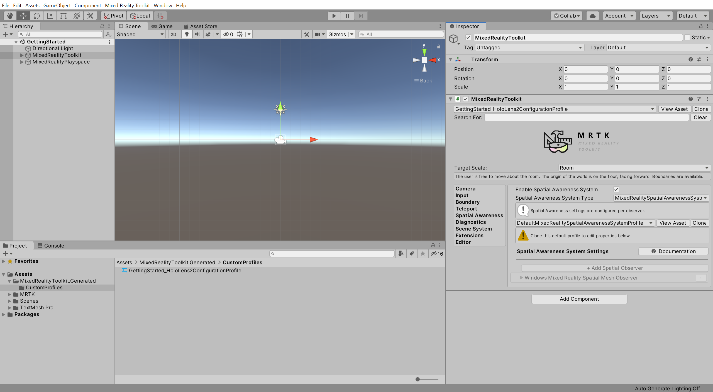

# 3. Configuring the Mixed Reality Toolkit profiles

## Overview

In this tutorial, you will learn how to customize and configure the MRTK profiles.

This particular example will show you how to hide the spatial awareness mesh by changing the settings of the Spatial Mesh Observer. However, you may follow these same principles to customize any setting or value in the MRTK profiles.

## Objectives

* Learn how to customize and configure Mixed Reality Toolkit profiles
* Hide the spatial awareness mesh

## Changing the Spatial Awareness Display Option

The main steps you will take to hide the spatial awareness mesh are:

1. Clone the default Configuration Profile
2. Enable the Spatial Awareness System
3. Clone the default Spatial Awareness System Profile
4. Clone the default Spatial Awareness Mesh Observer Profile
5. Change the visibility of the spatial awareness mesh

> [!NOTE]
> By default, the MRTK profiles are not editable. These are default profile templates that you have to clone before they can be edited. There are several nested layers of profiles. Therefore, it is common to clone and edit several profiles when configuring one or more settings.

### 1. Clone the default Configuration Profile

> [!NOTE]
> The Configuration Profile is the top level profile. Consequently, to be able to edit any other profiles, you first have to clone the Configuration Profile.

With the **MixedRealityToolkit** object selected in the Hierarchy window, in the Inspector window, change the **MixedRealityToolkit** Configuration Profile to **DefaultHoloLens2ConfigurationProfile**:

With the **MixedRealityToolkit** object still selected, in the Inspector window, click the **Copy & Customize** button to open the Clone Profile window:

In the Clone Profile window, enter a suitable **Profile Name**, for example, _GettingStarted_HoloLens2ConfigurationProfile_, then click the **Clone** button to create an editable copy of the **DefaultHololens2ConfigurationProfile**:

The newly created Configuration Profile is now assigned as the Configuration Profile for your scene:

In the Unity menu, select **File** > **Save** to save your scene.

> [!TIP]
> Remember to save your work throughout the tutorial.

### 2. Enable the Spatial Awareness System

With the **MixedRealityToolkit** object still selected in the Hierarchy window, in the Inspector window, select the **Spatial Awareness** tab, and then check the **Enable Spatial Awareness System** checkbox:

### 3. Clone the default Spatial Awareness System Profile

In the **Spatial Awareness** tab, click the **Clone** button to open the Clone Profile window:

In the Clone Profile window, enter a suitable **Profile Name**, for example, _GettingStarted_MixedRealitySpatialAwarenessSystemProfile_, then click the **Clone** button to create an editable copy of the **DefaultMixedRealitySpatialAwarenessSystemProfile**:

The newly created Spatial Awareness System Profile is now automatically assigned to your Configuration Profile:

### 4. Clone the default Spatial Awareness Mesh Observer Profile

With the **Spatial Awareness** tab still selected, expand the **Windows Mixed Reality Spatial Mesh Observer** section, then click the **Clone** button to open the Clone Profile window:

In the Clone Profile window, enter a suitable **Profile Name**, for example, _GettingStarted_MixedRealitySpatialAwarenessSystemProfile_, then click the **Clone** button to create an editable copy of the **DefaultMixedRealitySpatialAwarenessMeshObserverProfile**:

The newly created Spatial Awareness Mesh Observer Profile is now automatically assigned to your Spatial Awareness System Profile:

### 5. Change the visibility of the spatial awareness mesh

In the **Spatial Mesh Observer Settings**, change the **Display Option** to **Occlusion** to make the spatial mapping mesh invisible while still being functional:

> [!NOTE]
> Although the spatial mapping mesh is not visible, it is still present and functional. For example, any holograms behind the spatial mapping mesh, such as a hologram behind a physical wall, will not be visible.

You just learned how to modify a setting in the MRTK profile. As you can see, in order to customize the MRTK settings, you first need to create copies of the default profiles. Because the default profiles are not editable, you will always have them as reference if you want revert back to the default settings. To learn more about MRTK profiles and their architecture, you can refer to the [Mixed Reality Toolkit profile configuration guide](https://microsoft.github.io/MixedRealityToolkit-Unity/Documentation/MixedRealityConfigurationGuide.html) in the [MRTK Documentation Portal](https://microsoft.github.io/MixedRealityToolkit-Unity/README.html).

## Congratulations

In this tutorial, you learned how to clone, customize, and configure an MRTK profile setting.

[Next Tutorial: 4. Positioning objects in the scene](mr-learning-base-04.md)
