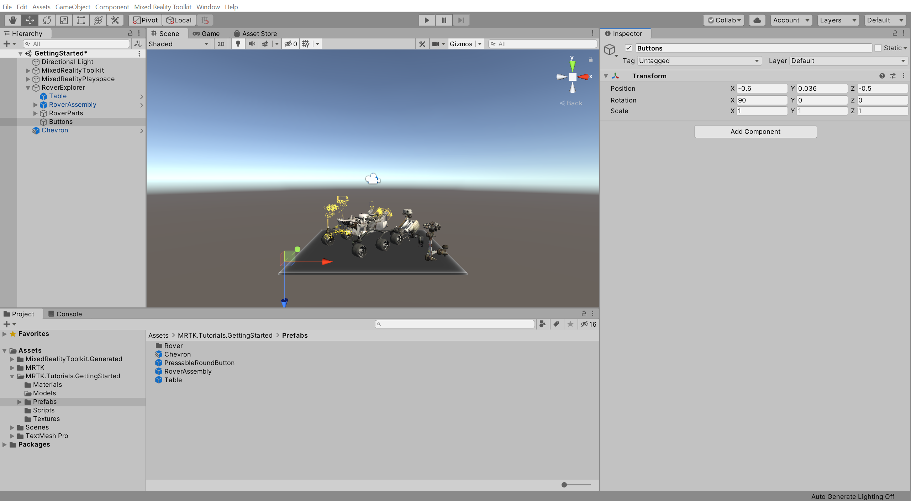
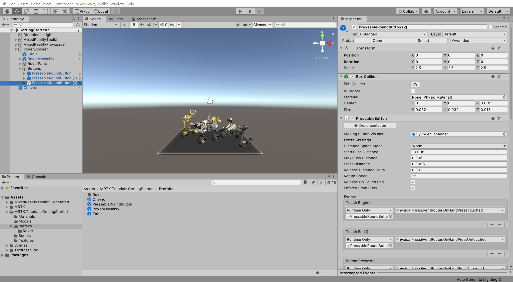
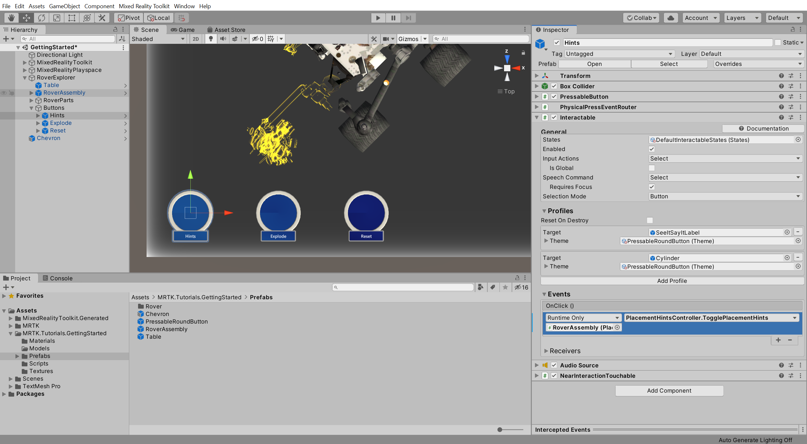
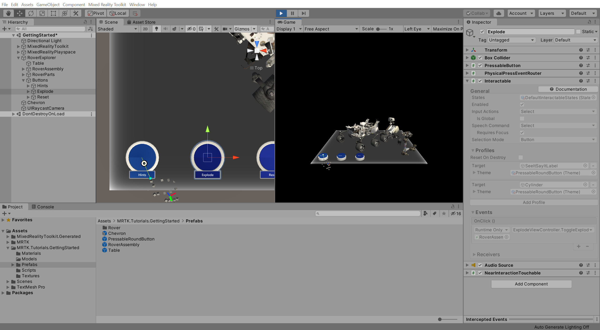
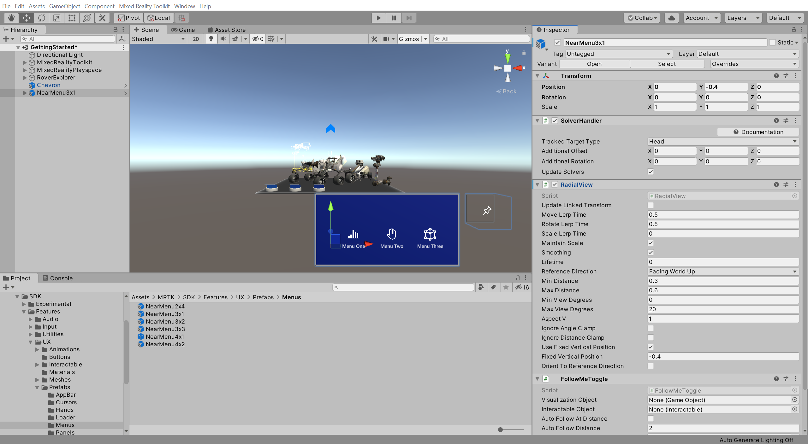

# 6. Creating user interface

## Overview

In this tutorial you will learn how to create and organize buttons along with UI text panels, and use default interaction (touch) to interact with each button. You will also explore the addition of simple actions and effects, such as changing the size, sound and color of objects.

## Objectives

* Customize and configure Mixed Reality Toolkit profiles
* Interact with holograms using UI elements and buttons
* Basic hand-tracking input and interactions

## Creating a static panel of buttons

In the Hierarchy window, right-click on the **RoverExplorer** object and select **3D Object** > **Create Empty** to add an empty object as a child of the RoverExplorer, name the object **Buttons**, and configure the **Transform** component as follows:

* **Position**: X = -0.6, Y = 0.036, Z = -0.5
* **Rotation**: X = 90, Y = 0, Z = 0
* **Scale**: X = 1, Y = 1, Z = 1

In the Project window, navigate to the **Assets** > **MRTK.Tutorials.GettingStarted** > **Prefabs** folder, click-and-drag the **PressableRoundButton** prefab on to the **Buttons** object, then right click on the PressableRoundButton and select **Duplicate** to create a copy, repeat until you have a total of three PressableRoundButton objects:

In the Hierarchy window, select the **Buttons** object, then in the Inspector window, use the **Add Component** button to add the **GridObjectCollection** component, and change the following values:

* **Sort Type**: Child Order
* **Layout**: Horizontal
* **Cell Width**: 0.2
* **Anchor**: Middle Left

Then click the **Update Collection** button to update the position of the Buttons child objects:

In the Hierarchy window, name the buttons **Hints**, **Explode**, and **Reset**, then for each button select the **SeeItSayItLabel** > **TextMeshPro** child object, and in the Inspector window change the **TextMeshPro - Text** component text to match the button names:

Once done, collapse the Buttons child objects.

In the Hierarchy window, select the **Hints** button object, then in the Inspector window, configure the Interactable **OnClick ()** event as follows:

* Assign the **RoverAssembly** object to the **None (Object)** field
* From the **No Function** dropdown, select **PlacementHintsController** > **TogglePlacementHints ()** to set the TogglePlacementHints () function as the action to be executed when the event is triggered

In the Hierarchy window, select the **Explode** button object, then in the Inspector window, configure the Interactable **OnClick ()** event as follows:

* Assign the **RoverAssembly** object to the **None (Object)** field
* From the **No Function** dropdown, select **ExplodedViewController** > **ToggleExplodedView ()** to set the ToggleExplodedView () function as the action to be executed when the event is triggered

Press the Play button to enter Game mode, then press-and-hold the space bar button to activate the hand and use the mouse to press the **Hints** button to toggle the visibility of the placement hint objects:

and the **Explode** button to toggle the exploded view on and off:

## Creating a dynamic menu that follows the user

In the Project window, navigate to the **Assets** > **MRTK** > **SDK** > **UX** > **Prefabs** > **Menus** folder, click-and-drag the **NearMenu3x1** prefab into the Hierarchy window, set it's Transform **Position** to X = 0, Y = -0.4, Z = 0 and configure it as follows:

* Verify that the **SolverHandler** component's **Tracked Target Type** is set to **Head**
* Check the checkbox next to the **RadialView** Solver component so it is enabled by default

## Adding text into your scene

In this section, you will learn how to add text to your mixed reality experiences using Unity's TextMesh Pro, which you prepared in the [Importing the TextMeshPro Essential Resources](mr-learning-base-02.md#importing-the-textmeshpro-essential-resources) section of the previous tutorial.

In this particular example, you will add a simple label underneath the button collection you created in the previous section.

Right-click on the ButtonCollection object and select **3D Object** > **Text - TextMeshPro** to create a TextMeshPro object as a child of the ButtonCollection object:

With the newly created TextMeshPro object, named Text (TMP), still selected, in the Inspector window change its position and size so the label is placed neatly underneath the button collection, for example:

* Change the Rect Transform **Pos Y** to -0.0425
* Change the Rect Transform **Width** to 0.24
* Change the Rect Transform **Height** to 0.024

Then update the text to reflect what the label is for and choose font properties so the text fits within the label, for example:

* Change the Text Mesh Pro (Script) **Text** to Button Collection
* Change the Text Mesh Pro (Script) **Font Style** to Bold
* Change the Text Mesh Pro (Script) **Font Size** to 0.2
* Change the Text Mesh Pro (Script) **Alignment** to Center and Middle

## Congratulations

In this tutorial, you learned how to clone, customize, and configure an MRTK profile setting. You also learned how to interact with buttons to trigger events using tracked hands on the HoloLens 2. Finally, you learned how to create a simple UI interface using the MRTK's Grid Object Collection component and Unity's Text Mesh Pro.

[Next Tutorial: 7. Interacting with 3D objects](mr-learning-base-07.md)
