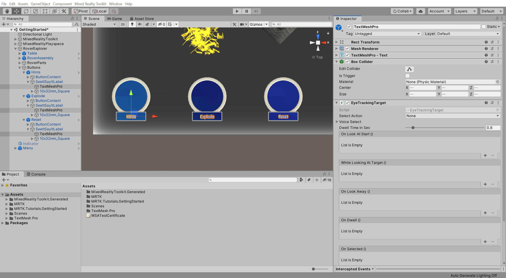
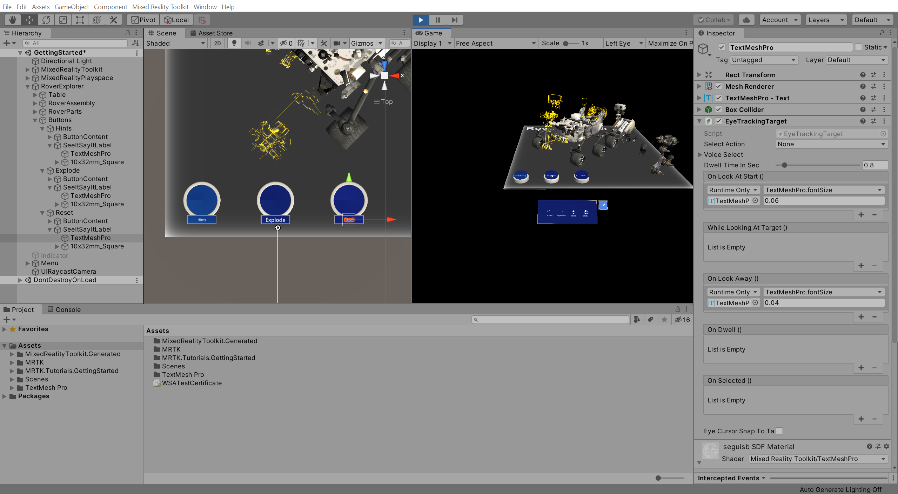

# 8. Using eye tracking

## Overview

In this tutorial, you will learn how to enable eye tracking for HoloLens 2 and how to add eye tracking to objects to trigger actions when the objects are looked at.

> [!NOTE]
> If you are also deploying this project to HoloLens (1st generation), note that eye tracking is only supported on HoloLens 2.

## Objectives

* Learn how to enable eye tracking for HoleLens 2
* learn how to use eye tracking to trigger action

## Ensuring the Eye Gaze Input capability is enabled

In the Unity menu, select Mixed Reality Toolkit > Utilities > **Configure Unity Project** to open the **MRTK Project Configurator** window, then in the **UWP Capabilities** section, verify that **Enable Eye Gaze Input Capability** is greyed out:

> [!NOTE]
> The Gaze Input capability should have been enabled during the [Apply the MRTK Project Configurator settings](mr-learning-base-02.md#apply-the-mrtk-project-configurator-settings) instructions when you configured the Unity project at the beginning of this tutorial series. However, if it is not enabled, make sure you enable it now.

## Enabling eye based gaze in the gaze provider

In the Hierarchy window, select the **MixedRealityToolkit** object, then in the Inspector window, select the MixedRealityToolkit > **Input** tab and take the following steps:

* Clone the **DefaultHoloLens2InputSystemProfile** and give it a suitable name, for example, _GettingStarted_HoloLens2InputSystemProfile_
* Expand the **Pointers** section
* Clone the **DefaultMixedRealityPointerProfile** and give it a suitable name, for example, _GettingStarted_MixedRealityPointerProfile_
* Located the **Gaze Settings** section and check the **Is Eye Tracking Enabled** checkbox

> [!TIP]
> For a reminder on how to clone MRTK profiles, you can refer to the [Configuring the Mixed Reality Toolkit profiles](mr-learning-base-03.md) instructions.

## Enabling simulated eye tracking for the Unity editor

In the Hierarchy window, select the **MixedRealityToolkit** object, then in the Inspector window, navigate to the **Input** tab, then:

* Expand the **Input Data Providers** > **Input Simulation Service** section
* Clone the **DefaultMixedRealityInputSimulationProfile** and give it a suitable name, for example, _GettingStarted_MixedRealityInputSimulationProfile_
* Located the **Eye Simulation** section and check the **Simulate Eye Position** checkbox

## Adding eye tracking to objects

In the Hierarchy window, expand the RoverExplorer > **Buttons** object, then for each of the three child button objects, expand and select the SeeItSayItLabel > **TextMeshPro** object:

With the three TextMeshPro objects still selected, in the Inspector window, use the **Add Component** button to add the following components to all the selected objects:

* **Box Collider** component
* **EyeTrackingTarget** component

In the Hierarchy window, select the Hints > SeeItSayItLabel > **TextMeshPro** object, then configure the **EyeTrackingTarget** component as follows:

* In the **On Look At Start ()** event section
  * Click the small **+** icon to add another event
  * Assign the the object itself, i.e. the same **TextMeshPro** object to the **None (Object)** field
  * From the **No Function** dropdown, select **TextMeshPro** > **float fontSize** to update the TextMeshPro.fontSize property value when the event is triggered
  * Set the argument to **0.06** to increase the font current size of 0.04 by 50%
* In the **On Look Away ()** event section
  * Click the small **+** icon to add another event
  * Assign the the object itself, i.e. the same **TextMeshPro** object to the **None (Object)** field
  * From the **No Function** dropdown, select **TextMeshPro** > **float fontSize** to update the TextMeshPro.fontSize property value when the event is triggered
  * Set the argument to **0.04** to reset the font size back to 0.04

**Repeat** this step for the Explode > SeeItSayItLabel > **TextMeshPro** object and the Reset > SeeItSayItLabel > **TextMeshPro** object.

If you now enter Game mode, you can use near or far interaction to move, rotate, and scale the Bounding Box, and use the Enable and Disable buttons to enable and disable the Bounding Box functionality:

## Congratulations

In this tutorial, you will learned how to enable eye tracking for HoloLens 2 and how to add eye tracking to objects to automatically trigger actions when the objects are looked at.

[Next Tutorial: 9. Using speech commands](mr-learning-base-09.md)
