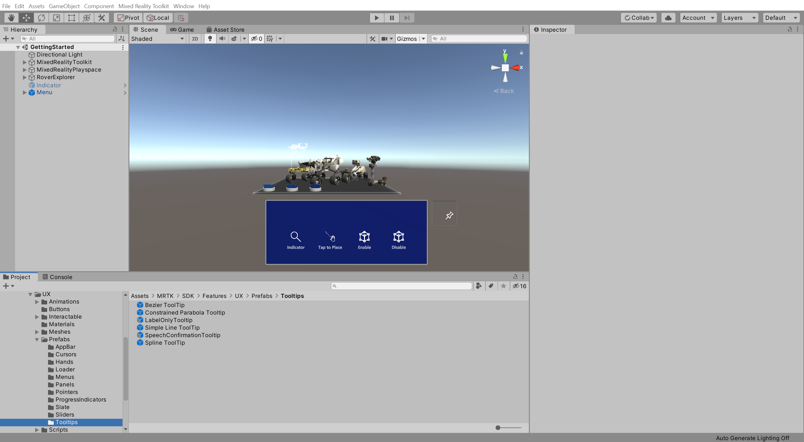
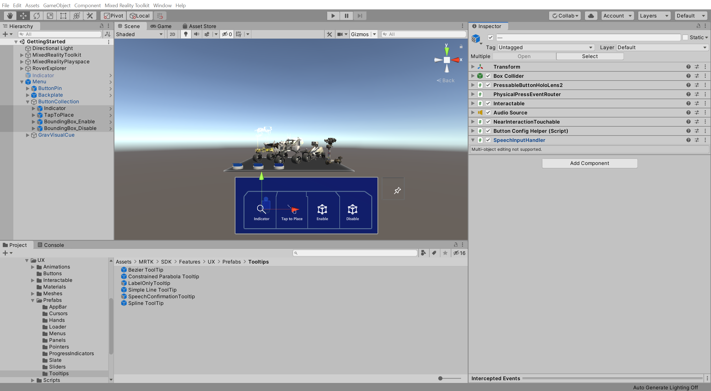

# 9. Using speech commands

## Overview

In this tutorial, you will explore a few advanced input options for HoloLens 2, including the use of voice commands, panning gesture, and eye tracking.

## Objectives

* Trigger events using voice commands and keywords
* Use tracked hands to pan textures and 3D objects with tracked hands
* Leverage HoloLens 2 eye tracking capabilities to select objects

## Ensuring the Microphone capability is enabled

In the Unity menu, select Mixed Reality Toolkit > Utilities > **Configure Unity Project** to open the **MRTK Project Configurator** window, then in the **UWP Capabilities** section, verify that **Enable Microphone Capability** is greyed out:

> [!NOTE]
> The Microphone capability should have been enabled during the [Apply the MRTK Project Configurator settings](mr-learning-base-02.md#1-apply-the-mrtk-project-configurator-settings) instructions when you configured the Unity project at the beginning of this tutorial series. However, if it is not enabled, make sure you enable it now.

## Creating speech commands

In the Hierarchy window, select the **MixedRealityToolkit** object, then in the Inspector window, select the MixedRealityToolkit > **Input** tab and take the following steps:

* Expand the **Speech** section
* Clone the **DefaultMixedRealitySpeechCommandsProfile** and give it a suitable name, for example, _GettingStarted_MixedRealitySpeechCommandsProfile_
* Verify that **Start Behaviour** is set to **Auto Start**

> [!TIP]
> For a reminder on how to clone MRTK profiles, you can refer to the [Configuring the Mixed Reality Toolkit profiles](mr-learning-base-03.md) instructions.

In the Speech > **Speech Commands** section, click the **+ Add a New Speech Command** button four times to add four new speech commands to the list of the existing speech commands, then in the **Keyword** fields enter the following phrases:

* Enable Indicator
* Enable Tap to Place
* Enable Bounding Box
* Disable Bounding Box

> [!TIP]
> If your computer doesn't have a microphone and you would like to test the speech commands using the in-editor simulation, you can assign a KeyCode to the speech commands which will let you trigger it when the corresponding key is pressed.

## Controlling speech commands

In the Project window, navigate to the **Assets** > **MRTK** > **SDK** > **Features** > **UX** > **Prefabs** > **ToolTip** folder to locate the tooltip prefabs:

In the Hierarchy window, expand the Menu > **ButtonCollection** object and select its four child objects, then in the Inspector window, use the **Add Component** button to add the **SpeechInputHandler** component to all the selected objects:

In the Hierarchy window, select the first button, i.e. the ButtonCollection > **Indicator** object, then in the Inspector window, take the following steps to configure the **SpeechInputHandler**:

* **Uncheck* the **Is Focus Required** checkbox

* Assign the **Indicator** object to the **None (Object)** field
* From the **No Function** dropdown, select **GameObject** > **SetActive (bool)** to set the SetActive () function as the action to be executed when the event is triggered
* Verify that the argument checkbox is **checked**

### 4. Add and configure the Speech Input Handler (Script) component

In the Hierarchy window, select the **Octa** object and add the **Speech Input Handler (Script)** component to the Octa object. Then uncheck the **Is Focus Required** checkbox Octa object to trigger the speech command:

### 5. Implement the Response event for the speech command

On the Speech Input Handler (Script) component, click the small **+** button to add a keyword element to the list of keywords:

Click the newly created **Element 0** to expand it, and then, from the **Keyword** dropdown, choose the **Play Music** keyword you created earlier:

> [!NOTE]
> The keywords in the Keyword dropdown are populated based on the keywords defined in the Speech Commands list in the Speech Commands Profile.

Create a new **Response ()** event, configure the **Octa** object to receive the event, define **AudioSource.PlayOneShot** as the action to be triggered, and assign a suitable audio clip to the **Audio Clip** field, for example, the MRTK_Gem audio clip:

## Congratulations

You have successfully added basic eye tracking capabilities to your application. These actions are only the beginning of a world of possibilities with eye tracking. In this tutorial, you also learned about other advanced input features, such as voice commands and panning gestures.

You have fully configured this application. Now, your application allows users to fully assemble the Lunar Module, launch the Lunar Module, toggle hints, and reset the application to start again.
