# 1. Getting started with AppX Holographic Remoting

* ## Overview

  Welcome to the second series of the HoloLens 2 tutorials. In this two-part tutorial series, you will learn how to create a Mixed Reality experience demonstration and how to create a Holographic Remoting remote app.

  In the first tutorial, [Create Mixed Reality experience](mrlearning-appx-ch1.md), you will learn how to create a Mixed Reality experience demonstrating UI elements, 3D model manipulation, model clipping, and eye-tracking features.

  In the second tutorial, [Create Holographic Remoting remote application](mrlearning-appx-ch2.md), you will learn how to create a Holographic Remoting remote app and connect to HoloLens 2 at any point, providing a way to visualize 3D content in Mixed Reality.

  ## Objectives

  - Import assets and set up the scene
  - Interact with holograms using UI elements and buttons
  - configuring 3D objects for the clipping feature.
  - Learn about eye tracking target select and highlight tooltips.

## Prerequisites

>[!TIP] If you have not completed the [Getting started tutorials](mrlearning-base.md) series yet, its recommended that you complete those tutorials first.
>
>- A Windows 10 PC configured with the correct [tools installed](install-the-tools.md)
>- Windows 10 SDK 10.0.18362.0 or later
>- Some essential C# programming ability
>- A HoloLens 2 device [configured for development](using-visual-studio.md#enabling-developer-mode)
>- [Unity Hub](https://docs.unity3d.com/Manual/GettingStartedInstallingHub.html) with Unity 2019.3.X mounted, and the Universal Windows Platform Build Support module added
>
>[!IMPORTANT] The recommended Unity version for this tutorial series is Unity 2019.3.X. It supersedes any Unity version requirements or recommendations stated in the prerequisites linked above.
>
>## Creating the Unity project
>
>In this section, you will create a new Unity project and get it ready for MRTK development.
>
>For this, first follow the [Initializing your project and first application](mrlearning-base-ch1.md), excluding the [Build your application to your device](mrlearning-base-ch1.md#build-your-application-to-your-device) instructions, which includes the following steps:
>
>1. [Create a new Unity project](mrlearning-base-ch1.md#create-new-unity-project) and give it a suitable name, for example, *MRTK Tutorials*
>2. [configuring the Unity project for Windows Mixed Reality](mrlearning-base-ch1.md#configuring-the-unity-project-for-windows-mixed-reality)
>3. [Import TextMesh Pro Essential Resources](mrlearning-base-ch1.md#import-textmesh-pro-essential-resources)
>4. [Import the Mixed Reality Toolkit](mrlearning-base-ch1.md#import-the-mixed-reality-toolkit)
>5. [configuring the Unity project for the Mixed Reality Toolkit](mrlearning-base-ch1.md#configuring-the-unity-project-for-the-mixed-reality-toolkit)
>6. [Add the Mixed Reality Toolkit to the Unity scene](mrlearning-base-ch1.md#configuring-the-mixed-reality-toolkit) and give the scene a suitable name, for example, *AppXHolographicRemoting*
>
>Then follow the [How to configuring the Mixed Reality Toolkit Profiles (Change Spatial Awareness Display Option)](mrlearning-base-ch2.md#how-to-configuring-the-mixed-reality-toolkit-profiles-change-spatial-awareness-display-option) instructions to change the MRTK configuration profile for your scene to the **DefaultHoloLens2ConfigurationProfile** and change the display options for the spatial awareness mesh to **Occlusion**.

## Importing the tutorial assets

Download and **import** the [MRTK.Tutorials.AppxHoloLensRemoting.unitypackage](https://github.com/Azure/azure-spatial-anchors-samples/releases/download/v2.1.1/AzureSpatialAnchors.unitypackage).

[!TIP] For a reminder on how to import a Unity custom package, you can refer to the [Import the Mixed Reality Toolkit](mrlearning-base-ch1.md#import-the-mixed-reality-toolkit) instructions.

After importing the tutorial assets, your Project window should look similar to this:

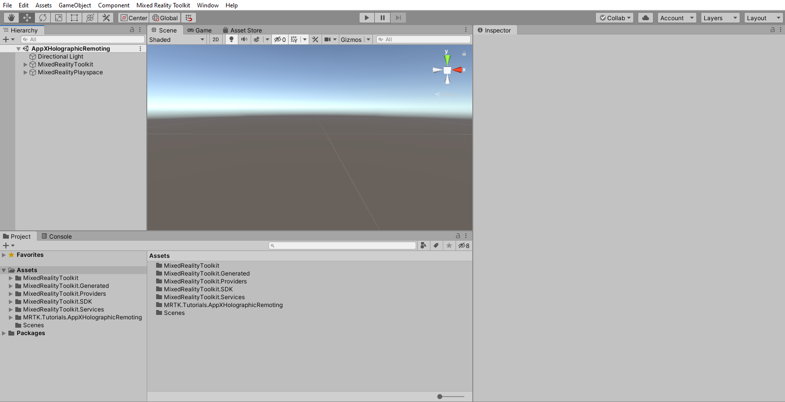

## Creating and preparing the scene

In this section, you will prepare the scene by adding some of the tutorial prefabs.

In the Project window, navigate to **Assets** > **MRTK.Tutorials.AppXHolograhicRemoting**> **Prefabs** folder. While holding down the CTRL button, click on **ButtonParent**, **ClippingObjects**, **ModelParent**, **Instructions**, **HandSpatialMapButton,** and **Platform** to select the six prefabs:

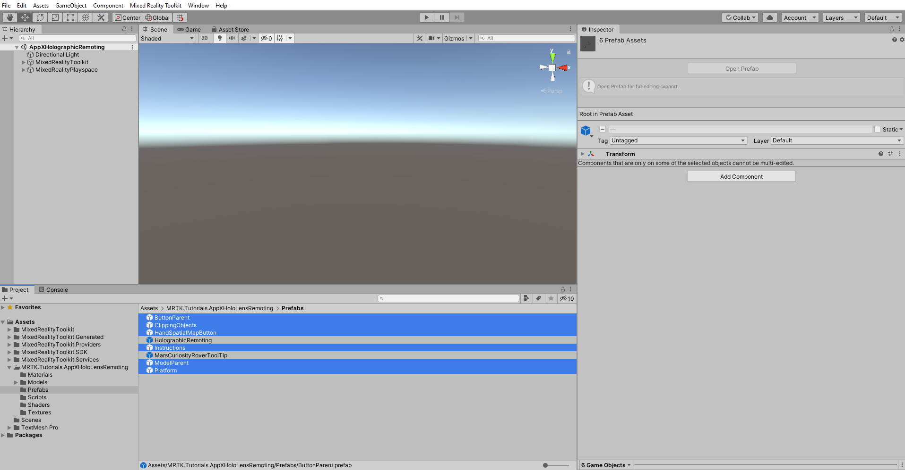

With the six prefabs still selected, drag them into the Hierarchy window to add them to the scene:

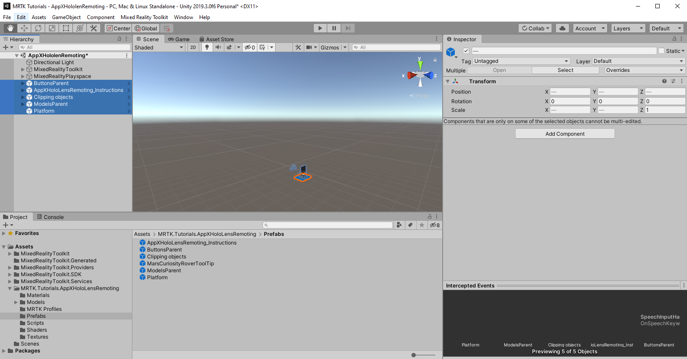

To focus in on the objects in the scene, you can double-click on the ModelParent object, and then zoom slightly in again:

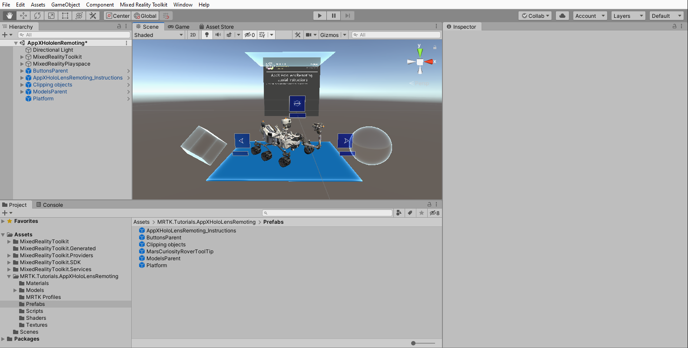

> [!TIP]
> If you find the large icons in your scene, for example, the large framed 'T' icons distracting, you can hide these by <a href="https://docs.unity3d.com/2019.1/Documentation/Manual/GizmosMenu.html" target="_blank">toggling the Gizmos</a> to the off position.

## Configuring the buttons to operate the scene

In this section, you will add scripts into the scene to create button events that demonstrate the fundamentals of model switching and clipping functionality. 

### 1. configuring the Interactable (Script) component

In the Hierarchy window, select the ButtonParent object and in the Inspector window, notice two scripts are attached to it, one **View Button Control (Script)** to change the 3D model in the scene and another **Toggle Button (Script)** to enable and disable the ClippingObjects object.

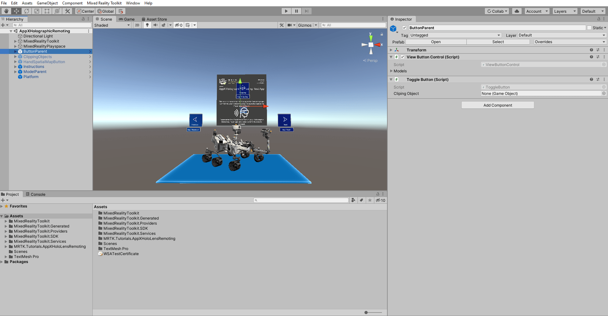

Now the scripts are attached to the ButtonParent object, and it is time to configuring **NextButton, PreviousButton,** and **ClippingButton.**

In the Hierarchy window, expand the ButtonParent object and select the next button. In the Inspector window, locate the **Interactable (Script)** component and add a new event listener to the **OnClick()** event by clicking the **+** icon:

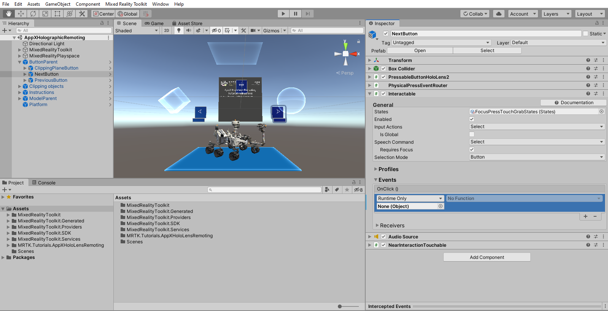

With the next button object still selected in the Hierarchy window, click-and-drag the ButtonParent object from the Hierarchy window into the empty **None (Object)** field of the event listener you just added to make the ButtonParent object listen for button click events from this button:

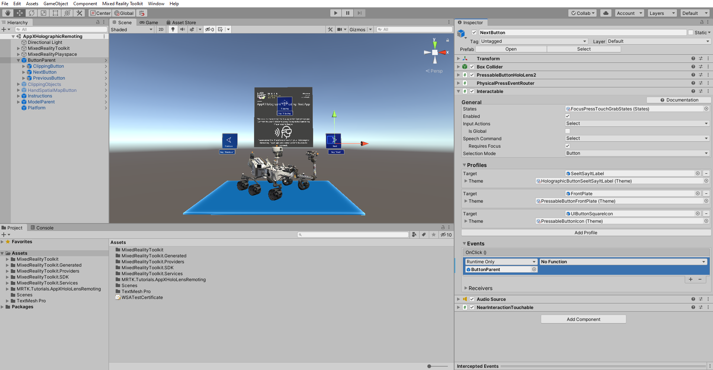

Click the **No Function** dropdown of the same event listener, then select **ViewButtonControl** > **NextModel ()** to set the **NextModel ()** function as the action that is triggered when the button pressed events is fired from this button:

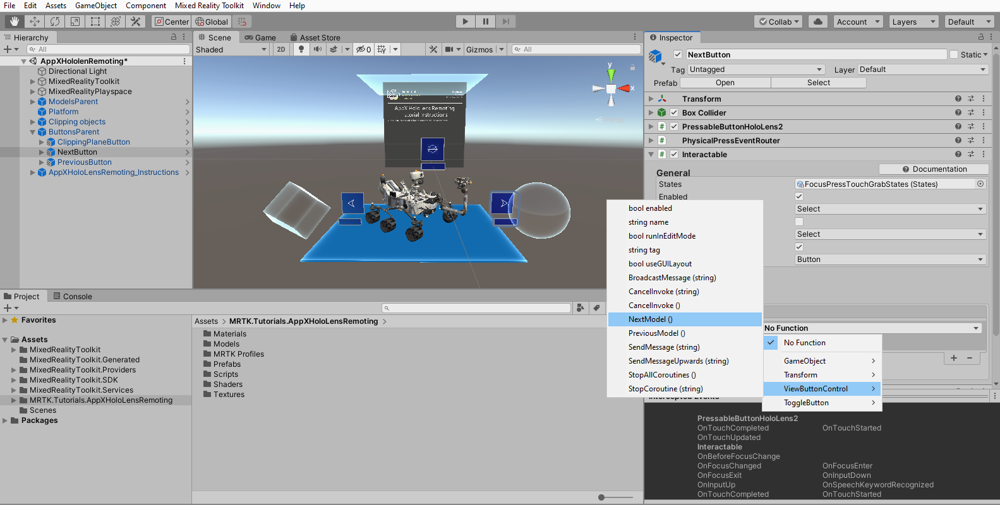

### 2. configuring the remaining buttons

For each of the remaining buttons, complete the process outlined above to assign functions to **OnClick ()** events:

* For PreviousButton object, assign the **ViewButtonContro**l > **PreviousModel ()** function. 

* For ClippingButton select **ToggleButton** > **ToggleClipping ()** function.

### 3. configuring the View Button Control (Script)  and Toggle Button (Script) component:

Now your buttons are configuringd to demonstrate the model switching and clipping functionality, and it is time to add 3D models and the clipping objects to the script.

For demonstration, we have provided five different 3D models, expand ModelParent object to find these 3D models.

With the ButtonParent object still selected in the Hierarchy window, in the Inspector window, locate the **View Button Control (Script)** component and expand the 3D **Models** variable. 

Enter the number of 3D models you would like to have on your scene. In this case, it would be five. It will create placeholders for adding new 3D models. Drag and drop ModelParent Object's child model objects into these placeholders. 

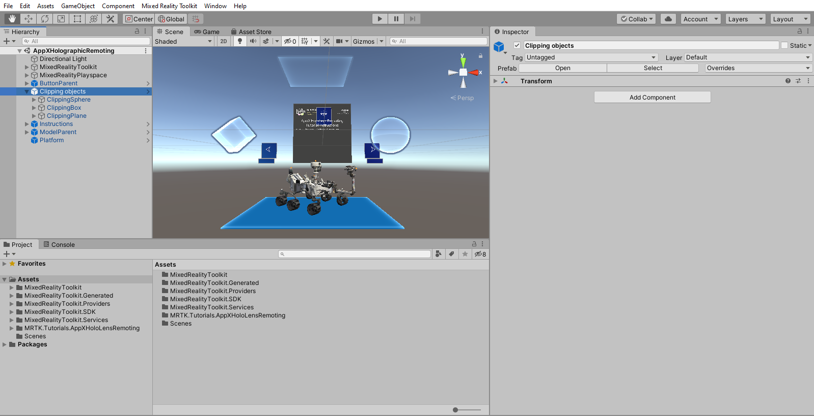

Drag-and-drop **ClippingObjects** object from the Hierarchy window to **Toggle Button (Script)** component empty field.

Note: In the Hierarchy window, select the **ClippingObjects** prefab and enable it in the Inspector window to turn on the Clipping objects.

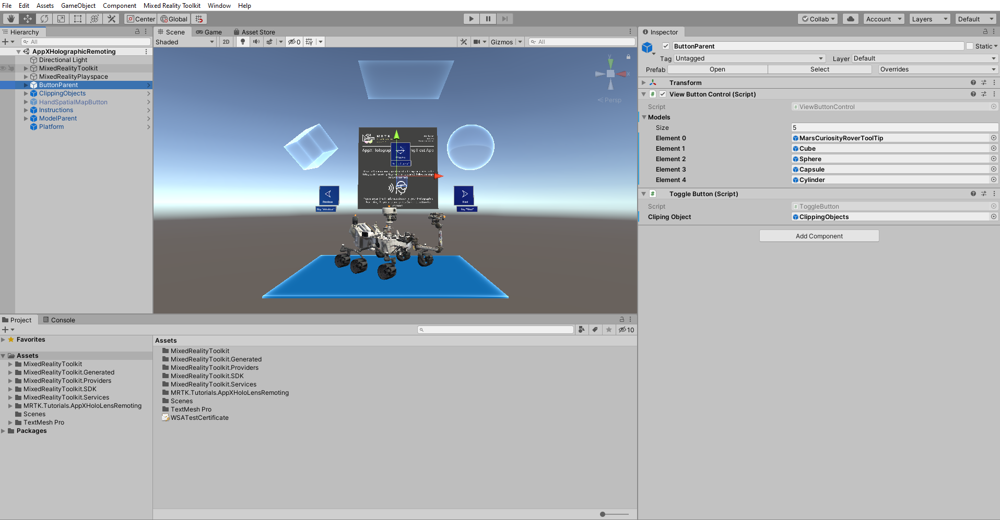

## configuring the clipping objects to enable clipping feature

In this section, you will add **MarsCuriosityRover** object's child objects renderer into an individual clipping object to demonstrate the clipping of MarsCuriosityRover.

In the Hierarchy window, expand the ClippingObjects object and find three different clipping objects that will be using in the project.

To configuring the **ClippingSphere** Object, click on it, and in the Inspector window, locate the **Clipping Sphere (Script)** component. Enter the number of renderers that you need to add for your 3D model. In this case, add 10 for MarsCuriosityRover child objects. It will create placeholders for adding renderers, drag-and-drop MarsCuriosityRover Object's child model objects into these placeholders.

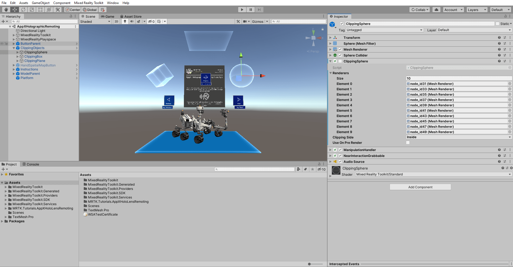

Follow the same steps and add MarsCuriosityRover 's child objects renderers to the **ClippingBox** and **ClippingPlane** objects. 

In this tutorial, only the MarsCuriosityRover model is used for demonstrating the clipping feature. You can follow the same steps and add a clipping feature for the rest of the models.

## configuring eye tracking to highlight tooltips

In this section, you will explore how to enable eye tracking in your project. For example, you will implement the functionality to highlight tooltips that are attached to MarsCuriosityRover's parts, while looking at them and hiding them, while you are looking away from them.

### 1. Identify target objects and associated tooltips.

In the Hierarchy window, select ModelParent object and expand MarsCuriosityRover to find five main parts of the MarsCuriosityRover: POI-Camera, POI-Wheels, POI-Antena, POI-Spectrometer, POI-RUHF Antenna.

Notice five corresponding tooltip objects associated with MarsCuriosityRover parts in the Hierarchy window. You will be configuring these objects to highlight the experience when you look at the MarsCuriosityRover parts.

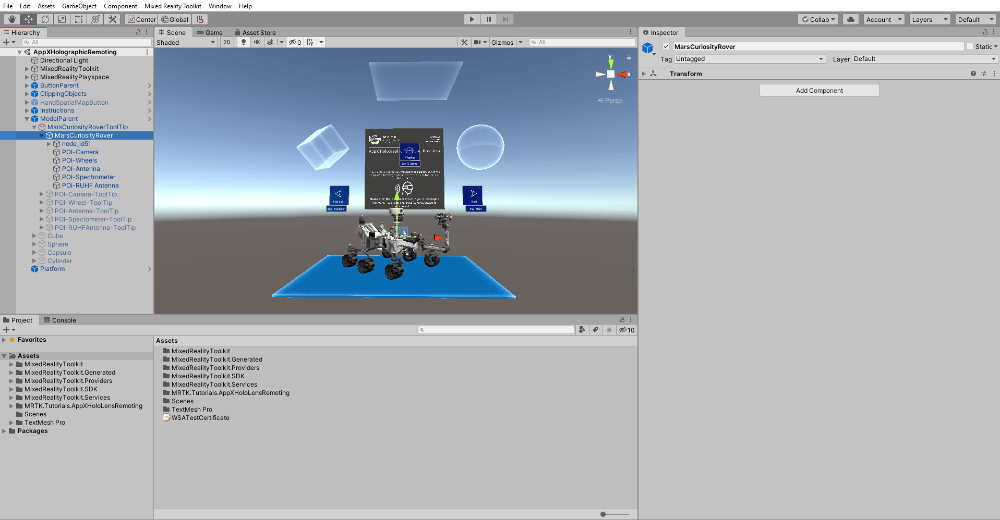

### 2. Implement While Looking At Target ()  &  On Look Away () events

In the Hierarchy window, expand the **MarsCuriosityRover's** object and select the POI-Camera object. In the Inspector window, locate the **Eye Tracking Target (Script)** component and find **POI-Camera ToolTip** and click-and-drag the object from the Hierarchy window into the empty **None(Object)** field of **While Looking At Target ()** & **On Look Away ()** events.

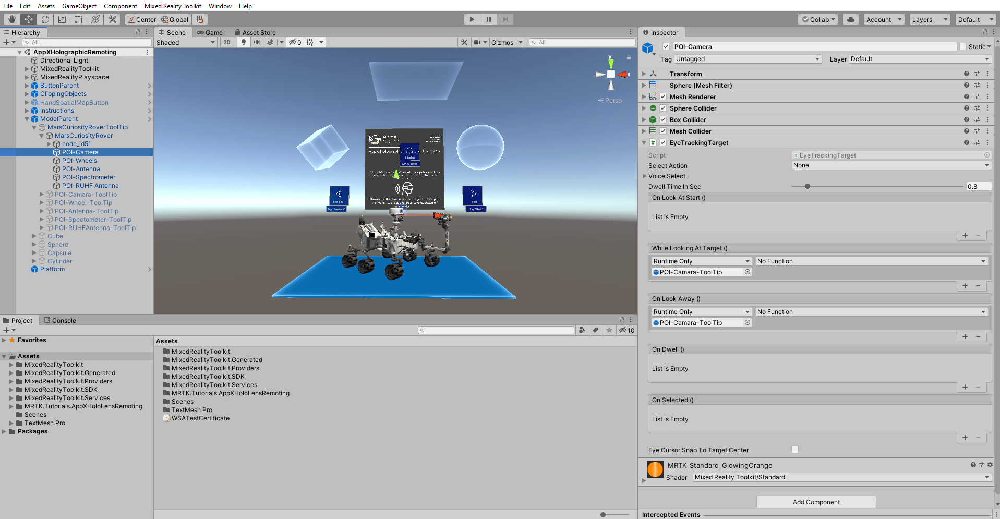

Click the **No Function** dropdown of While Looking At Target () event listener, select **GameObject** > **SetActive (bool),** select the **Checkbox** under it to highlight the tooltip as the action that is triggered when you look at the target object.

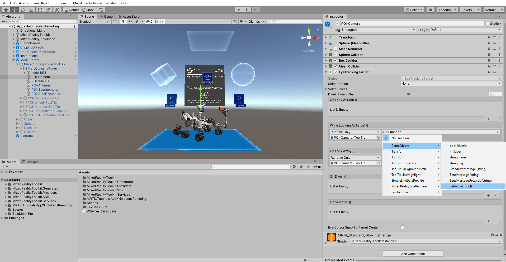

Follow the similar step and click the **No Function** dropdown of the On Look Away () event listener, then select **GameObject** > **SetActive (bool**) and leave the **Checkbox** empty to hide the tooltip as the action, that is triggered when you look away from the target object.

Follow the same process and assign respective tooltip objects to their similar **MarsCuriocityRover** parts While Looking At Target () & On Look Away () events.

To enable simulated eye-tracking for in-editor simulations, please follow these [guidelines](https://docs.microsoft.com/windows/mixed-reality/mrlearning-base-ch5#5-enable-simulated-eye-tracking-for-in-editor-simulations).

## Congratulations

In this tutorial, you learned to build a Mixed Reality experience demonstrating UI elements, 3D model manipulation, model clipping, and eye-tracking features. The tutorial provided you with NextButton and PreviousButton that let you explore the 3D model viewer experience. The ClippingObjectButton made you turn on clipping objects and experience clipping feature. The tutorial also provided you with an eye-tracking element to enable highlighting the tooltips in the experience.

In the next lesson, you will learn how to create a Holographic Remoting remote application for PC to connect HoloLens 2 at any point, providing a way to Visualize 3D content in Mixed reality.

[Next Lesson: 2. Create Holographic Remoting remote application ](mrlearning-appx-ch2.md)