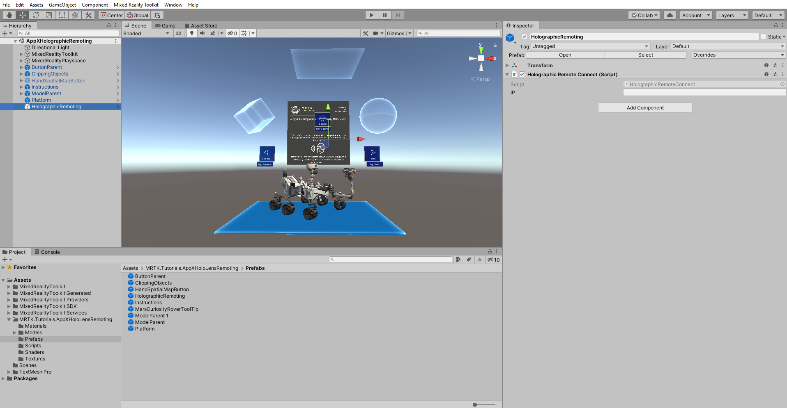
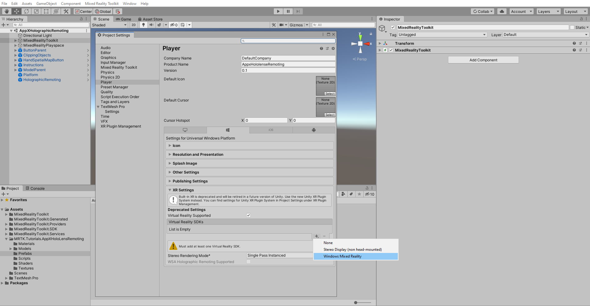
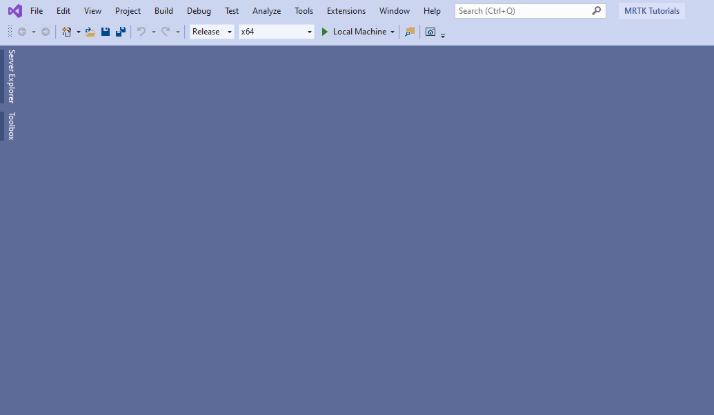

# 2. Create Holographic Remoting remote Application

In this tutorial, you will learn how to create a Holographic Remoting remote app and connect to HoloLens 2 at any point, providing a way to visualize 3D content in Mixed Reality.

## Objectives

* Configuring Unity for Holographic Remoting remote
* Learn how to build and deploy the application with Visual Studio
* Installing the Holographic Remoting remote application and connecting to HoloLens

## Configuring your scene for Holographic Remoting

In this section, you will Configuring your project to stream your Mixed Reality experience on to your HoloLens 2 device from your PC in real-time over a WIFI connection.

In the Project window, navigate to **Assets** > **MRTK.Tutorials.AppXHolograhicRemoting**> **Prefabs** folder, and select-and-drag **HolographicRemoting** prefab into your scene.

With the HolographicRemoting object still selected in the Hierarchy window, locate the **Holographic Remote Connect (Script)** component. The script uses HolographicRemoting API to connect, disconnect, and check the connection status.

## Build your Holographic Remoting application to PC

In this section, you will Configuring the project's player settings to support Holographic Remoting and build the application to PC.

In the Unity menu, select **Edit** > **Project Settings** to open the Project Settings window. In the Project Settings, window picks the **Player** tab, expand the **XR Settings** section.

In the XR Settings, select the **Virtual Reality Supported** checkbox to enable Mixed Reality. Click on **+** option to add Virtual Reality SDK's. In our scenario, choose **Windows Mixed Reality** SDK.

When Unity has finished adding the SDK, optimize the XR Settings as follows:

- Set Windows Mixed Reality **Depth Format** to **16-bit depth**
- Check the Windows Mixed Reality **Enable Depth Sharing** checkbox
- Set **Stereo Rendering Mode** to **Single-Pass Instanced**
- Select the Windows Mixed Reality **WSA Holographic Remoting Supported** checkbox

In the **Publishing Settings**, scroll down to the **Capabilities** section and double-check that the **InternetClient**, **Microphone**, and **SpatialPerception** capabilities, which you enabled when you created the project at the beginning of the tutorial. Then, allow the **InternetClientServer**, **PrivateNetworkClientServer**, **Webcam,** and **Gaze Input** capabilities:

For a reminder on how to Build the application, you can refer to the [Build your application to your device](https://docs.microsoft.com/windows/mixed-reality/mrlearning-base-ch1#build-your-application-to-your-device) instructions.

Configuring Visual Studio for PC with the below settings:

* Select the  **Release** Configuration instead of debugging
* Select **X64** architecture instead of ARM
* Select **Local Machine** as the target instead of Device

## How to test the Holographic Remoting remote application:

To connect your Holographic Remoting PC application to your HoloLens 2, follow the below procedure:

### 1. Install the Remoting Player application in HoloLens 2 device

* On your Microsoft HoloLens, visit the Store app and search for "**Remoting Player**".
* Select the **Remoting Player app**.
* Tap **Install** to start downloading and install the Remoting Player app.

### 2. Connect the remoting host sample to the Remoting Player

* Start the **Remoting Player** on your Microsoft HoloLens.
* Take note of the HoloLens **IP address**. It will be displayed as a hologram by the **Remoting Player** as soon as it launches.
* Open the installed application on your PC.
* Once the application is launched, enter the **IP address** and click on the **Connect** button to connect.

## Congratulations

In this tutorial, you learned how to create a Holographic Remoting remote app and connect to HoloLens 2 at any point, providing a way to visualize 3D content in Mixed Reality. Once the HoloLens connected to the Holographic Remoting PC application, you should see the Mixed Reality experience that has been streaming into your HoloLens 2 device. 

