# 1. Getting started with Azure Spatial Anchors

## Overview

Welcome to the second series of the HoloLens 2 tutorials. In this three-part tutorial series, you will learn the fundamentals of Azure Spatial Anchors.

In this first tutorial, [Getting started with Azure Spatial Anchors](mrlearning-asa-ch1.md), you will explore the various steps required to start and stop an Azure session and create, upload, and download Azure anchors on a single device.

In the second tutorial, [Saving, retrieving, and sharing Azure Spatial Anchors](mrlearning-asa-ch2.md), you will learn how to save Azure Spatial Anchors across multiple app sessions by saving anchor information to the HoloLens 2's storage and how to share this anchor information to other devices for a multi-device anchor alignment.

In the third tutorial, [Displaying Azure Spatial Anchor feedback](mrlearning-asa-ch3.md), you will learn how to provide users with feedback about anchor events and statuses when using Azure Spatial Anchors.

## Objectives

* Learn the fundamentals of developing with Azure Spatial Anchors for HoloLens 2
* Create, upload, and download spatial anchors

## Prerequisites

* Meet the requirements listed in the [Prerequisites](https://docs.microsoft.com/azure/spatial-anchors/quickstarts/get-started-unity-hololens#prerequisites) section of the  [Quickstart: Create a Unity HoloLens app that uses Azure Spatial Anchors](https://docs.microsoft.com/azure/spatial-anchors/quickstarts/get-started-unity-hololens) tutorial.
* Complete the [Create a Spatial Anchors resource](https://docs.microsoft.com/azure/spatial-anchors/quickstarts/get-started-unity-hololens#create-a-spatial-anchors-resource) section of the [Quickstart: Create a Unity HoloLens app that uses Azure Spatial Anchors](https://docs.microsoft.com/azure/spatial-anchors/quickstarts/get-started-unity-hololens) tutorial.
* If you have not completed the [Getting started tutorials](mrlearning-base.md) series yet, it's recommended that you complete those tutorials first.

## Creating the Unity project

In this section, you will create a new Unity project and configure it for Windows Mixed Reality.

1. Create a Unity project and give it a suitable name, for example, _Azure Spatial Anchors tutorial_.

2. Configure the Unity project for Windows Mixed Reality.

    >[!TIP]
    >For a reminder on how to create a Unity project and configure it for Windows Mixed Reality, you can refer to the [Create new Unity project](mrlearning-base-ch1.md#create-new-unity-project) and the [Configure the Unity project for Windows Mixed Reality](mrlearning-base-ch1.md#configure-the-unity-project-for-windows-mixed-reality) sections of the [Initializing your project and first application](https://docs.microsoft.com/windows/mixed-reality/mrlearning-base-ch1) tutorial which is part of the the [Getting started tutorials](mrlearning-base.md) series.

## Adding inbuilt Unity packages

In this section, you will add inbuilt Unity assets and packages required by the toolkits and SDKs you will be using in the project.

1. Import TMP Essential Resources.

    >[!NOTE]
    >We are adding this package because it is required by the Mixed Reality Toolkit.

    In the Unity menu, select **Window** > **TextMeshPro** > **Import TMP Essential Resources**.

    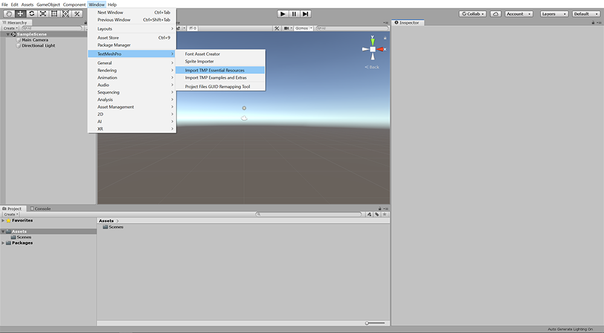

    In the Import Unity Package pop-up window, first make sure all the assets are selected by clicking the **All** button, then import the assets by clicking the **Import** button.

    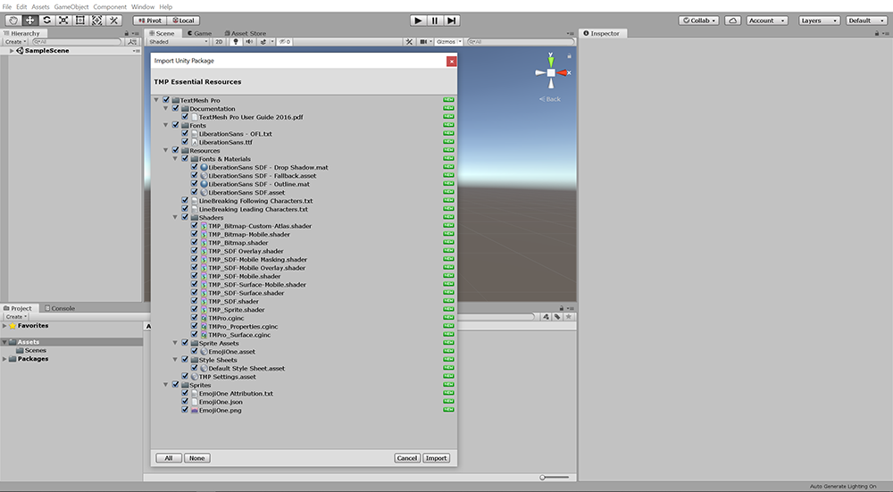

2. Install AR Foundation.

    >[!NOTE]
    >We are adding this package because it is required by the Azure Spatial Anchors SDK.

    In the Unity menu, select **Window** > **Package Manager**.

    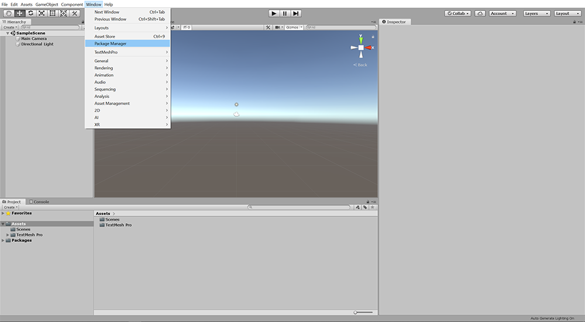

    In the Package Manager window, select **AR Foundation** and install the package by clicking the **Install** button.

    >[!IMPORTANT]
    >It might take a few seconds before the AR Foundation package appears in the list.

    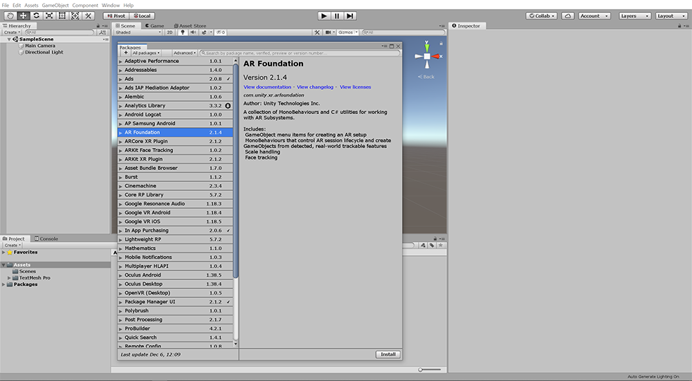

## Importing the tutorial assets

In this section, you will download and import all the tutorial assets.

1. Download the assets.

    * [AzureSpatialAnchors.unitypackage](https://github.com/Azure/azure-spatial-anchors-samples/releases/download/v2.0.0/AzureSpatialAnchors.unitypackage) (version 2.0.0)
    * [Microsoft.MixedReality.Toolkit.Unity.Foundation.2.1.0.unitypackage](https://github.com/microsoft/MixedRealityToolkit-Unity/releases/download/v2.1.0/Microsoft.MixedReality.Toolkit.Unity.Foundation.2.1.0.unitypackage)
    * [MRTK.HoloLens2.Unity.Tutorials.Assets.GettingStarted.2.1.0.1.unitypackage](https://github.com/microsoft/MixedRealityLearning/releases/download/getting-started-v2.1.0.1/MRTK.HoloLens2.Unity.Tutorials.Assets.GettingStarted.2.1.0.1.unitypackage)
    * [MRTK.HoloLens2.Unity.Tutorials.Assets.AzureSpatialAnchors.2.1.0.1.unitypackage](https://github.com/microsoft/MixedRealityLearning/releases/download/azure-spatial-anchors-v2.1.0.1/MRTK.HoloLens2.Unity.Tutorials.Assets.AzureSpatialAnchors.2.1.0.1.unitypackage)

2. Import the assets.

    In the Unity menu, select **Assets** > **Import Package** > **Custom Package...**.

    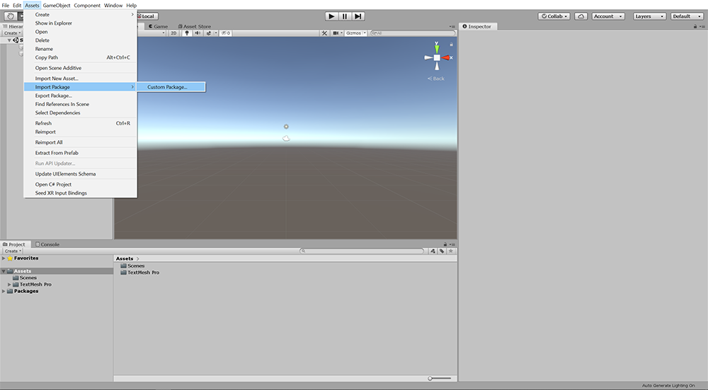

    In the Import package... pop-up window, select the **AzureSpatialAnchors.unitypackage** and click the **Open** button.

    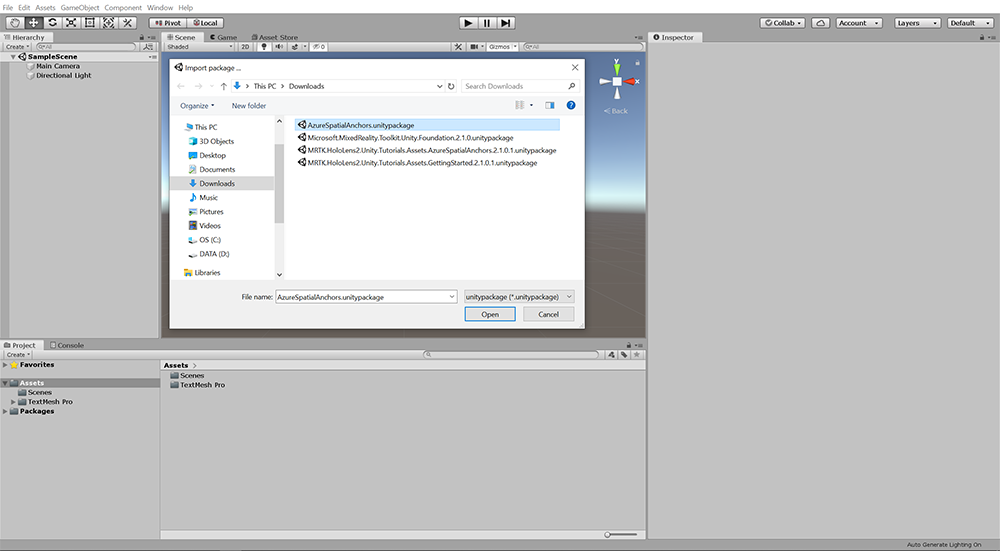

    In the Import Unity Package pop-up window, first make sure all the assets are selected by clicking the **All** button, then import the assets by clicking the **Import** button.

    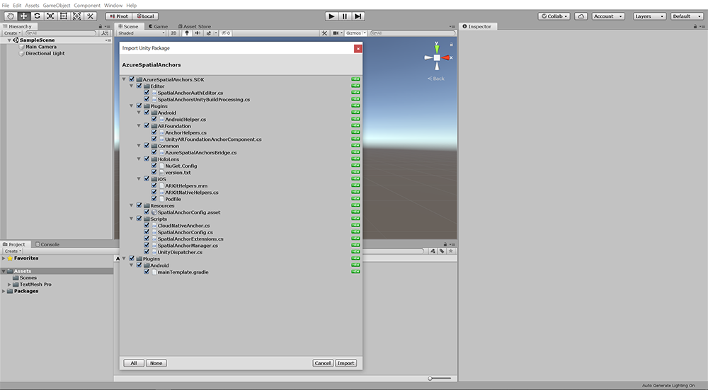

    Repeat these steps to import the remaining asset packages. Once complete, your Unity project's **Assets** folder should contain these sub-folders.

    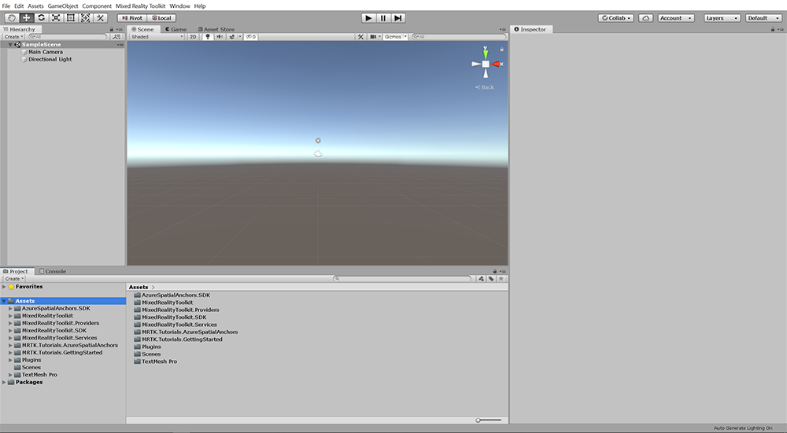

## Creating and preparing the scene

In this section, you will create and prepare the scene by adding the Mixed Reality Toolkit and some of the tutorial prefabs.

1. Create a new scene.

    In the Unity menu, select **File** > **New Scene**.

    

    In the Unity menu, select **File** > **Save As...**.

    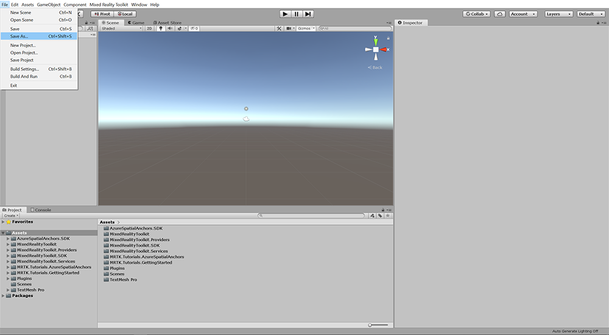

    In the Save Scene pop-up window, navigate to your project's **Scenes** folder, give your scene a suitable name, for example, _ASATutorialScene_, and save the scene by clicking the **Save** button.

    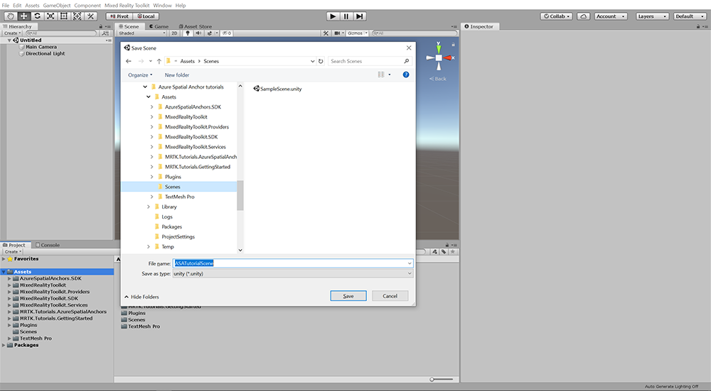

    >[!TIP]
    >You can save the scene anywhere you like as long as it is inside the project's Assets folder. However, to keep your project organized, it's generally recommended to save it in the project's Scenes folder.

2. Add the Mixed Reality Toolkit.

    In the Unity menu, select **Mixed Reality Toolkit** > **Add to Scene and Configure...**.

    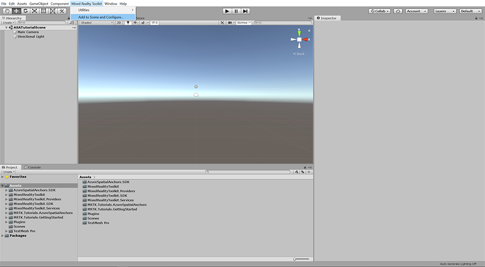

    In the Select MixedRealityToolkitConfigurationProfile pop-up window, click the **DefaultHoloLens2ConfigurationProfile** to set it as the scene's MRTK configuration profile.

    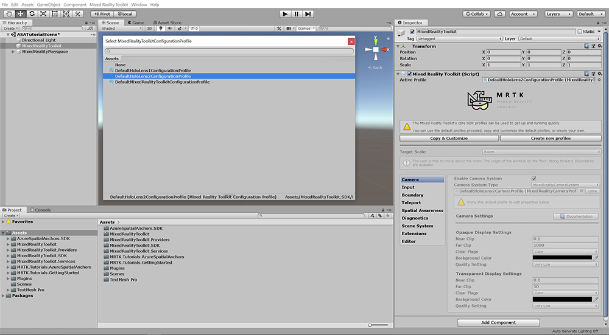

    In the Unity menu, select **File** > **Save** to save the scene.

    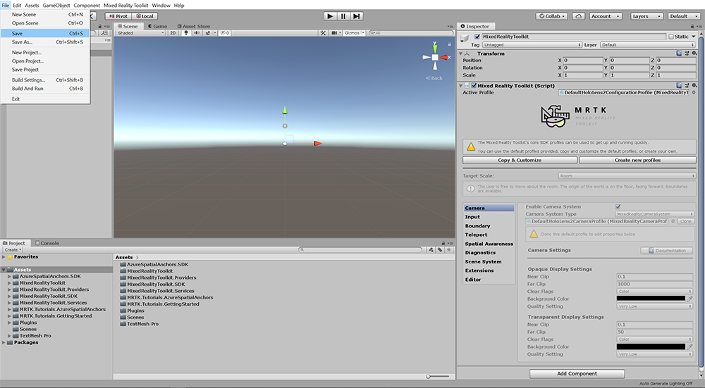

    >[!TIP]
    >You can use the keyboard shortcut CTRL+S (command + S on macOS) to quickly save your scene as you are working through this tutorial.

3. Add the tutorial prefabs.

    In the Project panel, navigate to **Assets** > **MRTK.Tutorials.AzureSpatialAnchors** > **Prefabs** folder. While holding down the CTRL button (command on macOS), click on **ButtonParent**, **DebugWindow**, and **ParentAnchor** to select the three prefabs.

    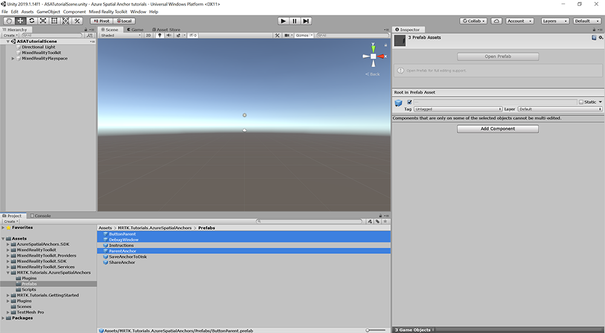

    With the three prefabs still selected, drag them into the Hierarchy panel to add them to the scene.

    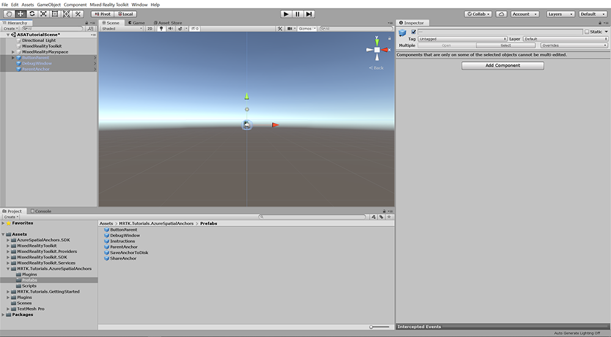

    To focus in on the objects in the scene, you can double-click on the ParentAnchor object, and then zoom slightly out again.

    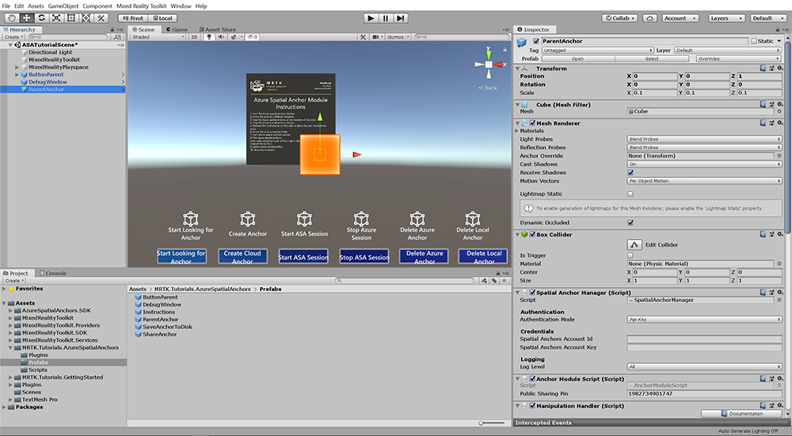

    >[!TIP]
    >If you find the large icons in your scene, for example, the large framed 'T' icons distracting, you can hide these by <a href="https://docs.unity3d.com/2019.1/Documentation/Manual/GizmosMenu.html" target="_blank">toggling the Gizmos</a> to the off position.

## Configuring the buttons to operate the scene

In this section, you will add prefabs and scripts into the scene to create a series of buttons that demonstrate the fundamentals of how both local anchors and Azure Spatial Anchors behave in an application.

1. Configure the Pressable Button Holo Lens 2 (script) component.

    In the Hierarchy panel, expand the **ButtonParent** object and select the first child object named **StartAzureSession**.

    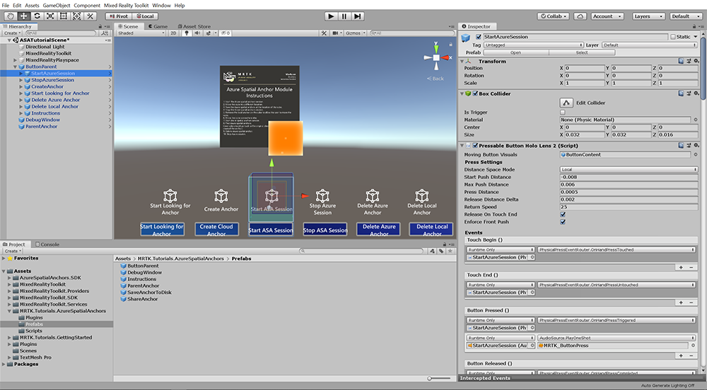

    In the Inspector panel, scroll down to the **Pressable Button Holo Lens 2 (script)** component and add a new event listener to the **Button Pressed ()** event by clicking the **+** icon.

    

    With the StartAzureSession object still selected in the Hierarchy panel, click-and-drag the **ParentAnchor** object from the Hierarchy panel into the empty **None (Object)** field of the event listener you just added to make the ParentAnchor object listen for button pressed events from this button.

    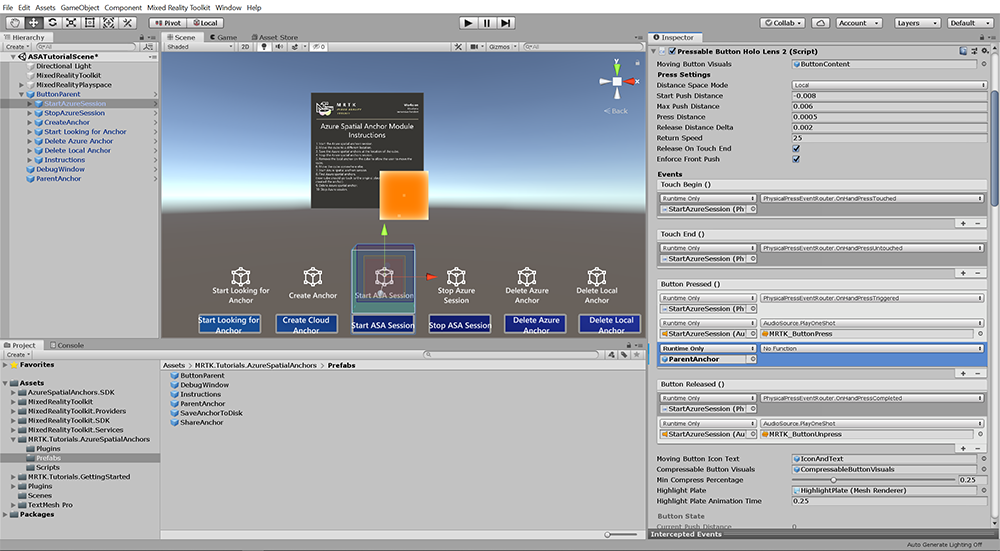

    Click the **No Function** dropdown of the same event listener, then select **AnchorModuleScript** > **StartAzureSession ()** to set the StartAzureSession () function as the action that is triggered when the button pressed events is fired from this button.

    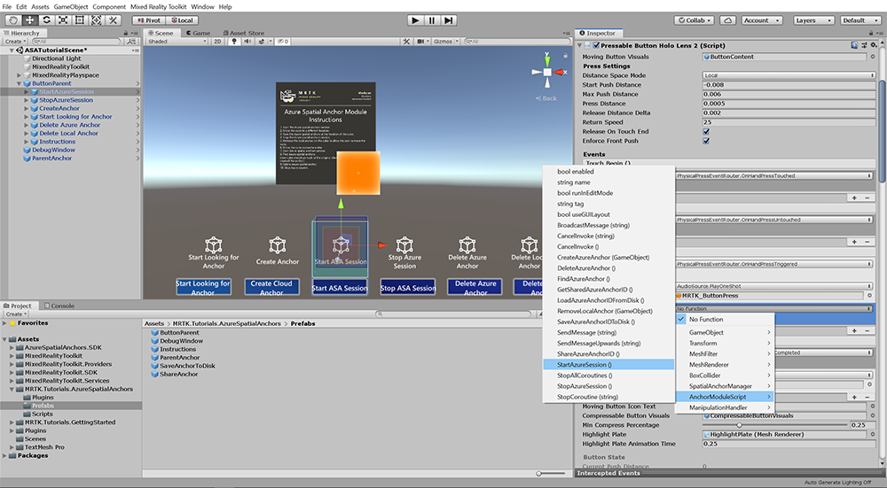

2. Configure the Interactable (script) component.

    With the StartAzureSession object still selected in the Hierarchy panel, in the Inspector panel, scroll down to the **Interactable (Script)** component and repeat the same process as in step 1 above for the **OnClick ()** event.

    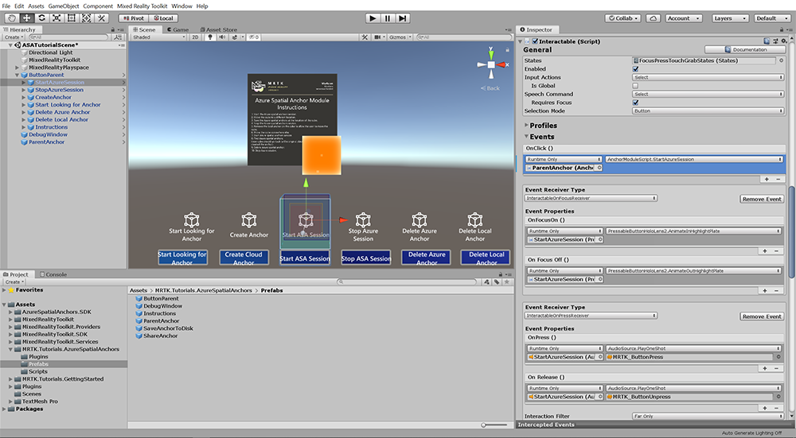

3. Configure the remaining buttons

    For each of the remaining buttons, complete the process outlined in step 1 and 2 above to assign functions to both the Button Pressed () and OnClick () events following:

    * For the **StopAzureSession** object, assign the **StopAzureSession()** function.
    * For the **CreateAnchor** object, assign the **CreateAzureAnchor()** function, then drag the **ParentAnchor** again into the empty **None (Game Object)** field.
    * For the **Start Looking for Anchor** object, assign the **FindAzureAnchor()** function.
    * For the **Delete Azure Anchor** object, assign the **DeleteAzureAnchor()** function.
    * For the **Delete Local Anchor** object, assign the **RemoveLocalAnchor()** function, then drag the **ParentAnchor** again into the empty **None (Game Object)** field.

4. Connect the scene to the Azure resource

    In the Hierarchy panel, select the **ParentAnchor** object and in the Inspector panel, scroll down to the **Spatial Anchor Manager (Script)** component.

    Then, in the **Credentials** section, paste your Spatial Anchors Account ID and Key into the corresponding **Spatial Anchors Account Id** and **Spatial Anchors Account Key** fields.

    >[!NOTE]
    >You created your Spatial Anchors Account Id and Key as part of this tutorial's [Prerequisites](mrlearning-asa-ch1.md#prerequisites).

    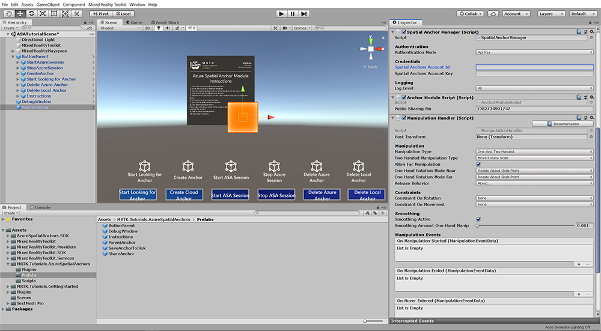

    >[!CAUTION]
    >Make sure you save your scene.

## Trying the basic behaviors of Azure Spatial Anchors

Now that your scene is configured to demonstrate the basics of Azure Spatial Anchors, it is time to deploy the app so you can experience Azure Spatial Anchors firsthand.

1. Add additional required capabilities.

    In the Unity menu, select **Edit** > **Project Settings...** to open the Player Settings panel.

    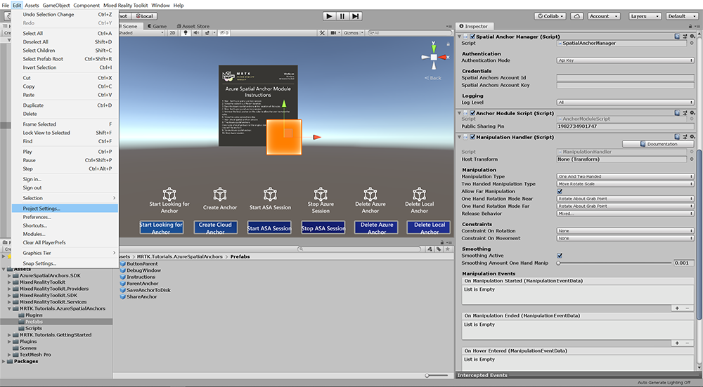

    In the Player Settings panel, select **Player** and then **Publishing Settings**.

    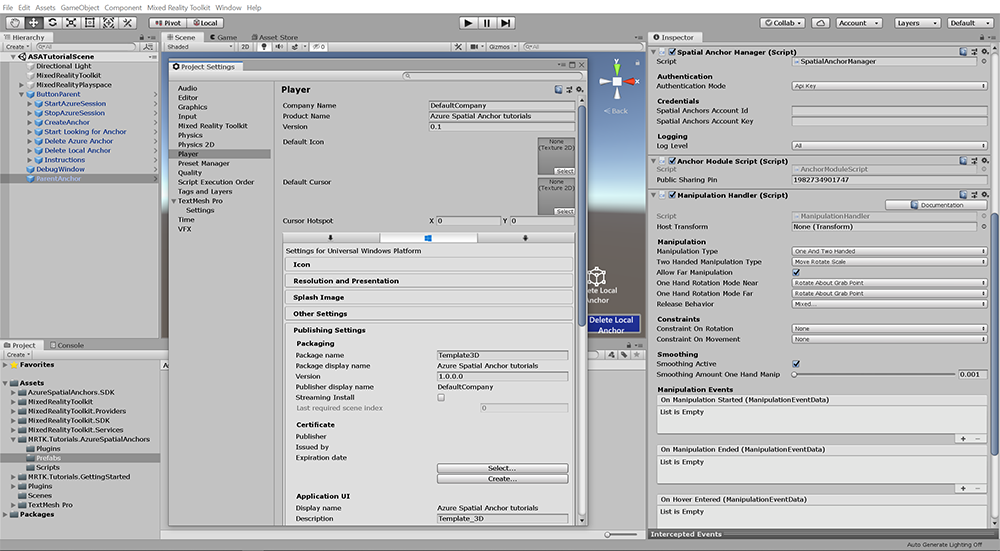

    In the  **Publishing Settings**, scroll down to the **Capabilities** section and double-check that **SpatialPerception**, which you enabled when you created the project at the beginning of the tutorial, is enabled. Then, enabled the **InternetClient**, **InternetClientServer**, **PrivateNetworkClientServer**, **RemovableStorage**, **Webcam**, and **Microphone** capabilities.

    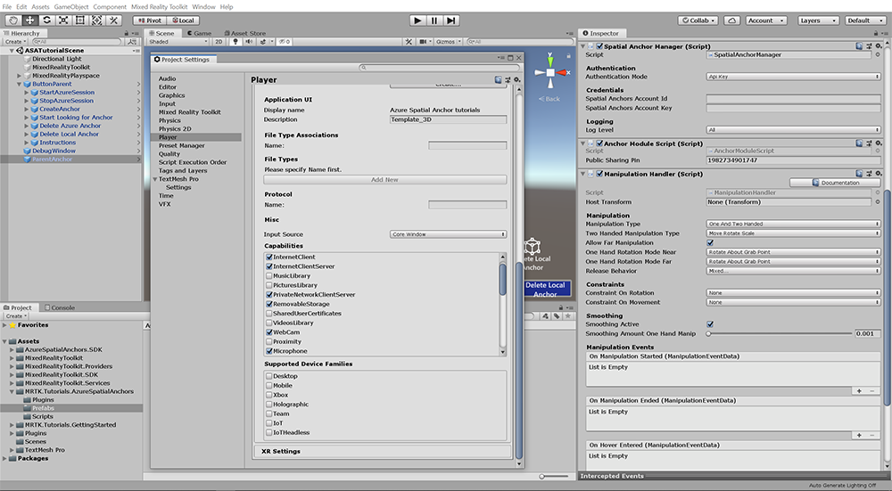

2. Deploy the app to your HoloLens 2.

    >[!TIP]
    >For a reminder on how to build and deploy your Unity project to HoloLens 2, you can refer to the [Build your application to your device](mrlearning-base-ch1.md#build-your-application-to-your-device) sections of the [Initializing your project and first application](https://docs.microsoft.com/windows/mixed-reality/mrlearning-base-ch1) tutorial which is part of the the [Getting started tutorials](mrlearning-base.md) series.

3. Run the app and follow the in-app instructions.

    >[!CAUTION]
    >Azure Spatial Anchors uses the internet to save and load the anchor data so make sure your device is connected to the internet.

    When the application is running on your device, follow the on-screen instructions displayed on the **Azure Spatial Anchor Module Instructions** panel.

    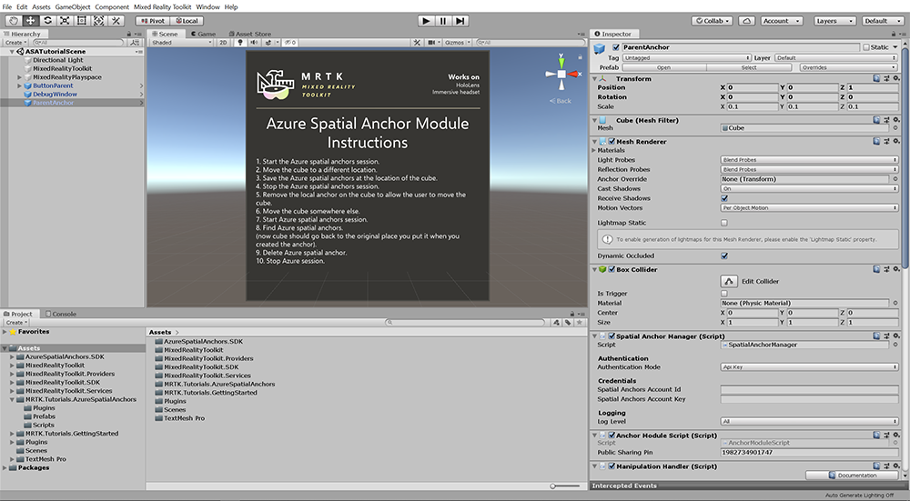

## Anchoring an experience

In the previous sections, you learned the fundamentals of Azure Spatial Anchors. We used a cube to represent and visualize the parent game object with the attached anchor. In this section, you will learn how to anchor an entire experience by placing it as a child of the ParentAnchor object.

1. Add the Rocket Launcher experience.

    In the Project panel, navigate to **Assets** > **MRTK.Tutorials.GettingStarted** > **Prefabs** folder and select the **Rocket Launcher_Complete** prefab.

    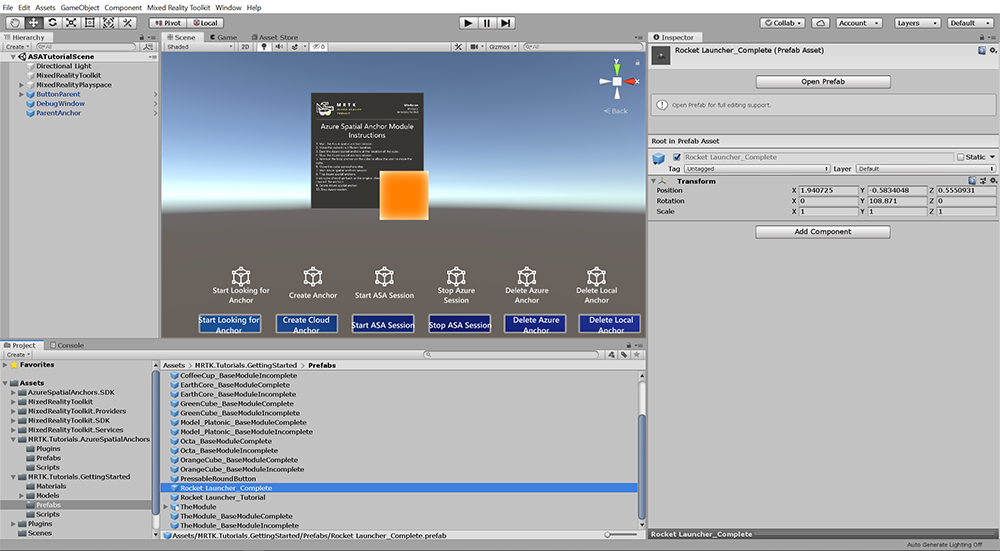

    With the Rocket Launcher_Complete prefab still selected, drag it on top of the **ParentAnchor** object in the Hierarchy panel to make it a child of the ParentAnchor object.

    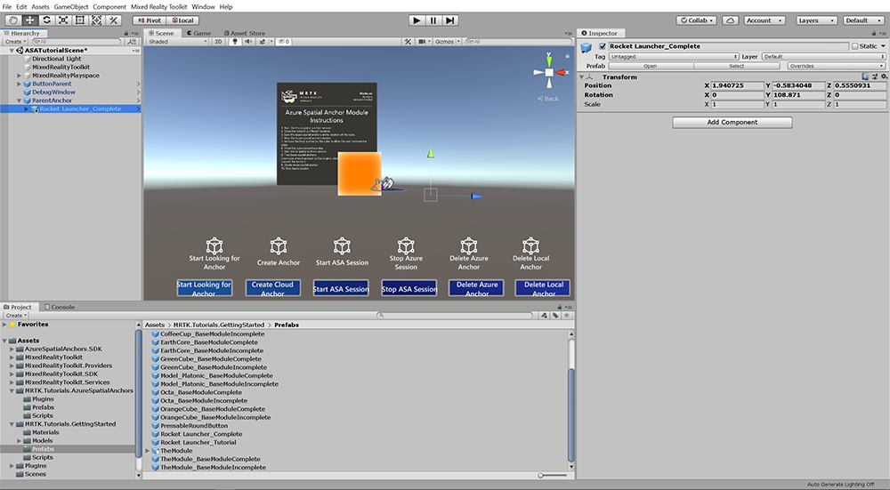

2. Reposition the Rocket Launcher experience.

    Move module **Rocket Launcher_Complete** object so that the **ParentAnchor** (the cube) is still exposed.

    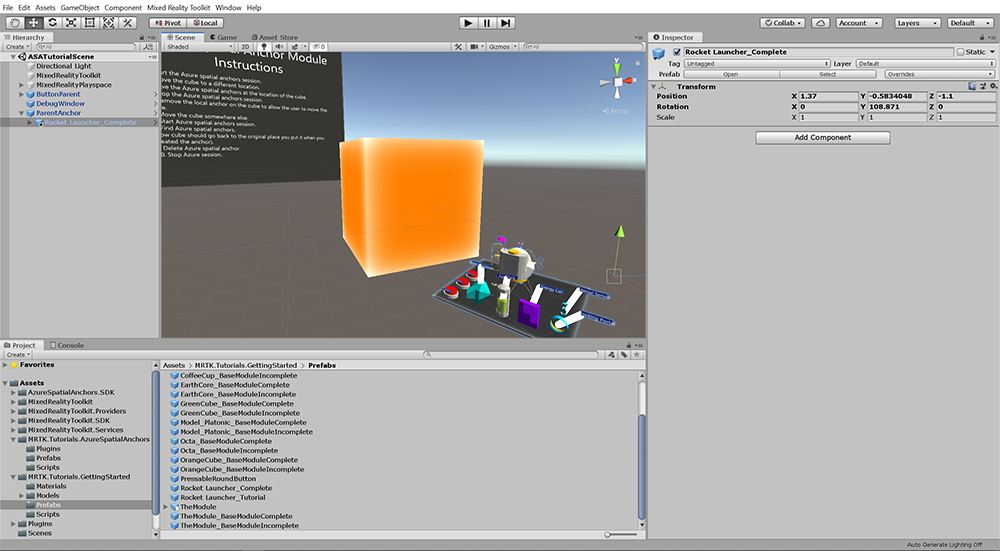

    In the application, users may now reposition the entire Rocket Launcher experience by moving the cube.

    >[!TIP]
    >There are a variety of user experience flows for repositioning experiences including the use of a repositioning object (such as the cube used in this tutorial), the use of a button to toggle a bounding box that surrounds the experience, the use of position and rotation gizmos, and more.

## Congratulations

In this tutorial, you learned the fundamentals of Azure Spatial Anchors. This Lesson provided you with several buttons that let you  explore the various steps required to start and stop an Azure session and create, upload and download azure anchors on a single device.

In the next lesson, you will learn how to save Azure anchor IDs to your HoloLens 2 for retrieval, even after the application is restarted, and how to transfer anchor IDs between multiple devices to achieve spatial alignment.

[Next Lesson: 2. Saving, retrieving and sharing Azure Spatial Anchors](mrlearning-asa-ch2.md)
