# Azure Spatial Anchor on HoloLens 2

Welcome to the second module of the HoloLens 2 Tutorial! Before getting started, be sure that all of the [prerequisites](https://docs.microsoft.com/en-us/azure/spatial-anchors/quickstarts/get-started-unity-hololens) are completed. If you have not completed the first, [base module](link) yet, we highly recommend that you complete that first. If you are starting from a new unity project, follow the new project creation steps in the [base module](link). 

## Objectives

* Download and import 3 different asset packets ([mixed reality toolkit](link to base module chater 1), [MR Base Module Asset Pack](https://github.com/microsoft/mixedrealitylearning/releases/tag/v1.1), and [Azure Spatial Anchors](https://github.com/azure/azure-spatial-anchors-samples/releases)) 

* 

  

## Instructions

### Downloading and Importing Assets
Before beginning, you must download and import the following assets:

[mixed reality toolkit](link to base module chater 1)

[MR Base Module Asset Pack](https://github.com/microsoft/mixedrealitylearning/releases/tag/v1.1)

[Azure Spatial Anchors](https://github.com/azure/azure-spatial-anchors-samples/releases)

[MRTK documentation](<https://microsoft.github.io/MixedRealityToolkit-Unity/Documentation/Architecture/SpatialAwareness/SpatialAwarenessSystemArchitecture.html>)

1. create a new scene in your project. Right click your scene folder, click "create," then scene. Name the new scene "ASA Module."

   

3. Disable the visibility of the spatial awareness mesh. To do this, find “Spatial Awareness System Settings” as shown in the image. Click the "clone" button to the right of the the “Spatial Awareness System Profile” to replace the default profile with a customizable copy. If a pop-up window appears, feel free to press the "Clone" button, as shown in the second image below.

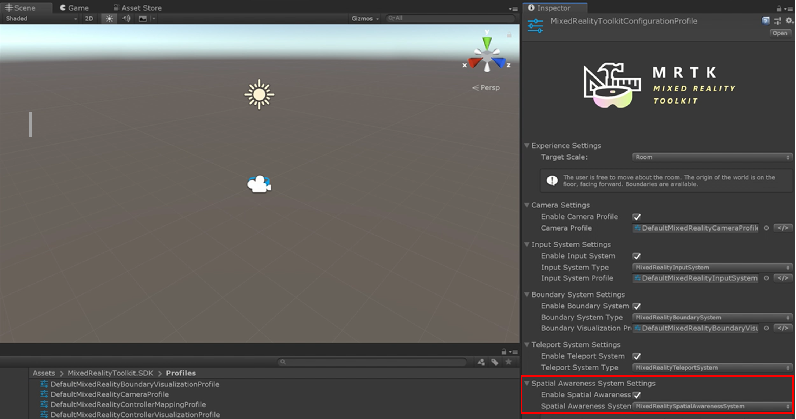

4. Create a custom copy of the Default Mixed Reality Spatial Mesh Observer. Click the down arrow next to “Windows Mixed Reality Spatial Mesh Observer” to see additional options. In these options, you will see the “Default Mixed Reality Spatial Mesh Observer” which appears greyed (not editable.) We must replace this default profile with a customizable copy of it so we can edit it. Click the button to the right (marked by green arrow) to create a copy.

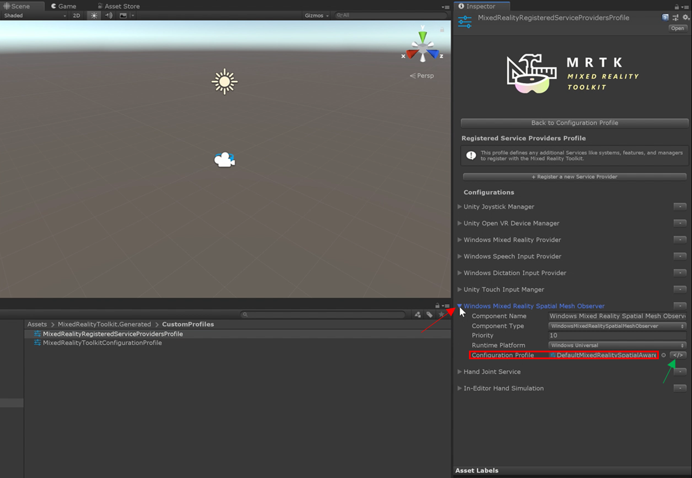

5. Next, we adjust the settings for the display option to say “occlusion.” This makes the spatial mesh invisible, but still hide game objects behind the spatial mesh (this is known as occlusion.)

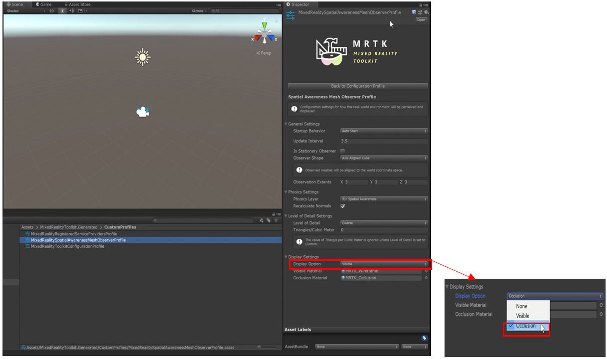

>Note: the spatial mapping mesh is still there, and you can still interact with it, but you won’t be able to see it directly. Also, any holograms behind the spatial mapping mesh (i.e. a hologram behind your visible wall) will not be visible because of the occlusion setting.

Congratulations! You just learned how to modify a setting in the MRTK profile. As you can see, in order to modify MRTK settings you need to create copies of the default profiles so that you can edit them. You will always have the default profiles (which are not editable) to go back to if you wanted to create a profile with new settings, or refer back to the default profiles. There are numerous settings that you can adjust. For full reference to MRTK profile settings, refer to the MRTK documentation here: https://microsoft.github.io/MixedRealityToolkit-Unity/Documentation/GettingStartedWithTheMRTK.html

### Hand Tracking Gestures and Interactable buttons
In this section, we will learn how to use hand tracking to press an interactable button.

1. Select “Assets” from the projects folder.

2. Type in the search bar, “pressablebutton.”

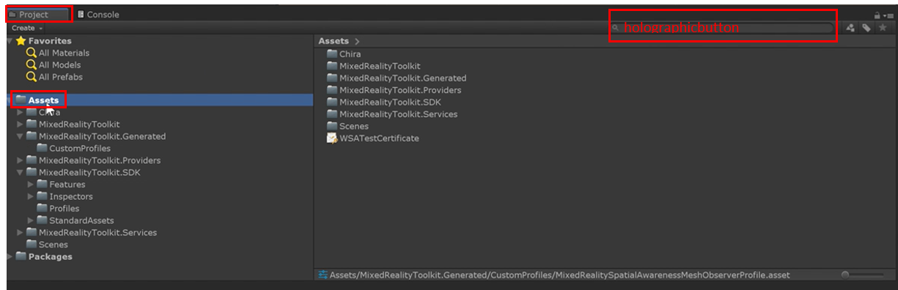

3. Drag the prefab (represented by a blue box) named "PressableButton" into your hierarchy. 

   > Note: If you get a message about “importing TMP Essentials” please import it at this time. If TMP Essentials was not already part of your project, you may need to repeat this step after importing TMP Essentials, otherwise button text may not appear.

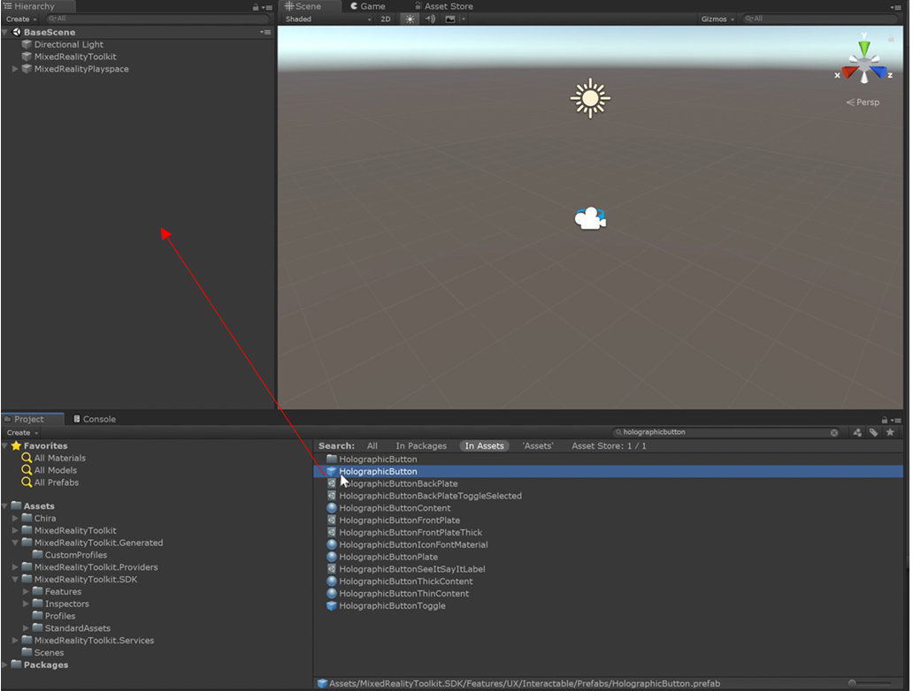

4. Double click the “PressableButton” game object (which should now be in your BaseScene hierarchy) to view it in your scene, as shown in the image below (your button graphics may appear different than the image below). 

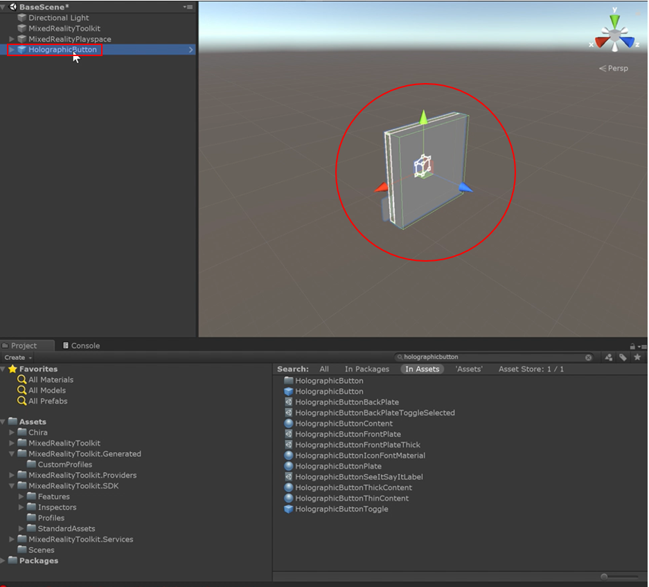

5. In the inspector panel, click “Add Event” to give the button an event to respond to when pushed. In the option that appears, select the drop-down menu. Select “InteractableOnPressReciever.” This allows the button to respond to a pressed event when a tracked hand presses the button.

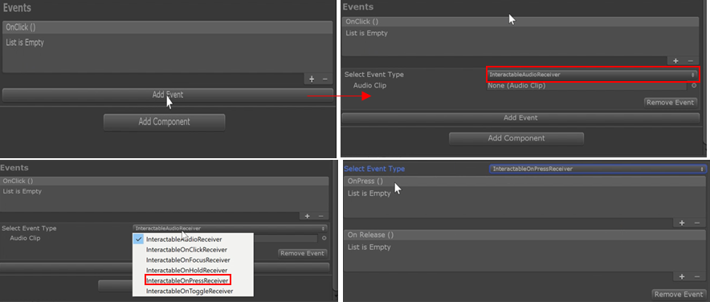

6. Add a cube to the scene. Right click on the hierarchy area, select 3D object, then click on “cube.” Now, a cube should be in your display. It will appear very large, so adjust the coordinates (while “cube” is still selected in the hierarchy area) to decrease the size. In this case, we are using the scale x = 0.1, y = 0.1 and z = 0.1. Be sure to position the cube in your scene to place it near the pressable button, but not overlapping with the button. In the image below, the cube’s position is x = 0, y = 0.2, and z = 1. 

   > Note: In general, 1 unit in Unity is roughly equivalent to 1 meter in the physical world. There are exceptions to this, for example when objects are children of scaled objects.
   
   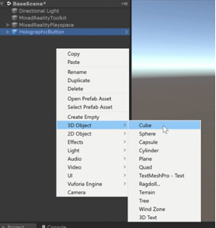

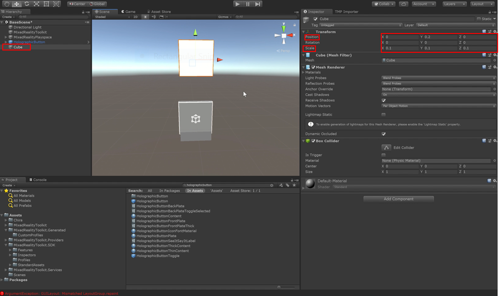

7. In this step we will set up the cube to change color when our button is pressed. Select the holographic button in the “BaseScene” menu. In the inspector panel, under the “Select Event Type” box, click the “+” button. Drag the “cube” from the “BaseScene” menu into the “Runtime Only” box, as shown in the image below

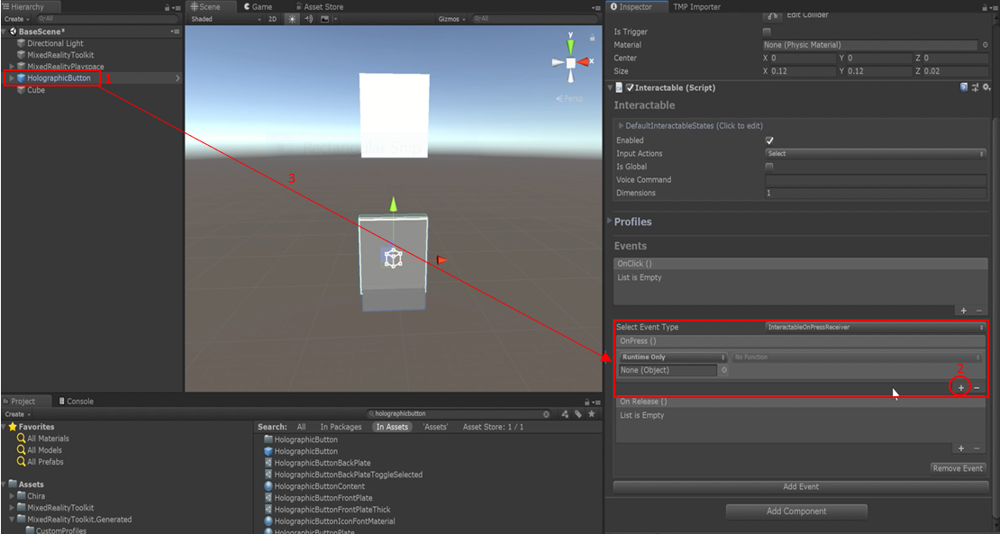

Click the dropdown list that says “No Function.” Select “MeshRenderer” then select “Material material.” This will allow us to change the material when the button is pressed. 

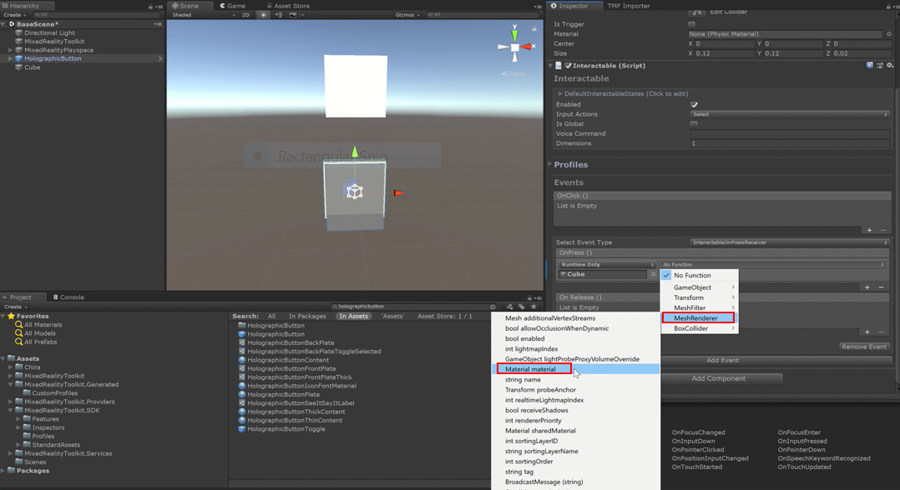

Go to the project panel and search for the material you wish to change it to. We are going to use the material “MRTK_Standard_Cyan” for this example, found by typing in “cyan” in the project tab’s search bar (The MRTK includes many materials and colors to choose from.) Drag the material to the box underneath “MeshRenderer.material.” The MRTK materials can be found in Assets>MixedRealityToolkit.SDK>StandardAssets>Materials.

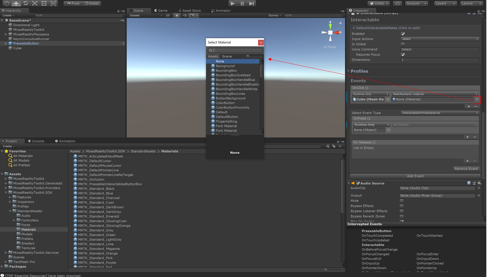

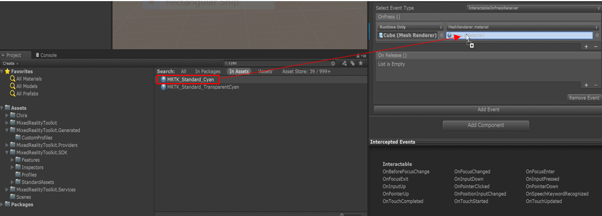

The event is now set so that when the button is pressed, the cube will change color based on the material you specified. For our example, the cube will change to the cyan color.

8. Next we’re going to set up the release action so that upon release, the button will go back to its default color. Repeat Step 7 (the previous step) but this time with the “OnRelease” event instead of the “OnPress” event, as shown in the image below.

9.  In the project panel, search for a material for the cube to default to upon button release (in our case, we chose MRTK_Standard_LightGray.) Drag the material into the box below the “MeshRenderer.material” field.

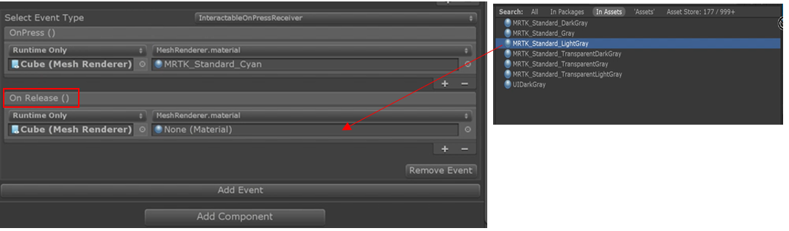

Now when the button is pressed, it should change to a new color (e.g., cyan) and when the button is released it should change back to the default color you specified (e.g., light gray.) Press the “play” button on the top of the screen to try it out in the editor or deploy to your HoloLens 2 to test! To learn more about in-editor simulation, including hand simulation read the [MRTK's simulation documentation page](<https://microsoft.github.io/MixedRealityToolkit-Unity/Documentation/InputSimulation/InputSimulationService.html>). 

### Creating a panel of buttons using MRTK’s Grid Object Collection

In this section, we’ll learn how to automatically align multiple buttons into a neat user interface using the MRTK’s GridObjectCollection tool.

1. Duplicate the button from the previous section until you have 5 buttons. There are several ways to do this:
- Right click on the button and click “copy,” then go down to below the button and right click again and click “paste.” 
- Right click on the button and click “duplicate.” 
- Use the keyboard command by clicking on the cube and pressing “ctrl D” on your keyboard.

Repeat this until you have 5 total buttons (see 5 red arrows in image below).

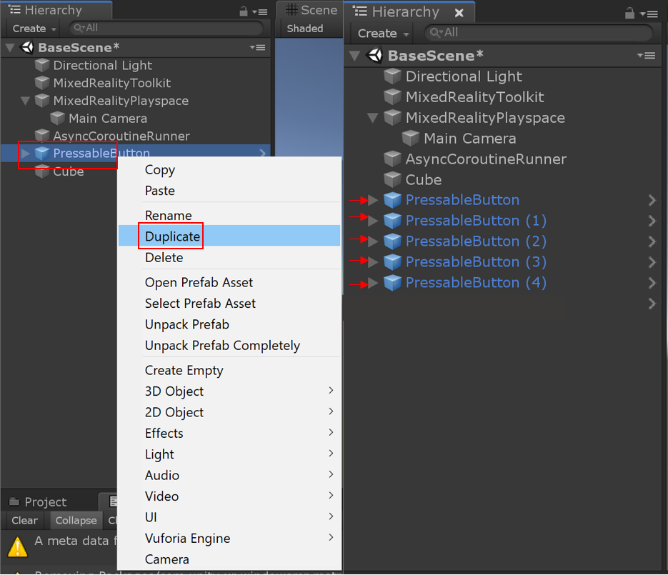

2. Group the buttons under an empty parent game object. In order to have the buttons in grid collection, we need to group our buttons under a common parent object. Right click in the hiearachy and click “create empty.” This creates a new empty game object for you to put all the buttons in. It will show up as “gameObject.” Right click and rename it to “ButtonColletion.”

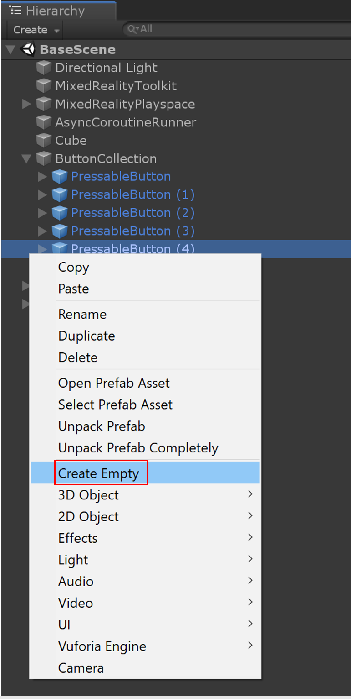

3. Move all the buttons into the new collection. Do this by selecting all five of the button objects in your heirarch and drag them all under “ButtonCollection” game object, as shown in the image below. Tip: select multiple items by holding the ctrl key while selecting items.

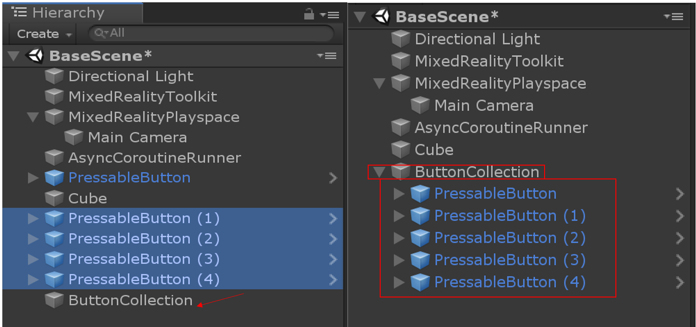

4. Add MRTK’s “Grid Object Collection” component to the button collection.	To do this, select the “ButtonCollection” parent object and in the inspector panel, click the “Add Component” button. Then search for “Grid Object Collection” in the search bar and select it when it appears in the list.

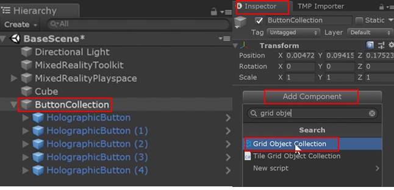

The Grid Object Collection component allows us to organize buttons or any set of objects in a neat row, column, or grid. This is one of the building blocks provided by the MRTK that provides you with a quick and simple way to create beautiful user interfaces.

5. Configure the grid object collection. To ensure all the buttons face the user, select “orient type” and then select “face parent forward” (as shown in the image.) Next, change the cell size to set the space between your buttons. Start with 0.12 units by 0.12 units for the Cell Width and Cell Height, as shown in the image below. You may need to adjust these values, depending on object/button assets chosen. Make sure "Rows" is set to 1. Then click “Update Collection” and the scene should look like the picture below. 

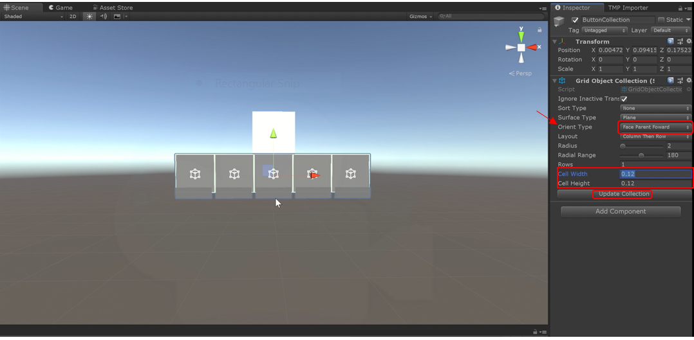

>Note: Depending on the orientation of the child objects or parent object, you will likely need to adjust the orientation setting differently in future projects. The Cell Width and the Cell Height fields may also need to be defined differently, depending on the size of the objects in your collection.

### Adding Text into Your Scene

In this section, we’ll cover how to add and edit text to your mixed reality experiences. If you haven’t already, please ensure you have TextMeshPro enabled in Unity by following the instructions [here](https://docs.unity3d.com/Packages/com.unity.textmeshpro@2.0/manual/index.html#installation).

1. Select the “ButtonCollection” parent object and right click the collection. Expand "3D object" in the dropdown menu, then select "TextMeshPro - Text". You should see a TextMeshPro object under the button collection, as shown in the image below.

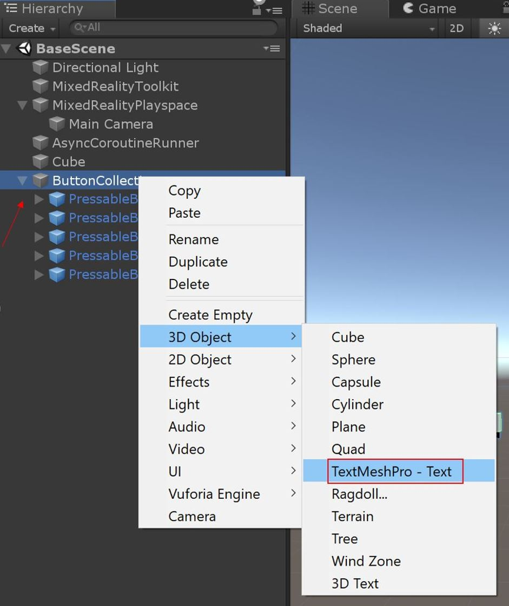
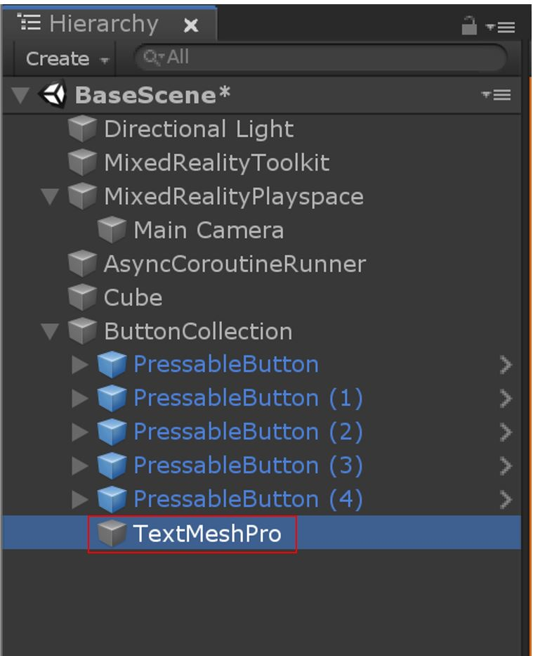

2. In the TextMeshPro component’s Text field (located in the inspector panel, as shown below), type in “Button Collection Text.” The text will appear in the scene, but it will be hidden behind the buttons and/or the wrong size.

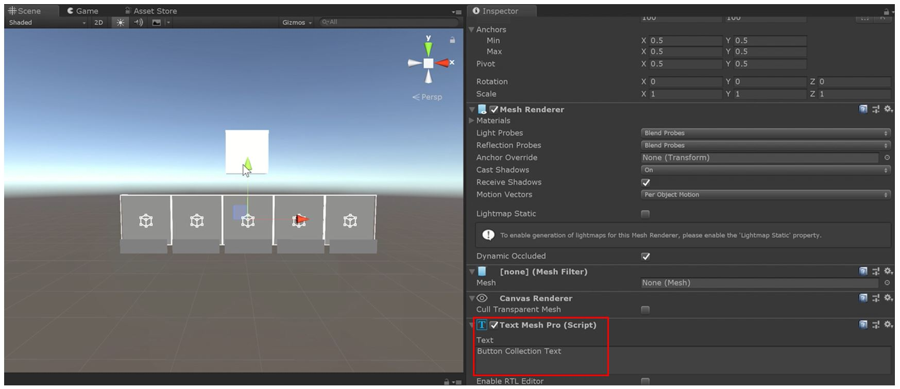

3. To improve the text size and placement for readability, adjust the “font size” field in the TextMeshPro component to change the size of the font. You will also need to adjust the “Rect Transform” position and scale as shown in the image below. See the images below for values used for our text configuration, and feel free to use these values as a starting point from which to further improve the size and placement of your text field.

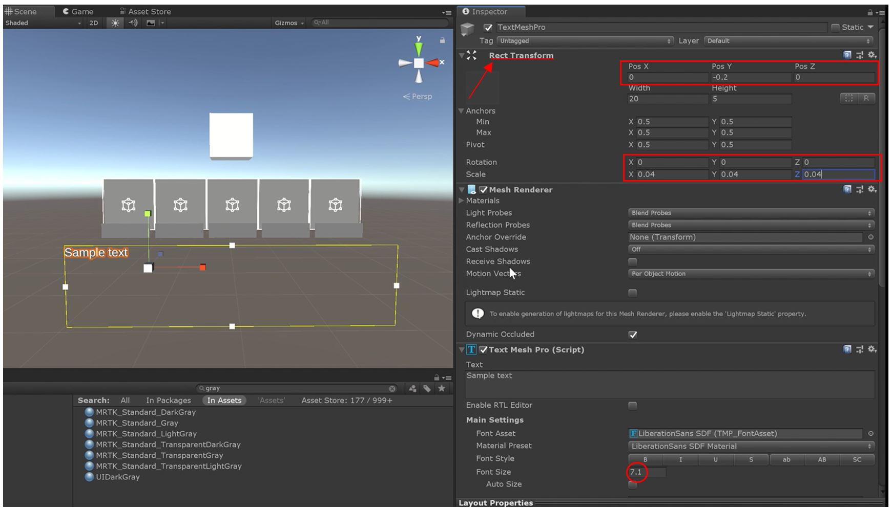
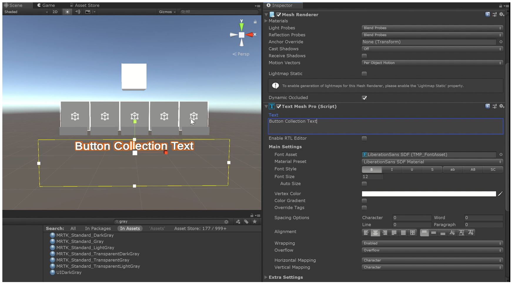

5. To modify the text values on the button objects, click the arrow next to any button to expand it and navigate to the “SeeItSayItLabel” object, then navigate to “TextMeshPro,” where you can edit the text to your buttons as described in the steps above.

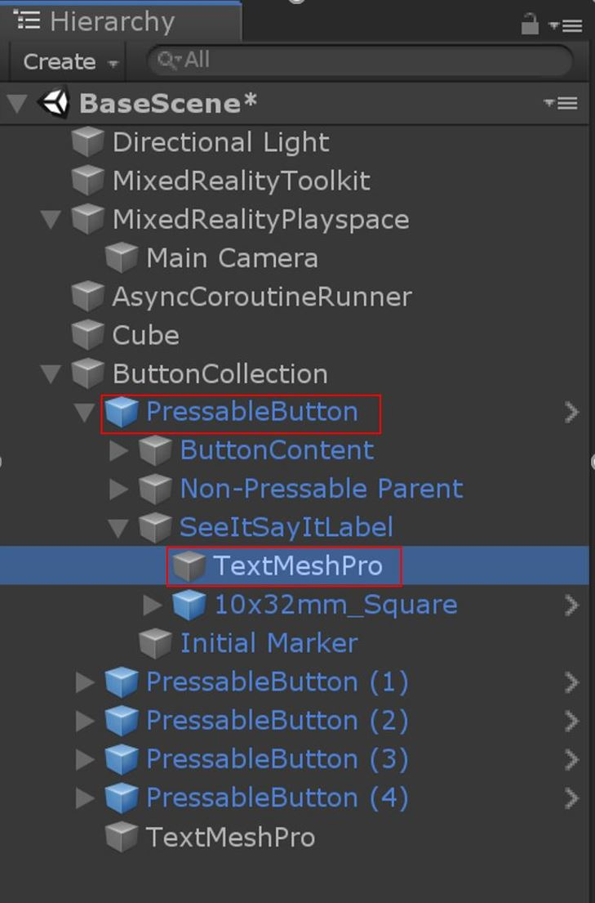

### Congratulations
In this lesson, you learned how to copy, customize, and configure an MRTK profile setting (i.e., spatial awareness mesh visibility.) You also learned how to interact with a button to trigger events using tracked hands on the HoloLens 2. Finally, you learned how to create a simple UI interface using Unity's Text Mesh Pro the MRTK's Grid Object Collection component.

[Next Lesson: Dynamic Content Placement and Solvers](mrlearning-base-ch3.md)

