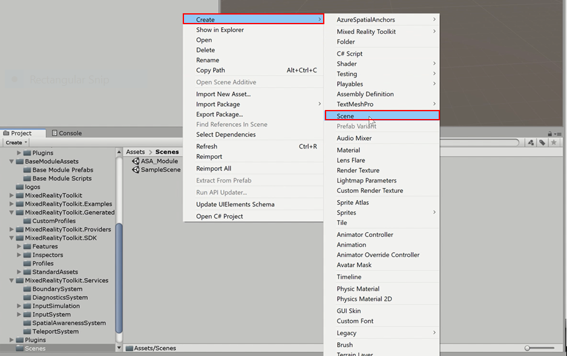
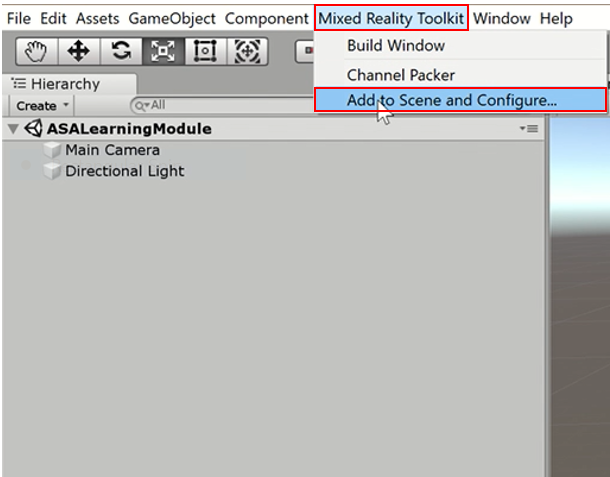
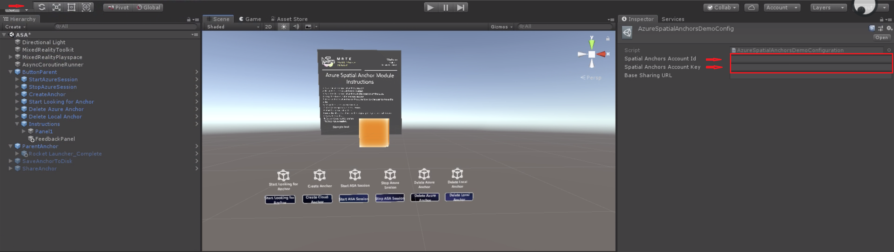
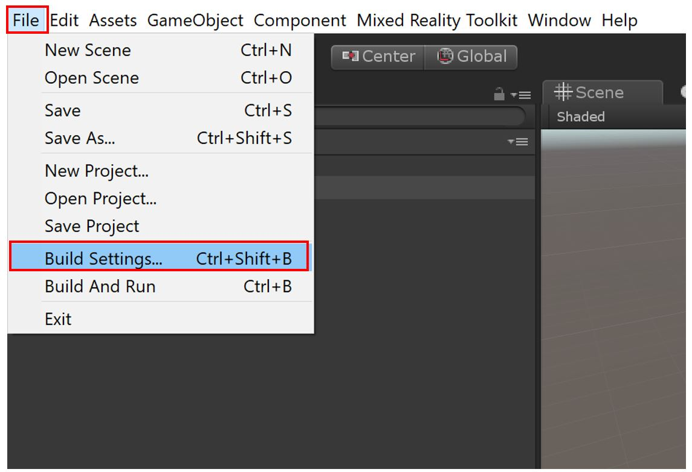
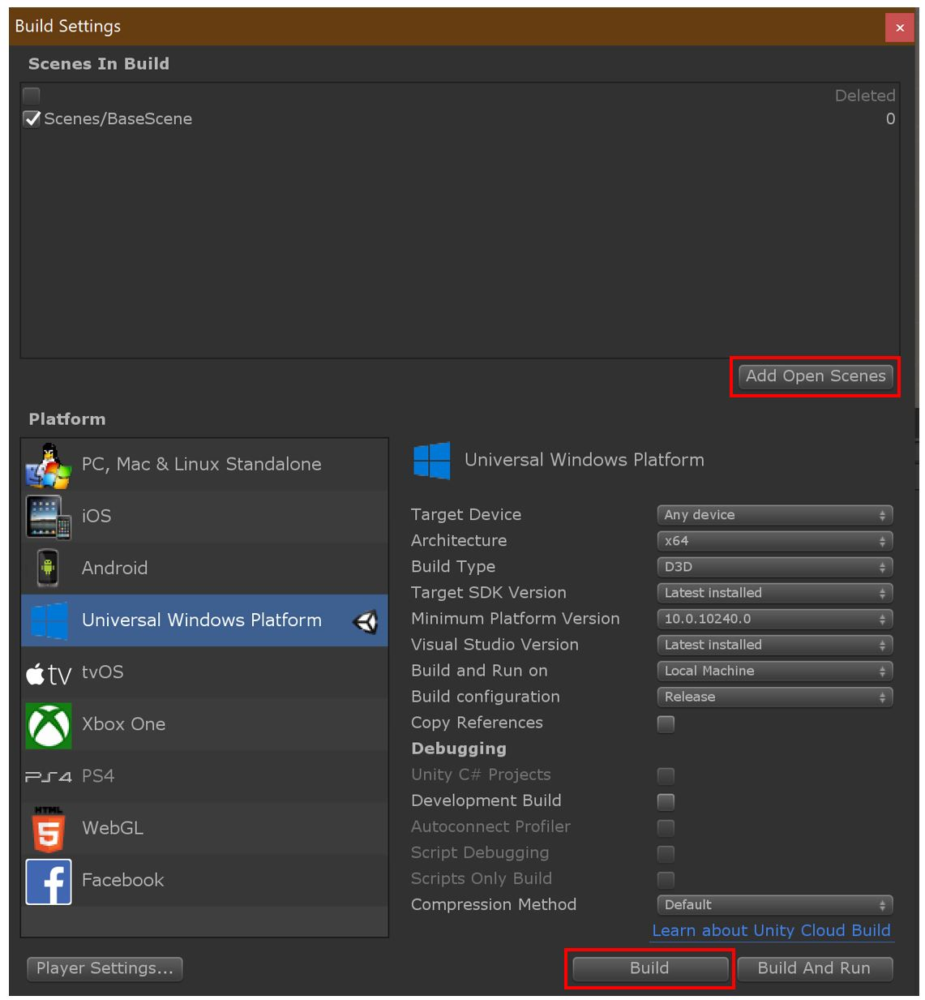
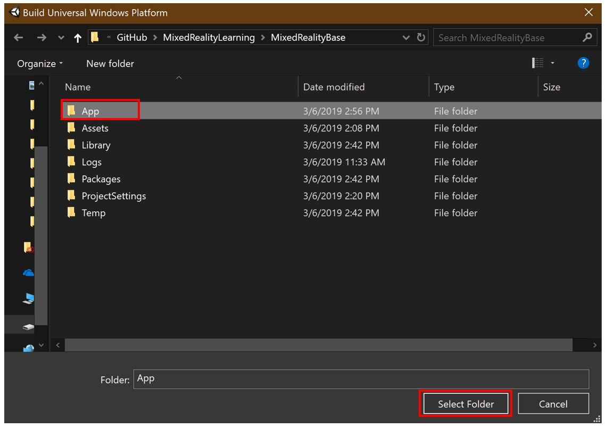
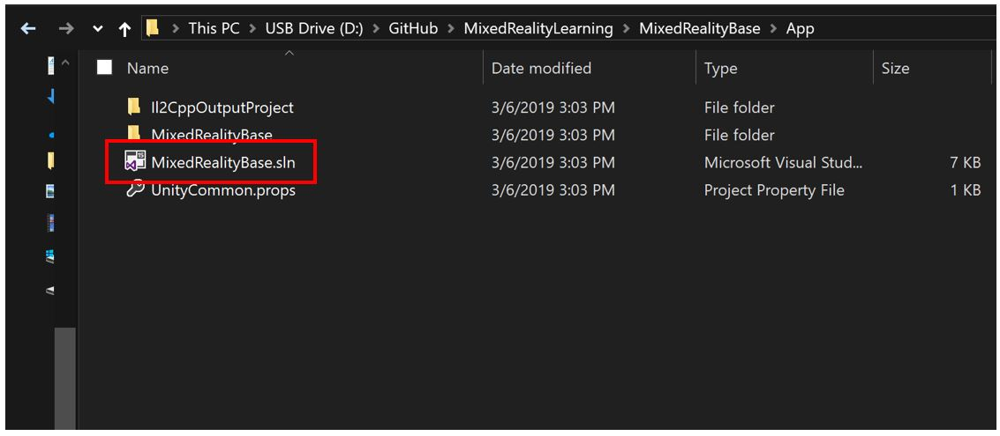
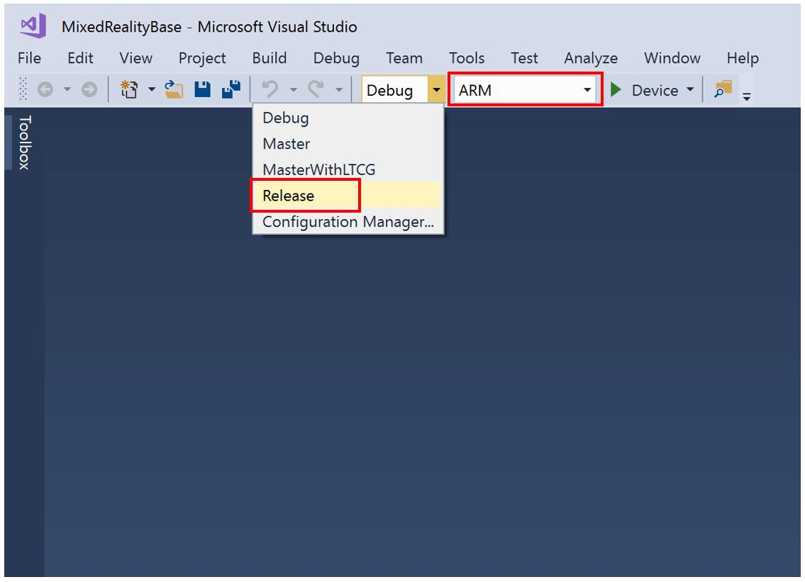
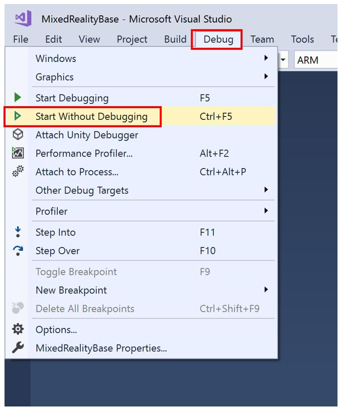

# 1. Getting started with Azure Spatial Anchors

Welcome to the second module of the HoloLens 2 tutorials. Before getting started, be sure that all of the [prerequisites](https://docs.microsoft.com//azure/spatial-anchors/quickstarts/get-started-unity-hololens) are completed. If you have not completed the first, [Base module](mrlearning-base.md) yet, it's recommended that you complete that module first. If you are starting from a new Unity project, follow the new project creation steps in the [Base module](mrlearning-base.md). 

## Objectives

* Learn the fundamentals of developing with Azure Spatial Anchors with HoloLens 2

* Create, upload, and download spatial anchors

## Instructions

### Downloading and importing assets
Before beginning, download and import the following assets:

[Azure Spatial Anchors v1.1.0](https://github.com/Azure/azure-spatial-anchors-samples/releases/download/v1.1.0/AzureSpatialAnchors.unitypackage)

[MR Base module Asset Pack v1.2](https://github.com/microsoft/MixedRealityLearning/releases/download/1.2/BaseModuleAssets-1.2.unitypackage)

[ASA module Asset Pack v1.3.1](https://github.com/Developer-OI/MixedRealityLearning/releases/download/ASA_1.3/ASAModuleAssets_1.3.1.unitypackage)

[Mixed Reality Toolkit  Foundation Package 2.1.0](https://github.com/microsoft/MixedRealityToolkit-Unity/releases/tag/v2.1.0)

1. Create a new scene in your project. Right click your Scene folder, click Create, then Scene. Name the new scene as "ASALearningModule".

2. Double click "ASALearningmodule" scene to see some pre-defined items to appear along with the new scene. 
3. Configure the scene for mixed reality development. 

> Note:
> You may see a pop-up dialog box for selecting a [profile for the Mixed Reality Toolkit](https://microsoft.github.io/MixedRealityToolkit-Unity/Documentation/Profiles/Profiles.html). Choose the profile named *DefaultHoloLens2ConfigurationProfile* by double-clicking it.

4. When choosing a file for the MRTK, select, DefaultMixedRealityToolkitConfigurationProfile.

> Note: If you have your own configuration profile, feel free to use that instead.
>

Now the scene is configured for mixed reality. Make sure you save your scene (do this with either control/command+S or click on file, then click on Save). 

5. Import the [Azure Spatial Anchors v1.1.0](https://github.com/Azure/azure-spatial-anchors-samples/releases/download/v1.1.0/AzureSpatialAnchors.unitypackage) unity package, that we downloaded in step 1. For that, click Assets, go down to Import Package. Then click Custom Package... Your computer files will open. When they do, find where you saved the Azure Spatial Anchors package, and select it. Then click Open.

A pop-up appears, providing a list of tools and settings, and asking you what to import. Select ***all*** of the options available, then click Import.

> Note: Be patient, it will take a few minutes to import. 

6. Import [MR Base module Asset Pack](https://github.com/microsoft/MixedRealityLearning/releases/tag/1.2) next. Much like Step 5, go back in to Unity, click Assets, and hover over Import Package. Click Custom Package... Your computer files will appear again. Go to where you stored the Base module Asset Pack. and select it. Click Open.

> Note: There might be more assets needed later in this module. Follow these steps to import any assets mentioned from this point on. 

7. Import the [ASA module pack 1.3.1](https://github.com/Developer-OI/MixedRealityLearning/releases/download/ASA_1.3/ASAModuleAssets_1.3.1.unitypackage) using the same steps as importing the other previous packages.

### Configuring your scene

In this section, we will add prefabs and scripts into the scene to create a series of buttons that demonstrate the fundamentals of how both local anchors and Azure Spatial Anchors behave in an application.

8. In the Project tab, underneath the Assets folder, click on ASAmoduleAssets. Once selected, you will see two prefabs: ButtonParent and ParentAnchor.

9. Drag both prefabs into the scene. 

Note: After adding the ButtonParent into the scene, a popup will appear asking you to import TMP assets. Import the "TMP Essentials". After this, If you see any large font text in the scene, delete the ButtonParent object and add it again from the ASAmoduleAssets folder.

Note: If you want to check the debug logs in the HoloLens. You can drag and drop the DebugWindow prefab from ASAModuleAssets folder into the scene. Attach the DebugWindowMessaging script in the DebugWindow inspector panel and enable the Debug Window Enabled option. After that, drag  and drop the DebugWindow prefab into DebugText empty field. You can also adjust the DebugWindow position wherever appropriate for you.

10. In order to zoom in to the scene, double click on the parent anchor in the hierarchy and adjust your view to see the entire scene as needed. Currently, ParentAnchor is a colored cube used for only demonstration purpose. Eventually, we will hide the cube and place our content as a child of the ParentAnchor. 

11. Now lets configure the buttons for operating the scene. For that, expand the ButtonParent prefab, and notice several labeled buttons. These buttons are created from the MRTK's PressableButton prefabs. Learn more about how to create PressableButton from the [Base module](mrlearning-base-ch2.md). For these buttons to operate, we need to add an event which will be triggered when the user presses or selects the individual buttons. 

- For the Button named, StartAzureSession, create a new event under the Button Pressed event trigger as well as the On Click event trigger. Drag the ParentAnchor object into the empty field, and assign the StartAzureSession() method from the ParentAnchor object's ASAmoduleScript component as shown in the below screenshot.
- 

- For the Button name, StopAzureSession, create a new event under the Button Pressed event trigger as well as the On Click event trigger. Drag the ParentAnchor object into the empty field, and assign the StopAzureSession() method from the ParentAnchor object's ASAmoduleScript component.

- For the Button named, CreateAnchor, create a new event under the Button Pressed event trigger as well as the On Click event trigger. Drag the ParentAnchor object into the empty field, and assign the CreateAzureAnchor() method from the ParentAnchor object's ASAmoduleScript component.  **After this, drag the ParentAnchor again into the next empty "Game Object" field.**

- For the Button named, Start Looking For Anchor, create a new event under the Button Presse" event trigger as well as the On Click event trigger. Drag the ParentAnchor object into the empty field, and assign the FindAzureAnchor() method from the ParentAnchor Object's ASAmoduleScript component.

- For the Button named, DeleteAzureAnchor, create a new event under the Button Pressed event trigger as well as the On Click event trigger. Drag the ParentAnchor object into the empty field, and assign the DeleteAzureAnchor() method from the ParentAnchor object's ASAmoduleScript component.  

- For the Button named, Delete Local Anchor, create a new event under the Button Pressed event trigger as well as the On Click event trigger. Drag the ParentAnchor object into the empty field, and assign the RemoveLocalAnchor() method from the ParentAnchor object's ASAmoduleScript component. **After this, drag the ParentAnchor object again into the next empty "Game Object" field.**

12. To set up Azure spatial anchors, go to AzureSpatialAnchorsPlugin folder in assets folder and then navigate to Examples -> Resources->AzureSpatialAnchorsDemoConfig file. In the inspector panel add the Azure Account ID and Account Key created earlier. If you haven't created or don't have the them, please follow the [Prerequisites](https://docs.microsoft.com//azure/spatial-anchors/quickstarts/get-started-unity-hololens). 

  

### Build and demonstrate Base Application

Now that your scene is configured to demonstrate the basics of Azure Spatial Anchors, we will build and demonstrate the basic behavior of Azure Spatial Anchors. 

1. Open the build settings window again by going to File>Build Settings.
    
2. Ensure the scene you want to try is in the Scenes in build list by clicking on the Add Open Scenes button.
3. Verify the Platform is set to Universal Windows Platform. If not, please set it to the same.
4. Press the Player Settings button and go to Publishing Settings. Under Capabilities, enable: Internet, Internet Client Server, Private Network Client Server, Removable Storage, Webcam, Microphone and Spatial Perception.
5. In the same Player Settings, go to XR settings  and select the Virtual Reality Supported to ON.
6. Press the Build button to begin the build process.
   
7. Create and name a new folder for your application. In the image below, a folder with the name App was created to contain the application. Click Select Folder to begin building to the newly created folder. After the build has completed, you may close the Build Setting" window in Unity.

    

    > NOTE: If the build fails, try building again or restarting Unity and building again. If you see an error such as "Error: CS0246 = The type or namespace name “XX” could not be found (are you missing a using directive or an assembly reference?). You might need to install [Windows 10 SDK (10.0.18362.0)](<https://developer.microsoft.com//windows/downloads/windows-10-sdk>) 

8. Even after a successful build you might get some errors as shown below but if the build is successful you can ignore them and proceed with next steps.

    

    

9. After the build is completed, open the newly created folder containing your newly built application files. Double click on the“MixedRealityBase.sln" solution or the corresponding name. if you used an alternative name for your project to open the solution file in Visual Studio.

    > Note: Be sure to open the newly created folder (i.e., the App folder, if following the naming conventions from the previous steps because there will be a similarly named .sln file outside of that folder that is not to be confused with the .sln file inside the build folder.

    

    > Note: If Visual Studio asks to install new components, please take a moment to ensure that all prerequisite components are installed as specific in [the "Install the Tools" page](install-the-tools.md)

9. Plug your HoloLens 2 into your PC with the USB cable. While these Lesson instructions assume you will be deploying a testing with a HoloLens 2 device, you may also choose to deploy to the [HoloLens 2 emulator](using-the-hololens-emulator.md) or choose to create an [app package for sideloading](<https://docs.microsoft.com//windows/uwp/packaging/packaging-uwp-apps>)

10. Before building to your device, ensure that the device is in Developer Mode. If this is your first time deploying to the HoloLens 2, Visual Studio may ask you to pair your HoloLens 2 with a pin. Follow [these instructions](https://docs.microsoft.com//windows/mixed-reality/using-visual-studio) if you need to enable developer mode or pair with Visual Studio.

11. Configure Visual Studio for building to your HoloLens 2 by selecting the Release configuration as well as the ARM architecture.

    

12. The final Step is to build to your device by selecting Debug>Start without Debugging. Selecting Start without Debugging causes the application to immediately start on your device upon a successful build without Debugging information appearing in Visual Studio. This also means that you can disconnect your USB cable while your application is running on your HoloLens 2 without stopping the application. You might also select Build>Deploy Solution to deploy to your device without having the application automatically start.

    

>Note: The Azure spatial anchors uses the internet to save and load the anchor data so make sure your device is connected to internet before testing the ASA app.

13. Follow the instructions. 
    When the application is running on your device, follow the on-screen instructions. Press the Scene buttons corresponding to the Steps below. If you added the debug window as mentioned in the previous steps you can see the feedback for individual button press and the progress of individual operations related to Azure spatial anchors.

    
    1. Start the spatial anchors session.
    
    2. Move the cube to a different location.
    
    3. Save the Azure spatial anchors at the location of the cube.
    
    4. Stop the Azure spatial anchors session.
    
    5. Remove the local anchor on the cube to allow the user to move the cube.
    
    6. Move the cube somewhere else.
    
    7. Start Azure spatial anchors session.
    
    8. Find Azure Spatial Anchors. 
    You should go back to the original place you put it when you created the anchor.
    
    9. Delete Azure spatial anchor.
    
    10. Stop Azure session.

### Anchoring an experience

In the previous sections, you learned the fundamentals of Azure Spatial Anchors. We've used a cube to represent and visualize the parent game object with the attached anchor. In this section, you learn how to anchor an entire experience by placing it as a child of the ParentAnchor object. For this example, we use the lunar module Assembly demonstration application that was created during [Base module Lesson 6](mrlearning-base-ch6.md).

1. Search for the "Rocket Launcher Complete" prefab, and drag it into your hierarchy as a child of the object as shown in the image below.

2. Position the module assembly experience so that the cube is still exposed as shown in the image below. In the application, users may reposition the entire experience by moving the cube. 

> Note: There are a variety of user experience flows for repositioning experiences, including the use of a button to toggle a bounding box that surrounds the experience, use of a repositioning object (such as the cube used in this step), the use of position and rotation gizmos, and more.

## Congratulations
In this tutorial, you learned the fundamentals of Azure Spatial Anchors. This Lesson provided you with several buttons that let you  explore the various steps required to start and stop an Azure session, and create, upload, and download azure anchors on a single device. In the next lesson, we'll learn how to save Azure anchor IDs to your HoloLens 2 for retrieval, even after the application is restarted. During the series, you will also learn how to transfer anchor IDs between multiple devices to achieve spatial alignment, and learn about multi-user shared sessions, forthcoming as part of Sharing tutorial.

[Next Lesson: 2. Saving, retrieving and sharing Azure Spatial Anchors](mrlearning-asa-ch2.md)

