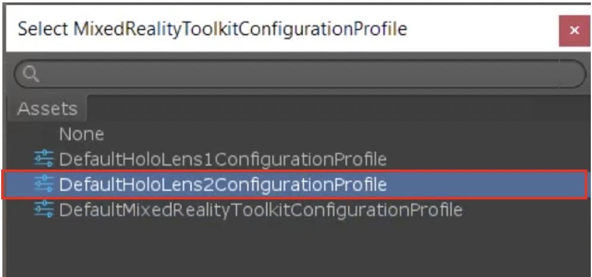
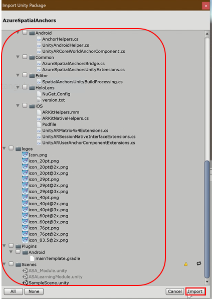
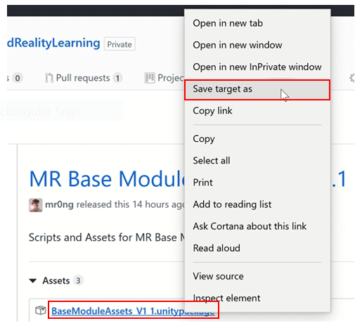
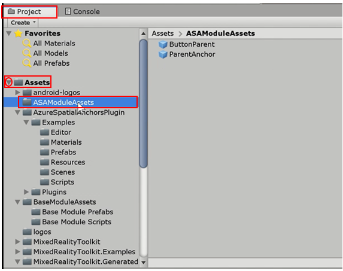
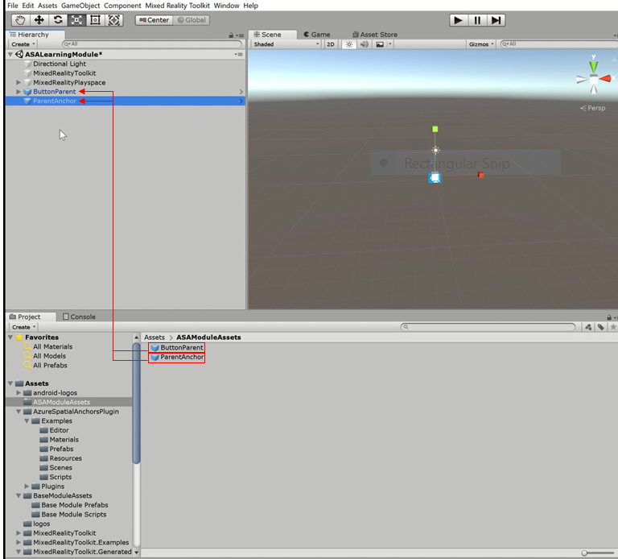
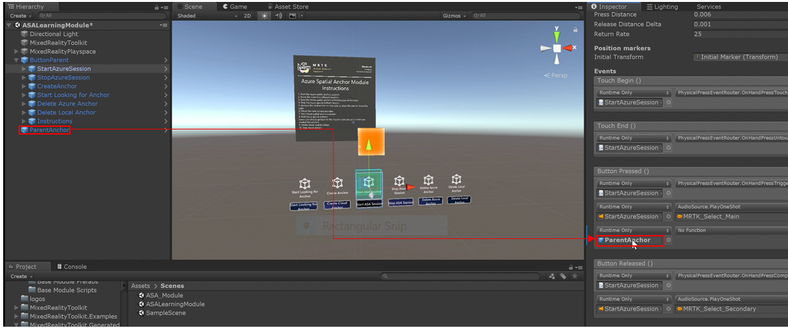
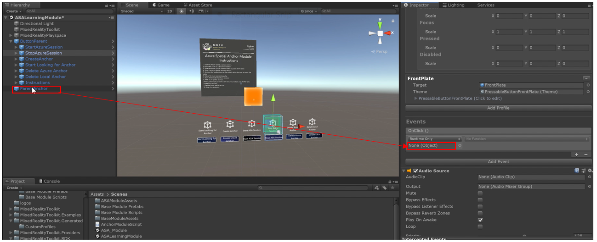
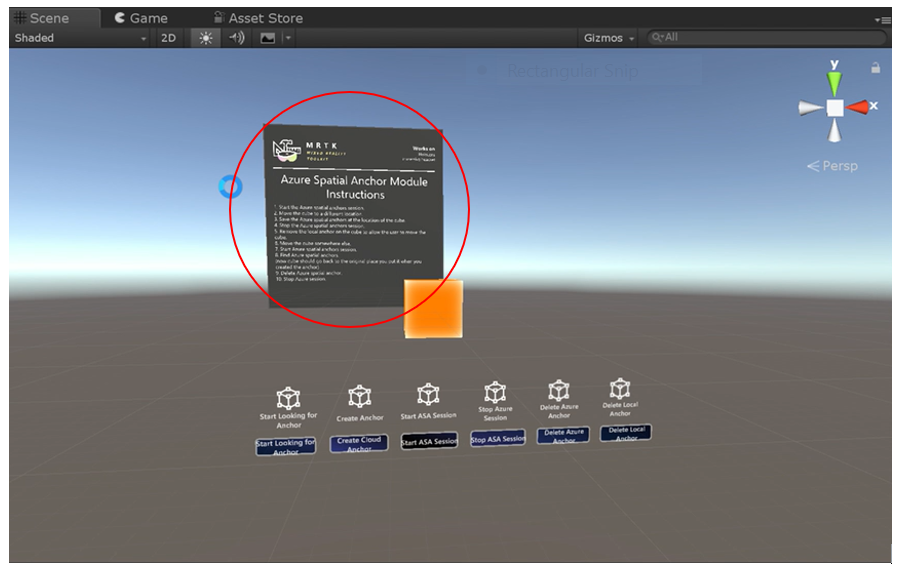
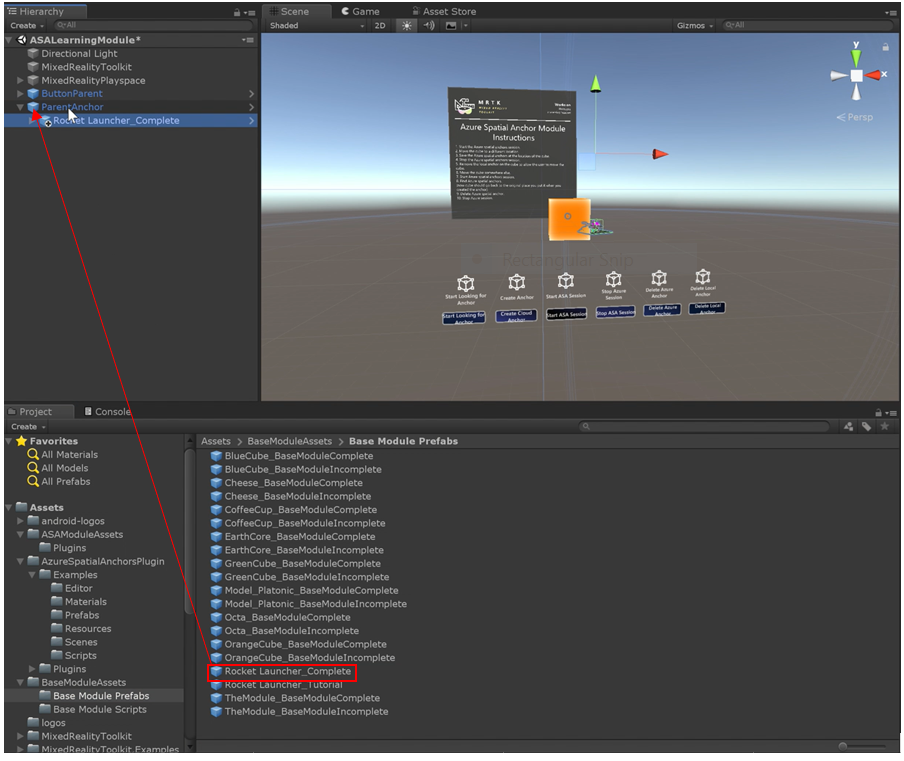
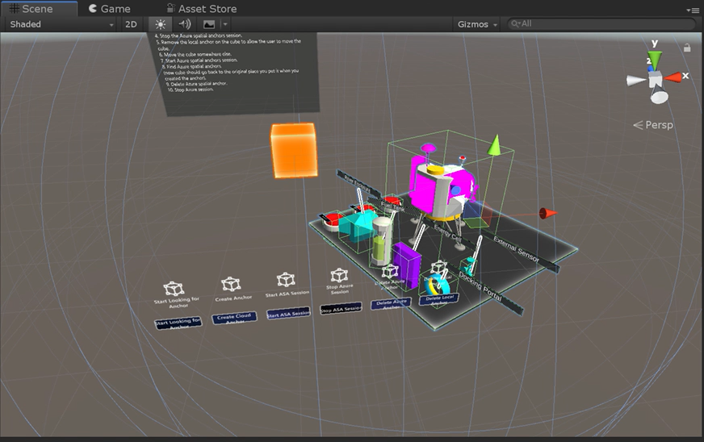

# Getting Started with Azure Spatial Anchors on HoloLens 2

Welcome to the second module of the HoloLens 2 Tutorial! Before getting started, be sure that all of the [prerequisites](https://docs.microsoft.com/en-us/azure/spatial-anchors/quickstarts/get-started-unity-hololens) are completed. If you have not completed the first, [base module](link) yet, we highly recommend that you complete that first. If you are starting from a new unity project, follow the new project creation steps in the [base module](link). 

## Objectives

* Learn the fundamentals of developing with Azure Spatial Anchors with the HoloLens 2

* Create, Upload, and Download Spatial Anchors

  

## Instructions

### Downloading and Importing Assets
Before beginning, you must download and import the following assets:

[Azure Spatial Anchors](https://github.com/azure/azure-spatial-anchors-samples/releases)

[MR Base Module Asset Pack](https://github.com/microsoft/mixedrealitylearning/releases/tag/v1.1)

[ASA Module Asset Pack](https://github.com/microsoft/mixedrealitylearning/releases/tag/v1.1)

[Mixed Reality Toolkit](link to base module chater 1)

> Note: see step 5 for specific instructions on how to import the Azure Spatial Anchors, step 6 for specific instructions on the MR Base Module Asset Pack, and steps 3-4 for specific instructions on the Mixed Reality Toolkit.

1. create a new scene in your project. Right click your scene folder, click "create," then scene. Name the new scene "ASALearningModule."

2. Double click "ASALearningModule" to see some pre-defined items appear along with the new scene. 
3. Configure the scene for mixed reality development. 

> Note: You will see a pop-up that says, "you must choose a file for the Mixed Reality Toolkit." Clicking "ok" will bring you to step 4.

4. When choosing a file for the Mixed Reality Toolkit, select, "DefaultMixedRealityToolkitConfigurationProfile."

   > Note: If you have your own configuration profile feel free to use that instead.

Now the scene is configured for mixed reality. Make sure you save your scene (do this with either control/command+S, or click on file, then click on save). 

5. Import the [Azure Spatial Anchors](https://github.com/azure/azure-spatial-anchors-samples/releases). In order to use spatial anchors, you must import this asset. So, click on the link above and right click on "AzureSpatialAnchors.unitypackage." Click on "save target as" and save it to your computer. 

   

   Then, after it's saved, go back into unity, click "assets," go down to "import package," then click "custom package..." Your computer files will open up. Once they do, find where you saved the Azure Spatial Anchors package and select it. Then click "open."

   

   Now there will be a popup giving a list of tools and settings, asking you what to import. Select ***all*** of the options available, then click "import."

   

   > note: it will take a few minutes to import, so please be patient. 

   6. Import [MR Base Module Asset Pack](https://github.com/microsoft/mixedrealitylearning/releases/tag/v1.1) next. Much like step 5, click the link above, then right click "BaseModuleAssetsV1 1.unitypackage" and click "save target as" and save it to your computer. 

   

   > Tip: Save all these assets in the same folder so that they are easier to find and have access to. It will keep everything nice and organized!

   Just like step 5, go back in to unity, click "assets," hover over "import package" then click "custom package..." Your computer files should appear again, so go to where you stored the Base Module Asset Pack and select it. Then click "open."

   

   > Note: there may be more assets needed later in this module. Follow these steps to import any assets mentioned from this point on. 

7. Import the ASA Module Pack using the same approach as importing the previous packages.

### Configuring your scene

In this section, we will be adding prefabs and scripts into the scene to create a series of buttons that demonstrate the fundamentals of how both local anchors and Azure Spatial Anchors behave in an application.

7. In the "project" tab, underneath the "assets" folder, click on "ASAModuleAssets." Once selected you will see 2 prefabs, "ButtonParent" and "ParentAnchor."

8. Drag both of the prefabs into the scene. 

9. Double click on the parent anchor to select it. You may need to adjust your view to see the entire scene, so adjust your scene as needed.

​	Familiarize yourself with the ParentAnchor prefab. Currently, the game object named "ParentAnchor" is a colored cube, for demonstration purposes. Eventually, we will hide the cube and place our content as a child of the ParentAnchor. This prefab includes the AzureSpatialAnchorsDemoWrapper.cs script (included with the ASA SDK) and the ASAModuleScript.cs script (included as part of this module) to the ParentAnchor object. 

10. Configure Buttons. Under the ParentAnchor prefab, you will notice several labeled buttons. These buttons are created from the MRTK's PressableButton prefabs. Learn more about how to create Pressable Buttons from the [Base Module](mrlearning-base-ch2.md). For each button, add an event that will be triggered when the user presses or selects the button according to the list below. 

- For the Button named "StartAzureSession", create a new event under the "Button Pressed" event trigger as well as the "On Click" event trigger. Drag the ParentAnchor object into the empty field, and assign the StartAzureSession() method from the ParentAnchor Object's ASAModuleScript component.

  

  

  

- For the Button named "StopAzureSession", create a new event under the "Button Pressed" event trigger as well as the "On Click" event trigger. Drag the ParentAnchor object into the empty field, and assign the StopAzureSession() method from the ParentAnchor Object's ASAModuleScript component.

- For the Button named "CreateAnchor", create a new event under the "Button Pressed" event trigger as well as the "On Click" event trigger. Drag the ParentAnchor object into the empty field, and assign the CreateAzureAnchor() method from the ParentAnchor Object's ASAModuleScript component.

- For the Button named "Start Looking For Anchor", create a new event under the "Button Pressed" event trigger as well as the "On Click" event trigger. Drag the ParentAnchor object into the empty field, and assign the FindAzureAnchor() method from the ParentAnchor Object's ASAModuleScript component.

- For the Button named "DeleteAzureAnchor", create a new event under the "Button Pressed" event trigger as well as the "On Click" event trigger. Drag the ParentAnchor object into the empty field, and assign the DeleteAzureAnchor() method from the ParentAnchor Object's ASAModuleScript component.

- For the Button named "Delete Local Anchor", create a new event under the "Button Pressed" event trigger as well as the "On Click" event trigger. Drag the ParentAnchor object into the empty field, and assign the RemoveLocalAnchor() method from the ParentAnchor Object's ASAModuleScript component.

### Build and Demonstrate Base Application

Now that your scene is configured to demonstrate the basics of Azure Spatial Anchors, we will build and demonstrate the basic behavior of Azure Spatial Anchors. 

1. If you closed the Build Settings window from the previous sections, open the build settings window again by going to File>Build Settings.
    

2. Ensure the scene you want to try is in the “Scenes in Build” list by clicking on the “Add Open Scenes” button.

3. Press the Build button to begin the build process.
    

4. Create and name a new folder for your application. In the image below, a folder with the name “App” was created to contain the application. Click “Select Folder” to begin building to the newly created folder. After the build has completed, you may close the "Build Settings" window in Unity. 
    

  > NOTE: If the build fails, try building again or restarting Unity and building again. If you see an error such as "Error: CS0246 = The tyoe or namespace name “XX” could not be found (are you missing a using directive or an assembly reference?)", then you may need to install [Windows 10 SDK (10.0.18362.0)](<https://developer.microsoft.com/en-us/windows/downloads/windows-10-sdk>) 
  >

5. After the build is completed, open the newly created folder containing your newly built application files. Double click on the “MixedRealityBase.sln” solution (or the corresponding name, if you used an alternative name for your project) to open the solution file in Visual Studio.

  > Note: Be sure to open the newly created folder (i.e., the "App" folder, if following the naming conventions from the previous steps), as there will be a similarly named .sln file outside of that folder that is not to be confused with the .sln file inside the build folder. 

  > Note: If visual studio asks to install new components, please take a moment to ensure that all prerequisite components are installed as specific in [the "Install the Tools" page](install-the-tools.md) 

6. Plug your HoloLens 2 into your PC with the USB cable. While these lesson instructions assume you will be deploying a testing with a HoloLens 2 device, you may also choose to deploy to the [HoloLens 2 emulator](using-the-hololens-emulator.md) or choose to create an [app package for sideloading](<https://docs.microsoft.com/en-us/windows/uwp/packaging/packaging-uwp-apps>)

7. Before building to your device, ensure that the device is in Developer Mode. If this is your first time deploying to the HoloLens 2, Visual Studio may ask you to pair your HoloLens 2 with a pin. Please follow [these instructions](https://docs.microsoft.com/en-us/windows/mixed-reality/using-visual-studio) if you need to enable developer mode or pair with Visual Studio.

8. Configure Visual Studio for building to your HoloLens 2 by selecting the “Release” configuration and the “ARM” architecture.
    
    
9. The final step is to build to your device by selecting Debug>Start without Debugging. Selecting “Start without Debugging” will cause the application to immediately start on your device upon a successful build, but without Debugging information appearing in Visual Studio. This also means that you can disconnect your USB cable while your application is running on your HoloLens 2 without stopping the application. You may also select Build>Deploy Solution to deploy to your device without having the application automatically start.
    
    
10. When the application is running on your device, please follow the on-screen instructions. Please press the scene buttons corresponding to the steps below.
    
    
    
    1. Start the Azure spatial anchors session.
    
    2. Move the cube to a different location.
    
    3. Save the Azure spatial anchors at the location of the cube.
    
    4. Stop the Azure spatial anchors session.
    
    5. Remove the local anchor on the cube to allow the user to move the cube.
    6. Move the cube somewhere else.
    
    7. Start Azure spatial anchors session.
    
    8. Find Azure spatial anchors.
    (now cube should go back to the original place you put it when you created the anchor).
    9. Delete Azure spatial anchor.
    
    10. Stop Azure session.

### Anchoring an experience

In the previous sections, you learned the fundamentals of Azure Spatial Anchors. We've used a cube to represent and visualize the parent game object with the attached anchor. In this section, you wiill learn how to anchor an entire experience by placing it as a child of the ParentAnchor object. For this example, we will use the Lunar Module Assembly demo app that was created during [Base Module Lesson 6](mrlearning-base-ch6.md).

1. Search for the Lunar Module Assembly Complete prefab and drag it into your heirarchy as a child of the AnchorParent gameobject, as shown in the image below.

   

2. Position the module assembly experience in such a way that the cube is still exposed, as shown in the image below. In the application, users may reposition the entire experience by moving the cube. 

   

   > Note: There are a variety of user experience flows for repositioning experiences, including the use of a button to toggle a bounding box that surrounds the experience, use of a repositioning object (such as the cube used in this step), the use of position and rotation gizmos, and more.

## Congratulations
In this lesson, you learned the fundamentals of Azure Spatial Anchors. This lesson provided you with several buttons allowing you to explore the various steps required to start and stop an Azure session, and create, upload, and download azure anchors on a single device. In the next lesson, we'll learn how to save Azure anchor IDs to your HoloLens 2 for retrieval, even after the application is restarted. During the series, you will also learn how to transfer anchor IDs between multiple devices to achieve spatial alignment, and eventually learn about multi-user shared sessions (forthcoming as part of sharing module.)

[Next Lesson: ASA Lesson 2](mrlearning-base-ch3.md)

