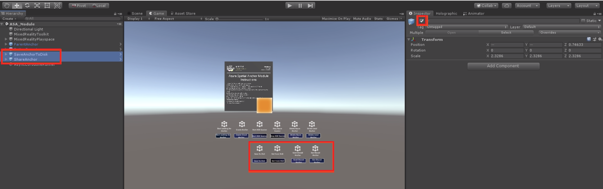
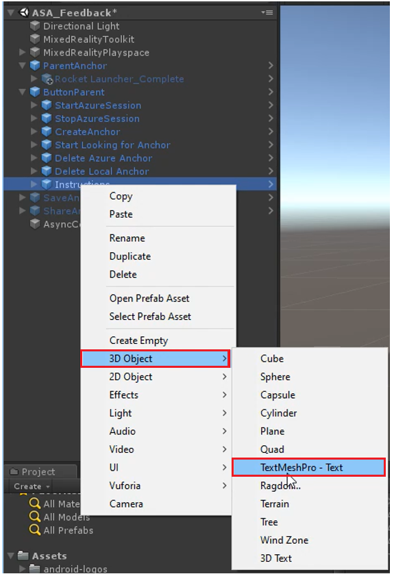
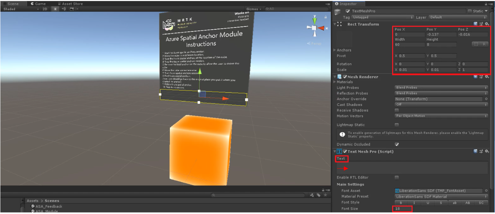
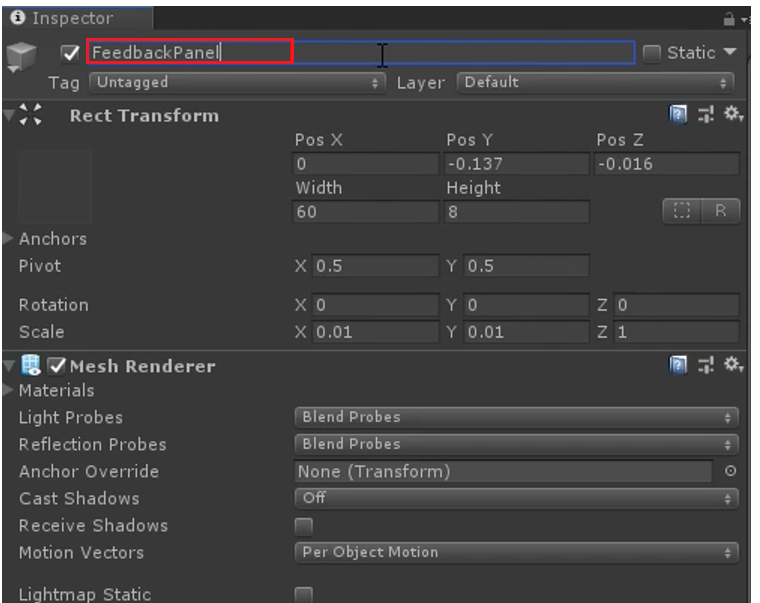
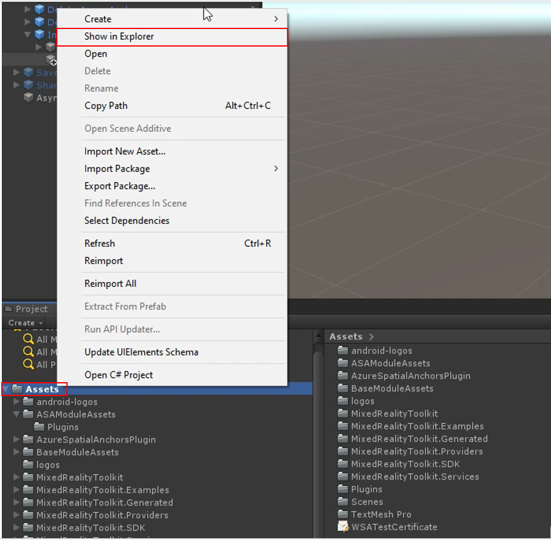
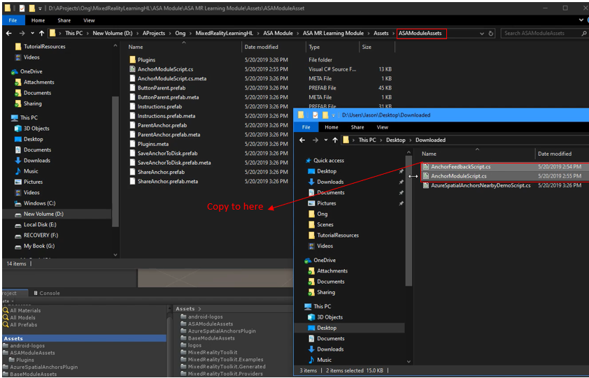
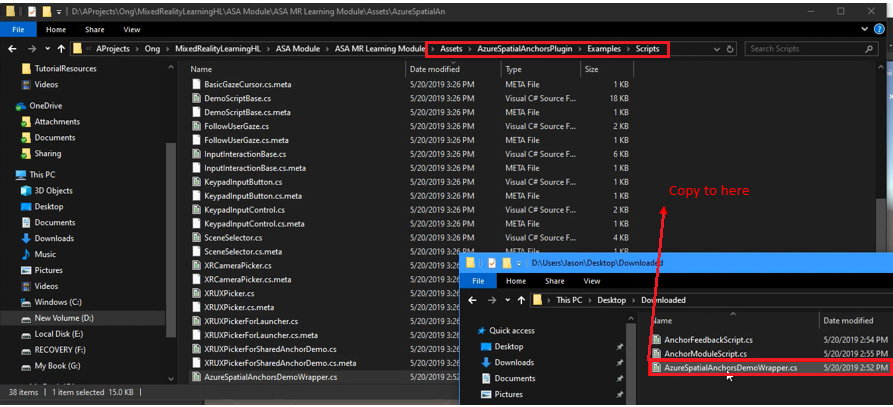
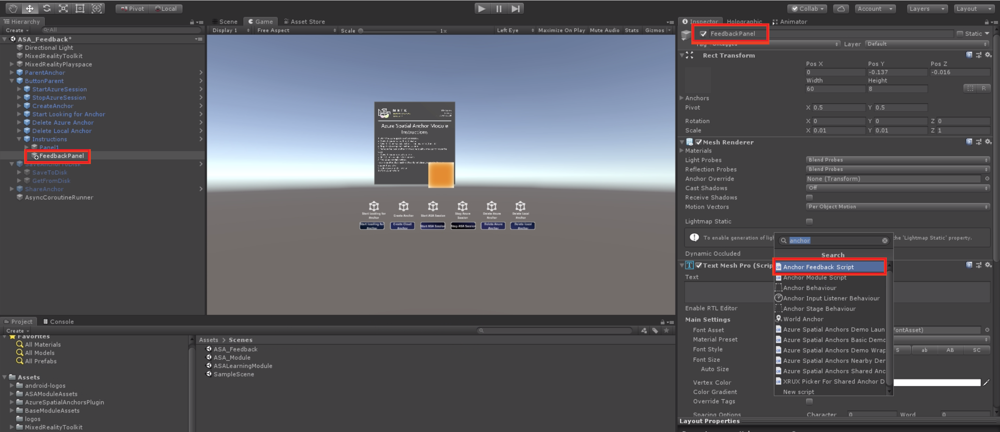
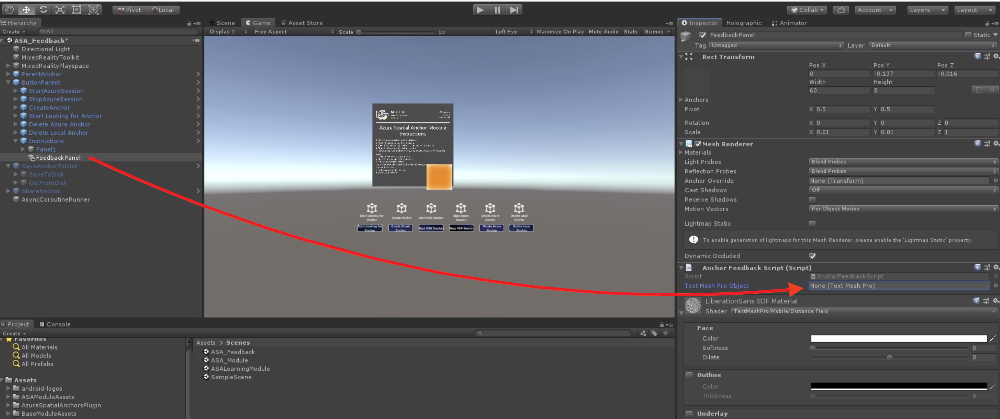

# 3. Displaying Azure Spatial Anchor feedback

In this lesson, you'll learn about how to provide users with feedback about anchor discovery, events, and status when using Azure Spatial Anchors.

## Objectives

* Learn how to set up a UI panel that displays important information about the current ASA session

* Understand and explore feedback elements that the ASA SDK makes available to users

## Instructions

### Set Up ASA Feedback UI Panel

1. In this lesson, we are not using the "SaveAnchorToDisk" and "ShareAnchor" buttons so select both buttons and uncheck the checkbox in the inspector panel (as shown below) to hide these buttons.
   

2. Next, create the instruction panel. Start by right clicking the "instructions" button, hover over "3D Object" and select "textmeshpro-text."

3. Adjust the scale and the positioning of the text so that it matches with the instructions in your scene. Also, ensure the alignment for all of the text is centered. Then delete the sample text from the text editor, as shown in in the image below.

4. Change the name of the TextMeshPro object to "FeedbackPanel."
   

5. In the project panel, select "assets" and right click, then select "show in explorer."
   

Now, click [here](https://onedrive.live.com/?authkey=%21ABXEC8PvyQu8Qd8&id=5B7335C4342BCB0E%21395636&cid=5B7335C4342BCB0E) to download the files needed in the next few steps.

6. Once explorer opens, select the assets folder, then the "ASAmodulesAssets" folder, and copy the anchor feedback script and the anchor module script files into the folder. 

> note: if you get a pop-up asking you if you would like to overwrite the old or keep the old make sure you select overwrite.

7. Now return to the Assets folder. Then, go into the "AzureSpatialAnchorsPlugin" folder, then the examples folder, and finally the scripts folder, and copy the Azure Spatial Anchors demo wrapper into that folder. 

8. Now that the files are uploaded, ensure that the "feedbackpanel" text is selected, in the ASA_feedback hierarchy and click "add component" and add the anchor feedback script by searching for it and selecting it once it appears. 

9. Drag the "feedbackPanel" text object from the ASA_Feedback hierarchy into the empty slot beneath the script as seen in the picture below. 

## Congratulations

In this lesson we learned how to create a UI panel to display the current status of the Azure Spatial Anchor experience for providing user with real-time feedback.

