# 4. Azure Spatial Anchors for Android and iOS

In this tutorial, you will learn how to build your project to Android and iOS devices using AR Foundation, ARCore XR Plugin, and ARKit XR Plugin.

## Objectives

* Learn how to build your project to Android device using Unity AR Foundation and ARCore XR Plugin.
* Learn how to build your project to an iOS device using Unity AR Foundation and ARKit XR Plugin.

[!NOTE] To complete this tutorial, make sure you have completed Azure Spatial Anchors Tutorials -> [Getting started with Azure Spatial Anchors](mrlearning-asa-ch1.md).

## Adding inbuilt Unity packages

In this section, you will install Unity's inbuilt AR Foundation, ARCore XR Plugin, and ARKit XR Plugin packages required to support Android and iOS devices.

Make sure you install the correct version of these Unity packages as listed below:

* **AR Foundation 2.1.4**
* **ARCore XR plugin 2.2.0 preview 2**
* **ARKit XR plugin 2.1.1**

[!NOTE] If you are developing this project for Android, there is no need to install the ARKit XR Plugin package. Similarly, if you are developing this project for iOS, you do not need to install the ARCore XR Plugin.

In the Unity menu, select **Window** > **Package Manager**:

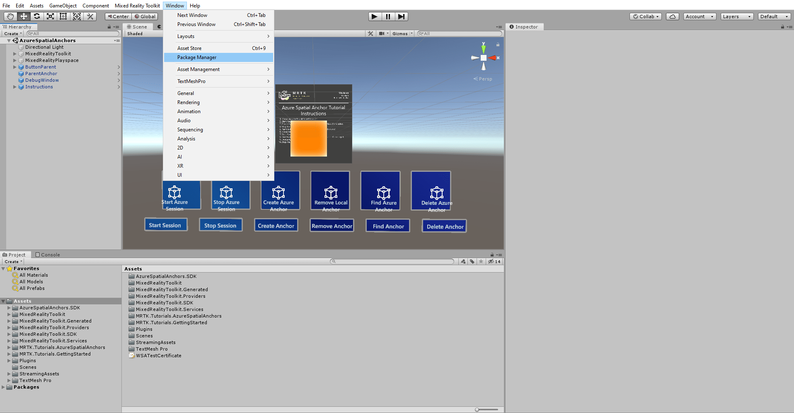

It might take a few seconds before all packages appear in the list. Display preview packages by clicking on Advanced option and select "**Show preview packages.**"

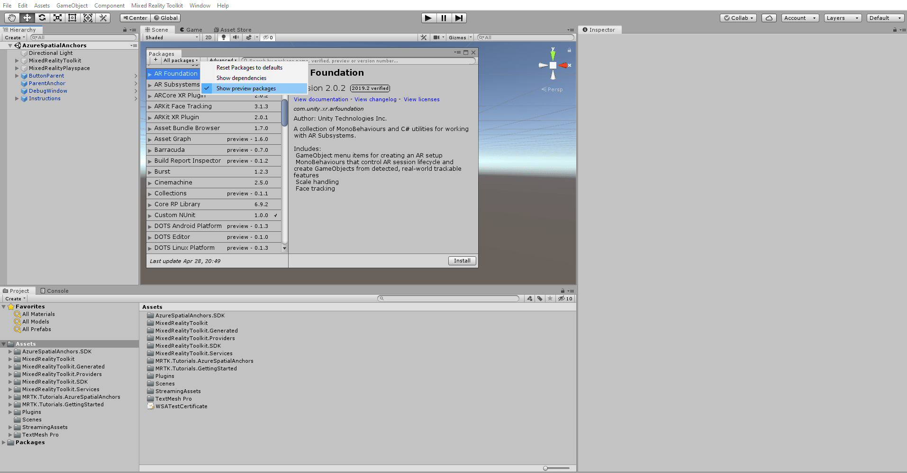

In the Package Manager window, select **AR Foundation**, here you see many version and need to select version 2.1.4 and update the package by clicking the **Update to 2.1.4** button:

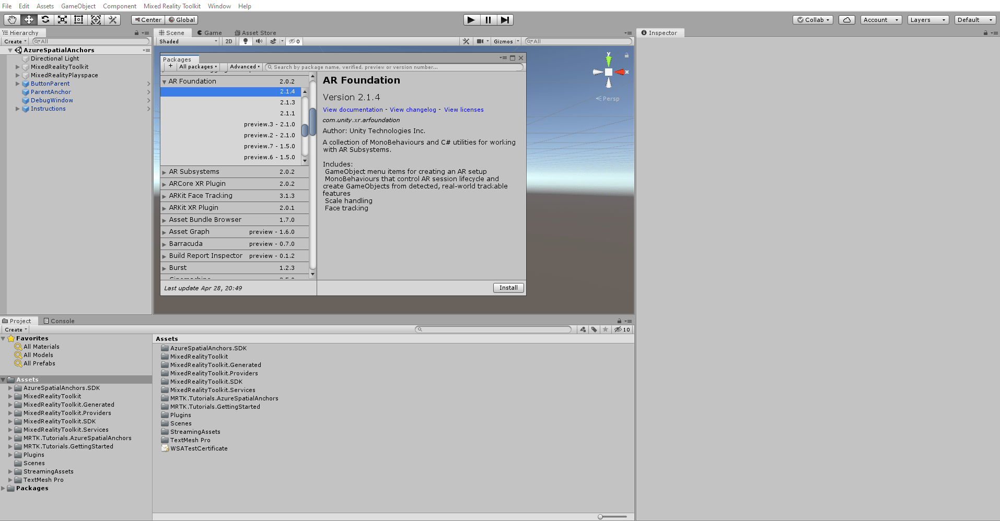

To support Android devices, follow the same process to import ARCore XR Plugin 2.2.0 preview 2.

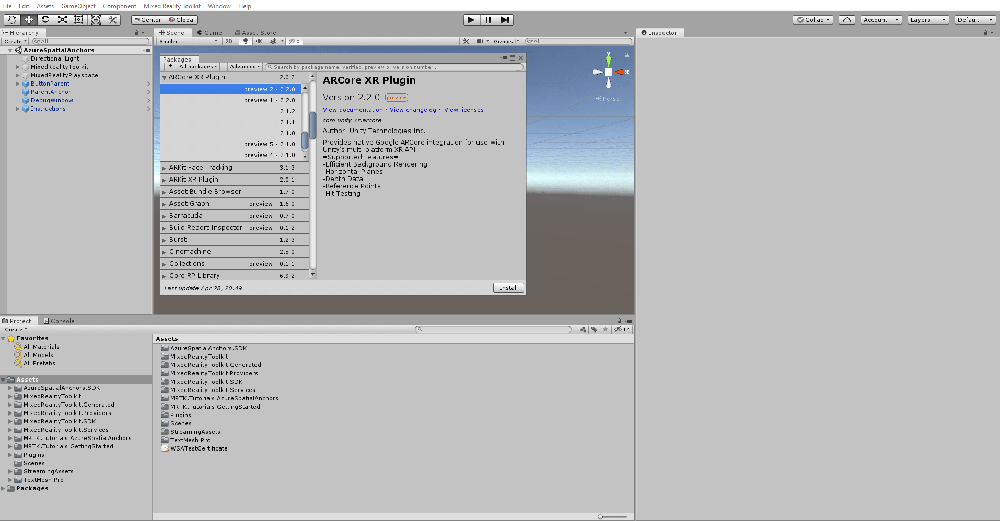

To support iOS devices, you should import the **ARKit XR plugin 2.1.1** Unity package from the Package Manager.

## Customize MRTK to support AR Foundation camera

Customize MRTK settings to support AR Foundation by selecting MixedRealityToolKit in the Hierarchy window and click the **Clone** button in Mixed Reality ToolKit in the Inspector window.

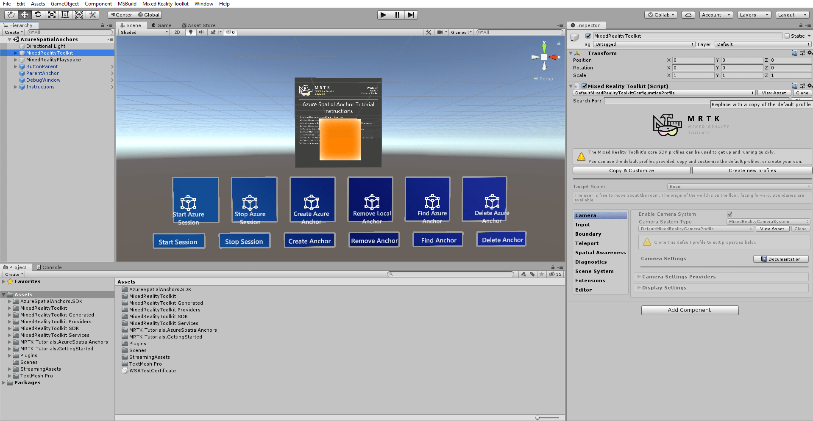

When you click the **Clone** button, a new Clone Profile window will appear, click on the Clone button again to clone the DefaultMixedRealityToolkitProfile.

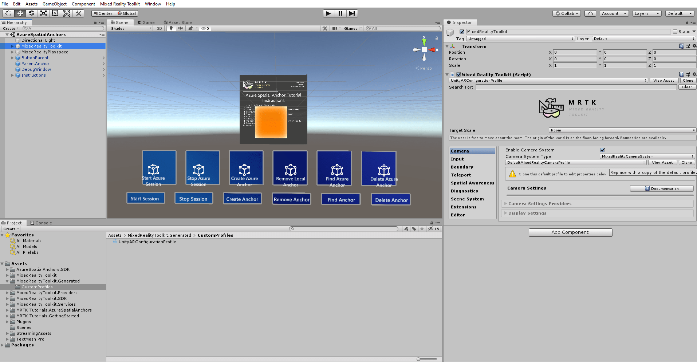

Similarly, clone the camera profile in the Inspector window and rename the profile to “UnityARConfigurationProfile” and click on the **Clone** button. In the Inspector window, locate the MixedReality, select the Camera tab Expand the camera setting providers in the inspector window and click on **+Add Camera Setting Provider** > expand **New data provider 1**> select Type **None** >select **Microsoft .MixedReality.Toolkit.Experimental.UnityAR** > Select **UnityARCameraSettings**.

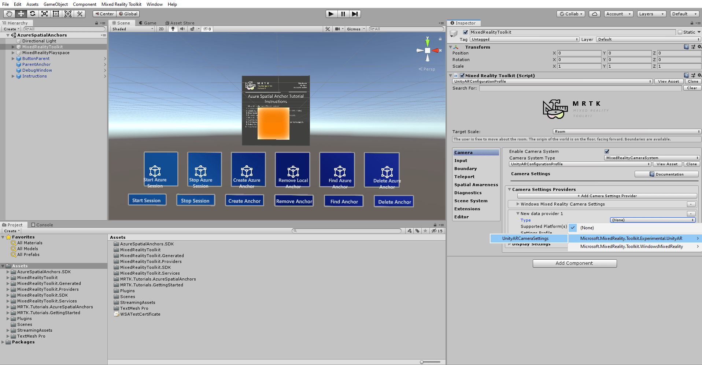

With the MixedRealityToolKit object selected in the Hierarchy window, in the Inspector window, attach supporting scripts by clicking on the **Add component** button and type in AR reference Point manager and select the script.

Adding the  "AR Reference Point Manager" script will automatically add "AR session origin" along with it in the Inspector window. After adding the supporting scripts, the Inspector window should look like this.

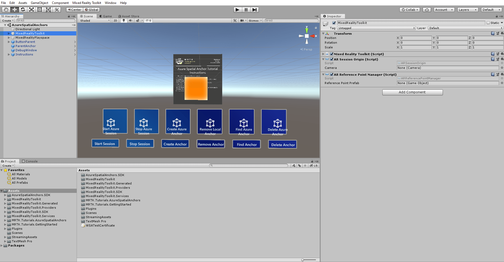

## Build application to Android device

To build this application to your Android device, click on **File** at the top of the window and select **Build Settings.** A new window will appear on the screen, select **Android,** and click on the **Switch Platform**. It will take a few minutes to switch platform. After switching to the Android platform, click on **Add Open Scenes** and make sure your current scene is the only selected scene in the **Scenes In Build** list.

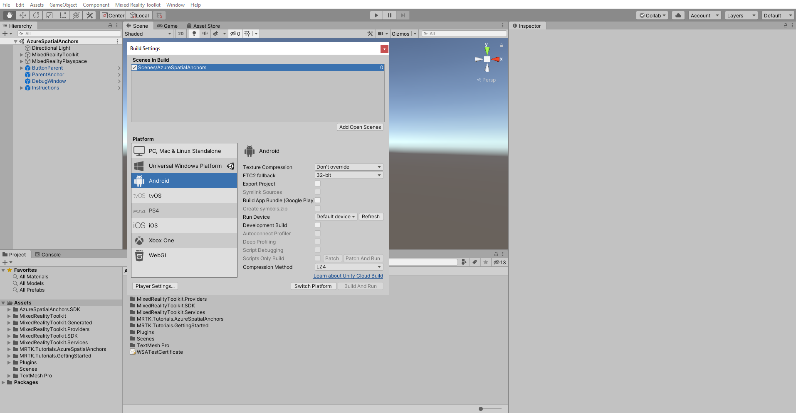

Close the **Build Settings** window. In the Unity menu, select **Mixed Reality Toolkit** > **Utilities** > **Configure Unity Project** and click on **Apply** to configure the Unity project for the Android platform.

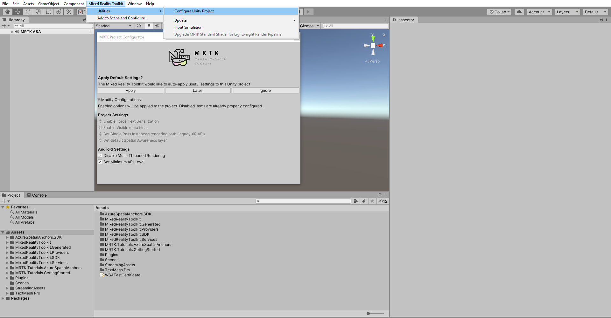

In the Unity menu, select **Edit** > **Project Settings** to open the Project Settings window. In the Project Settings, window selects the **Player** tab, expand the Other Settings section, select **Vulkan,** and remove it by clicking the "-" symbol.

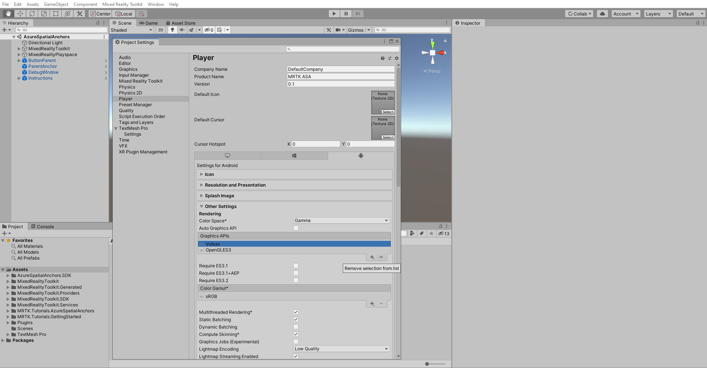

Close the Player Settings window and open the Build Settings window again. Then, using a USB cable, connect your Android device to your computer and select your device in the **Build and Run on** the dropdown, then click **Build And Run**. You will be asked to save a .apk file, which you can pick any name.

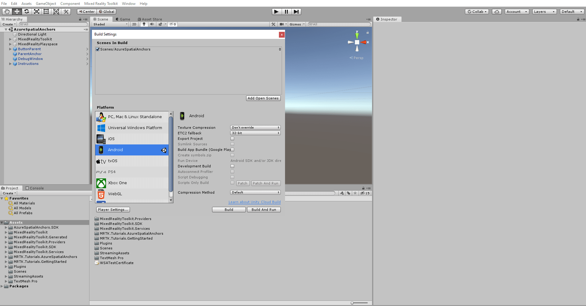

> [!NOTE]
> If you get any error in the Unity Console window related to Android SDK, NDK, and or JDK modules, you need to open Unity Hub and install the associated SDK, NDK, and JDK modules for the Android Build Support module.

When the build process is complete, your applications should automatically load on your Android device.

## Build application to iOS Device

To build this application to your iOS device, click on **File** at the top of the window and select **Build Settings.** A new window will appear on the screen, then select **iOS** and click on the **Switch Platform**.

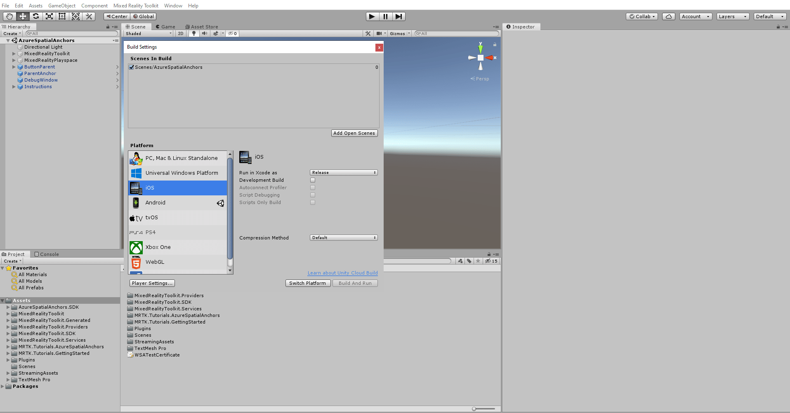

Close the **Build Settings** window. In the Unity menu, select **Mixed Reality Toolkit** > **Utilities** > **Configure Unity Project** and click on **Apply** to configure the Unity project for the iOS platform.

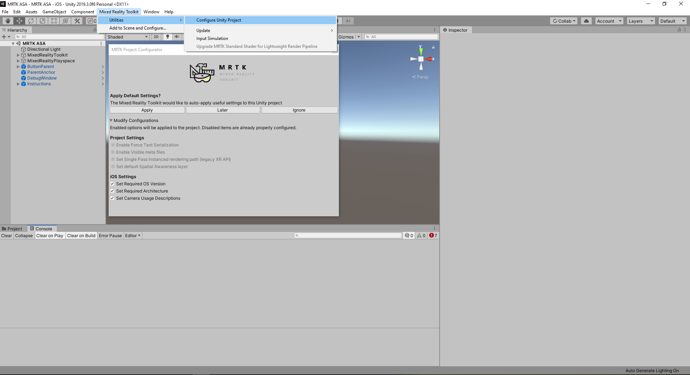

To build the iOS XCode project, go to Build Settings and, click on **Build**.

Follow [this guide](https://docs.microsoft.com/azure/spatial-anchors/quickstarts/get-started-unity-ios#export-the-xcode-project) to learn how to deploy this project to your iOS device.

## Congratulations

In this tutorial, you learned how to build your project for Android and iOS devices. You also learned how to use AR Foundation, ARCore XR Plugin, and ARKit XR Plugin to make your project work for Android and iOS devices.