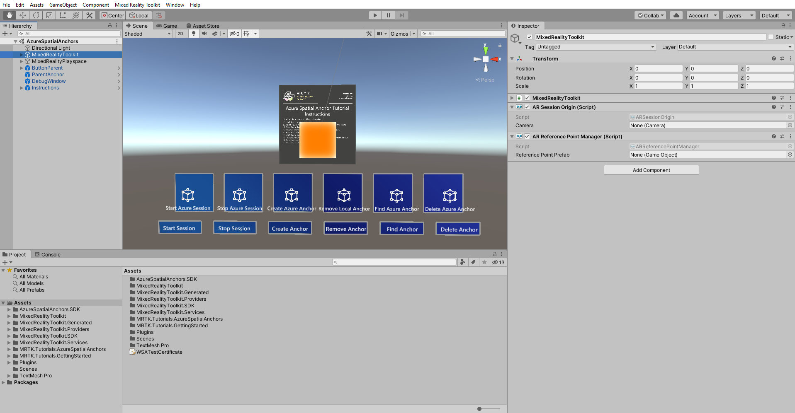

# 4. Azure spatial anchors for android and iOS 

In this tutorial, you will learn how to build the existing project to android and iOS devices using AR Foundation, ARCore XR plugin and ARKit XR plugin.

## Objectives

* Learn how to build existing project to android device using Unity's AR Foundation and ARCore XR Plugin.
* Learn how to build existing project to iOS device using Unity's AR Foundation and ARKit XR Plugin.

## Prerequisites

To complete this tutorial, make sure you have completed Azure Spatial Anchors Tutorials -> [Getting started with Azure Spatial Anchors](mrlearning-asa-ch1.md)

## Adding inbuilt Unity packages

In this section, you will install Unity's inbuilt AR Foundation and ARCore XR plugin packages required to support android device.

Make sure you install right version of unity packages as listed below:

- **AR Foundation 2.1.4**
- **ARCore XR plugin 2.2.0 preview 2**

In the Unity menu, select **Window** > **Package Manager**:

It might take a few seconds before the AR Foundation package appears in the list. Enable preview changes by clicking on Advanced option and select "Show preview packages".

In the Package Manager window, select **AR Foundation**, here you see many version and need to select version 2.1.4 and install the package by clicking the **Install** button:

Similarly follow the same process to import ARCore XR plugin 2.2.0 preview 2. 

## Customize MRTK to support AR Foundation camera

Customize MRTK settings to support ARFoundation by selecting MixedRealitytToolKit in Hierarchy window and select clone button in Mixed Reality ToolKit in inspector window.

After you select clone button, this opens a new Clone Profile window, now you can rename this profile as "UnityARConfigurationProfile" and click Clone button.

Similarly, clone the camera settings in the inspector window and rename the profile name to “UnityARConfigurationProfile” and click on Clone button. Expand the camera setting providers in inspector window and click on **+Add Camera Setting Provider** > expand **New data provider 1**> select Type **None** >select **Microsoft .MixedReality.Toolkit.Experimental.UnityAR**  > Select **UnityARCameraSettings**.

While Selecting MixedRealityToolKit in Hierarchy, attach supporting scripts by clicking on Add component button and type in AR reference Point manager and select the script. 

Adding "AR Reference Point Manager" script will automatically adds "AR session origin" along with it in the the inspector window. After adding the supporting scripts, the inspector window should look like this.

## Build application to Android device

To build this application to android device, click on File at the top of the window and select Build settings. A new window will be appear on screen, select Android and then click on switch platform. This will take few minutes to switch, after switching to Android platform, click on **Add open scenes** and make sure your current scene is added for building. 

In player settings, expand other setting and select **Vulkan** and remove it by selecting "-" Symbol.

To make changes to Android platform build settings, click on Player settings and expand XR setting, select **Virtual Reality Support**  and click "+" Symbol to add **None** under the default SDK section.

Close player settings, click on Build button to build and save the apk file. 

## Build Application to iOS Device

To support iOS devices, you should import **ARKit XR plugin 2.1.1** unity package from the package manager. 

A new window will appear on screen, then select iOS and click on switch platform and keep the same player settings as Android. Once the platform switching is complete, click on Build to build the iOS XCode project.

Follow this guide to learn how to build this project in to your [iOS device](https://hangouts.google.com/call/nCtoXV2WpWf_xQZotpR_AEEF).

## Congratulations

In this tutorial you learned how to build existing project to android and iOS devices. You also learned how to use AR Foundation, ARCore XR plugin and ARKit XR plugin in the existing project to make it work on the android and iOS devices.

