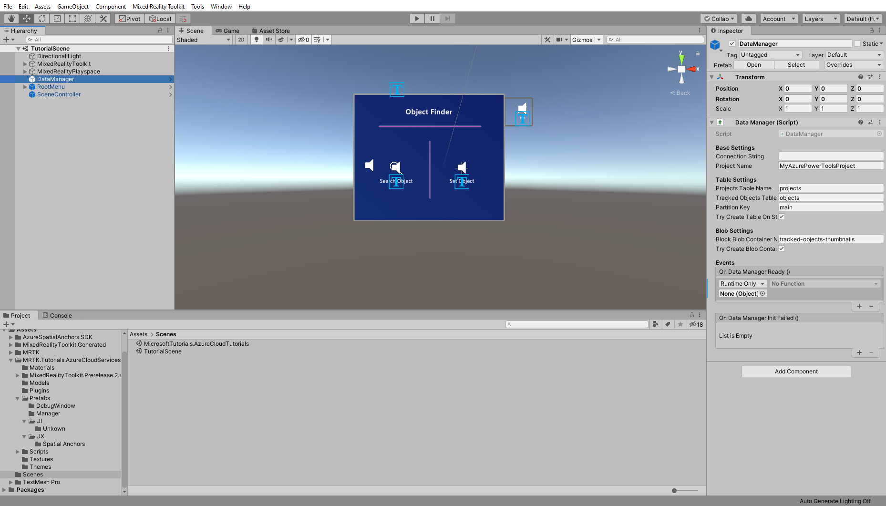
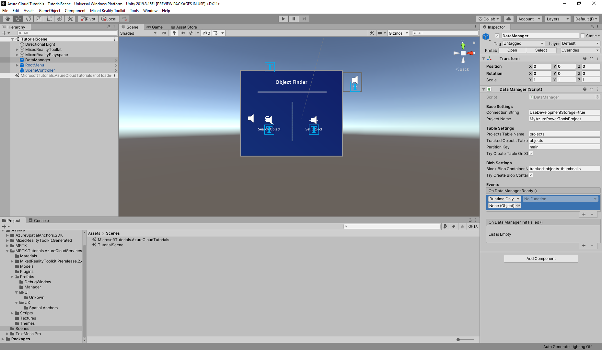
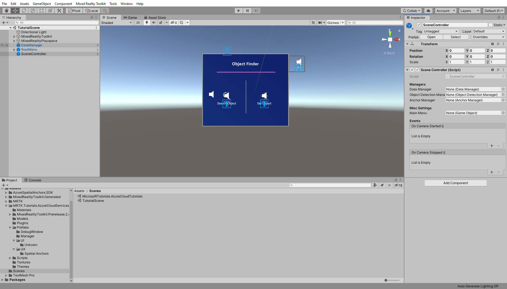

# 1. Introducing Azure Cloud Services for HoloLens 2

## Overview

Welcome to this series of tutorials focused on bringing **Azure Cloud** services into a **HoloLens 2** application. In this five-part tutorial series, you will learn how to integrate several **Azure Cloud** services into a **Unity** project for **HoloLens 2**. With each consecutive chapter, you will add new **Azure Cloud** services to expand the application features and user experience, while teaching you the fundamentals of each **Azure Cloud** service.

> [!NOTE]
> This tutorial series will focus on the **HoloLens 2** but due the cross-platform nature of Unity, most of your learnings will also apply for Desktop and Smartphone applications.

In this first tutorial, [Introducing Azure Cloud Services for HoloLens 2](mrlearning-azure-01.md), we begin by explaining you the goals of the application, briefly introduce you to each Azure Cloud service and set up the unity project.

In the second tutorial, [Integrating Azure Storage](mrlearning-azure-02.md), we start off by integrating Azure Storage as the persistence solution for our application, learn the differences between Blob Storage and Table Storage, prepare the needed project resources, setup the scene and verify the read, update and delete data operations.

Continuing with the third tutorial, [Integrating Azure Custom Vision](mrlearning-azure-03.md), you will use Azure Custom Vision to train and detect images in the HoloLens 2 application. The chapter starts off with setting up your own Azure Custom Vision resource, preparing the scene components and getting into action by training and detecting your own images from inside the application.

Next we advance in the fourth tutorial, [Integrating Azure Spatial Anchors](mrlearning-azure-04.md), with exploring Azure Spatial Anchors service to save and find locations, learn the core concepts, prepare necessary resources, setup the scene and start using the new feature in the application.

With the fifth tutorial, [Integrating Azure Bot Service with LUIS](mrlearning-azure-05.md), we finalize by giving the application a new method of user interaction: natural language! This feature will be realized by using the Azure Bot Framework together with Language Understanding (LUIS). This final chapter teaches you the basics of Azure Bot Service and to speed up the process you will be using the Bot Framework Composer as a zero code solution. Once the bot is created, you will integrate it into the scene and give it a run with the final stage of the HoloLens 2 application.

## Demo Application Goals

In this tutorial series we will build a **HoloLens 2** application that can detect objects from images and find its spatial location. To set a domain language, we call such entities from now **Tracked Object**.
The user can create a **Tracked Object** to either or both associate a set of images via computer vision and a spatial location. All data must be persisted into the cloud. Furthermore some aspects of the application will be optionally be controlled by natural language assisted through a bot.

### Features
* Basic CRUD for data and images
* Image training and detection 
* Storing a spatial location and guidance to it
* Bot Assistant to use some features via natural language 

## Azure Cloud services

To solve the required features for the demo application, we will use these **Azure Cloud** services:

### Azure Storage
We will use [Azure Storage](https://azure.microsoft.com/en-us/services/storage/) for our persistence solution. It allows us to store data on a table and upload large binaries like images.

### Azure Custom Vision
With [Azure Custom Vision](https://azure.microsoft.com/en-us/services/cognitive-services/custom-vision-service/) (part of the [Azure Cognitive Services](https://azure.microsoft.com/en-us/services/cognitive-services/)) we can associate to our *Tracked Object* a set images, train a machine learning model on the set and detect the *Tracked Object*.

### Azure Spatial Anchors
To store a *Tracked Object* location and give a guided directions to find it, we use [Azure Spatial Anchors](https://azure.microsoft.com/en-us/services/spatial-anchors/).

### Azure Bot Service
The application is mainly driven by traditional UI, so we use the [Azure Bot Service](https://azure.microsoft.com/en-us/services/bot-service/) to add it some personality and acts as a new interaction method.

## Prerequisites

>[!TIP]
>If you have not completed the [Getting started tutorials](mrlearning-base.md) series yet, it's recommended that you complete those tutorials first.

* A Windows 10 PC configured with the correct [tools installed](install-the-tools.md)
* Windows 10 SDK 10.0.18362.0 or later
* Some basic C# programming ability
* A HoloLens 2 device [configured for development](using-visual-studio.md#enabling-developer-mode)
* <a href="https://docs.unity3d.com/Manual/GettingStartedInstallingHub.html" target="_blank">Unity Hub</a> with Unity 2019.3.X installed and the Universal Windows Platform Build Support module added
* If you intend to deploy to Android
    * A <a href="https://developer.android.com/studio/debug/dev-options" target="_blank">developer enabled</a> and <a href="https://developers.google.com/ar/discover/supported-devices" target="_blank">ARCore capable</a>
 Android device with USB connection to your Windows or macOS computer
    * <a href="https://docs.unity3d.com/Manual/GettingStartedInstallingHub.html" target="_blank">Unity Hub</a> with Unity 2019.2.X installed and the Android Build Support module added
* If you intend to deploy to iOS
    * A macOS computer with the the latest version of <a href="https://geo.itunes.apple.com/us/app/xcode/id497799835?mt=12" target="_blank">Xcode</a> and <a href="https://cocoapods.org" target="_blank">CocoaPods</a> installed
    * An <a href="https://developer.apple.com/documentation/arkit/verifying_device_support_and_user_permission" target="_blank">ARKit compatible</a> iOS device with USB connection to your macOS computer
    * <a href="https://docs.unity3d.com/Manual/GettingStartedInstallingHub.html" target="_blank">Unity Hub</a> with Unity 2019.2.X installed and the iOS Build Support module added

> [!IMPORTANT]
> The recommended Unity version for this tutorial series is Unity 2019.3.X. This supersedes any Unity version requirements or recommendations stated in the prerequisites linked above.

## Creating and preparing the Unity project

In this section, you will create a new Unity project and get it ready for MRTK development.

For this, first follow the [Initializing your project and first application](mr-learning-base-02.md), excluding the [Build your application to your device](mr-learning-base-02.md#building-your-application-to-your-hololens-2) instructions, which includes the following steps:

1. [Creating the Unity project](mr-learning-base-02.md#creating-the-unity-project) and give it a suitable name, for example, *MRTK Tutorials*
2. [Switching the build platform](mr-learning-base-02.md#configuring-the-unity-project)
3. [Importing the TextMeshPro Essential Resources](mr-learning-base-02.md#importing-the-textmeshpro-essential-resources)
4. [Importing the Mixed Reality Toolkit](mr-learning-base-02.md#importing-the-mixed-reality-toolkit)
5. [Configuring the Unity project](mr-learning-base-02.md#configuring-the-unity-project)
6. [Creating and configuring the scene](mr-learning-base-02.md#creating-and-configuring-the-scene) and give the scene a suitable name, for example, *AzureSpatialAnchors*

Then follow the [Changing the Spatial Awareness Display Option](mr-learning-base-03.md#changing-the-spatial-awareness-display-option) instructions to change the MRTK configuration profile for your scene to the **DefaultHoloLens2ConfigurationProfile** and change the display options for the spatial awareness mesh to **Occlusion**.

> [!CAUTION]
> As mentioned in the [Configure the Unity project for the Mixed Reality Toolkit](mrlearning-base-ch1.md#configure-the-unity-project-for-the-mixed-reality-toolkit) instructions linked above, it is strongly recommended to not enable MSBuild for Unity.

## Importing the tutorial assets

Download and **import** the following Unity custom packages **in the order they are listed**:

* [MRTK.Tutorials.AzureCloudServices](https://github.com/onginnovations/MixedRealityLearning/releases/download/azure-cloud/MRTK.Tutorials.AzureCloudServices.unitypackage)
* [Azure Storage for Unity](https://github.com/onginnovations/MixedRealityLearning/releases/download/azure-cloud/AzureStorageForUnity.unitypackage)
* [Azure Spatial Anchors](https://github.com/Azure/azure-spatial-anchors-samples/releases/tag/v2.2.1)

> [!TIP]
> For a reminder on how to import a Unity custom package, you can refer to the [Import the Mixed Reality Toolkit](mrlearning-base-ch1.md#import-the-mixed-reality-toolkit) instructions.
 
After you have imported the tutorial assets your Project window should look similar to this:

## Creating and preparing the scene
<!-- TODO: Consider renaming to 'Preparing the scene' -->

In this section, you will prepare the scene by adding some of the tutorial prefabs.

In the Project window, navigate to **Assets** > **MRTK.Tutorials.AzureCloudServices** > **Prefabs** > **Manager** folder. While holding down the CTRL button, click on **SceneController**, **RootMenu** and **DataManager** to select the three prefabs:

The **SceneController (prefab)** contains two scripts, **SceneController (script)** and **UnityDispatcher (script)**. The **SceneController** script component contains several UX functions and facilitates the photo capture functionality while **UnityDispatcher** is a helper class to allow execute actions on the Unity main thread.

The **RootMenu (prefab)** is the primary UI prefab that holds all UI windows that are connected with each through various small script components and control the general UX flow if the application.

The **DataManager (prefab)** is responsible for talking to Azure storage and will be explained further in the next lesson.

Let's continue, now with the four prefabs still selected, drag them into the Hierarchy window to add them to the scene:

To focus in on the objects in the scene, you can double-click on the ParentAnchor object, and then zoom slightly out again:

> [!TIP]
> If you find the large icons in your scene, for example, the large framed 'T' icons distracting, you can hide these by <a href="https://docs.unity3d.com/2019.1/Documentation/Manual/GizmosMenu.html" target="_blank">toggling the Gizmos</a> to the off position.

## Configure the scene

In this section, you will connect *SceneManager*, *DataManager* and *RootMenu* together to have a working scene to be ready for the following [Azure Storage tutorial](mrlearning-azure-01.md).

### Connect the objects

In the Hierarchy window, select the **DataManager** object:

In the Inspector window, locate the **DataManager (Script)** component and add a new event listener to the **On Data Manager Ready ()** event by clicking the **+** icon:

Now select in the Hierarchy window the **SceneController** object and drag it into the **On Data Manager Ready ()** event and select from the dropdown menu **SceneController.Init**

From the Inspector window, select the **SceneController** object, there in the inspector you will find the **SceneController (script)** component. 

You will see that there several unpopulated fields, let's change that. Move the **DataManager** object from the Hierarchy into the *Data Manager* field and move the **RootMenu** GameObject from the Hierarchy into the *Main Menu* field.

Now your scene is ready for the upcoming tutorials. Don't forget to save it into your project.

## Prepare project build pipeline

While we have jet to fill the project with life, let's do some preparations so the project is ready for building for **HoloLens 2**.

### 1. Add additional required capabilities

In the Unity menu, select **Edit** > **Project Settings...** to open the Player Settings window:

In the Player Settings window, select **Player** and then **Publishing Settings**:

In the  **Publishing Settings**, scroll down to the **Capabilities** section and double-check that the **InternetClient**, **Microphone** and **SpatialPerception** capabilities, which you enabled when you created the project at the beginning of the tutorial, are enabled. Then, enable the **InternetClientServer**, **PrivateNetworkClientServer**, and **Webcam** capabilities:

### 2. Deploy the app to your HoloLens 2

Features like Azure Spatial Anchors from the [forth tutorial](mrlearning-azure-04.md) can not run in Unity, so to test the Azure Spatial Anchors functionality, you need to deploy the project to your device.

> [!TIP]
> For a reminder on how to build and deploy your Unity project to HoloLens 2, you can refer to the [Build your application to your device](mrlearning-base-ch1.md#build-your-application-to-your-device) instructions.

### 3. Run the app on your HoloLens 2 and follow the in-app instructions

> [!CAUTION]
> All Azure Services uses the internet, so make sure your device is connected to the internet.

When the application is running on your device, accept access to requested capabilities which several services will need to function properly.

## Congratulations

In this tutorial, you got introduced to the tutorial series, learned about the features we will implement and how **Azure Cloud** services tie in to make our *HoloLens 2* application happen. You added the required components into the project and prepared the scene for this tutorial series.

In the next lesson, we will use Azure Storage as a cloud based persistence solution for storing data and images.

[Next Lesson: 2. Integrating Azure Storage](mrlearning-azure-02.md)