# 1. Getting started with Azure Spatial Anchors

## Overview

Welcome to the second series of the HoloLens 2 tutorials. In this four-part tutorial series, you will learn the fundamentals of Azure Spatial Anchors.

In this first tutorial, [Getting started with Azure Spatial Anchors](mrlearning-asa-ch1.md), you will explore the various steps required to start and stop an Azure session and create, upload, and download Azure anchors on a single device.

In the second tutorial, [Saving, retrieving, and sharing Azure Spatial Anchors](mrlearning-asa-ch2.md), you will learn how to save Azure Spatial Anchors across multiple app sessions by saving anchor information to the HoloLens 2's storage and how to share this anchor information to other devices for a multi-device anchor alignment.

In the third tutorial, [Displaying Azure Spatial Anchor feedback](mrlearning-asa-ch3.md), you will learn how to provide users with feedback about anchor events and statuses when using Azure Spatial Anchors.

In the fourth tutorial, [Azure Spatial Anchors for Android and iOS](mrlearning-asa-ch4.md), you will learn how to build and deploy your project to Android and iOS devices.

## Objectives

* Learn the fundamentals of developing with Azure Spatial Anchors for HoloLens 2
* Create, upload, and download spatial anchors

## Prerequisites

>[!TIP]
>If you have not completed the [Getting started tutorials](mrlearning-base.md) series yet, it's recommended that you complete those tutorials first.

* A Windows 10 PC configured with the correct [tools installed](install-the-tools.md)
* Windows 10 SDK 10.0.18362.0 or later
* Some basic C# programming ability
* A HoloLens 2 device [configured for development](using-visual-studio.md#enabling-developer-mode)
* <a href="https://docs.unity3d.com/Manual/GettingStartedInstallingHub.html" target="_blank">Unity Hub</a> with Unity 2019.2.X installed and the Universal Windows Platform Build Support module added
* Complete the [Create a Spatial Anchors resource](https://docs.microsoft.com/azure/spatial-anchors/quickstarts/get-started-unity-hololens#create-a-spatial-anchors-resource) section of the [Quickstart: Create a Unity HoloLens app that uses Azure Spatial Anchors](https://docs.microsoft.com/azure/spatial-anchors/quickstarts/get-started-unity-hololens) tutorial.
* If you intend to deploy to Android
    * A <a href="https://developer.android.com/studio/debug/dev-options" target="_blank">developer enabled</a> and <a href="https://developers.google.com/ar/discover/supported-devices" target="_blank">ARCore capable</a>
 Android device with USB connection to your Windows or macOS computer
    * <a href="https://docs.unity3d.com/Manual/GettingStartedInstallingHub.html" target="_blank">Unity Hub</a> with Unity 2019.2.X installed and the Android Build Support module added
* If you intend to deploy to iOS
    * A macOS computer with the the latest version of <a href="https://geo.itunes.apple.com/us/app/xcode/id497799835?mt=12" target="_blank">Xcode</a> and <a href="https://cocoapods.org" target="_blank">CocoaPods</a> installed
    * An <a href="https://developer.apple.com/documentation/arkit/verifying_device_support_and_user_permission" target="_blank">ARKit compatible</a> iOS device with USB connection to your macOS computer
    * <a href="https://docs.unity3d.com/Manual/GettingStartedInstallingHub.html" target="_blank">Unity Hub</a> with Unity 2019.2.X installed and the iOS Build Support module added

> [!IMPORTANT]
> The recommended Unity version for this tutorial series is Unity 2019.2.X. This supersedes any Unity version requirements or recommendations stated in the prerequisites linked above.

## Creating the Unity project
<!-- TODO: Consider renaming to 'Creating and preparing the Unity project'-->

In this section, you will create a new Unity project and get it ready for MRTK development.

For this, first follow the [Initializing your project and first application](mrlearning-base-ch1.md), excluding the [Build your application to your device](mrlearning-base-ch1.md#build-your-application-to-your-device) instructions, which includes the following steps:

1. [Create new Unity project](mrlearning-base-ch1.md#create-new-unity-project) and give it a suitable name, for example, *MRTK Tutorials*

2. [Configure the Unity project for Windows Mixed Reality](mrlearning-base-ch1.md#configure-the-unity-project-for-windows-mixed-reality)

3. [Import TextMesh Pro Essential Resources](mrlearning-base-ch1.md#import-textmesh-pro-essential-resources)

4. [Import the Mixed Reality Toolkit](mrlearning-base-ch1.md#import-the-mixed-reality-toolkit)

5. [Configure the Unity project for the Mixed Reality Toolkit](mrlearning-base-ch1.md#configure-the-unity-project-for-the-mixed-reality-toolkit)

6. [Add the Mixed Reality Toolkit to the Unity scene](mrlearning-base-ch1.md#configure-the-mixed-reality-toolkit) and give the scene a suitable name, for example, *AzureSpatialAnchors*

Then follow the [How to configure the Mixed Reality Toolkit Profiles (Change Spatial Awareness Display Option)](mrlearning-base-ch2.md#how-to-configure-the-mixed-reality-toolkit-profiles-change-spatial-awareness-display-option) instructions to change the MRTK configuration profile for your scene to the **DefaultHoloLens2ConfigurationProfile** and change the display options for the spatial awareness mesh to **Occlusion**.

> [!CAUTION]
> As mentioned in the [Configure the Unity project for the Mixed Reality Toolkit](mrlearning-base-ch1.md#configure-the-unity-project-for-the-mixed-reality-toolkit) instructions linked above, it is strongly recommended to not enable MSBuild for Unity.

## Adding inbuilt Unity packages
<!-- TODO: Consider renaming to 'Installing AR Foundation' -->

In this section, you will install Unity's inbuilt AR Foundation package because it is required by the Azure Spatial Anchors SDK you will import in the next section.

In the Unity menu, select **Window** > **Package Manager**:

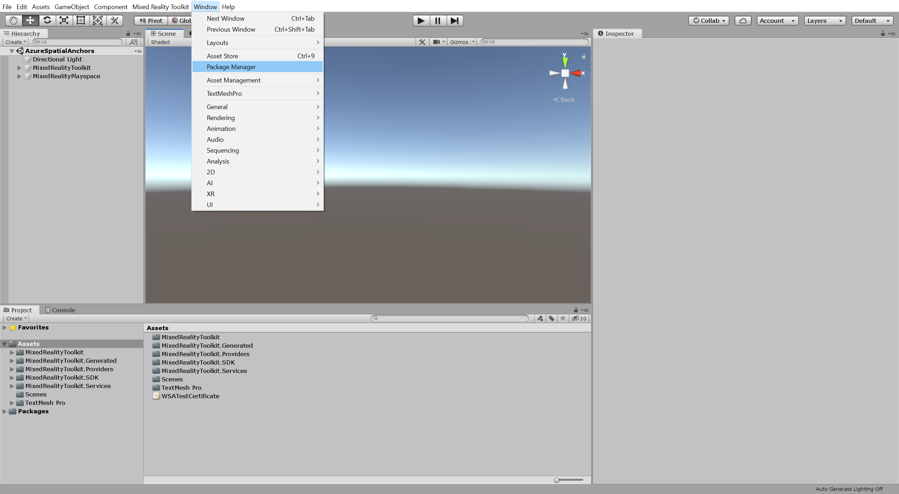

> [!NOTE]
> It might take a few seconds before the AR Foundation package appears in the list.

In the Package Manager window, select **AR Foundation** and install the package by clicking the **Install** button:

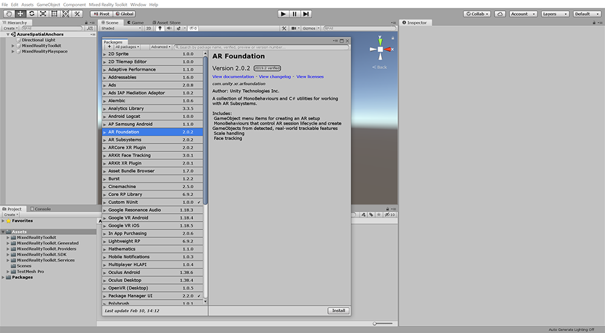

## Importing the tutorial assets

Download and **import** the following Unity custom packages **in the order they are listed**:

* [AzureSpatialAnchors.unitypackage](https://github.com/Azure/azure-spatial-anchors-samples/releases/download/v2.1.1/AzureSpatialAnchors.unitypackage) (version 2.1.1)
* [MRTK.HoloLens2.Unity.Tutorials.Assets.GettingStarted.2.3.0.3.unitypackage](https://github.com/microsoft/MixedRealityLearning/releases/download/getting-started-v2.3.0.3/MRTK.HoloLens2.Unity.Tutorials.Assets.GettingStarted.2.3.0.3.unitypackage)
* [MRTK.HoloLens2.Unity.Tutorials.Assets.AzureSpatialAnchors.2.3.0.1.unitypackage](https://github.com/microsoft/MixedRealityLearning/releases/download/azure-spatial-anchors-v2.3.0.1/MRTK.HoloLens2.Unity.Tutorials.Assets.AzureSpatialAnchors.2.3.0.1.unitypackage)

> [!TIP]
> For a reminder on how to import a Unity custom package, you can refer to the [Import the Mixed Reality Toolkit](mrlearning-base-ch1.md#import-the-mixed-reality-toolkit) instructions.

After you have imported the tutorial assets your Project window should look similar to this:

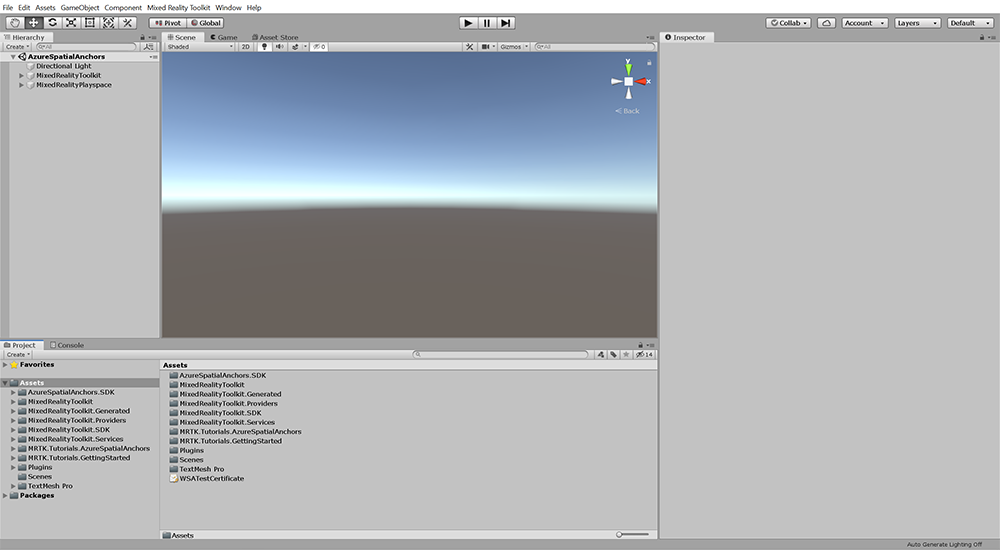

## Creating and preparing the scene
<!-- TODO: Consider renaming to 'Preparing the scene' -->

In this section, you will prepare the scene by adding some of the tutorial prefabs.

In the Project window, navigate to **Assets** > **MRTK.Tutorials.AzureSpatialAnchors** > **Prefabs** folder. While holding down the CTRL button, click on **ButtonParent**, **DebugWindow**, **Instructions**, and **ParentAnchor** to select the four prefabs:

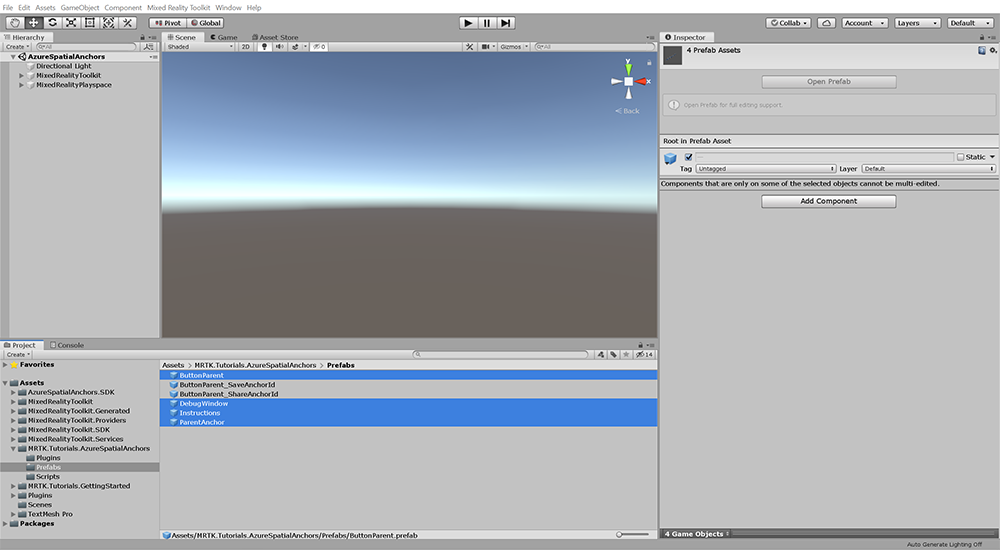

With the four prefabs still selected, drag them into the Hierarchy window to add them to the scene:

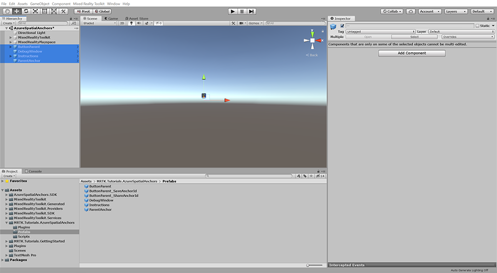

To focus in on the objects in the scene, you can double-click on the ParentAnchor object, and then zoom slightly out again:

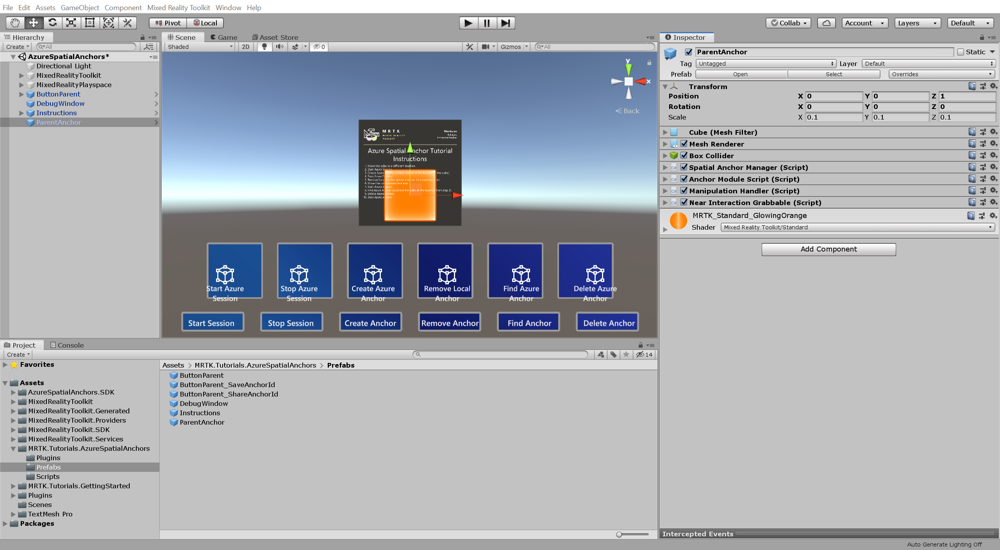

> [!TIP]
> If you find the large icons in your scene, for example, the large framed 'T' icons distracting, you can hide these by <a href="https://docs.unity3d.com/2019.1/Documentation/Manual/GizmosMenu.html" target="_blank">toggling the Gizmos</a> to the off position.

## Configuring the buttons to operate the scene

In this section, you will add scripts into the scene to create a series of button events that demonstrate the fundamentals of how both local anchors and Azure Spatial Anchors behave in an application.

### 1. Configure the Pressable Button Holo Lens 2 (Script) component

In the Hierarchy window, expand the **ButtonParent** object and select the first child object named **StartAzureSession**:

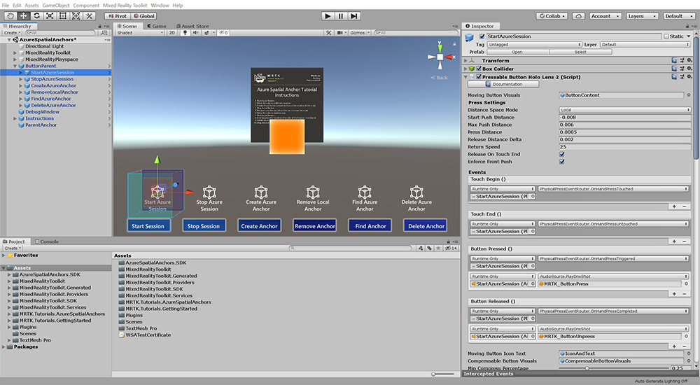

In the Inspector window, locate the **Pressable Button Holo Lens 2 (Script)** component and add a new event listener to the **Button Pressed ()** event by clicking the **+** icon:

With the StartAzureSession object still selected in the Hierarchy window, click-and-drag the **ParentAnchor** object from the Hierarchy window into the empty **None (Object)** field of the event listener you just added to make the ParentAnchor object listen for button pressed events from this button:

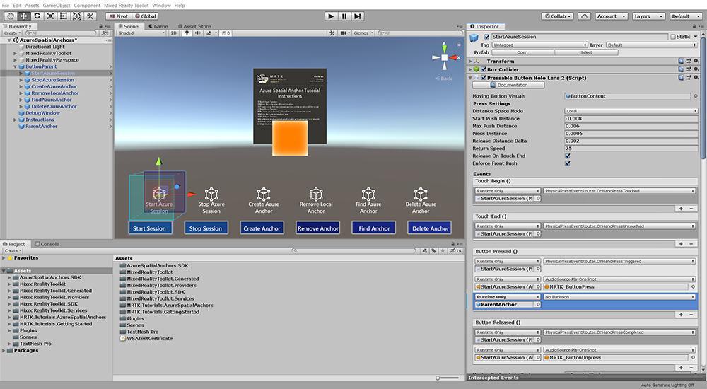

Click the **No Function** dropdown of the same event listener, then select **AnchorModuleScript** > **StartAzureSession ()** to set the StartAzureSession () function as the action that is triggered when the button pressed events is fired from this button:

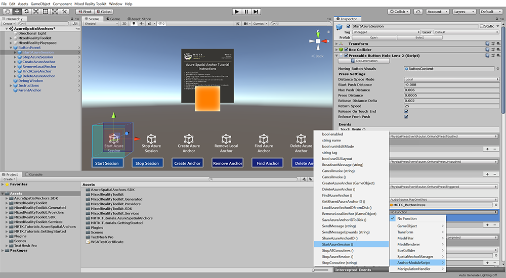

### 2. Configure the Interactable (Script) component

With the StartAzureSession object still selected in the Hierarchy window, in the Inspector window, locate the **Interactable (Script)** component and repeat the same process as in step 1 above for the **OnClick ()** event:

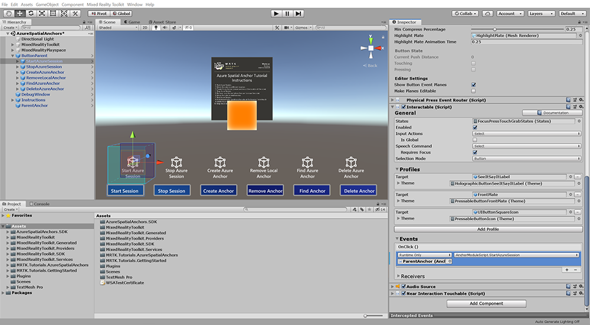

### 3. Configure the remaining buttons

For each of the remaining buttons, complete the process outlined in step 1 and 2 above to assign functions to both the **Button Pressed ()** and **OnClick ()** events:

* For the **StopAzureSession** object, assign the AnchorModuleScript > **StopAzureSession ()** function.
* For the **CreateAzureAnchor** object, assign the AnchorModuleScript > **CreateAzureAnchor ()** function,
  * then drag the **ParentAnchor** again into the empty **None (Game Object)** field.
* For the **RemoveLocalAnchor** object, assign the AnchorModuleScript > **RemoveLocalAnchor ()** function,
  * then drag the **ParentAnchor** again into the empty **None (Game Object)** field.
* For the **FindAzureAnchor** object, assign the AnchorModuleScript > **FindAzureAnchor ()** function.
* For the **DeleteAzureAnchor** object, assign the AnchorModuleScript > **DeleteAzureAnchor ()** function.

### 4. Connect the scene to the Azure resource

In the Hierarchy window, select the **ParentAnchor** object and in the Inspector window, scroll down to the **Spatial Anchor Manager (Script)** component.

Then, in the **Credentials** section, paste your Spatial Anchors Account ID and Key, which you created as part of this tutorial's [Prerequisites](mrlearning-asa-ch1.md#prerequisites), into the corresponding **Spatial Anchors Account Id** and **Spatial Anchors Account Key** fields:

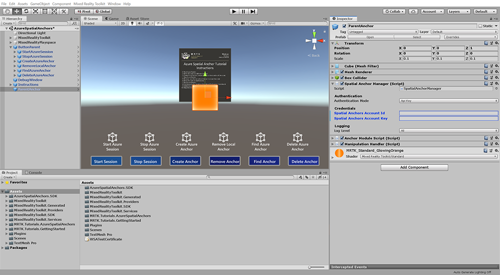

## Trying the basic behaviors of Azure Spatial Anchors

Now that your scene is configured to demonstrate the basics of Azure Spatial Anchors, it is time to deploy the app so you can experience Azure Spatial Anchors firsthand.

### 1. Add additional required capabilities

In the Unity menu, select **Edit** > **Project Settings...** to open the Player Settings window:

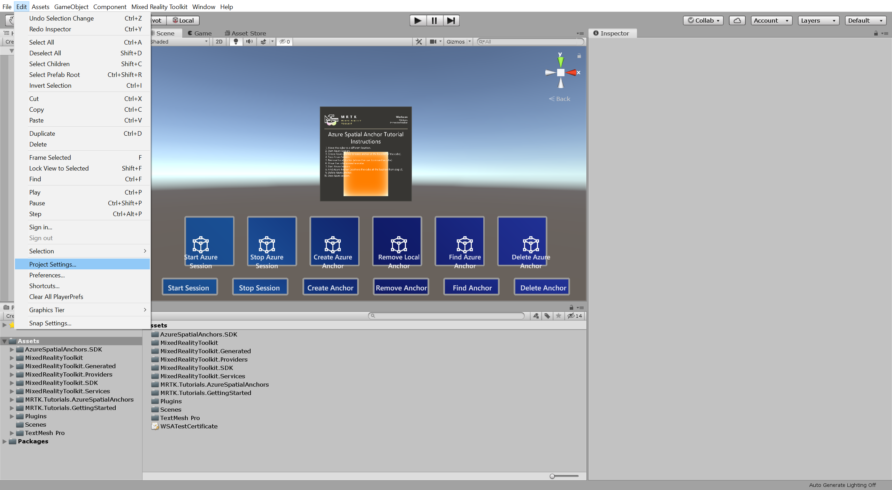

In the Player Settings window, select **Player** and then **Publishing Settings**:

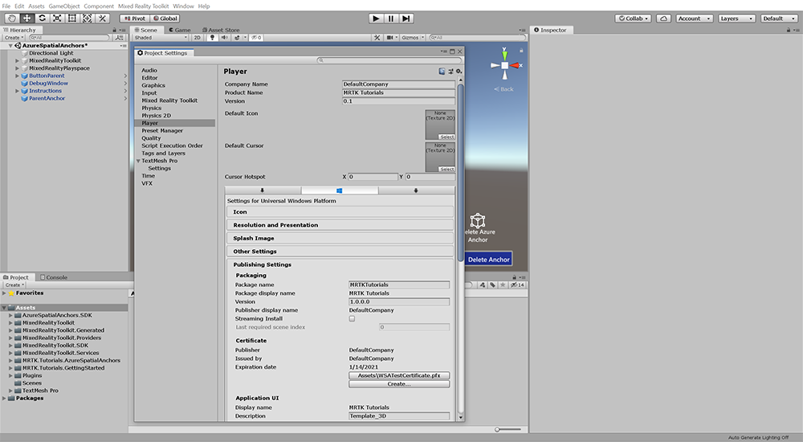

In the  **Publishing Settings**, scroll down to the **Capabilities** section and double-check that the **InternetClient**, **Microphone**, and **SpatialPerception** capabilities, which you enabled when you created the project at the beginning of the tutorial, are enabled. Then, enable the **InternetClientServer**, **PrivateNetworkClientServer**, **RemovableStorage**, and **Webcam** capabilities:

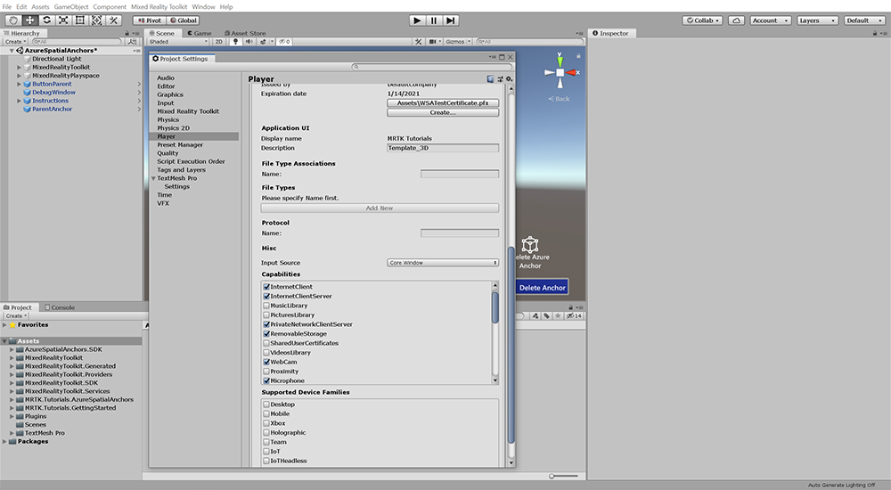

### 2. Deploy the app to your HoloLens 2

Azure Spatial Anchors can not run in Unity, so to test the Azure Spatial Anchors functionality, you need to deploy the project to your device.

> [!TIP]
> For a reminder on how to build and deploy your Unity project to HoloLens 2, you can refer to the [Build your application to your device](mrlearning-base-ch1.md#build-your-application-to-your-device) instructions.

### 3. Run the app on your HoloLens 2 and follow the in-app instructions

> [!CAUTION]
> Azure Spatial Anchors uses the internet to save and load the anchor data so make sure your device is connected to the internet.

When the application is running on your device, follow the on-screen instructions displayed on the Azure Spatial Anchor Tutorial Instructions panel:

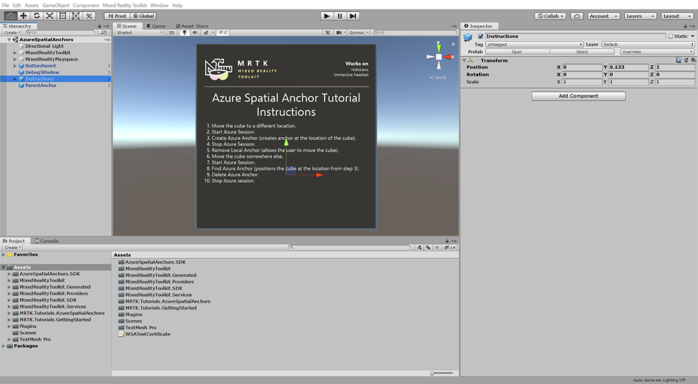

## Anchoring an experience

In the previous sections, you learned the fundamentals of Azure Spatial Anchors. We used a cube to represent and visualize the parent game object with the attached anchor. In this section, you will learn how to anchor an entire experience by placing it as a child of the ParentAnchor object.

### 1. Add the Rocket Launcher experience

In the Project window, navigate to the **Assets** > **MRTK.Tutorials.GettingStarted** > **Prefabs** > **RocketLauncher** folder and select the **RocketLauncher_Complete** prefab:

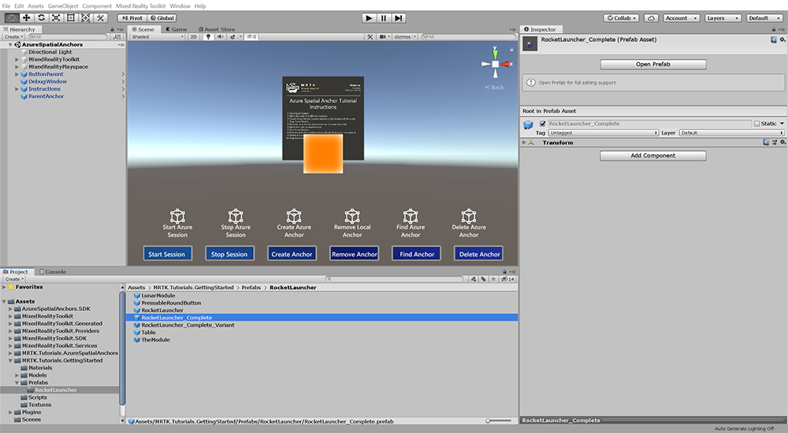

With the RocketLauncher_Complete prefab still selected, drag it on top of the **ParentAnchor** object in the Hierarchy window to make it a child of the ParentAnchor object:

### 2. Reposition the Rocket Launcher experience

Position, rotate, and scale the **RocketLauncher_Complete** object to a suitable scale and orientation, while also ensuring the **ParentAnchor** object is still exposed, for example:

* Transform **Position** X = 0, Y = 0, Z = 3.75
* Transform **Rotation** X = 0, Y = 90, Z = 0
* Transform **Scale** X = 10, Y = 10, Z = 10

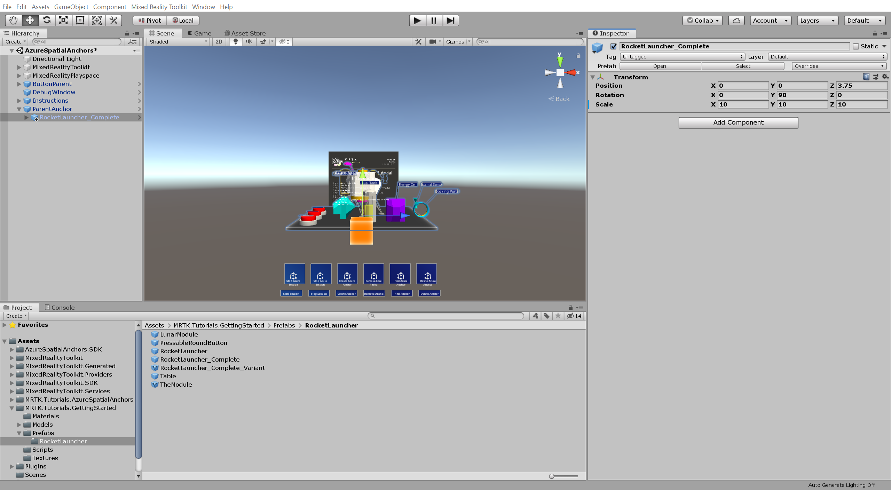

In the application, users may now reposition the entire Rocket Launcher experience by moving the cube.

> [!TIP]
> There are a variety of user experience flows for repositioning experiences including the use of a repositioning object (such as the cube used in this tutorial), the use of a button to toggle a bounding box that surrounds the experience, the use of position and rotation gizmos, and more.

## Congratulations

In this tutorial, you learned the fundamentals of Azure Spatial Anchors. The tutorial provided you with several buttons that let you explore the various steps required to start and stop an Azure Spatial Anchors session and create, upload and download Azure Spatial Anchors on a single device.

In the next lesson, you will learn how to save Azure anchor IDs to your HoloLens 2 for retrieval, even after the application is restarted, and how to transfer anchor IDs between multiple devices to achieve spatial alignment.

[Next Lesson: 2. Saving, retrieving and sharing Azure Spatial Anchors](mrlearning-asa-ch2.md)
