# MR Learning Base Module - Project Initialization and First Application

In this first lesson, you will learn some of the capabilities the Mixed Reality Toolkit has to offer, start your first application for the HoloLens 2, and deploy it to the device.

## Objectives

* Optimize Unity for HoloLens development.
* Import assets and setup the scene.
* Visualization of the spatial mesh, hand meshes, and the framerate counter.

## Instructions

### Create new Unity project

1. Start Unity.
2. Select **New**.

3. Enter a project name (e.g. "MixedRealityBase").

4. Enter a location to save your project.
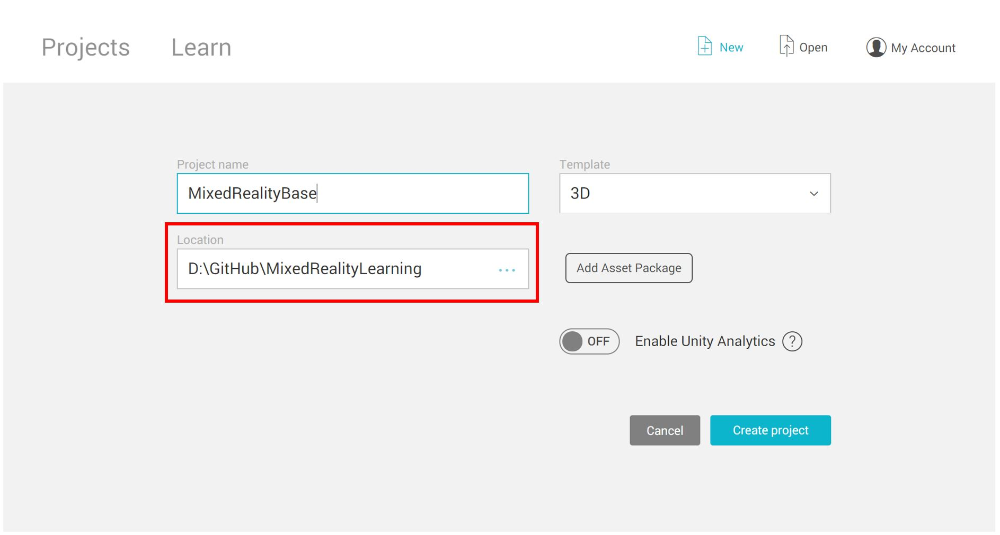
5. Make sure the project is set to **3D**.
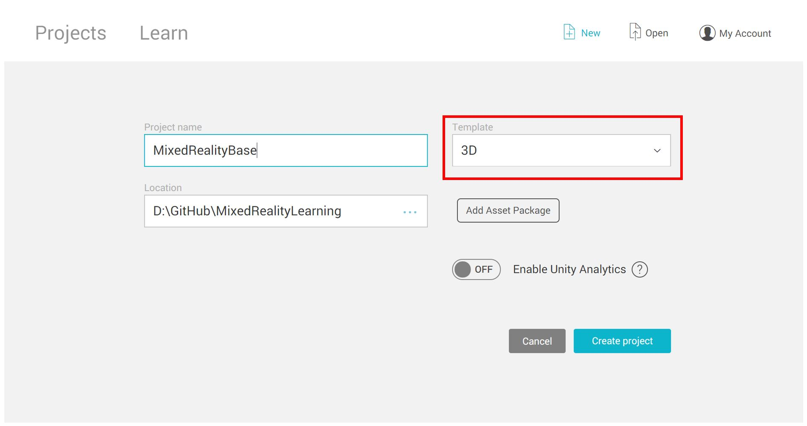
6. Click **Create Project**.
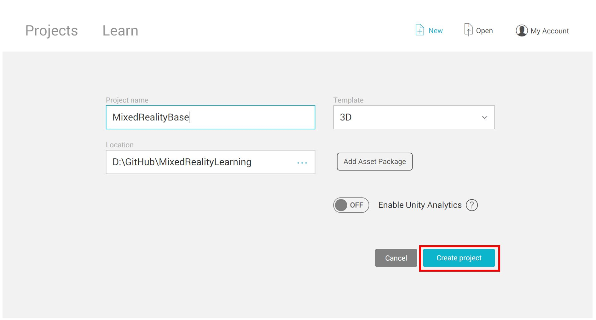

### Configure the Unity project for Windows Mixed Reality

1. Open the build settings window by going to File>Build Settings.
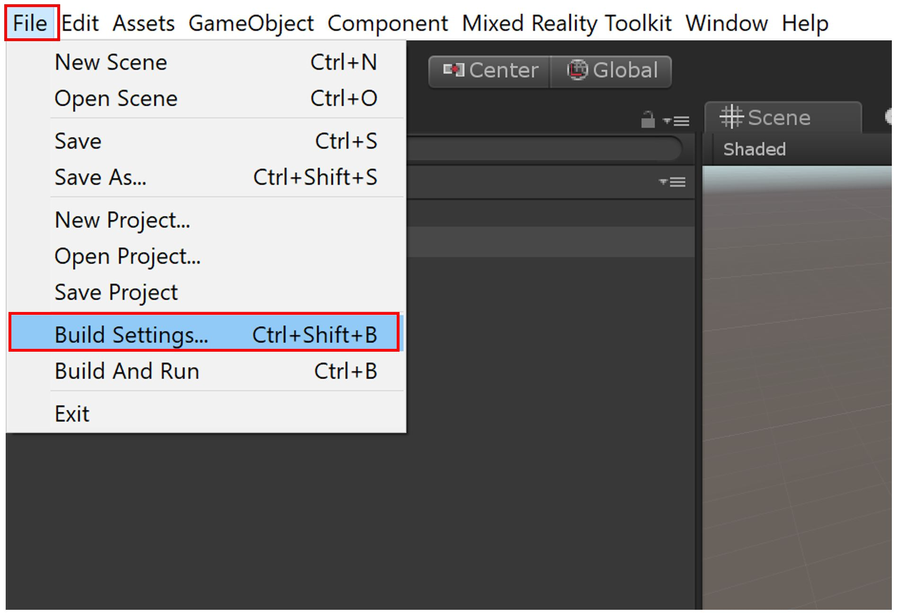
2. Switch to “Universal Windows Platform” by selecting “Universal Windows Platform” and then click the “Switch Platform” button to switch platforms. Apps running on HoloLens 2 are required to be Universal Windows Platform (UWP).

3. Enable virtual reality by clicking on Player Settings in the Build Window, and then in the inspector panel enable the “Virtual Reality Supported” checkbox under XR Settings, as shown in the image below. Please note that you may need to drag the "Build Settings" window out of the way in order to see the inspector panel. The "Virtual Reality Supported" checkbox also applies to Mixed Reality / AR headsets because it refers to the enabling of stereoscopic vision (rendering different images for each eye.)
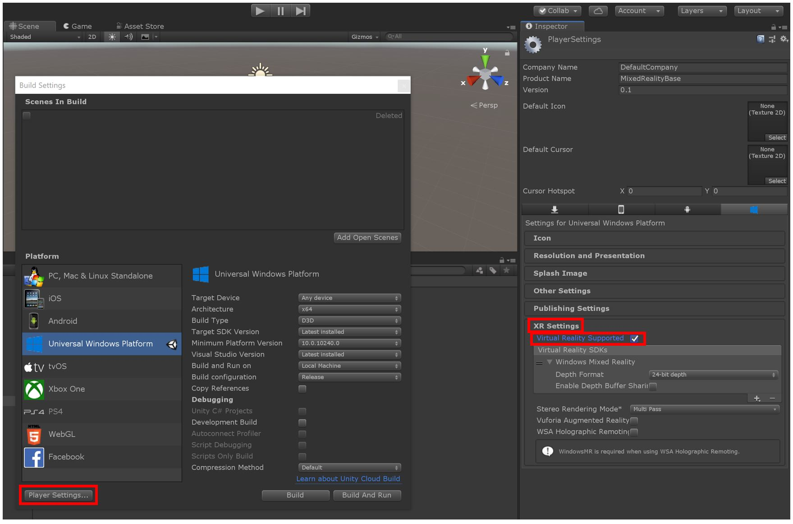
4. In the same inspector panel, check that the “Spatial Perception” checkbox in the capabilities section is enabled, under Publishing Settings. Spatial Perception will allow us to visualize the spatial mapping mesh on a mixed reality device such as the HoloLens 2. Publishing settings are found in the Inspector panel, above "XR Settings" and under "Other Settings."

> NOTE: While not used in this section, some other common capabilities you may want to enable include Microphone (for voice commands) and InternetClient (for connecting to services requiring a network connection)

### Import the Mixed Reality Toolkit

1. Download the [Mixed Reality Toolkit](https://github.com/Microsoft/MixedRealityToolkit-Unity/releases/download/v2.0.0-RC1/Microsoft.MixedReality.Toolkit.Unity.Foundation-v2.0.0-RC1.unitypackage) unity package and save it to a folder on your PC.

2. Import the Mixed Reality Toolkit package by clicking on Assets>Import>Custom Package. Find the Mixed Reality Toolkit package downloaded in Step 1 and open it to begin the importing process. Please allow a few minutes for the importing process.
    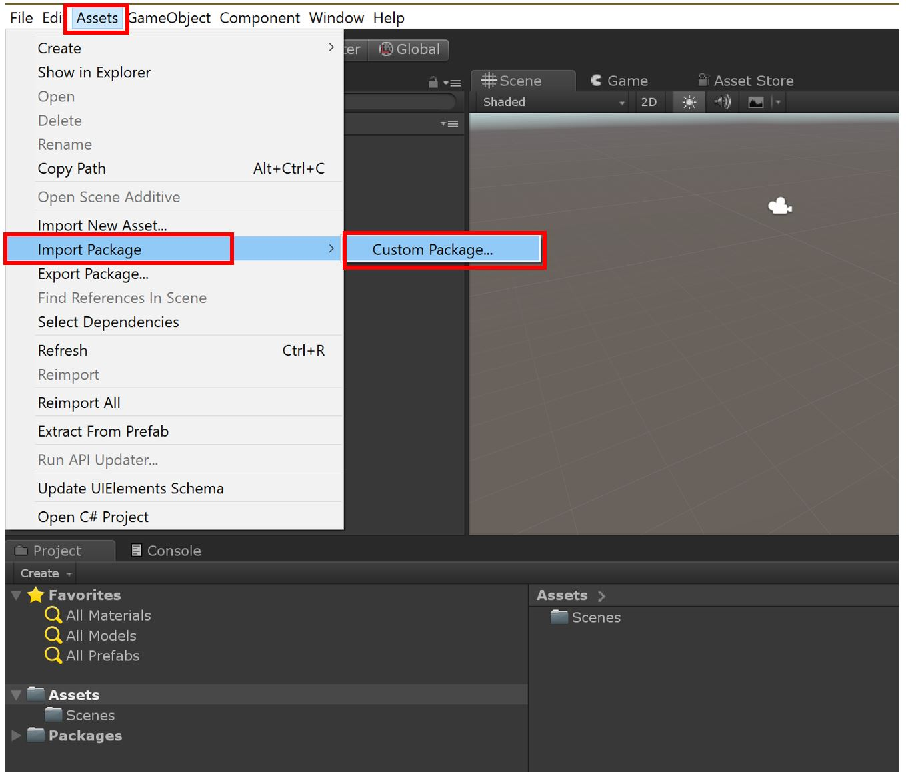
    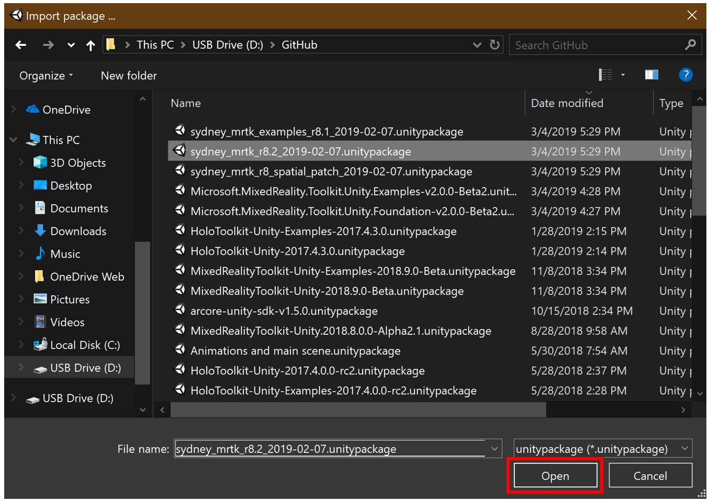

3. In the next pop-up window, click “Import” to begin importing the Mixed Reality Toolkit. Ensure all items are checked, as shown in the image. If you see a pop-up dialog box asking to apply Mixed Reality Toolkit default settings, click "Apply."
    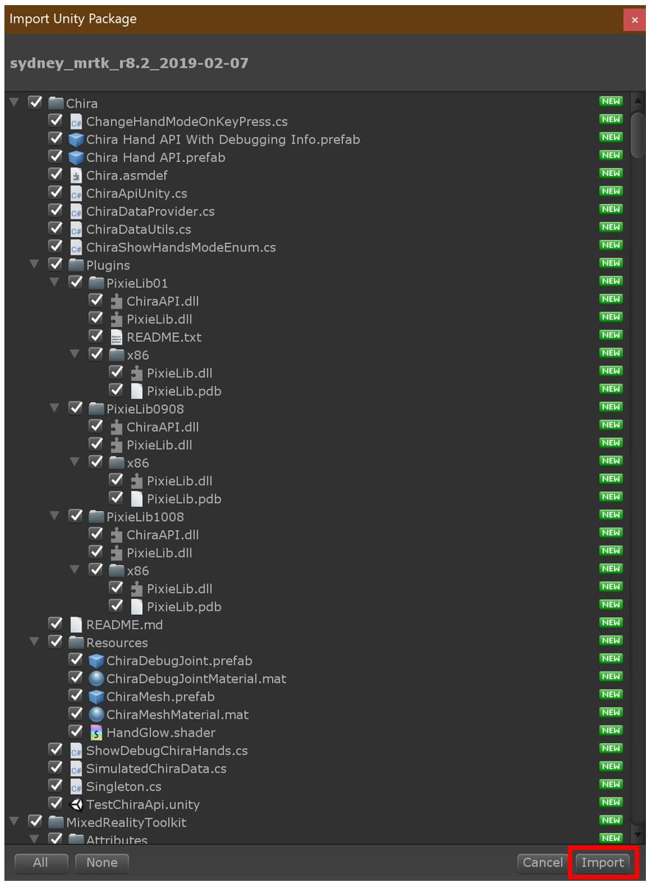
    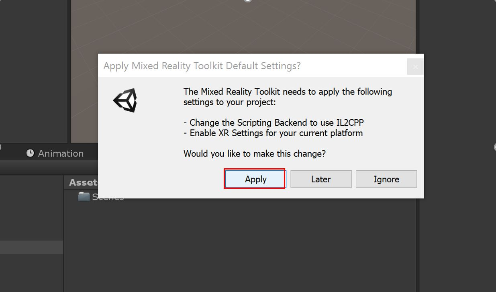

### Configure the Mixed Reality Toolkit

1. Configure the Mixed Toolkit by selecting from the menu bar Mixed Reality Toolkit > Configure. If you don't see this menu item after importing the mixed reality toolkit, please restart Unity.
  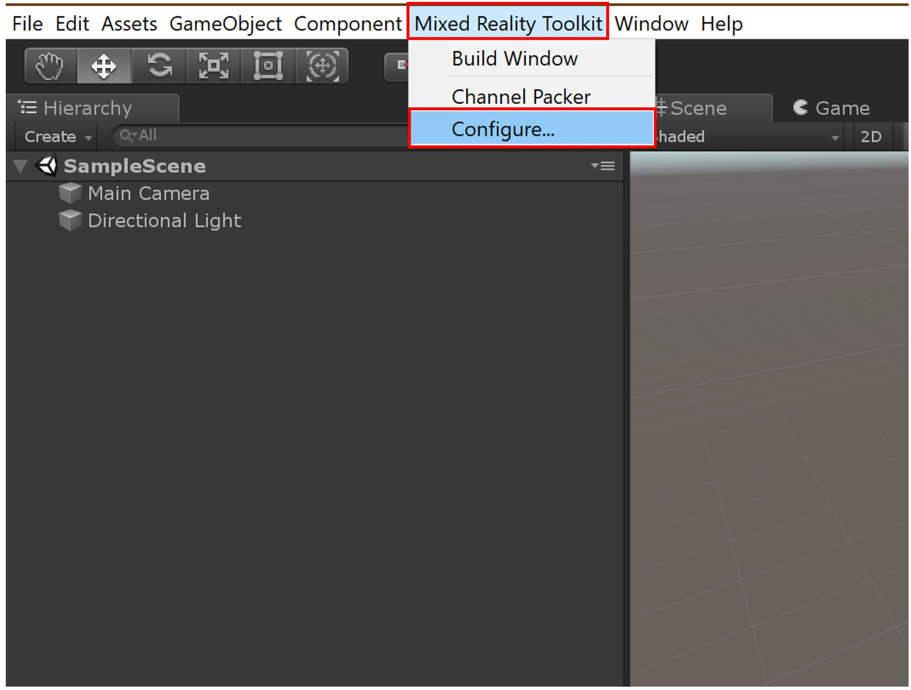

  > Note: You may see a pop-up dialog box asking to select a profile for the Mixed Reality Toolkit. If so, select "ok" and choose the profile named "DefaultMixedRealityToolkitConfigurationProfile."

2. Your scene will now have several new items and modifications in it from the Mixed Reality Toolkit. Save your scene under a different name by clicking on File>Save As and give your scene a name, e.g., BaseScene. Keep your scene organized by saving it to the “Scenes” folder in your project’s Assets folder.
  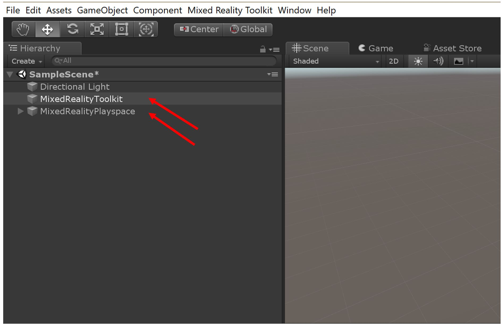
  

### Build your application to your device

1. If you closed the Build Settings window from the previous sections, open the build settings window again by going to File>Build Settings.
    

2. Ensure the scene you want to try is in the “Scenes in Build” list by clicking on the “Add Open Scenes” button.

3. Press the Build button to begin the build process.
    

4. Create and name a new folder for your application. In the image below, a folder with the name “App” was created to contain the application. Click “Select Folder” to begin building to the newly created folder. After the build has completed, you may close the "Build Settings" window in Unity. 
    

  > NOTE: If the build fails, try building again or restarting Unity and building again. If you see an error such as "Error: CS0246 = The type or namespace name “XX” could not be found (are you missing a using directive or an assembly reference?)", then you may need to install [Windows 10 SDK (10.0.18362.0)](<https://developer.microsoft.com/en-us/windows/downloads/windows-10-sdk>)
  >

5. After the build is completed, open the newly created folder containing your newly built application files. Double click on the “MixedRealityBase.sln” solution (or the corresponding name, if you used an alternative name for your project) to open the solution file in Visual Studio.

  > Note: Be sure to open the newly created folder (i.e., the "App" folder, if following the naming conventions from the previous steps), as there will be a similarly named .sln file outside of that folder that is not to be confused with the .sln file inside the build folder. 

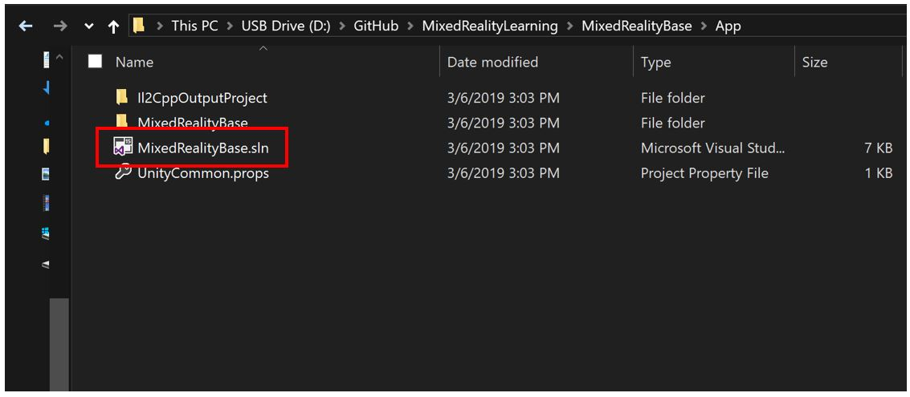

  > Note: If Visual Studio asks you to install new components, please take a moment to ensure that all prerequisite components are installed as specified in [the "Install the Tools" page](install-the-tools.md)

6. Plug your HoloLens 2 into your PC with the USB cable. While these lesson instructions assume you will be deploying a testing with a HoloLens 2 device, you may also choose to deploy to the [HoloLens 2 emulator](using-the-hololens-emulator.md) or choose to create an [app package for sideloading](<https://docs.microsoft.com/en-us/windows/uwp/packaging/packaging-uwp-apps>)

7. Before building to your device, ensure that the device is in Developer Mode. If this is your first time deploying to the HoloLens 2, Visual Studio may ask you to pair your HoloLens 2 with a pin. Please follow [these instructions](https://docs.microsoft.com/en-us/windows/mixed-reality/using-visual-studio) if you need to enable developer mode or pair with Visual Studio.

8. Configure Visual Studio for building to your HoloLens 2 by selecting the “Release” configuration and the “ARM” architecture.
    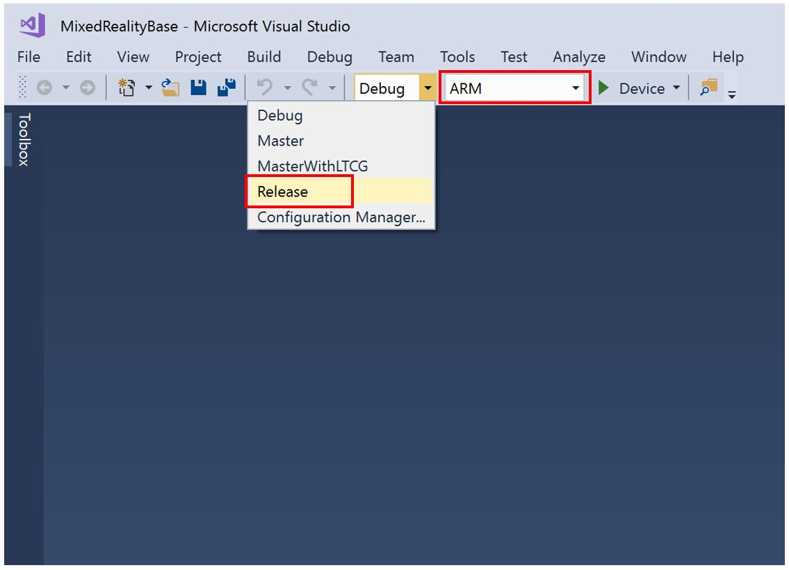

9. The final step is to build to your device by selecting Debug>Start without Debugging. Selecting “Start without Debugging” will cause the application to immediately start on your device upon a successful build, but without Debugging information appearing in Visual Studio. This also means that you can disconnect your USB cable while your application is running on your HoloLens 2 without stopping the application. You may also select Build>Deploy Solution to deploy to your device without having the application automatically start.
    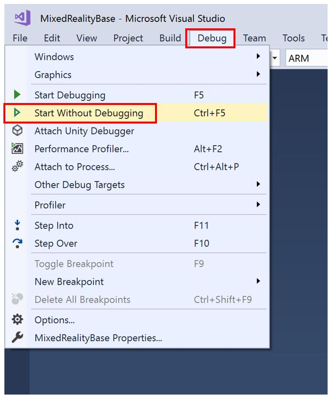

## Congratulations

You now have now deployed your first HoloLens 2 application. As you walk around, you should see a spatial mesh cover all the surfaces that have been perceived by the HoloLens 2. Additionally, you should see indicators on your hands and fingers for hand tracking and a frame rate counter for keeping an eye on app performance. These are just a few of the foundational pieces, included out of the box, with the Mixed Reality Toolkit. In the lessons to come, you will start adding more content and interactivity to your scene, so you can fully explore the capabilities of the HoloLens 2 and the Mixed Reality Toolkit.

>Note: You will cover how to toggle the frame rate counter using a voice command in [Lesson 5](mrlearning-base-ch5.md)

[Next Lesson: User Interface, Hand Tracking, and Mixed Reality Toolkit Configuration](mrlearning-base-ch2.md)
