# 2. Initializing your project and first application

## Overview

<!-- TODO: Consider expanding to include summary of each tutorial in this tutorial series -->
In this first tutorial, you will learn about some of the capabilities the <a href="https://github.com/microsoft/MixedRealityToolkit-Unity" target="_blank">Mixed Reality Toolkit (MRTK)</a> has to offer, start your first application for the HoloLens 2, and deploy it to the device.

## Objectives

* Configure Unity for HoloLens development
* Import assets and set up the scene
* Visualization of the spatial mapping mesh, hand meshes, and the framerate counter

## Prerequisites

* A Windows 10 PC configured with the correct [tools installed](install-the-tools.md)
* Windows 10 SDK 10.0.18362.0 or later
* Some basic C# programming ability
* A HoloLens 2 device [configured for development](using-visual-studio.md#enabling-developer-mode)
* <a href="https://docs.unity3d.com/Manual/GettingStartedInstallingHub.html" target="_blank">Unity Hub</a> with Unity 2019.2.X installed and the Universal Windows Platform Build Support module added

> [!IMPORTANT]
> The recommended Unity version for this tutorial series is Unity 2019.2.X. This supersedes any Unity version requirements or recommendations stated in the prerequisites linked above.

## Create new Unity project

Launch **Unity Hub**, select the **Projects** tab, and click the **down arrow** next to the **New** button:

Select the Unity version specified in the [Prerequisites](#prerequisites) section above:

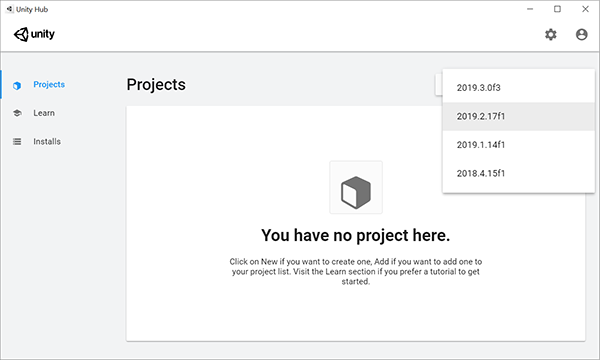

In the Create a new project window:

* Ensure **Templates** is set to **3D**
* Enter a suitable **Project Name**, for example, _MRTK Tutorials_
* Choose a suitable **Location** to store your project, for example, _D:\MixedRealityLearning_
* Click the **Create** button to create and launch your new Unity project

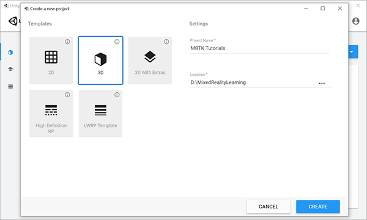

> [!CAUTION]
> When working on Windows, there is a MAX_PATH limit of 255 characters. Unity is affected by these limits and may fail to compile if any file path is longer than 255 characters. Consequently, it is strongly recommended to store your Unity project as close to the root of the drive as possible.

Wait for Unity to create the project:

## Configure the Unity project for Windows Mixed Reality

<!-- TODO: Consider adding info about configuring Unity for WMR vs MRTK, or removing WMR section -->

In this section, you will switch build platform, enable virtual reality, and enable spatial perception.

### 1. Switch build platform

In the Unity menu, select **File** > **Build Settings...** to open the Build Settings window:

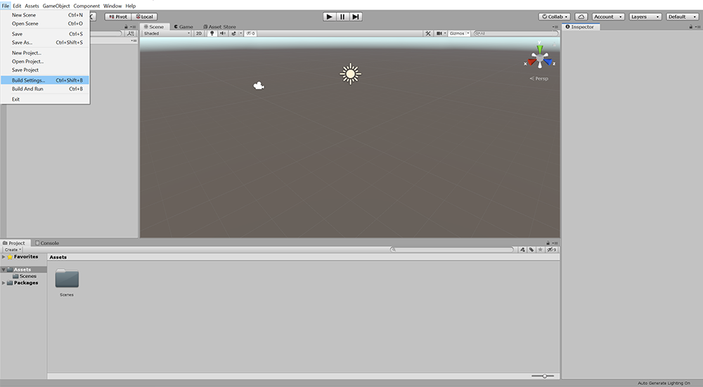

In the Build Settings window, select **Universal Windows Platform** and click the **Switch Platform** button:

Wait for Unity to finish switching the platform:

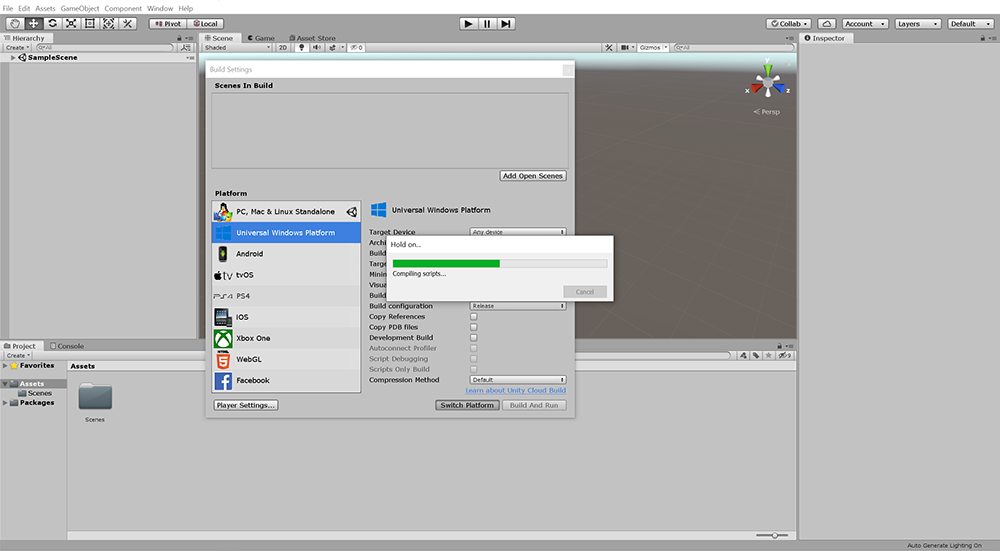

When Unity has finished switching the platform, click the red **x** icon to close the Build Settings window:

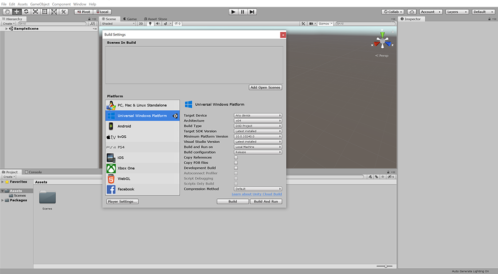

### 2. Enable virtual reality

> [!NOTE]
> Enabling virtual reality also applies to mixed reality and augmented reality headsets because it refers to enabling stereoscopic vision, i.e. rendering different images for each eye.

In the Unity menu, select **Edit** > **Project Settings...** to open the Project Settings window:

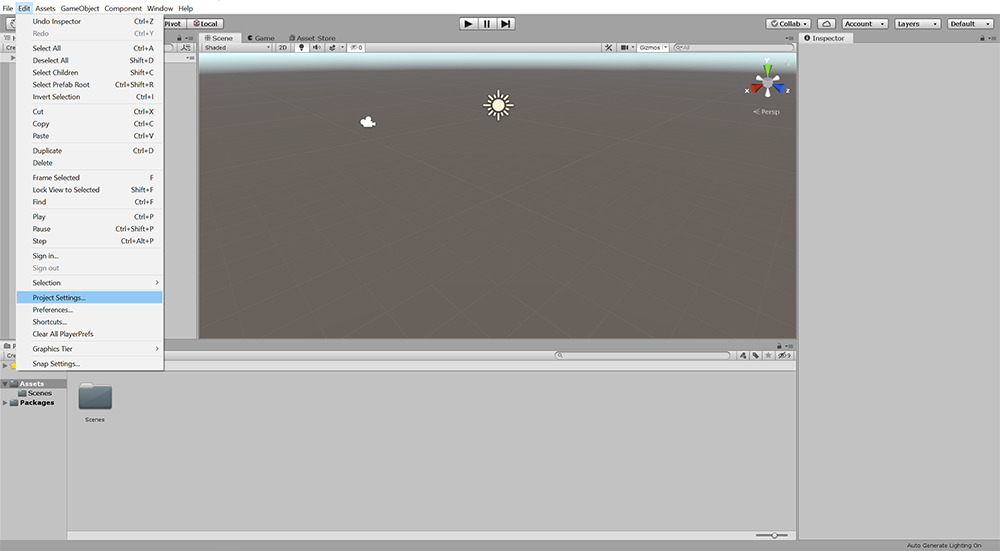

In the Project Settings window, select **Player** > **XR Settings** to expand the XR Settings:

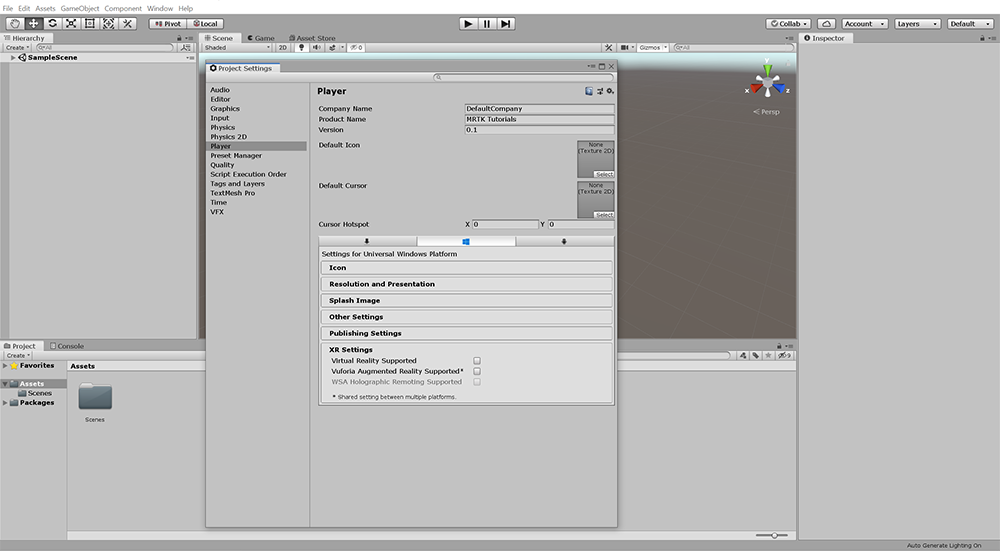

In the XR Settings, check the **Virtual Reality Supported** checkbox to enable virtual reality, then click the **+** icon and select **Windows Mixed Reality** to add the Windows Mixed Reality SDK:

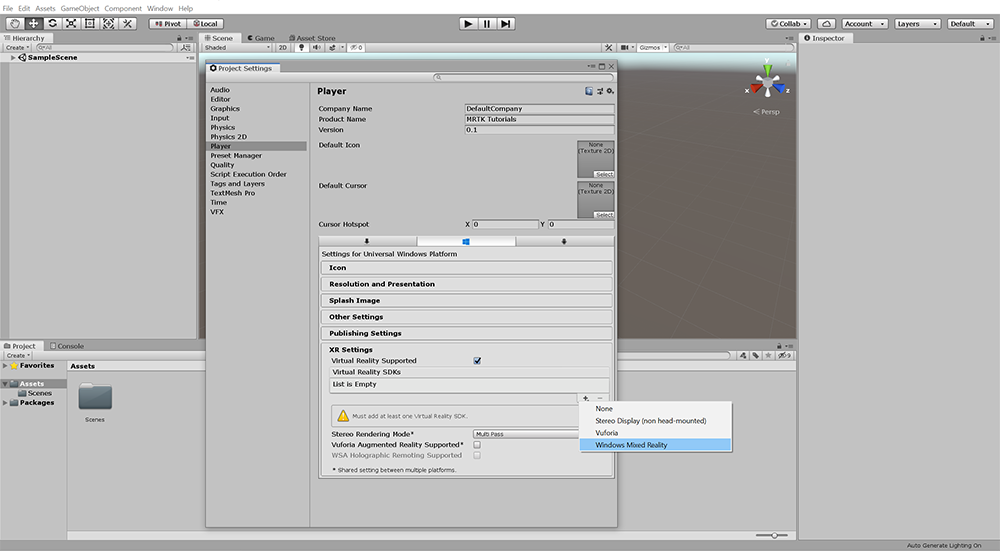

Wait for Unity to finish adding the SDK:

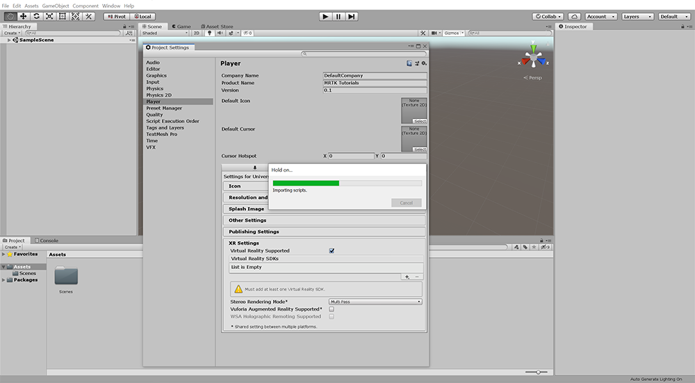

When Unity has finished adding the SDK, optimize the XR Settings as follows:

* Set Windows Mixed Reality **Depth Format** to **16-bit depth**
* Check the Windows Mixed Reality **Enable Depth Sharing** checkbox
* Set Stereo **Rendering Mode\*** to **Single Pass Instanced**

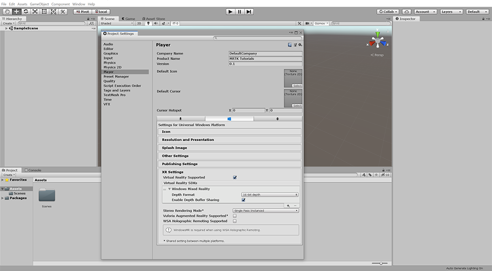

> [!TIP]
> To learn more about optimizing Unity for Windows Mixed Reality, you can refer to the [Recommended settings for Unity](recommended-settings-for-unity.md) documentation.

### 3. Enable spatial perception

> [!NOTE]
> Spatial perception allows visualization of the spatial mapping mesh on Windows Mixed Reality devices.

In the Project Settings window, select **Player** > **Publishing Settings** to expand the Publishing Settings:

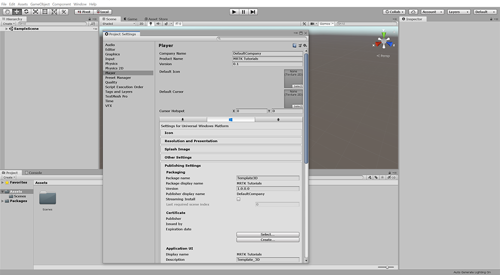

In the Publishing Settings, scroll down to the **Capabilities** section and check the **SpatialPerception** checkbox:

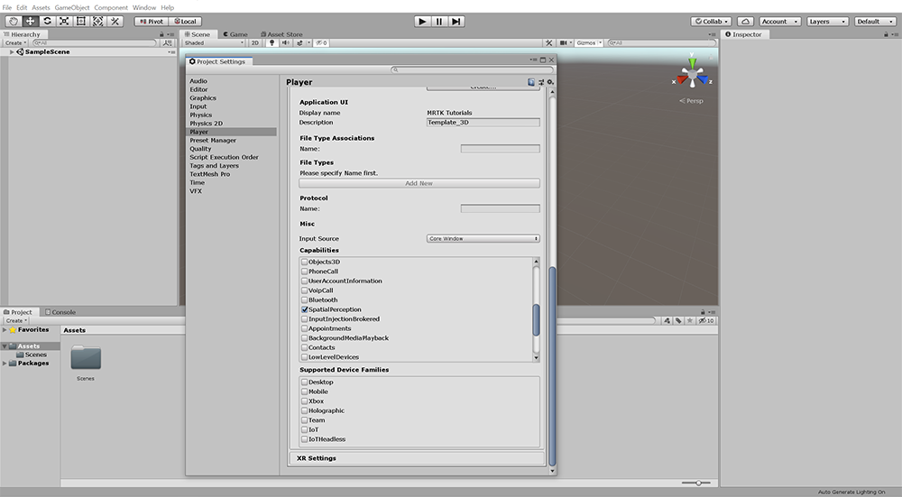

<!-- TODO: Consider adding info about audio spatializer plugin setting -->

Close the Project Settings window.

## Import TextMesh Pro Essential Resources

> [!NOTE]
> We are importing this package because it is required by Mixed Reality Toolkit's UI elements.

In the Unity menu, select **Window** > **TextMeshPro** > **Import TMP Essential Resources**:

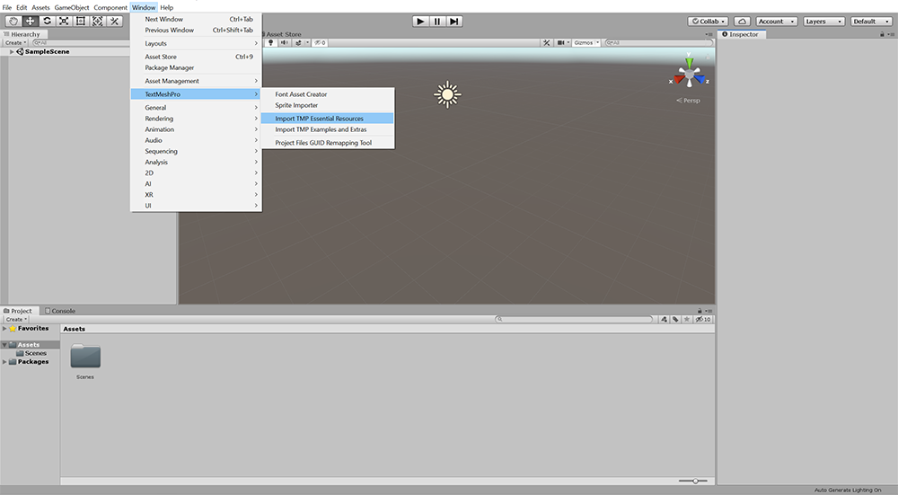

In the Import Unity Package window, click the **All** button to ensure all the assets are selected, then click the **Import** button to import the assets:

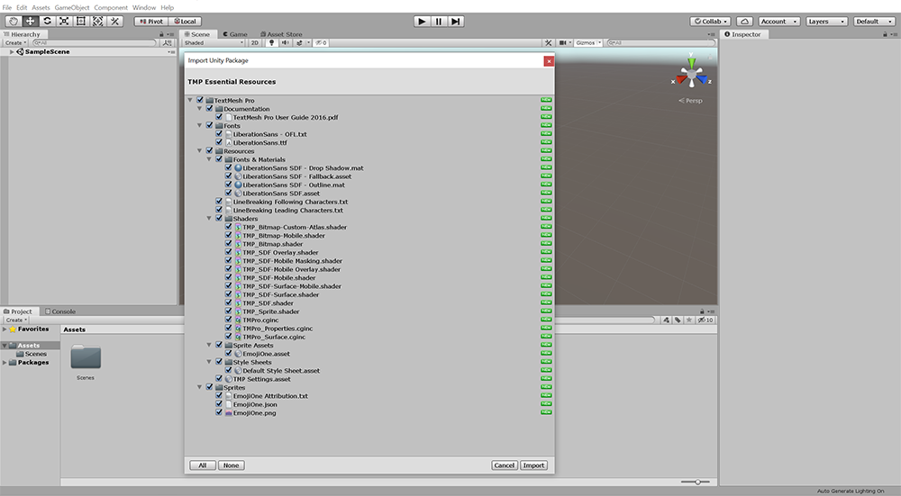

## Import the Mixed Reality Toolkit

Download the Unity custom package:

* [Microsoft.MixedReality.Toolkit.Unity.Foundation.2.2.0.unitypackage](https://github.com/microsoft/MixedRealityToolkit-Unity/releases/download/v2.2.0/Microsoft.MixedReality.Toolkit.Unity.Foundation.2.2.0.unitypackage)

In the Unity menu, select **Assets** > **Import Package** > **Custom Package...** to open the Import package... window:

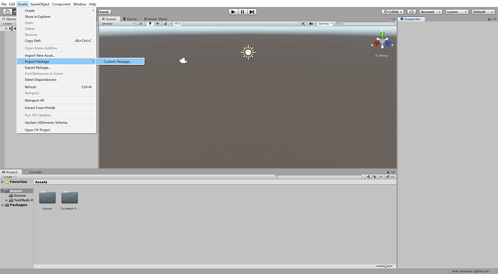

In the Import package... window, select the **Microsoft.MixedReality.Toolkit.Unity.Foundation.2.2.0.unitypackage** you downloaded and click the **Open** button:

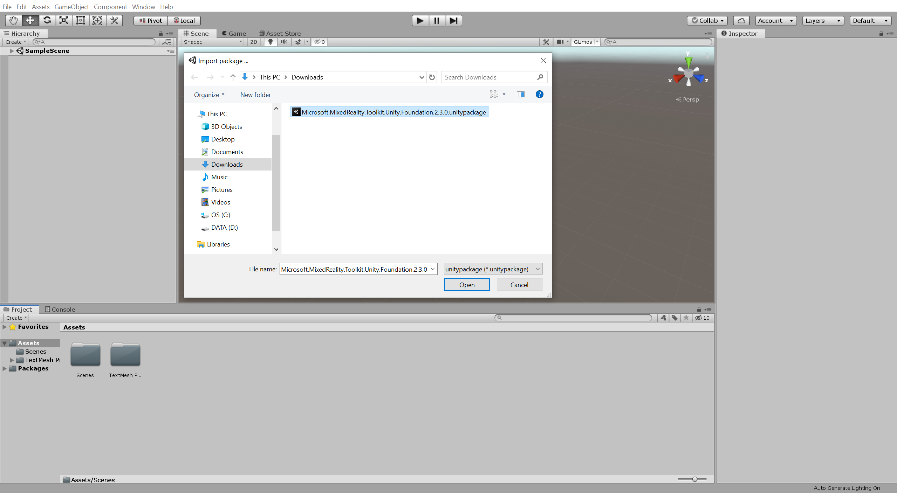

In the Import Unity Package window, click the **All** button to ensure all the assets are selected, then click the **Import** button to import the assets:

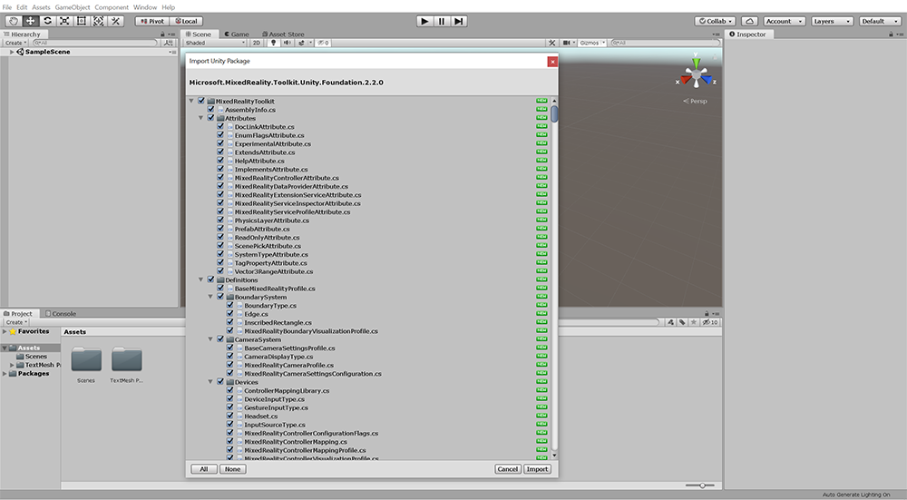

## Configure the Unity project for the Mixed Reality Toolkit

<!-- TODO: Consider adding info about configuring Unity for WMR vs MRTK, or removing WMR section -->

After the package has been imported, the MRTK Project Configurator window should appear. If it does not, open it by 
selecting **Mixed Reality Toolkit** > **Utilities** > **Configure Unity Project** in the Unity menu.

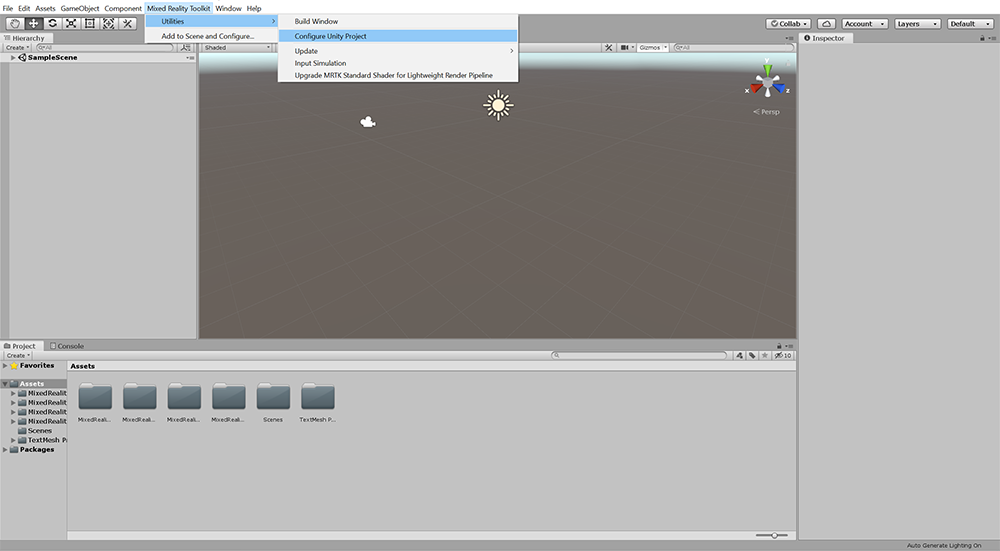

In the MRTK Project Configurator window, expand the **Modify Configurations** section, <u>uncheck</u> the **Enable MSBuild for Unity** checkbox, ensure all other options are checked, and click the **Apply** button to apply the settings:

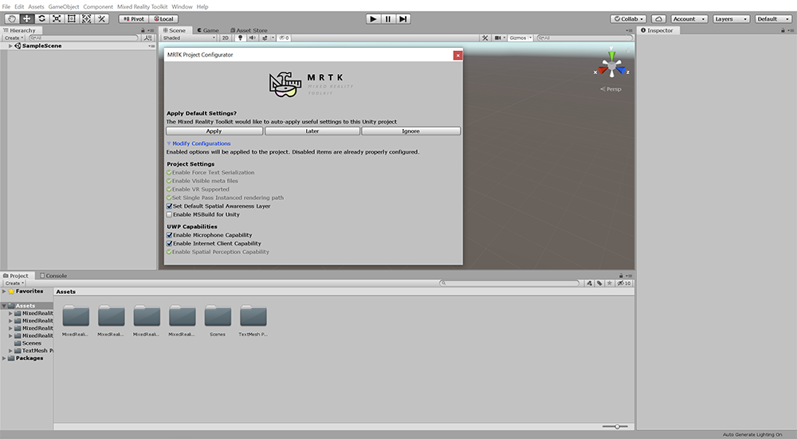

> [!CAUTION]
> MSBuild for Unity may not support all SDKs you will be using and can be challenging to disable after it has been enabled. Consequently, it is strongly recommended to not enable MSBuild for Unity.

## Configure the Mixed Reality Toolkit
<!-- TODO: Consider renaming to 'Add the Mixed Reality Toolkit to the Unity scene' -->

In the Unity menu, select **Mixed Reality Toolkit** > **Add to Scene and Configure...** to add the Mixed Reality Toolkit to your current scene:

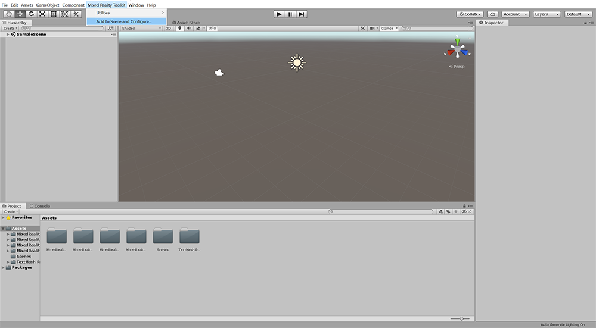

With the MixedRealityToolkit object selected in the Hierarchy window, in the Inspector window, change the Mixed Reality Toolkit configuration profile to **DefaultHoloLens2ConfigurationProfile**:

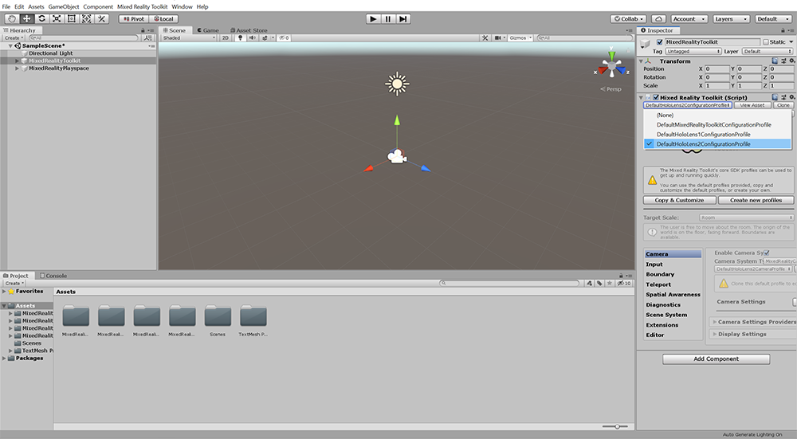

In the Unity menu, select **File** > **Save As...** to open the Save Scene window:

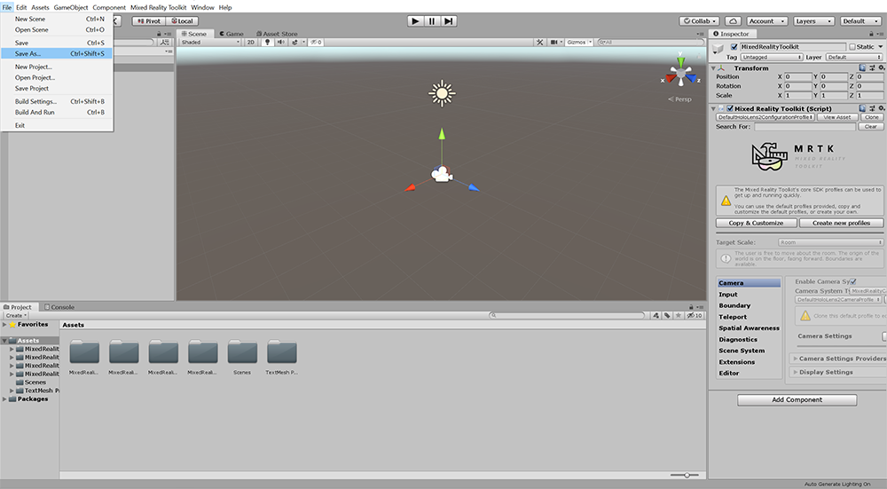

In the Save Scene window, navigate to your project's **Scenes** folder, give your scene a suitable name, for example, _Getting Started_, and click the **Save** button to save the scene:

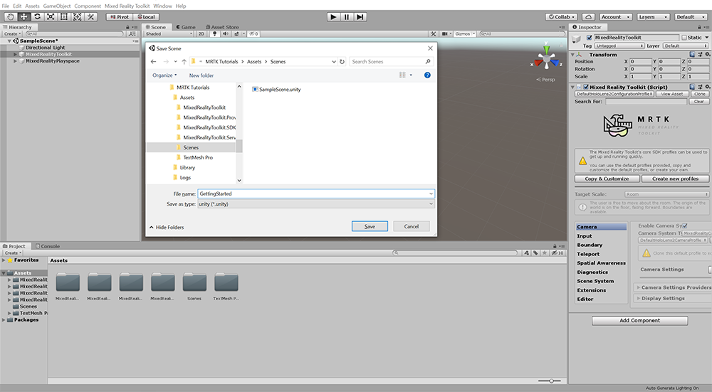

## Build your application to your device

### 1. Build the Unity project

In the Unity menu, select **File** > **Build Settings...** to open the Build Settings window.

In the Build Settings window, click the **Add Open Scenes** button to add your current scene to the **Scenes In Build** list, then click the **Build** button to open the Build Universal Windows Platform window:

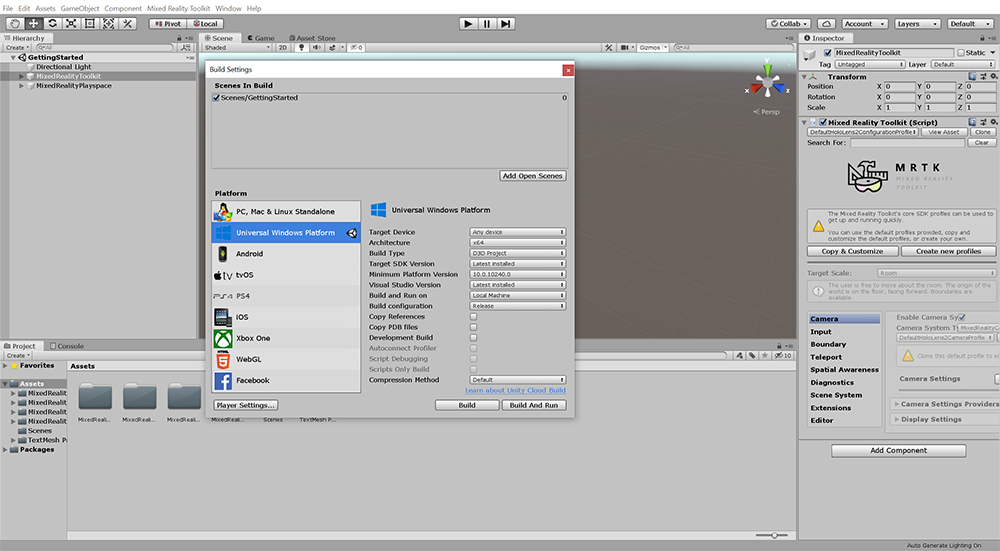

In the Build Universal Windows Platform window, choose a suitable location to store your build, for example, _D:\MixedRealityLearning\Builds_, create a new folder and give it a suitable name, for example, _GettingStarted_, and then click the **Select Folder** button to start the build process:

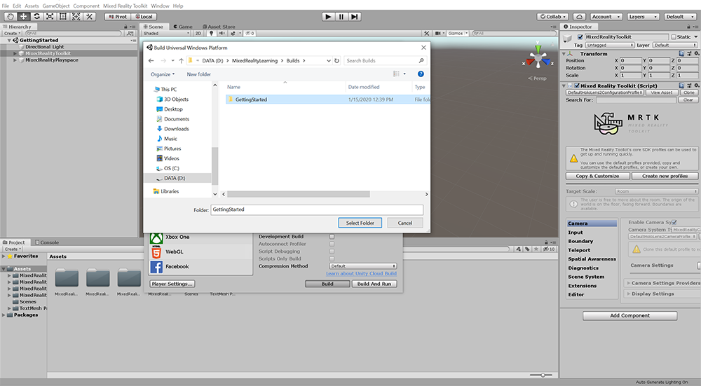

Wait for Unity to finish the build process:

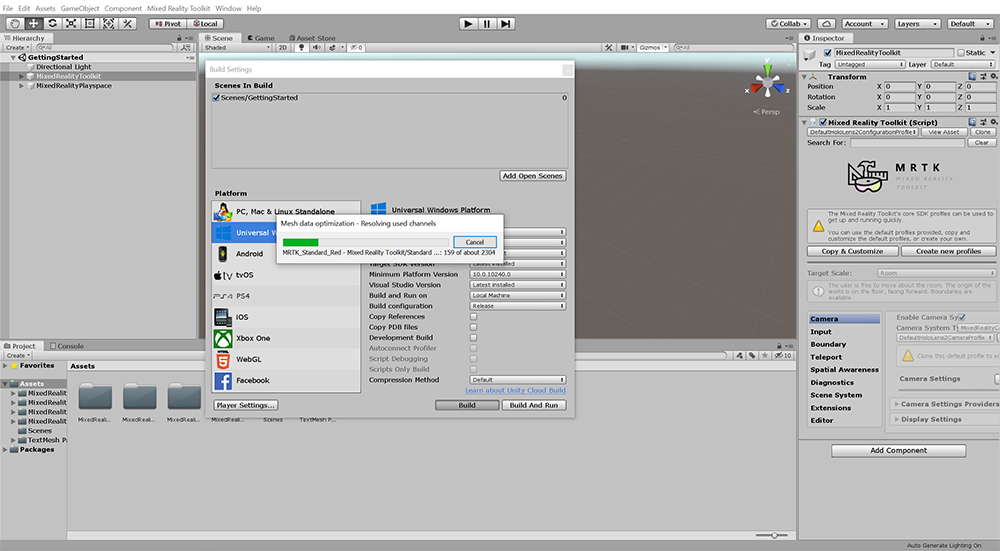

### 2. Build and deploy the application

When the build process is completed, Unity will prompt Windows File Explorer to open the location you stored the build. Navigate inside the folder, and double-click the solution file to open it in Visual Studio:

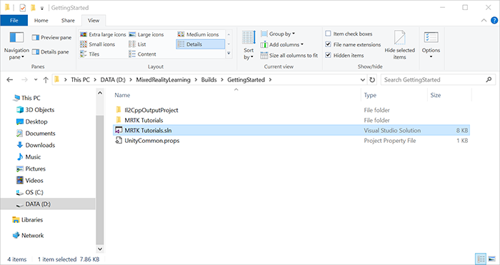

> [!NOTE]
> If Visual Studio asks you to install new components, take a moment to ensure that all prerequisite components are installed as specified in the [Install the Tools](install-the-tools.md) documentation.

Configure Visual Studio for HoloLens 2 by selecting the **Master** or **Release** configuration, the **ARM** architecture, and **Device** as target:

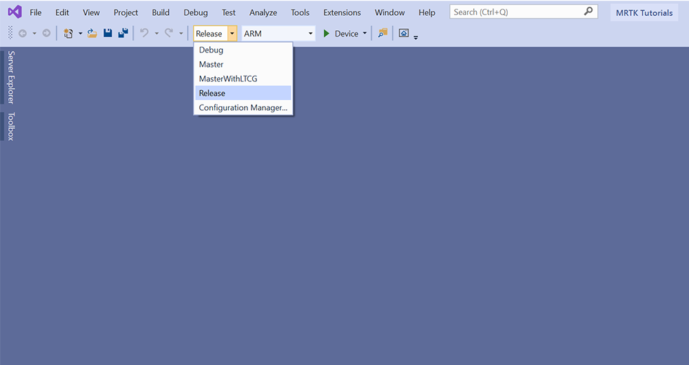

Connect your HoloLens 2 to your computer.

> [!IMPORTANT]
> Before building to your device, the device must be in Developer Mode and paired with your development computer. Both of these steps can be completed by following [these instructions](using-visual-studio.md).

The final step is to build and deploy to your device by selecting **Debug** > **Start Without Debugging**:

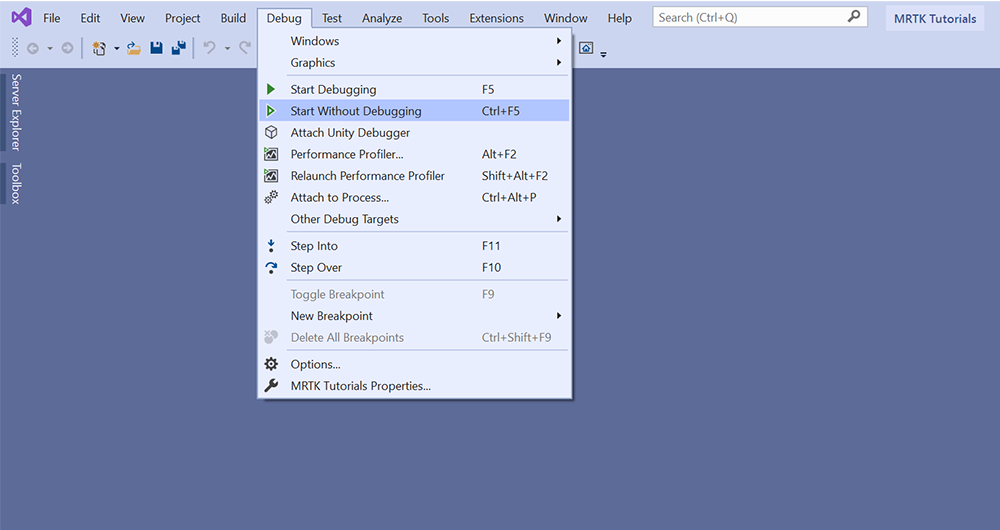

While these instructions assume you will be deploying to a HoloLens 2 device, you can also deploy to the [HoloLens 2 emulator](using-the-hololens-emulator.md) or create an [app package for sideloading](<https://docs.microsoft.com//windows/uwp/packaging/packaging-uwp-apps>).

Selecting Start without Debugging causes the application to immediately start on your device upon a successful build, but without the debugger attached and information appearing in Visual Studio. This also means that you can disconnect your USB cable while your application is running on your HoloLens 2 without stopping the application.

To deploy to your device without having the application start automatically, you can select Build > Deploy Solution.

## Congratulations

<!-- TODO: Consider cleanup and adding in app screenshots -->
You have now deployed your first HoloLens 2 application. As you walk around, you should see a spatial mapping mesh covering all the surfaces that have been perceived by the HoloLens 2. Additionally, you should see indicators on your hands and fingers for hand tracking and a frame rate counter for keeping an eye on application performance. These are just a few of the foundational pieces, included out of the box, with the Mixed Reality Toolkit. In the tutorials to come, you will start adding more content and interactivity to your scene so that you can fully explore the capabilities of HoloLens 2 and the Mixed Reality Toolkit.

> [!NOTE]
> In the app, you may notice the Diagnostics profiler, you can toggle it's visibility using the speech command **Toogle Diagnostics**. However, it is generally recommended to keep the profiler visible at all times during development to understand when changes to the app may have impacted performance, for example, HoloLens 2 application should [continuously run at 60 FPS](understanding-performance-for-mixed-reality.md).

[Next Tutorial: 3. Creating user interface and configure Mixed Reality Toolkit](mrlearning-base-ch2.md)
