# 3. Creating user interface and configure Mixed Reality Toolkit
<!-- TODO: Consider renaming to 'Configuring Mixed Reality Toolkit profiles and creating user interfaces' -->

In the previous tutorial, you learned about some of the capabilities the Mixed Reality Toolkit (MRTK) has to offer by starting your first application for the HoloLens 2. In this tutorial you will learn how to create and organize buttons along with UI text panels, and use default interaction (touch) to interact with each button. You will also explore the addition of simple actions and effects, such as changing the size, sound and color of objects. This module will introduce basic concepts about modifying MRTK profiles, starting with turning off the [spatial mapping](spatial-mapping.md) mesh visualization.

## Objectives

* Customize and configure Mixed Reality Toolkit profiles
* Interact with holograms using UI elements and buttons
* Basic hand-tracking input and interactions

## How to configure the Mixed Reality Toolkit Profiles (Change Spatial Awareness Display Option)
<!-- TODO: Consider renaming to 'How to customize the MRTK profiles' -->

In this section, you will learn how to customize and configure the default MRTK profiles.

This particular example will show you how to hide the spatial awareness mesh by changing the settings of the Spatial Mesh Observer. However, you may follow these same principles to customize any setting or value in the MRTK profiles.

The main steps you will take to hide the spatial awareness mesh are:

1. Clone the default Configuration Profile
2. Enable the Spatial Awareness System
3. Clone the default Spatial Awareness System Profile
4. Clone the default Spatial Awareness Mesh Observer Profile
5. Change the visibility of the spatial awareness mesh

> [!NOTE]
> By default, the MRTK profiles are not editable. These are default profile templates that you have to clone before they can be edited. There are several nested layers of profiles. Therefore, it is common to clone and edit several profiles when configuring one or more settings.

### 1. Clone the default Configuration Profile

> [!NOTE]
> The Configuration Profile is the top level profile. Consequently, to be able to edit any other profiles, you first have to clone the Configuration Profile.

With the **MixedRealityToolkit** object selected in the Hierarchy window, in the Inspector window, change the Mixed Reality Toolkit **Configuration Profile** to **DefaultHoloLens2ConfigurationProfile**:

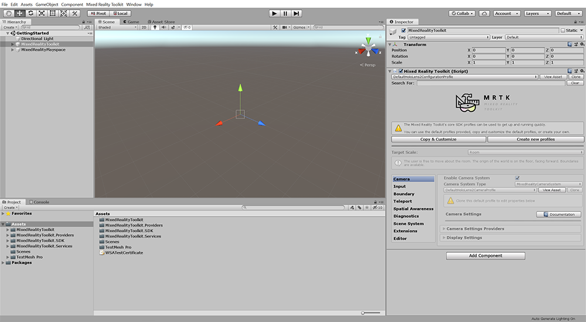

With the **MixedRealityToolkit** object still selected, in the Inspector window, click the **Copy & Customize** button to open the Clone Profile window:

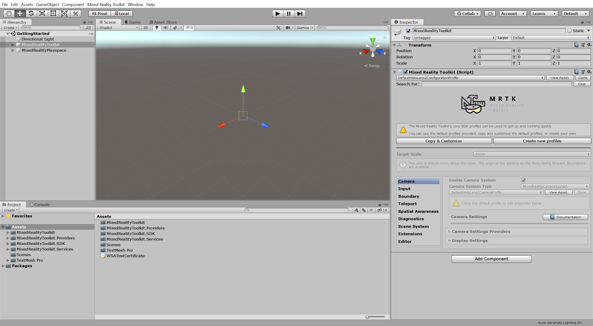

In the Clone Profile window, click the **Clone** button to create an editable copy of the **DefaultHololens2ConfigurationProfile**:

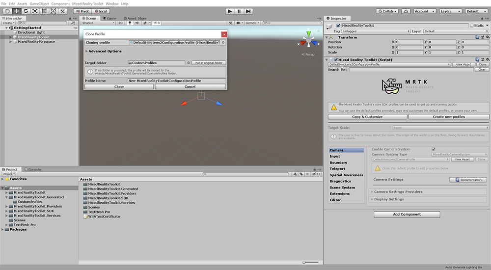

The newly created Configuration Profile is now assigned as the Configuration Profile for your scene:

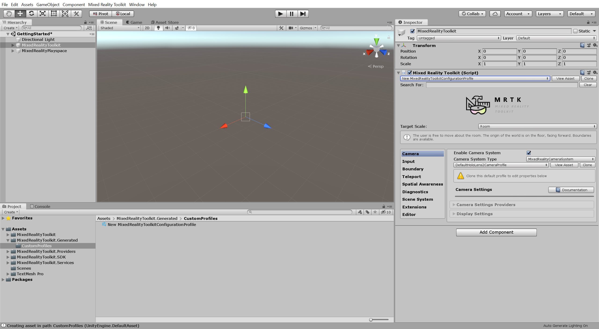

In the Unity menu, select **File** > **Save** to save your scene.

> [!TIP]
> Remember to save your work throughout the tutorial.

### 2. Enable the Spatial Awareness System

With the **MixedRealityToolkit** object still selected in the Hierarchy window, in the Inspector window, select the **Spatial Awareness** tab, and then check the **Enable Spatial Awareness System** checkbox:

### 3. Clone the default Spatial Awareness System Profile

In the **Spatial Awareness** tab, click the **Clone** button to open the Clone Profile window:

In the Clone Profile window, click the **Clone** button to create an editable copy of the **DefaultMixedRealitySpatialAwarenessSystemProfile**:

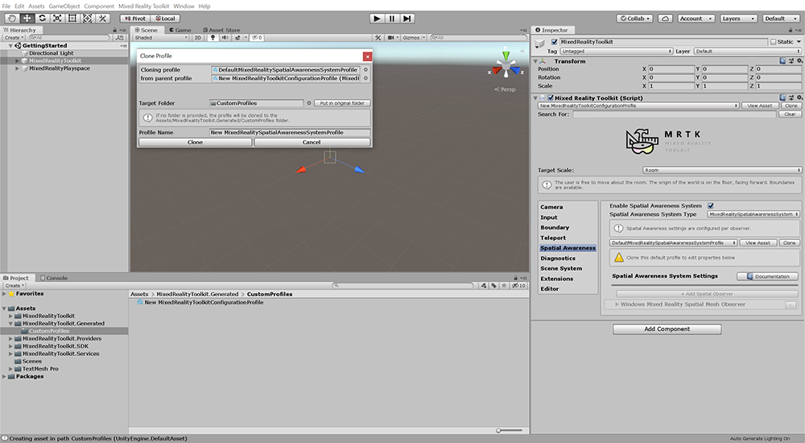

The newly created Spatial Awareness System Profile is now automatically assigned to your Configuration Profile:

### 4. Clone the default Spatial Awareness Mesh Observer Profile

With the **Spatial Awareness** tab still selected, expand the **Windows Mixed Reality Spatial Mesh Observer** section, then click the **Clone** button to open the Clone Profile window:

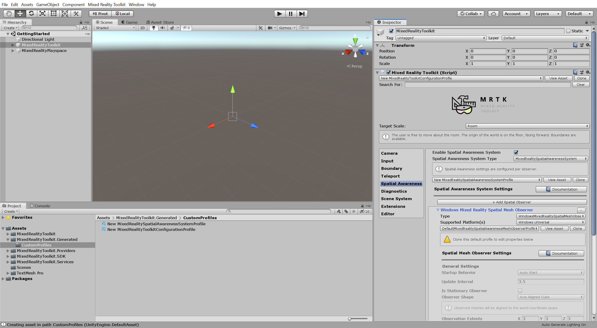

In the Clone Profile window, click the **Clone** button to create an editable copy of the **DefaultMixedRealitySpatialAwarenessMeshObserverProfile**:

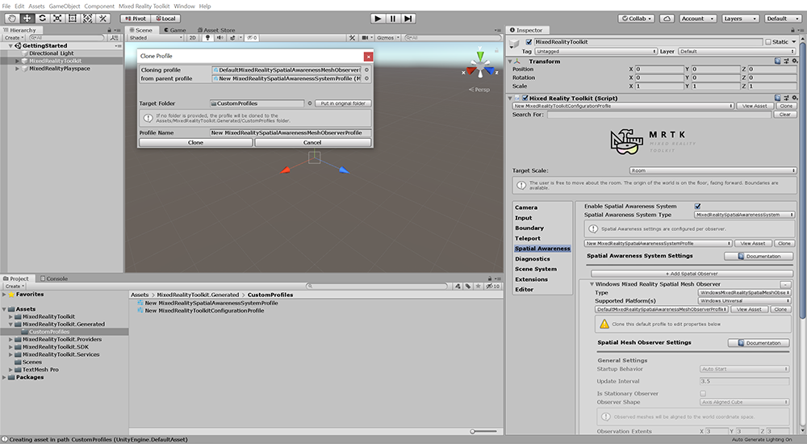

The newly created Spatial Awareness Mesh Observer Profile is now automatically assigned to your Spatial Awareness System Profile:

### 5. Change the visibility of the spatial awareness mesh

In the **Spatial Mesh Observer Settings**, change the **Display Option** to **Occlusion** to make the spatial mapping mesh invisible while still being functional:

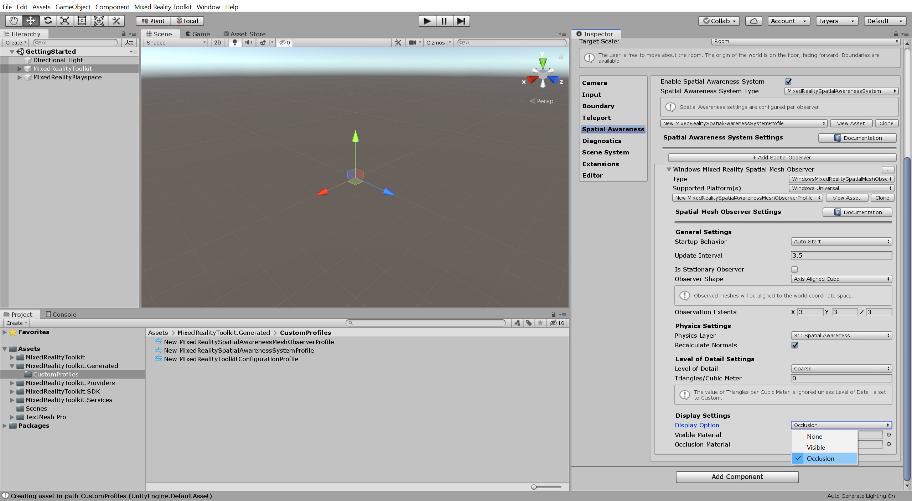

> [!NOTE]
> Although the spatial mapping mesh is not visible, it is still present and functional. For example, any holograms behind the spatial mapping mesh, such as a hologram behind a physical wall, will not be visible.

You just learned how to modify a setting in the MRTK profile. As you can see, in order to customize the MRTK settings, you first need to create copies of the default profiles. Because the default profiles are not editable, you will always have them as reference if you want revert back to the default settings. To learn more about MRTK profiles and their architecture, you can visit the [Mixed Reality Toolkit profile configuration guide](https://microsoft.github.io/MixedRealityToolkit-Unity/Documentation/MixedRealityConfigurationGuide.html) in the [MRTK Documentation Portal](https://microsoft.github.io/MixedRealityToolkit-Unity/README.html).

## Hand tracking gestures and interactable buttons

In this section, you will learn how to use hand tracking to press a button and trigger events to cause an action when the button is pressed.

This particular example will show you how to change the color of a cube when the button is pressed and change it back to it's original color when the button is released. However, you may follow these same principles to create other events.

The main steps you will take to change the color of the cube are:

1. Add a pressable button prefab to the scene
2. Add a cube to the scene
3. Configure the InteractableOnPressReceiver event type
4. Configure the cube to receive the On Press event
5. Define the action to be triggered by the On Press event
6. Configure the cube to receive the On Release event
7. Define the action to be triggered by the On Release event
8. Test the button using the in-editor simulation

### 1. Add a pressable button prefab to the scene

> [!TIP]
> A <a href="https://docs.unity3d.com/Manual/Prefabs.html" target="_blank">prefab</a> is a pre-configured GameObject stored as a Unity Asset and can be reused throughout your project.

In the **Project window**, search for **PressableButtonHoloLens2** to locate the prefab you will use for this example:

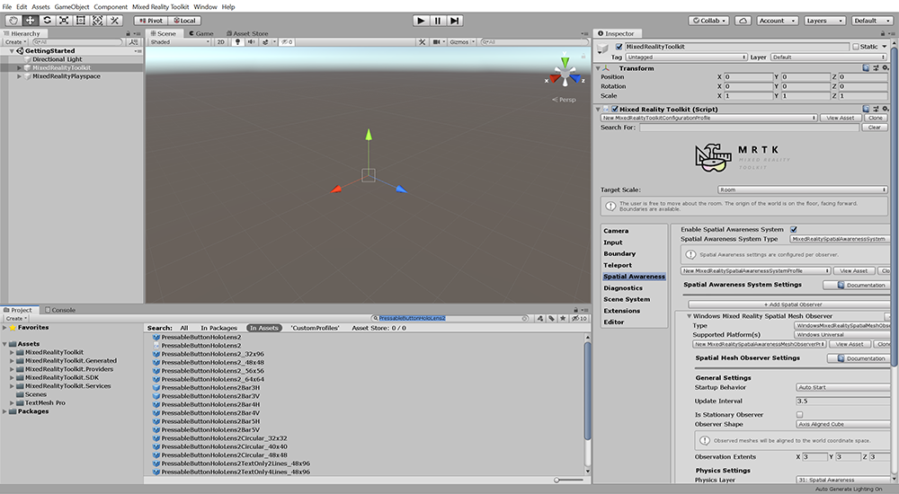

In the **Search** result, select the **PressableButtonHoloLens2** prefab and **drag** it into the **Hierarchy** window to add it to your scene:

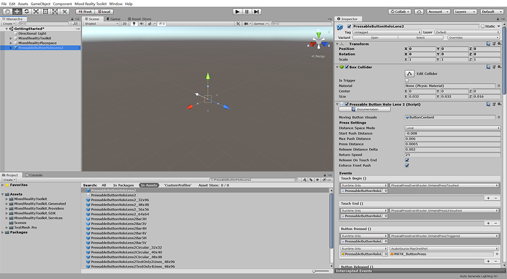

> [!TIP]
> To display your scene as shown in the image below, double-click the PressableButtonHoloLens2 object in the Hierarchy window to bring it into focus, then use the <a href="https://docs.unity3d.com/Manual/SceneViewNavigation.html" target="_blank">Scene Gizmo</a>, located in the top right corner of the Scene window, to adjust the viewing angle to be along the forward Z axis.

With the **PressableButtonHoloLens2** object still selected, in the **Inspector** window:

* Change its Transform **Position** so it's positioned in front of the camera, which is positioned at origin, for example, x = 0, y = 0, and z = 0.5

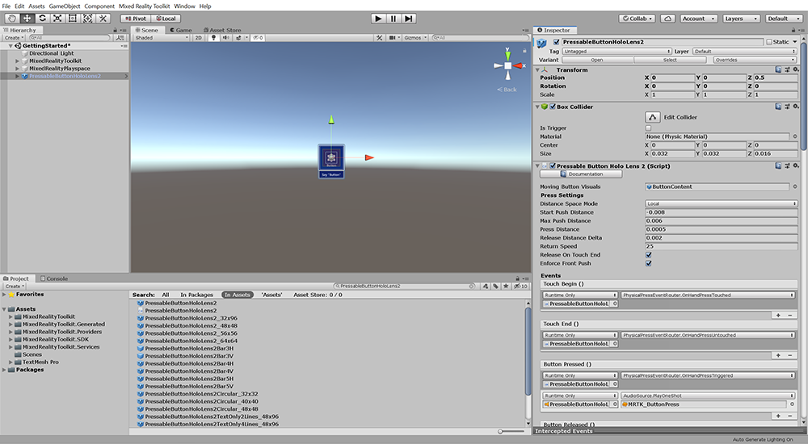

> [!NOTE]
> In general, 1 position unit in Unity is roughly equivalent to 1 meter in the physical world. However, there are exceptions to this, for example, when objects are children of scaled objects.

### 2. Add a cube to the scene

Right-click on an empty spot inside the Hierarchy window and select **3D Object** > **Cube** to add a cube to your scene:

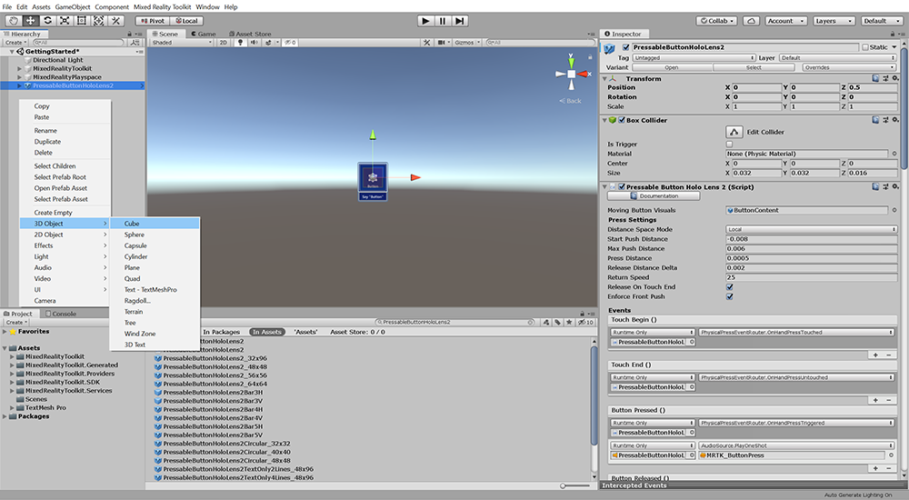

With the **Cube** object still selected, in the **Inspector** window:

* Change its Transform **Position** so its located near the pressable button, but not overlapping with it, for example, x = 0, y = 0.04, and z = 0.5
* Change its Transform **Scale** to a suitable size, for example, x = 0.02, y = 0.02, and z = 0.02

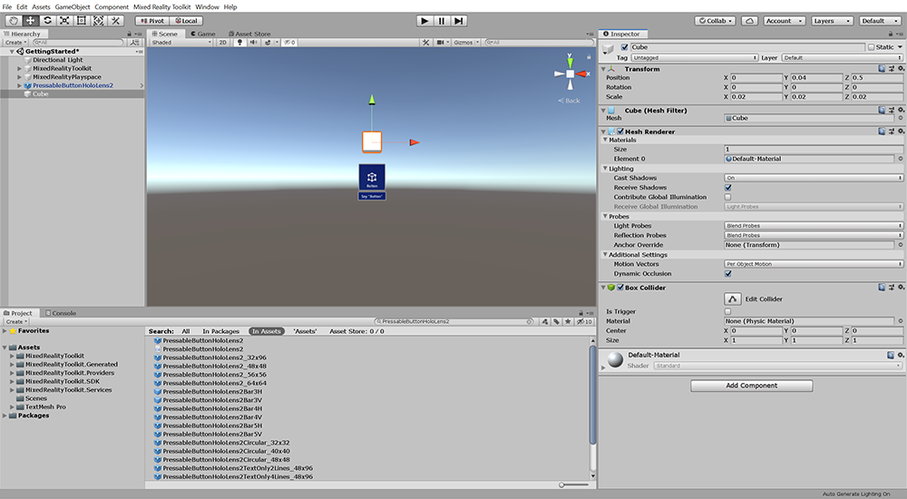

### 3. Configure the InteractableOnPressReceiver event type

In the Hierarchy window, select the **PressableButtonHoloLens2** object, then in the **Inspector** window **hamburger menu**, select **Collapse All Components** to get an overview of all components on this object:

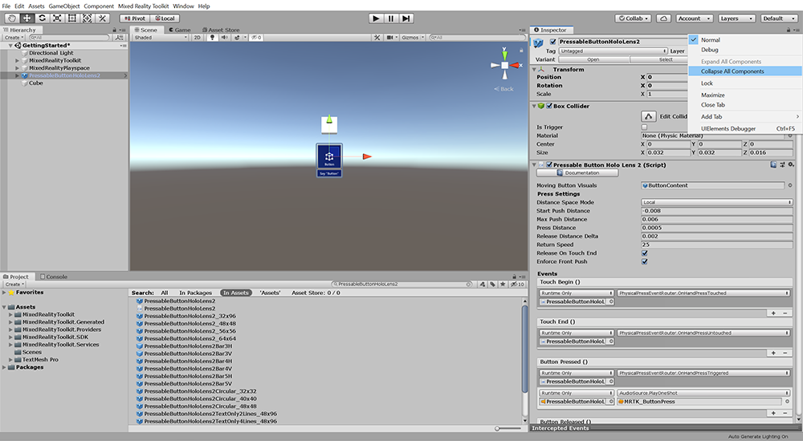

Expand the **Interactable (Script)** component, then locate and expand the **Events** > **Receivers** section:

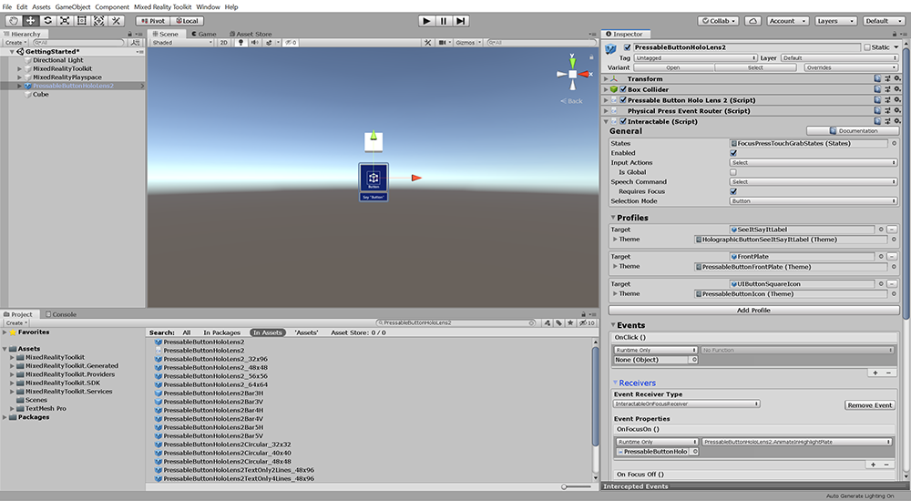

Click the **Add Event** button, to create a new event receiver of Event Receiver Type **InteractableOnPressReceiver**:

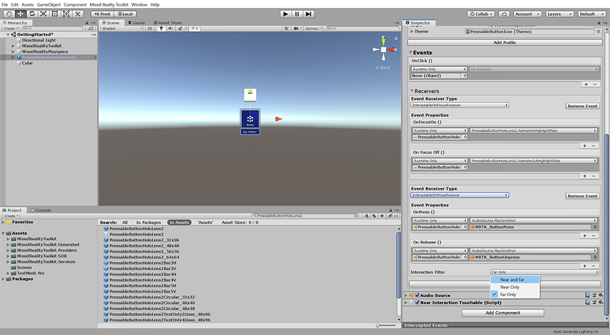

> [!NOTE]
> The Event Receiver Type named InteractableOnPressReceiver allows the button to respond to a pressed event when a tracked hand presses the button.

For the newly created event receiver, change the **Interaction Filter** to **Near and Far**:

### 4. Configure the cube to receive the On Press event

From the Hierarchy window, **click-and-drag** the **Cube** into the **Event Properties** object field for the **On Press ()** event to assign the Cube as a receiver of the On Press () event:

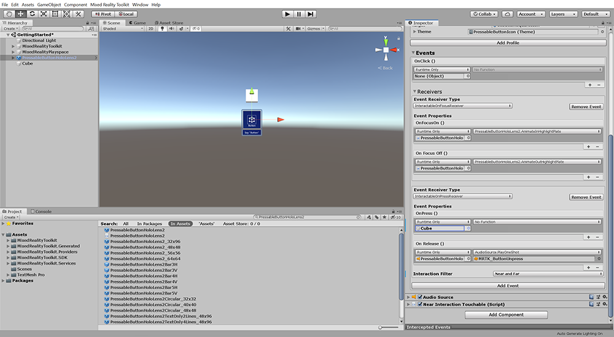

### 5. Define the action to be triggered by the On Press event

Click the action dropdown, currently assigned **No Function**, and select **MeshRenderer** > **Material material** to set the Cube's material property to be changed when the On Press () event is triggered:

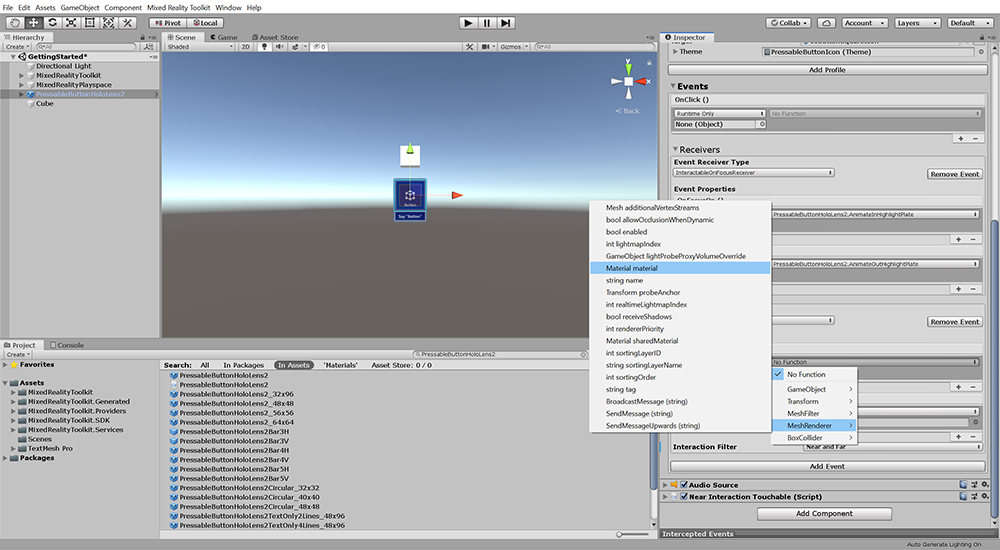

Click the small **circle** icon next to the material field, currently populated with **None (Material)**, to open the Select Material window:

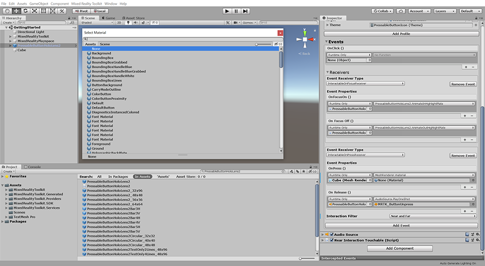

In the Select Material window, **search** for **MRTK_Standard** and select a suitable material, for example, **MRTK_Standard_Cyan** so the Cube's color changes to cyan when the button is pressed:

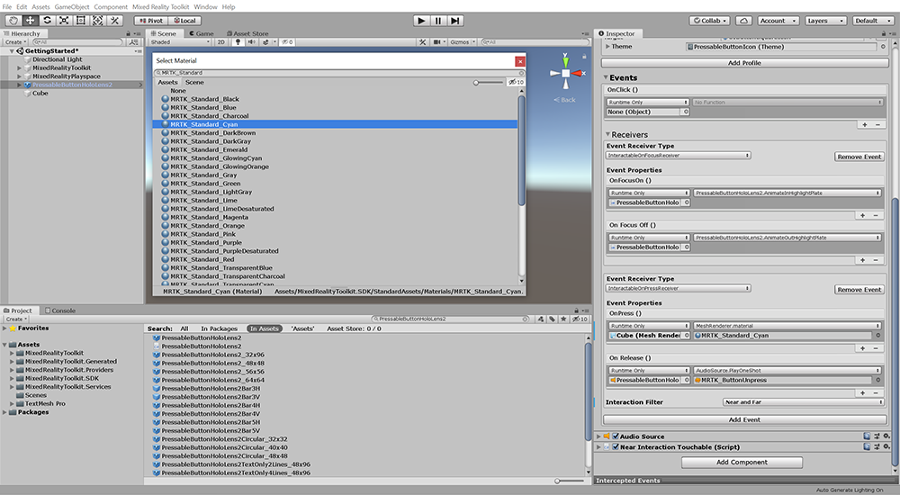

### 6. Configure the cube to receive the On Release event

**Repeat** Step 4 for the On Release event to assign the **Cube** as a receiver of the **On Release ()** event.

### 7. Define the action to be triggered by the On Release event

**Repeat** Step 5 for the On Release event, but choose the **MRTK_Standard_LightGray** material so the Cube's color returns to its original light gray color when the button is released:

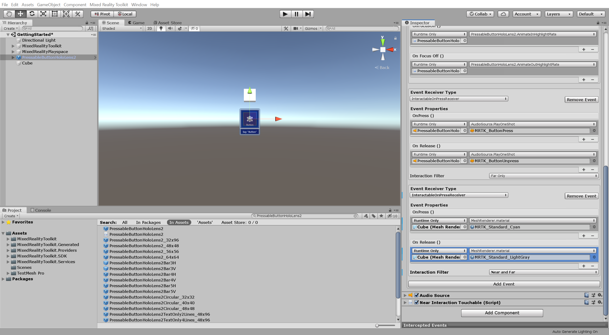

### 8. Test the button using the in-editor simulation

Press the **Play** button to enter Game mode and use the in-editor input simulation to test your newly configured button.

Button not pressed (spacebar + mouse scroll wheel backward):

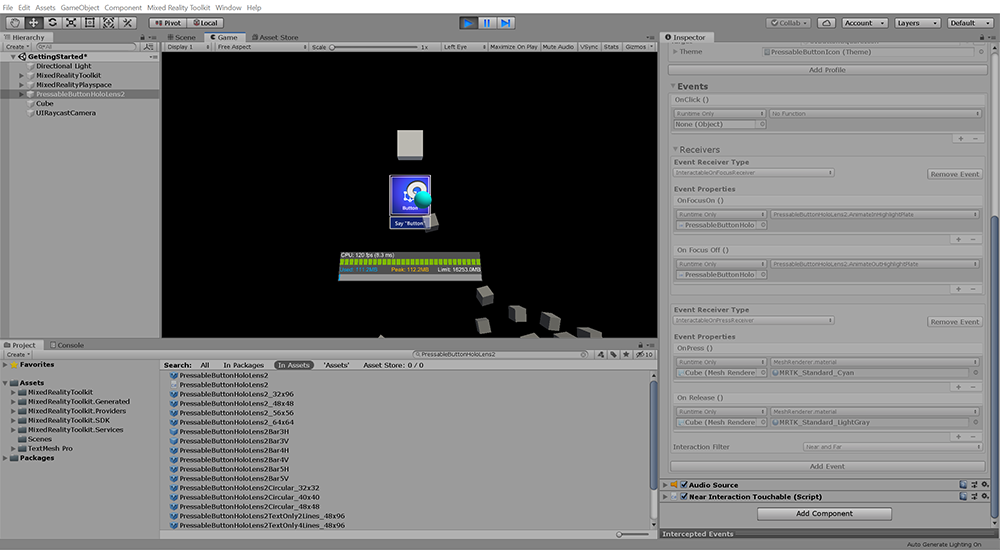

Button pressed (spacebar + mouse scroll wheel forward):

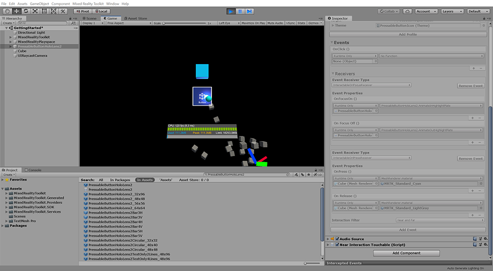

> [!TIP]
> To learn how to use the in-editor input simulation, you can refer to the [Using the In-Editor Hand Input Simulation to test a scene](https://microsoft.github.io/MixedRealityToolkit-Unity/Documentation/GettingStartedWithTheMRTK.html#using-the-in-editor-hand-input-simulation-to-test-a-scene) guide in the [MRTK Documentation Portal](https://microsoft.github.io/MixedRealityToolkit-Unity/README.html).

## Creating a panel of buttons using MRTK's Grid Object Collection

In this section, you will learn how to automatically align multiple buttons into a neat user interface by using the MRTK's Grid Object Collection tool.

This particular example will show you how to a create a panel with five buttons aligned horizontally. However, you may follow these same principles to create other layouts.

The main steps you will take to achieve this are:

1. Parent the button objects to a parent object
2. Add and configure the Grid Object Collection (Script) component
3. Test the buttons using the in-editor simulation

### 1. Parent the button objects to a parent object

Right-click on an empty spot inside the Hierarchy window and select **Create Empty**:

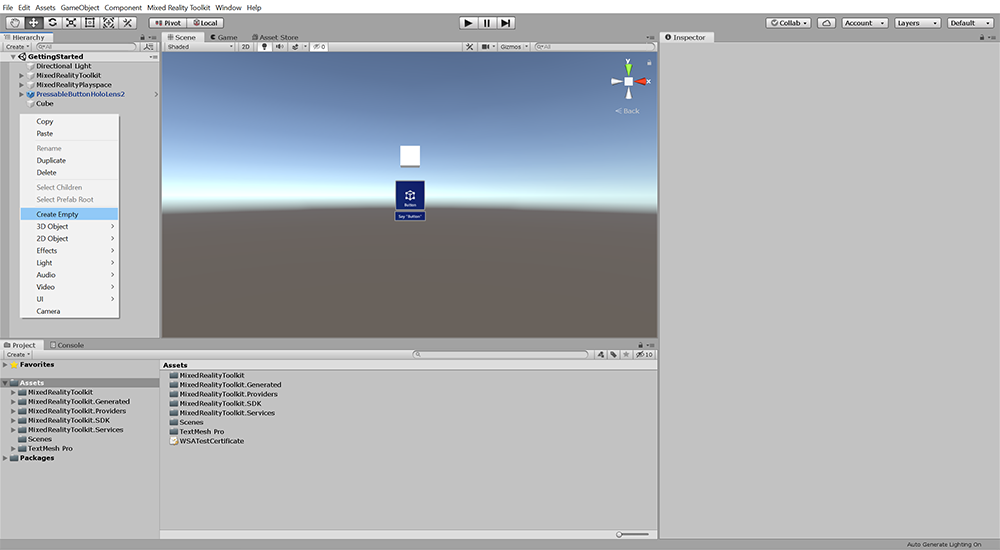

Right-click on the newly created object, select **Rename**, and give it a suitable name, for example, **ButtonCollection**:

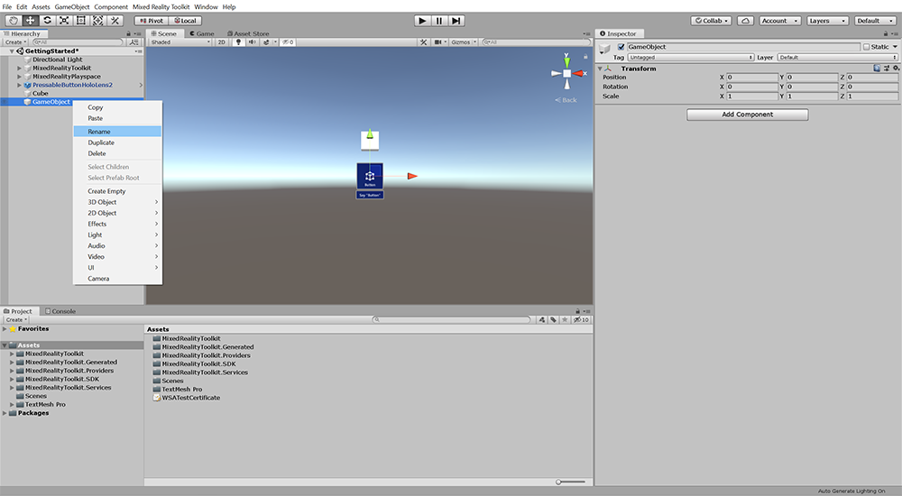

Select the **PressableButtonHoloLens2** object and **drag** it on top of the **ButtonCollection** object to make it a child of the ButtonCollection object:

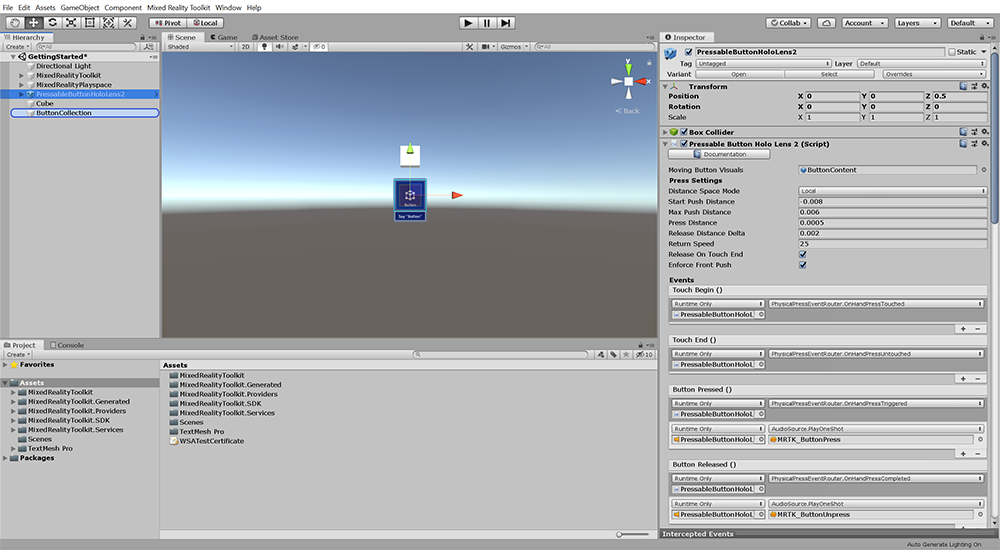

Right-click the **PressableButtonHoloLens2** object and select **Duplicate** to create a copy of it:

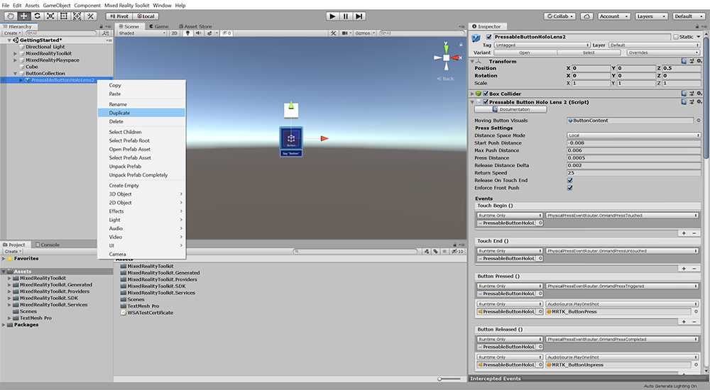

**Repeat** this step four more times until you have a total of five PressableButtonHoloLens2 objects.

### 2. Add and configure the Grid Object Collection (Script) component

With the ButtonCollection object selected in the Hierarchy window, in the Inspector window, click the **Add Component** button, then search for and select **Grid Object Collection** to add a Grid Object Collection (Script) component to the ButtonCollection object:

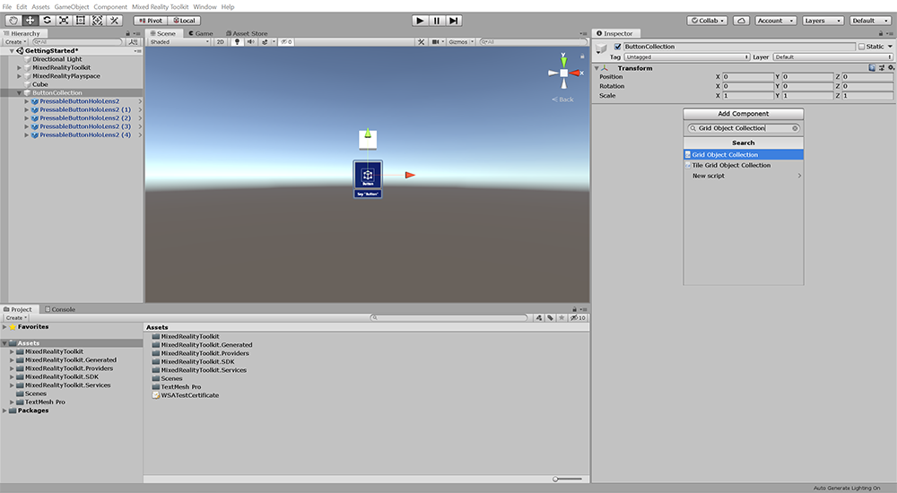

Configure the Grid Object Collection (Script) as follows:

* Change **Num Rows** to 1 to have all buttons aligned on one single row
* Change **Cell Width** to 0.05 to space out the buttons within the row

Then click the **Update Collection** button to apply the new configuration:

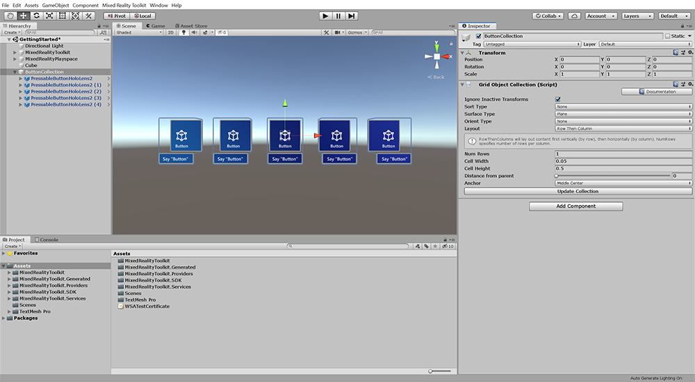

> [!NOTE]
> The configuration changes you just applied represent the minimum changes required to achieve the objective of placing the buttons in a single row. However, in future projects, depending on factors such as, for example, the orientation of the parent and child objects, you might need to adjust other settings such as, for example, the Orient Type. To learn more about MRTK's Grid Object Collection, you can visit the [Object collection scripts](https://microsoft.github.io/MixedRealityToolkit-Unity/Documentation/README_ObjectCollection.html#object-collection-scripts) guide in the [MRTK Documentation Portal](https://microsoft.github.io/MixedRealityToolkit-Unity/README.html).

With the ButtonCollection object still selected in the Hierarchy window, in the Inspector window, change the ButtonCollection object's Transform **Position** so its child button objects are positioned in front of the camera, which is positioned at origin, for example, x = 0, y = 0, and z = 0.5:

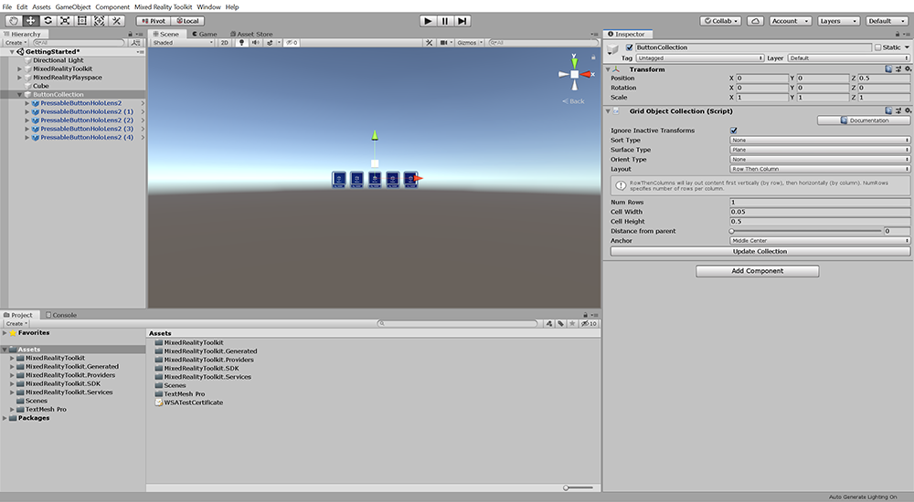

> [!NOTE]
> When you first added the PressableButtonHoloLens2 prefab to the scene in the [Hand tracking gestures and interactable buttons](mrlearning-base-ch2.md#hand-tracking-gestures-and-interactable-buttons) section above, you positioned it in front of the camera. However, because the Grid Object Collection controls its immediate child objects' position, the PressableButtonHoloLens2 child objects' Z Position were reset to 0 according to the Grid Object Collection's default Distance from parent value of 0. This, and to keep the parent/child positional relationship organized, is why we moved the parent ButtonCollection object's position forward instead of configuring the Distance from parent value to move the PressableButtonHoloLens2 child objects forward.

### 3. Test the buttons using the in-editor simulation

Press the Play button to enter Game mode and use the in-editor input simulation to test each of the buttons in in your newly created panel of buttons:

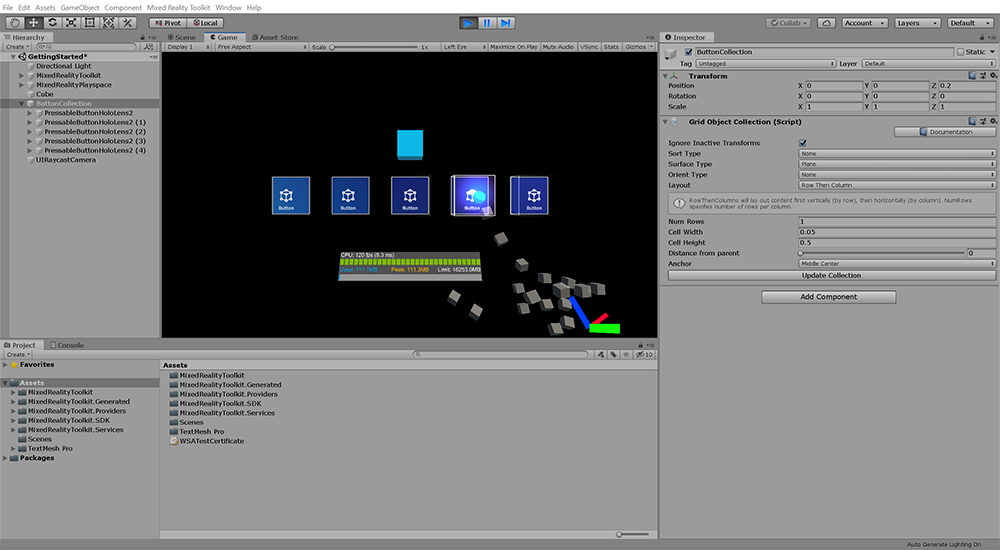

> [!TIP]
> Currently, when your press any of the five buttons, the cube color changes to cyan. To make the experience more interesting, use what you just learn to configure each button to change the cube to a different color.

## Adding text into your scene

In this section, you will learn how to add text to your mixed reality experiences using Unity's TextMesh Pro, which you prepared in the [Import TextMesh Pro Essential Resources](mrlearning-base-ch1.md#import-textmesh-pro-essential-resources) section of the previous tutorial.

In this particular example, you will add a simple label underneath the button collection you created in the previous section.

Right-click on the ButtonCollection object and select **3D Object** > **Text - TextMeshPro** to create a TextMeshPro object as a child of the ButtonCollection object:

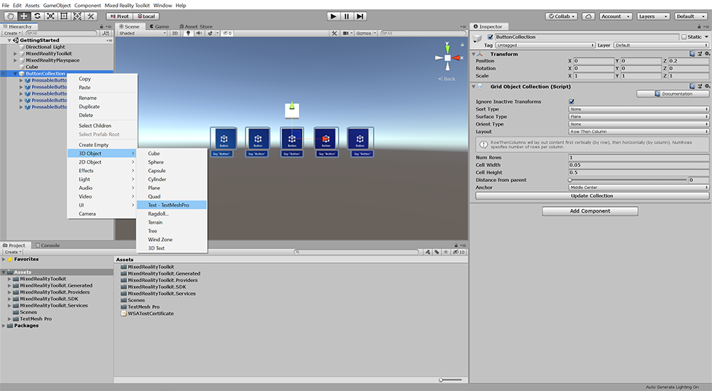

With the newly created TextMeshPro object, named Text (TMP), still selected, in the Inspector window change its position and size so the label is placed neatly underneath the button collection, for example:

* Change the Rect Transform **Pos Y** to -0.0425
* Change the Rect Transform **Width** to 0.24
* Change the Rect Transform **Height** to 0.024

Then update the text to reflect what the label is for and choose font properties so the text fits within the label, for example:

* Change the Text Mesh Pro (Script) **Text** to Button Collection
* Change the Text Mesh Pro (Script) **Font Style** to Bold
* Change the Text Mesh Pro (Script) **Font Size** to 0.2
* Change the Text Mesh Pro (Script) **Alignment** to Center and Middle

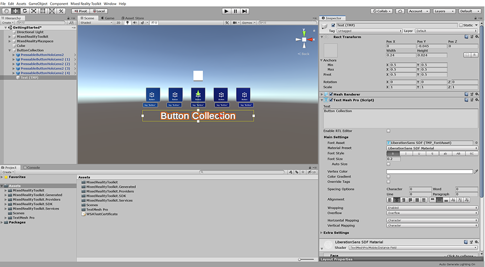

## Congratulations

In this tutorial, you learned how to clone, customize, and configure an MRTK profile setting. You also learned how to interact with buttons to trigger events using tracked hands on the HoloLens 2. Finally, you learned how to create a simple UI interface using the MRTK's Grid Object Collection component and Unity's Text Mesh Pro.

[Next Tutorial: 4. Placing dynamic content and using solvers](mrlearning-base-ch3.md)
