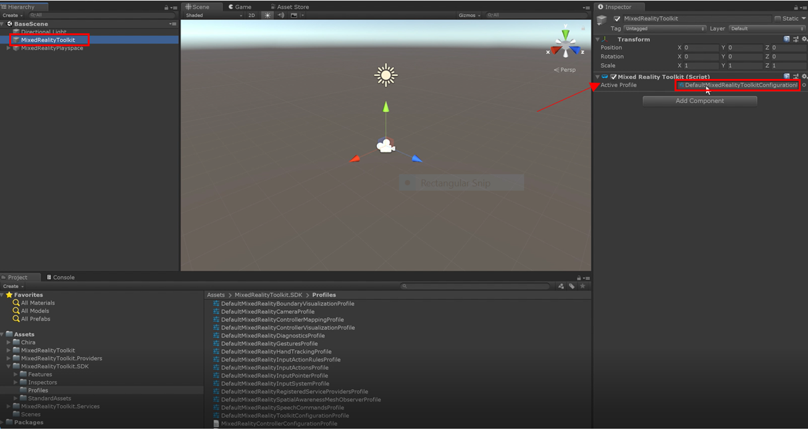

# MR Learning Base Module User Interface, Hand Tracking, and Mixed Reality Toolkit Configuration

In the previous lesson, we learned some of the capabilities the MRTK had to offer, with starting your first application for the HoloLens 2. In this next lesson we’ll learn how to create and organize buttons along with UI text panels and use default interaction (touch) to interact with each button. We will also explore the addition of simple actions and effects, such as changing the size, sound and color of objects. We will introduce basic concepts on how to modify MRTK profiles, starting with turning off the visualization of the spatial mesh. 

## Objectives

* Customize and configure Mixed Reality Toolkit profiles
* Interacting with holograms using UI elements and buttons
* Basic hand-tracking input and interactions

## Instructions

### How to Configure the Mixed-Reality Toolkit Profiles (Change Spatial Awareness Display Option)
In this section we will learn how to customize and configure the default Mixed Reality Toolkit profiles by adjusting the display option of the spatial awareness mesh. You may follow these same principles for adjusting any settings or values in the MRTK profiles.

1. Select Mixed-Reality Toolkit (MRTK) from the “BaseScene” hierarchy. In the inspector panel, look for the “Mixed Reality Toolkit Script” and select the “active profile” as shown in the figure below. Double click to open it.

>Note:
>By default, the MRTK profiles are not editable. These are default profile templates from which you can copy and customize. There are several layers of customization and profiles, so it is standard practice to copy and customize several profiles when configuring one or more settings.

2. Create a copy of the default profile to customize it. To copy a default profile, click the “Copy & Customize” button (see image). This creates a copy of the MRTK profile. With your own copy of the MRTK profile, you now have the ability customize any settings in this profile. You will also need to repeat the copy/customize step for any additional profiles nested under this profile, as described in the subsequent steps.

3. Disable the visibility of the spatial awareness mesh. To do this, find “Additional Service Providers” as shown in the image. When you open the “default mixed reality registered serviced providers profile” (marked by red arrow) it will appear greyed (not editable.) Click the button to the right of the profile (marked by green arrow) to replace the default profile with a customizable copy.

4. Create a custom copy of the Default Mixed Reality Spatial Mesh Observer. Click the down arrow next to “Windows Mixed Reality Spatial Mesh Observer” to see additional options. In these options, you will see the “Default Mixed Reality Spatial Mesh Observer” which appears greyed (not editable.) We must replace this default profile with a customizable copy of it so we can edit it. Click the button to the right (marked by green arrow) to create a copy.

5. Next, we adjust the settings for the display option to say “occlusion.” This makes the spatial mesh invisible, but still hide game objects behind the spatial mesh (this is known as occlusion.)

>Note: the spatial mapping mesh is still there, and you can still interact with it, but you won’t be able to see it directly. Also, any holograms behind the spatial mapping mesh (i.e. a hologram behind your visible wall) will not be visible because of the occlusion setting.

Congratulations! You just learned how to modify a setting in the MRTK profile. As you can see, in order to modify MRTK settings you need to create copies of the default profiles so that you can edit them. You will always have the default profiles (which are not editable) to go back to if you wanted to create a profile with new settings, or refer back to the default profiles. There are numerous settings that you can adjust. For full reference to MRTK profile settings, refer to the MRTK documentation here: https://microsoft.github.io/MixedRealityToolkit-Unity/Documentation/GettingStartedWithTheMRTK.html

### Hand Tracking Gestures and Interactable buttons
In this section, we will learn how to use hand tracking to press an interactable button.

1. Select “Assets” from the projects folder.

2. Type in the search bar, “holographicbutton.”

3. Drag the prefab (represented by a blue box) named "HolographicButton" into your hierarchy.

>Note: If you get a message about “importing TMP Essentials” please import it at this time. If TMP Essentials was not already part of your project, you may need to repeat this step after importing TMP Essentials, otherwise button text may not appear.

4. Double click the “HolographicButton” game object (which should now be in your BaseScene hierarchy) to view it in your scene, as shown in the image below. 

5. In the inspector panel, click “Add Event” to give the button an event to respond to when pushed. In the option that appears, select the drop-down menu. Select “InteractableOnPressReciever.” This allows the button to respond to a pressed event when a tracked hand presses the button.

> Note: These instructions are based on an earlier version of the MRTK and will be updated to reflect new button/event systems in the current version of the MRTK.

6. Add a cube to the scene. Right click on the hierarchy area, select 3D object, then click on “cube.” Now, a cube should be in your display. It will appear very large, so adjust the coordinates (while “cube” is still selected in the hierarchy area) to decrease the size. In this case, we are using the dimensions x = 0.1, y = 0.1 and z = 0.1. Be sure to position the cube in your scene to place it near the pressable button, but not overlapping with the button. In the image below, the cube’s position is x = 0, y = 0.2, and z = 0. 

7. In this step we will set up the cube to change color when our button is pressed. Select the holographic button in the “BaseScene” menu. Select the holographic button in the “BaseScene” menu. In the inspector panel, under the “Select Event Type” box, click the “+” button. Drag the “cube” from the “BaseScene” menu into the “Runtime Only” box, as shown in the image below
 

Click the dropdown list that says “No Function.” Select “MeshRenderer” then select “Material material.” This will allow us to change the material when the button is pressed. 

Go to the project panel and search for the material you wish to change it to. We are going to use the material “MRTK_Standard_Cyan” for this example, found by typing in “cyan” in the project tab’s search bar (The MRTK includes many materials and colors to choose from.) Drag the material to the box underneath “MeshRenderer.material.”

The event is now set so that when the button is pressed, the cube will change color based on the material you specified. For our example, the cube will change to the cyan color.

8. Next we’re going to set up the release action so that upon release, the button will go back to its default color. Repeat Step 7 (the previous step) but this time with the “OnRelease” event instead of the “OnPress” event, as shown in the image below.

9.  In the project panel, search for a material for the cube to default to upon button release (in our case, we chose MRTK_Standard_LightGray.) Drag the material into the box below the “MeshRenderer.material” field.

### Congratulations
Now when the button is pressed, it should change to a new color (e.g., cyan) and when the button is released it should change back to the default color you specified (e.g., light gray.) Press the “play” button on the top of the screen to try it out in the editor or deploy to your HoloLens 2 to test! In this lesson, you learned how to copy, customize, and configure an MRTK profile setting (i.e., spatial awareness mesh visibility.) You also learned how to interact with a button to trigger events using tracked hands on the HoloLens 2.

