# 3. Creating user interface and configure Mixed Reality Toolkit

In the previous lesson, you learned about some of the capabilities the Mixed Reality Toolkit (MRTK) has to offer by starting your first application for the HoloLens 2. In this next lesson you'll learn how to create and organize buttons along with UI text panels, and use default interaction (touch) to interact with each button. You will also explore the addition of simple actions and effects, such as changing the size, sound and color of objects. This module will introduce basic concepts about modifying MRTK profiles, starting with turning off the [spatial mapping](spatial-mapping.md) mesh visualization.

## Objectives

* Customize and configure Mixed Reality Toolkit profiles
* Interact with holograms using UI elements and buttons
* Basic hand-tracking input and interactions

## Instructions

### How to Configure the Mixed Reality Toolkit Profiles (Change Spatial Awareness Display Option)

In this section, you'll learn how to customize and configure the default MRTK profiles by adjusting the display option of the spatial awareness mesh. You may follow these same principles for adjusting any settings or values in the MRTK profiles.

1. Select Mixed-Reality Toolkit (MRTK) from the BaseScene hierarchy. In the inspector panel, look for the Mixed Reality Toolkit Script and select the active profile as shown in the figure below. Double click to open it.

    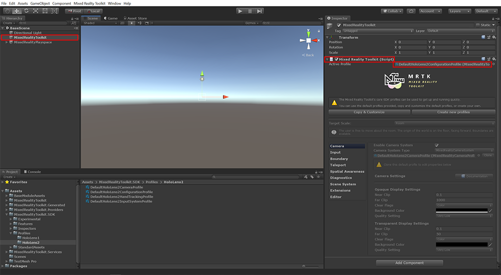

    >[!NOTE]
    >By default, the MRTK profiles are not editable. These are default profile templates that you can copy and customize. There are several layers of customization and profiles. So, it is standard practice to copy and customize several profiles when configuring one or more settings.
    >
    >To discover more about MRTK profiles and their architecture, visit the [MRTK documentation](<https://microsoft.github.io/MixedRealityToolkit-Unity/Documentation/MixedRealityConfigurationGuide.html>).

2. Create a copy of the default profile to customize it. Start by clicking **Copy & Customize**.

    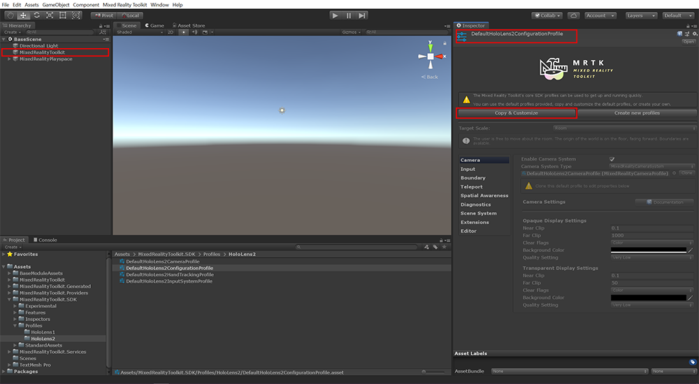

    This will open the *Clone Profile* popup window.

    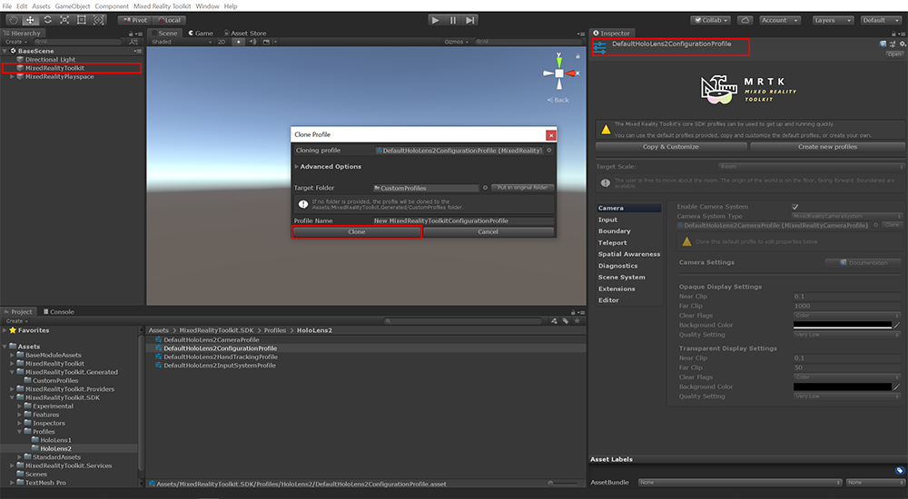

    Click **Clone** to create a copy of the MRTK profile. With your own copy of the MRTK profile, you now have the ability customize any settings in this profile. You will also need to repeat the copy and customize step for any additional profiles nested under this profile as described in the subsequent steps.

3. Disable the visibility of the spatial awareness mesh. To do this, find Spatial Awareness system settings as shown in the image below. Make sure the **Enable Spatial Awareness System** option is checked. Click the **Clone** button to the right of the Spatial Awareness System Profile to replace the default profile with a customizable copy. In the popup window that appears, press the **Clone** button, as shown in the second image below.

    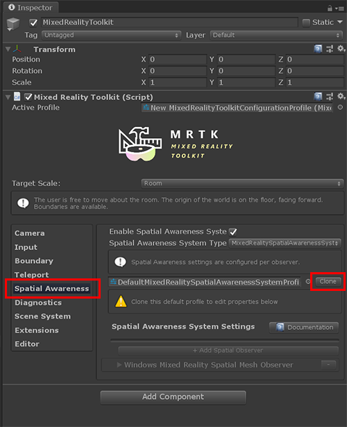

    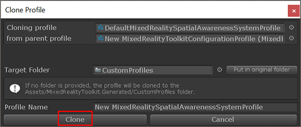

4. Create a custom copy of the Default Mixed Reality Spatial Mesh Observer. Click the down arrow next to Windows Mixed Reality Spatial Mesh Observer to see additional options.

    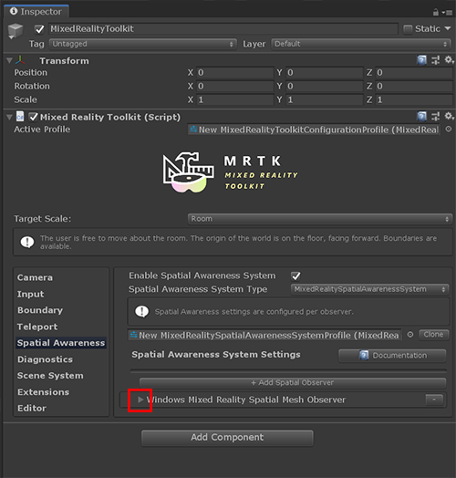

    In these options, you will see the Default Mixed Reality Spatial Mesh Observer that is greyed-out (not editable). You must replace this default profile with a customizable copy so you can edit it. As you did earlier, click the **Clone** button and then, in the popup window that appears, press the **Clone** button, as shown in the second image below.

    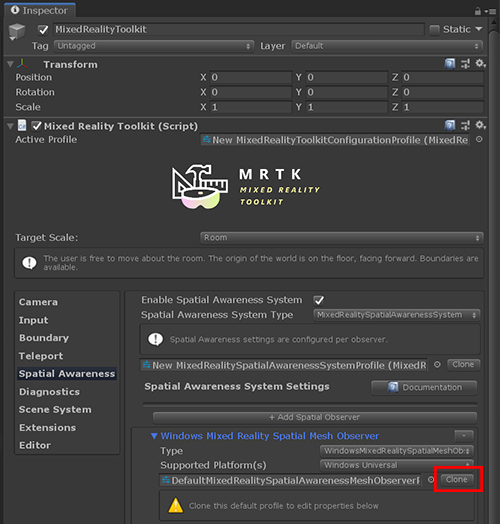

    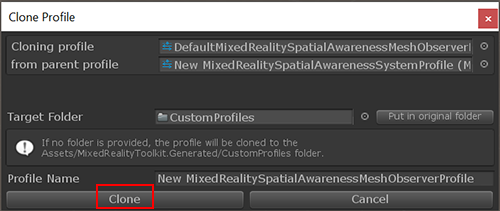

5. Next, you will adjust the settings for the display option to say “occlusion.” This makes the spatial mapping mesh invisible, but still hides game objects behind the spatial mapping mesh, also known as occlusion.

    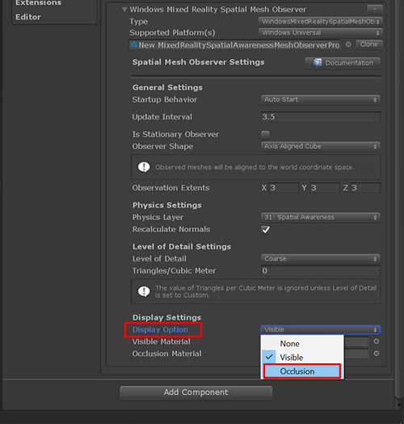

    >[!NOTE]
    >Note: While the spatial mapping mesh is not visible, it is still present and you can interact with it. Any holograms behind the spatial mapping mesh, such as a hologram behind your visible wall, will not be visible because of the occlusion setting.

Congratulations! You just learned how to modify a setting in the MRTK profile. As you can see, in order to modify MRTK settings you need to create copies of the default profiles so that you can edit them. You will always have the default profiles, which are not editable, to go back to if you wanted to create a profile with new settings or you can refer back to the default profiles. There are numerous settings that you can adjust. For full reference to MRTK profile settings, refer to the MRTK documentation here: [https://microsoft.github.io/MixedRealityToolkit-Unity/Documentation/GettingStartedWithTheMRTK.html](https://microsoft.github.io/MixedRealityToolkit-Unity/Documentation/GettingStartedWithTheMRTK.html)

### Hand Tracking Gestures and Interactable buttons

In this section, you will learn how to use hand tracking to press a pressable button.

1. Select Assets from the projects folder.

2. Type "PressableButtonHoloLens2" in the search bar.

    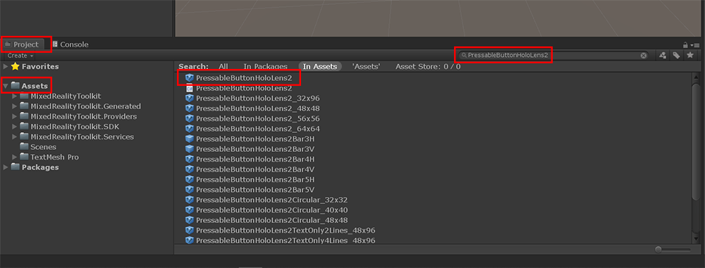

3. Drag the prefab (represented by a blue box) named "PressableButtonHoloLens2" into your hierarchy and set set the position values to x = 0, y = 0 and z = 0.2 so the button is in front of the camera. (The camera is positioned at origin).

    >[!NOTE]
    >If you get a message about “importing TMP Essentials”, import it at this time. If TMP Essentials was not already part of your project, you might need to repeat this step after importing TMP Essentials, otherwise button text may not appear.

    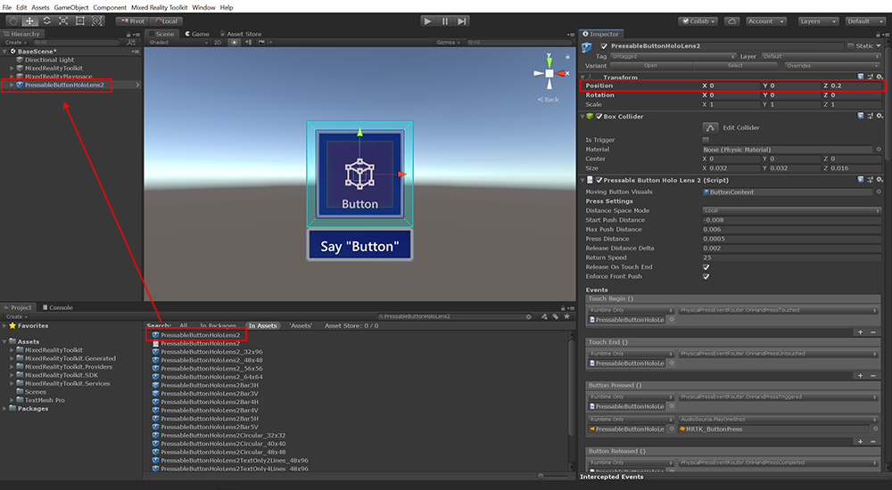

4. Add a cube to the scene. Right click on the hierarchy area, select a 3D object, then click on Cube.

    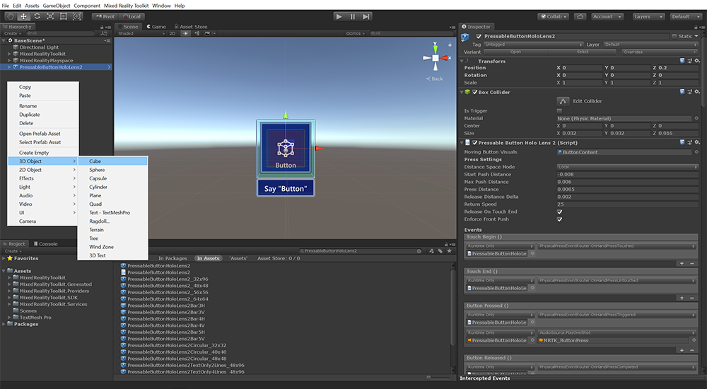

    Now, a cube should be in your display. It will appear very large. You can adjust the coordinates (while Cube is still selected in the hierarchy area) to decrease the size. Set the scale values to x = 0.02, y = 0.02 and z = 0.02. Be sure to position the cube in your scene near the button, but not overlapping with it. In the image below, the cube’s position is x = 0, y = 0.4, and z = 0.2.

    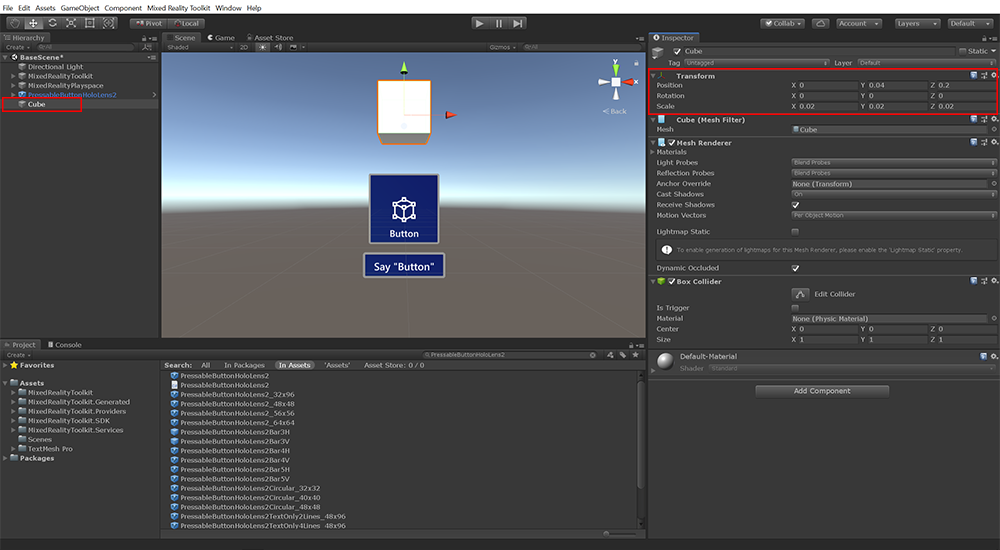

    >[!NOTE]
    >In general, 1 unit in Unity is roughly equivalent to 1 meter in the physical world. There are exceptions to this, for example when objects are children of scaled objects.

5. With the PressableButtonHoloLens2 game object selected, in the Inspector scroll towards the bottom to locate the Events section of the Interactable (Script) component.

    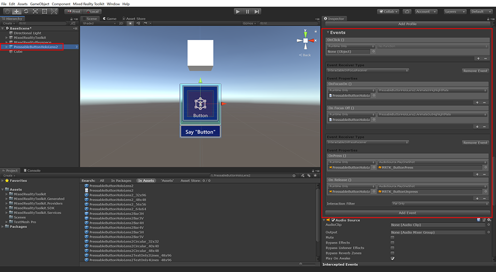

6. We will modify the existing event to give the button an event to respond to when pushed. As you can see, the Event Receiver Type is set to InteractableOnPressReceiver. This allows the button to respond to a pressed event when a tracked hand presses the button. At this point you should also change the Interaction Filter to Near and Far.

    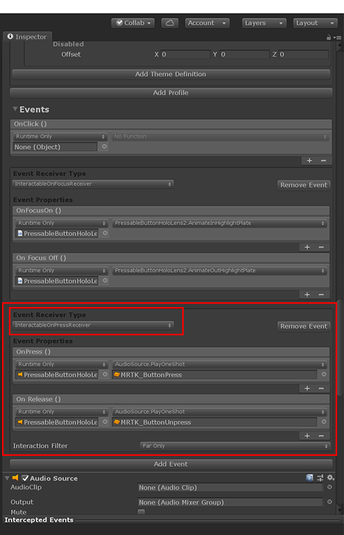

7. In this step you will set up the cube to change color when your button is pressed. Select the PressableButtonHoloLens2 in the BaseScene hierarchy and drag the Cube game object from the BaseScene hierarchy into the Runtime Only field as shown in the image below.

    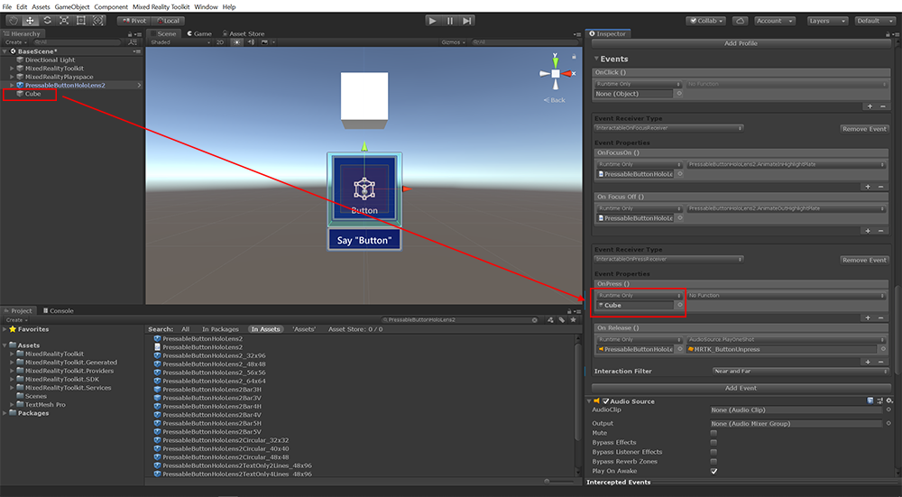

    Click the dropdown list that says No Function. Select MeshRenderer, then select Material material. This lets you change the material when the button is pressed.

    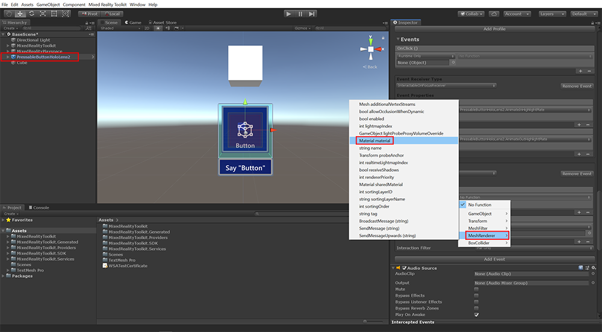

    Click the circle next to the empty material field to open the Select Material popup. The MRTK includes many materials and colors to choose from. For this example, you are going to use the material, MRTK_Standard_Cyan, found by typing in "MRTK_Standard" in the popup search bar. Select the MRTK_Standard_Cyan material to populate the material field.

    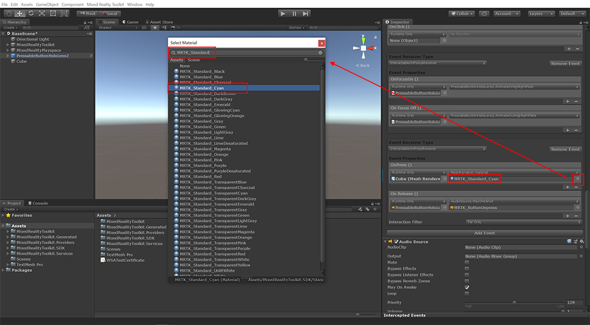

    The event is now set so that when the button is pressed, the cube will change color based on the material you specified. In this example, the cube will change to the cyan color.

8. Next you are going to set up the release action so that upon release, the button will go back to its default color. Repeat Step 7 above. But this time with the OnRelease event instead of the OnPress MRTK_Standard_LightGray material as shown in the image below.

    

    Now when the button is pressed, it will change to a new color, cyan. When the button is released it will change back to the default color you specified (e.g., light gray.) Press the Play button on the top of the screen to try it out in the editor or deploy to your HoloLens 2 to test. To learn more about in-editor simulation, including hand simulation, read the [MRTK's simulation documentation page](<https://microsoft.github.io/MixedRealityToolkit-Unity/Documentation/InputSimulation/InputSimulationService.html>).

### Creating a panel of buttons using MRTK’s Grid Object Collection

In this section, you will learn how to automatically align multiple buttons into a neat user interface by using the MRTK’s GridObjectCollection tool.

1. Duplicate the button from the previous section until you have five buttons. There are several ways to do this:
    -Right click on the button, and click Copy. Then go down to below the button and right click again, and click Paste.
    -Right click on the button and click Duplicate.
    -Use the keyboard command by clicking on the cube, and pressing Ctrl D on your keyboard.

    Repeat this until you have five buttons; see the five red arrows in image below.

    

2. Group the buttons under an empty parent game object. In order to have the buttons in the grid collection, you need to group your buttons under a common parent object. Right click in the hiearachy, and click Create Empty. This creates a new empty game object for you to put all the buttons in. It shows up as gameObject. Right click and rename it, ButtonCollection.

    

3. Move all the buttons into the new collection. Do this by selecting all five of the button objects in your heirarchy, and drag them all under ButtonCollection game object as shown in the image below. Tip: select multiple items by holding the Ctrl key while selecting items.

    

4. Add MRTK’s Grid Object Collection component to the button collection. To do this, select the ButtonCollection parent object. From the Inspector panel, click the Add Component button. Search for Grid Object Collection in the search bar, and select it when it appears in the list.

    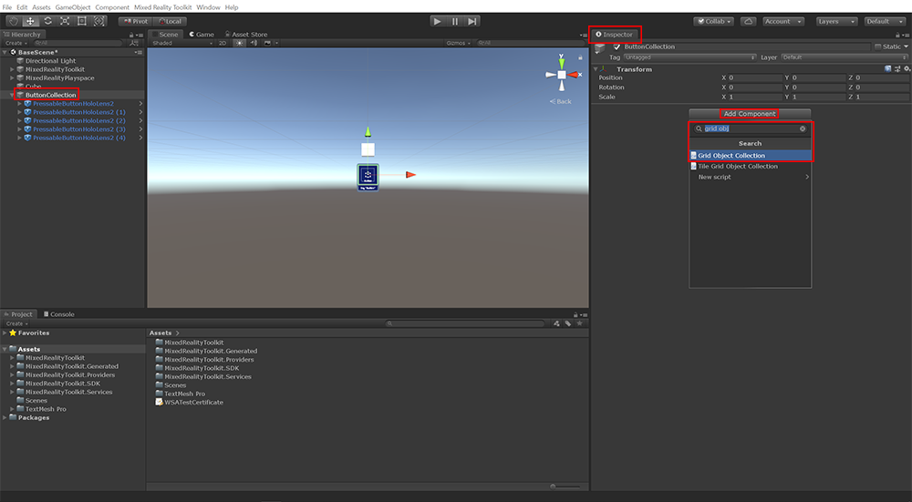

    The Grid Object Collection component lets you organize buttons or any set of objects in a neat row, column, or grid. This is one of the building blocks provided by the MRTK that gives you a quick and easy way to create enticing user interfaces.

5. Configure the grid object collection. To ensure all the buttons face the user, select Orient Type. Then select Face Parent Forward as shown in the image below. Next, change the cell size to set the space between your buttons. Start with 0.05 units by 0.05 units for the Cell Width and Cell Height as shown in the image below. Make sure Distance is set to 0 and Rows is set to 1. Click Update Collection. The scene will look similar to the picture below.

    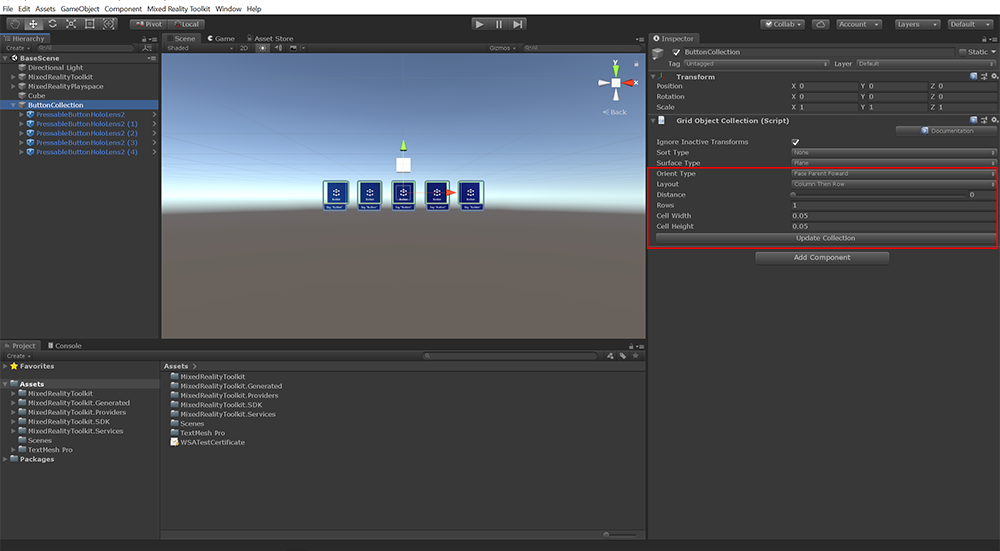

    >[!NOTE]
    >Depending on the orientation of the child objects or parent object, you will likely need to adjust the orientation setting differently in future projects. The Cell Width and the Cell Height fields may also need to be defined differently, depending on the size of the objects in your collection.

### Adding Text into Your Scene

In this section, you will learn how to add and edit text to your mixed reality experiences. If you haven’t already, please ensure you have TextMeshPro enabled in Unity by following the instructions [here](https://docs.unity3d.com/Packages/com.unity.textmeshpro@2.0/manual/index.html#installation).

1. Select the ButtonCollection parent object, and right click the collection. Expand 3D object in the dropdown menu. Then select TextMeshPro - Text. You should see a TextMeshPro object under the button collection as shown in the image below.

    
    

2. To improve the text size and placement for readability, adjust the Font Size field in the TextMeshPro component to change the size of the font. You will also need to adjust the Rect Transform position and scale as shown in the image below. See the images below for values used for our text configuration. Feel free to use these values as a starting point to further improve the size and placement of your text field.

    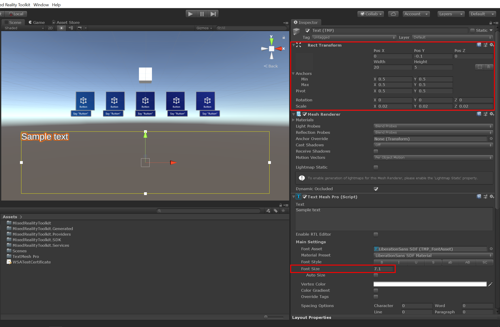

3. In the TextMeshPro component’s text field in the Inspector panel, type in "Button Collection Text" and adjust the Alignment properties to be Center and Top as shown in the image below.

    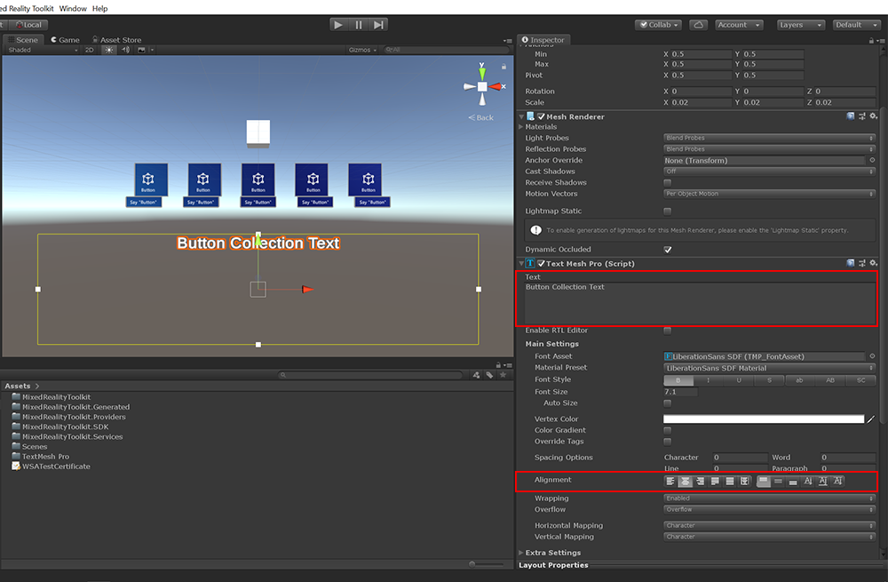

4. To modify the text values on the button objects, click the arrow next to any button to expand it and navigate to the SeeItSayItLabel object. Navigate to TextMeshPro where you can edit the text to your buttons as described in the steps above.

    

## Congratulations

In this lesson, you learned how to copy, customize, and configure an MRTK profile setting (i.e., spatial awareness mesh visibility.) You also learned how to interact with a button to trigger events using tracked hands on the HoloLens 2. Finally, you learned how to create a simple UI interface using Unity's Text Mesh Pro and the MRTK's Grid Object Collection component.

[Next Lesson: 4. Placing dynamic content and using solvers](mrlearning-base-ch3.md)
