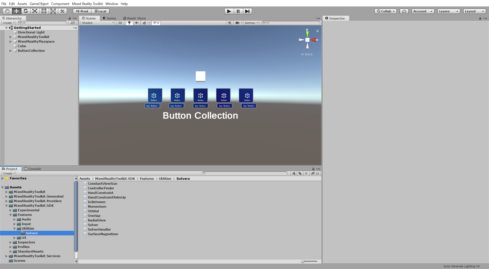
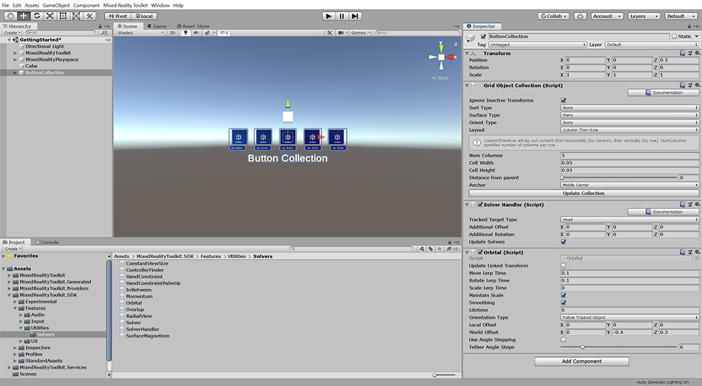
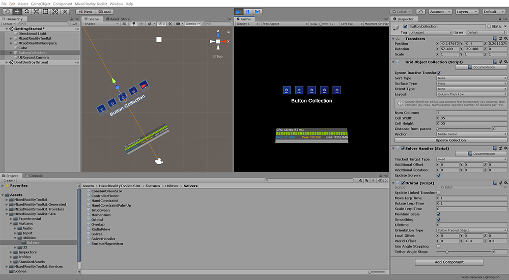
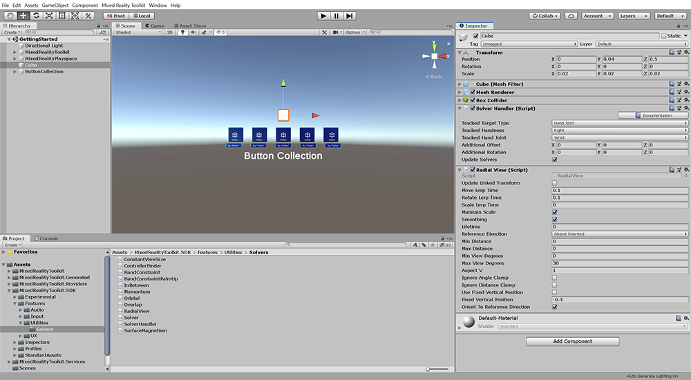
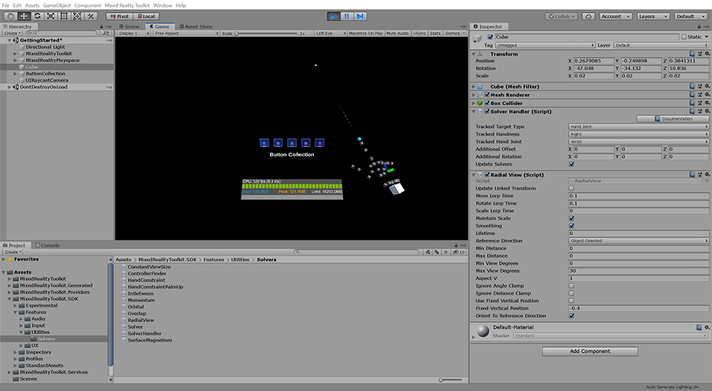

# 4. Placing dynamic content and using Solvers
<!-- Consider renaming to 'Placing dynamic content using Solvers' -->

Holograms come to life in HoloLens 2 when they intuitively follow the user and are placed in the physical environment in a way that makes interaction seamless and elegant. In this tutorial, we explore ways to dynamically place holograms using the MRTK's available placement tools, known as Solvers, to solve complex spatial placement scenarios. In the MRTK, Solvers are a system of scripts and behaviors that are used to allow UI elements to follow you, the user, or other game objects in the scene. They can also be used to snap to certain positions quickly, making your application more intuitive.

## Objectives

* Introduce the MRTK's Solvers
* Use Solvers to have a collection of buttons follow the user
* Use Solvers to have a game object follow the user's tracked hands

## Location of Solvers in the MRTK

 The MRTK's Solvers are located in the MRTK SDK folder. To see the available Solvers in your project, in the Project window, navigate to **Assets** > **MixedRealityToolkit.SDK** > **Features** > **Utilities** > **Solvers**:

In this tutorial, we will review the implementation of the Orbital Solver and the Radial View Solver. To learn more about the full range of Solvers available in the MRTK, you can visit the the [Solvers](https://microsoft.github.io/MixedRealityToolkit-Unity/Documentation/README_Solver.html) guide in the [MRTK Documentation Portal](https://microsoft.github.io/MixedRealityToolkit-Unity/README.html).

## Use a Solver to follow the user
<!-- Consider renaming to 'Use a Solver to have an object follow the user' -->

In this section, you will enhance the button collection you created in the previous tutorial so it follows the user's gaze direction. Additionally, you will also configure the Solver so the button collection is always:

* Rotated parallel to the user's reading direction, for natural left to right reading
* Positioned below the user horizontal gaze direction, so it's not obstructing the other objects you will add later in this tutorial
* Positioned approximately a half arm's-length from the user, so the buttons can easily be pressed

For this, you will use the **Orbital Solver** which locks the object to a specified position and offset from the referenced object.

### 1. Add the Orbital Solver

In the Hierarchy window, select the **ButtonCollection** object, then in the Inspector window, use the **Add Component** button to add the **Orbital (Script)** component to the ButtonCollection object.

> [!NOTE]
> When you add a Solver, in this case the Orbital (Script) component, the Solver Handler (Script) component is automatically added because it is required by the Solver.

### 2. Configure the Orbital Solver

Configure the **Solver Handler (Script)** component:

* Verify that **Tracked Target Type** is set to **Head**

Configure the **Orbital (Script)** component:

* Verify that **Orientation Type** is set to **Follow Tracked Object**
* Reset **Local Offset** to X = 0, Y = 0, Z = 0
* Change **World Offset** to X = 0, Y = -0.4, Z = 0.3

### 3. Test the Orbital Solver using the in-editor simulation

Press the Play button to enter Game mode and press and hold the right mouse button to rotate your gaze direction, and notice the following:

* The ButtonCollection's Transform Position is now driven by the Solver settings
* The Cube, which is not affected by the Solver, remains in the same position

> [!TIP]
> If you don't see the camera ray in your Scene window, make sure your Gizmos menu is enabled. To learn more about the Gizmos menu and how you can use it to optimize your scene view, you can visit Unity's <a href="https://docs.unity3d.com/Manual/GizmosMenu.html" target="_blank">Gizmos menu</a> documentation.
>
> To display your Scene and Game window side by side as shown in the image above, simply drag the Game window to the right side of the Scene window. To learn more about customizing your workspace, you can visit Unity's <a href="https://docs.unity3d.com/Manual/CustomizingYourWorkspace.html" target="_blank">Customizing Your Workspace</a> documentation.

## Enabling objects to follow tracked hands

In this section, you will configure the Cube object you created in the previous tutorial so it follows the user's tracked hands, specifically the right hand wrist. Additionally, you will also configure the Solver so the cube:

* Changes it's orientation with the user's hand rotation
* Positioned on the user's wrist

For this, you will use the **Radial View Solver** which keeps the object within a view cone cast by the referenced object.

### 1. Add the Radial View Solver

In the Hierarchy window, select the **Cube** object, then in the Inspector window, use the **Add Component** button to add the **Radial View (Script)** component Cube object.

### 2. Configure the Radial View Solver

Configure the **Solver Handler (Script)** component:

* Change **Tracked Target Type** to **Hand Joint**
* Change **Tracked Handness** to **Right**
* Change **Tracked Hand Joint** to **Wrist**

Configure the **Radial View (Script)** component:

* Change **Reference Direction** to **Object Oriented**, then check the **Orient To Reference Direction** checkbox
* Change **Min Distance** and **Max Distance** to 0

### 3. Test the Radial View Solver using the in-editor simulation

Press the Play button to enter Game mode and then press and hold the spacebar to bring up the hand. Move the mouse cursor around to move the hand, and click and hold the left mouse button to rotate the hand:

## Congratulations

In this tutorial, you learned how to use the MRTK's solvers to have a UI intuitively follow the user. You also learned how to attach a Solver to an object (i.e., cube) to follow the user's tracked hands. To learn more about these and other solvers included with the MRTK,  you can visit the [Solvers](https://microsoft.github.io/MixedRealityToolkit-Unity/Documentation/README_Solver.html) guide in the [MRTK Documentation Portal](https://microsoft.github.io/MixedRealityToolkit-Unity/README.html).

[Next Tutorial: 5. Interacting with 3D objects](mrlearning-base-ch4.md)
