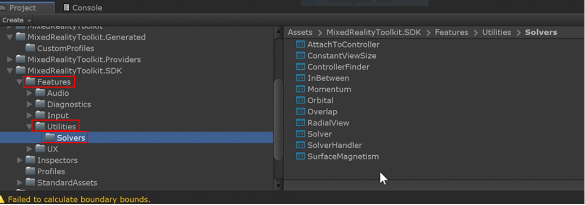
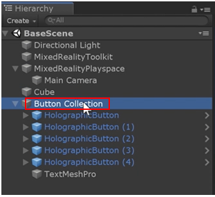
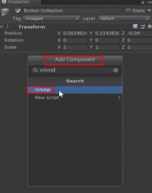
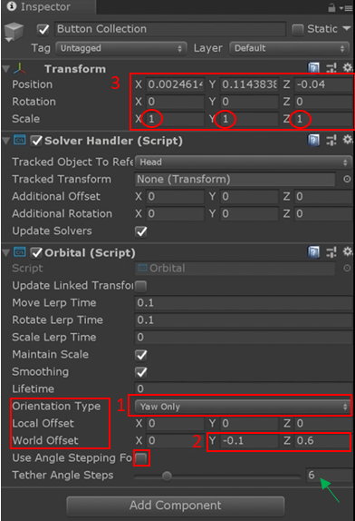
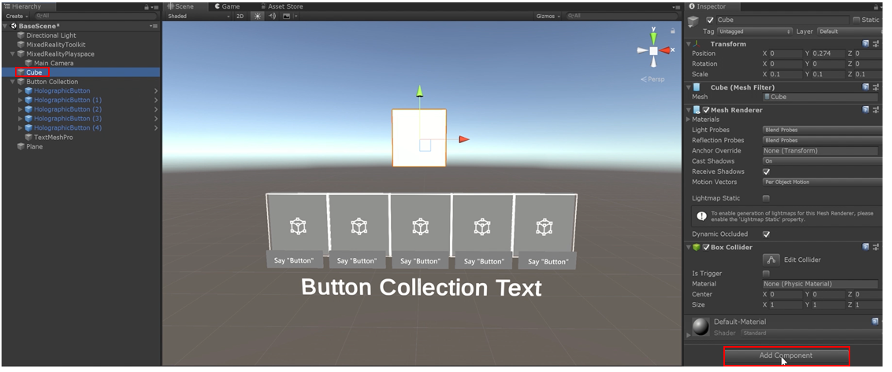
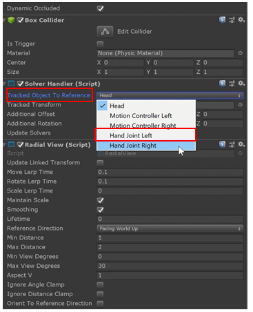
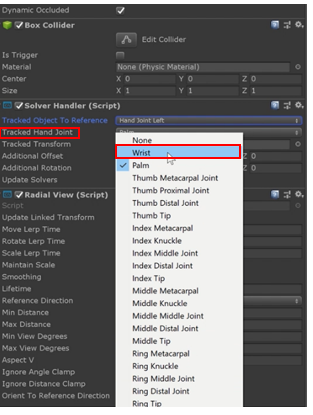
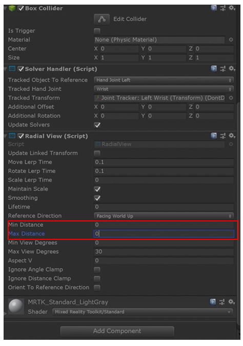

# MR Learning Base Module - Dynamic Content Placement and Solvers

Holograms come to life in the HoloLens 2 when they intuitively follow the user and are placed in the physical environment in a way that makes interaction seamless and elegant. In Lesson 3, we will explore ways to dynamically place holograms using the MRTK’s available placement tools, known as "solvers." They are known as "solvers" for the way they solve complex spatial placement algorithms. In the MRTK, solvers are a system of scripts and behaviors that we use to be able to allow UI elements to follow you, the user or other game objects in the scene. They can also be used to snap to certain positions quickly, making your application more intuitive. 

## Objectives

* Introduce the MRTK's solvers
* Use solvers to have a collection of buttons follow the user
* Use solvers to have a game object follow the user's tracked hands

## Instructions

### Location of solvers in the MRTK
 To find the available solvers in your project, look in the MRTK SDK folder (MixedRealityToolkit.SDK folder), then under the utilities folder you will see the solvers folder, as shown in the image below.

>Note: In this lesson we will only go over implementation of the "Orbital" solver and the "RadialView" solver. To learn more about the full range of solvers available in the MRTK, please visit: https://microsoft.github.io/MixedRealityToolkit-Unity/Documentation/README_Solver.html

### Use a Solver to Follow the User
The goal of this chapter is to enhance the button collection we previously created such that it follows the user’s gaze direction. In previous version of the MRTK and HoloToolkit, this was referred to as a "taglong" functionality.

1. Select the Button Collection parent object from the previous lesson.

2. In the inspector panel, click the "add component" button and search for "orbital." The orbital component should appear. Select it to add the orbital component to the Button Collection game object.

>Note: When you add the component you will notice that the system adds the orbital script and the solver handler script in the inspector tab, which is a required component. 

3. In order to configure the button collection to follow the user, we need to implement the following adjustments (please also refer to the image below):
- In the Orbital script, set the "orientation type" drop-down list to "Yaw Only." This makes it so that only one axis of the object rotates as it follows the user.
- Set the local offset to 0 on all axes. Set the World Offset to x = 0, y = -0.1 and z = 0.6. This locks movement of the object such that when the user changes height, the object will remain at a fixed height in the physical environment, while still allowing it to follow the user as the user moves about the environment. These values may be adjusted to achieve a wide range of behaviors.
- For a follow behavior whereby the buttons only follow the user’s view after the user turns his or her head sufficiently far, you could select the "Use Angle Stepping for world offset" checkbox (Note: This title may be truncated on some screens, as it is in the image below.) For example, to have the object follow the user only every 90 degrees, set the number of steps equal to 4 (marked by a green arrow in the example to the left). 

### Enabling Objects to Follow Tracked Hands

In this section, we will configure the cube game object previously created to follow the user’s tracked hands using the RadialView solver.

1. Select the cube object in the BaseScene hierarchy. Click "add component" in the inspector panel. 

2. Type in "RadialView" in the search box and select the RadialView component to add it to the cube. The solver handler component will also be automatically added to the cube.

3. Change the radial view to not follow the head but follow the left hand. Select the dropdown menu next to the "tracked object to reference" option. Then select "hand joint left" from the menu.

4. Once you select the hand joint, you can choose which part of the hand you want the cube to follow. For this example, we are going to use the wrist. Next to the option "tracked hand joint" select the dropdown menu and select wrist. 

5. Set the maximum and minimum distances to 0 so that the cube will not have any distance between it and the user’s wrist. Once set, the cube will be perfectly aligned with the wrist. You may also adjust the "Reference Direction" field to adjust the behavior of how the cube is oriented (e.g., if you would like to allow the object to rotate with the user's wrist, set the reference direction to "Orient with Tracked Object")

### Congratulations
Congratulations! In this lesson, you learned how to use the MRTK’s solvers to have a UI intuitively follow the user. You also learned how to attach a solver to a game object (i.e., cube) to follow the user’s tracked hands. To learn more about these and other solvers included with the MRTK, feel free to visit the [MRTK solvers documentation page](https://microsoft.github.io/MixedRealityToolkit-Unity/Documentation/README_Solver.html).

[Next Lesson: 3D Object Interaction](mrlearning-base-ch4.md)

