# MR Learning Base Module - 3D Object Interaction

In this lesson, we will go through basic 3D content and user experience. We will learn about: 
* Organizing 3D objects as part of a collection.
* Bounding boxes for basic manipulation.
* Near and far interaction.
* Touch and grab gestures with hand tracking. 

## Objectives

* Learn how to organize 3D content using MRTK's Grid Object Collection
* Implement bounding boxes
* Configure 3D objects for basic manipulation--move, rotate, and scale
* Explore near and far interaction
* Learn about additional hand tracking gestures, such as grab and touch

## Instructions

### Organizing 3D Objects in a Collection

1. Right click on your hierarchy and select, Create Empty. This creates an empty game object. Rename it to 3DObjectCollection. This is where we will put all of our 3D Objects. Make sure the collection’s positioning is set at x = 0, y = 0, and z = 0.

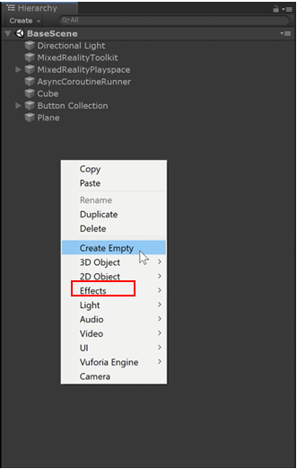

2. Import BaseModule Assets Using the same instructions to import custom packages outlined in [Lesson1](mrlearning-base-ch1.md). The BaseModule assets include 3D modules and other useful scripts that are used throughout this tutorial. The BaseModule Unity package can be found here: <https://github.com/Microsoft/MixedRealityLearning/releases/tag/V1.1>

3. The coffee cup prefab can be recognized by a blue cube next to it. Do not select the coffee cup with the blue cube and small white paper because this denotes the original 3D model and not the prefab.) 

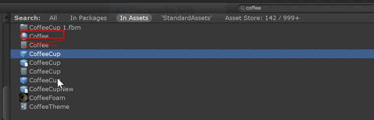

4. Drag the coffee cup prefab of your choice into the 3DObjectCollection game object from Step 1. The coffee cup is now a child of the collection.

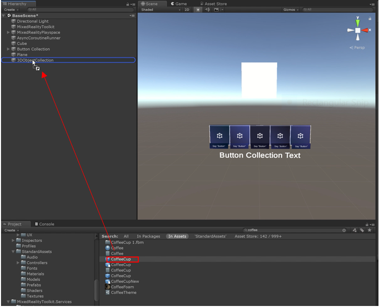

5. Next, we'll add more 3D objects into our scene. Below is a list of objects we are going to add in this example. As you add the objects you might find that they appear in your scene in various sizes. Adjust the scale of each 3D model under Transform 
Setting in the Inspector panel. Recommended adjustments for this example are listed with the objects below. 
Search these words in the search box in your project panel and drag the 3D object prefab into the 3DObjectCollection object similar to the previous step. You will find these collections of prefabs in Assets>BaseModuleAssets>Base Module Prefabs
- Search for TheModule_BaseModuleIncomplete. Drag into scene. Set the scale to x = 0.03, y = 0.03, z = 0.03. 
- Search for Octa_BaseModuleIncomplete. Drag into scene. Set the scale to x = 0.13. y = 0.13, z =0.13.
- Search for EarthCore_BaseModuleIncomplete. Drag into scene. Set the scale to x = 50.0 y = 50.0, z = 50.0.
- Search for Cheese_BaseModuleIncomplete. Drag into scene. Set the scale to x = 0.05, y = 0.05, z = 0.05.
- Search for Model_Platonic_BaseModuleIncomplete. Drag into scene. Set the scale to x = 0.13, y = 0.13, z = 0.13.
- Search for CoffeeCup_BaseModuleIncomplete. Drag into scene.

6. Add three cubes into your scene. Right click the 3DObjectCollection object, select 3D Object, then select Cube. Set the scale to x = 0.14, y = 0.14, and z = 0.14. Repeat this step two additional times to create a total of three cubes. Alternatively, you can duplicate the cube twice for a total of three cubes. You may also choose to use the three prepared cube prefabs from Assets>BaseModuleAssets>Base Module Prefabs and select GreenCube_BaseModuleIncomplete, BlueCube_BaseModuleIncomplete and OrangeCube_BaseModuleIncomplete.

7. Organize your collection of objects to form a grid using the procedure described in [Lesson 2](mrlearning-base-ch2.md) using the MRTK’s Grid Object Collection. Refer to the image below to see an example of configuring the objects in a 3x3 grid.

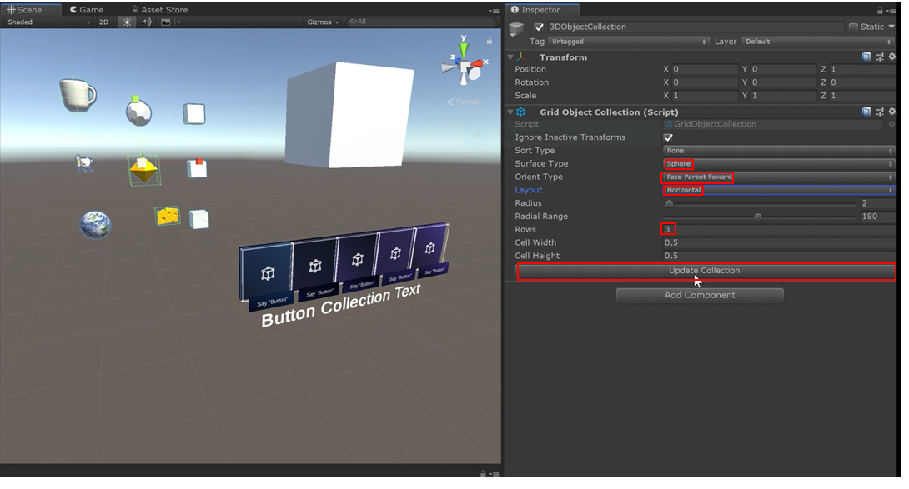

>Note: You might notice that some of the objects are off-center, such as the objects in the image above. This is because prefabs or objects may have child objects that are not aligned. Feel free to make any necessary adjustments to object positions or child object positions to achieve a well-aligned grid.

### Manipulating 3D Objects
1. Add the ability to manipulate a cube. To add the ability to manipulate 3D objects, do the following:
-	Select the 3D object you want to manipulate in your hierarchy, i.e., one of your cubes.
-	Click Add Component. 
-	Search for manipulation.
-	Select Manipulation Handler.
-   Repeat for all 3D objects under the 3DObjectCollection object but not the 3DObjectCollection itself.
-   Ensure all 3D objects have a collider or box collider (Add Component>Box Cllider).

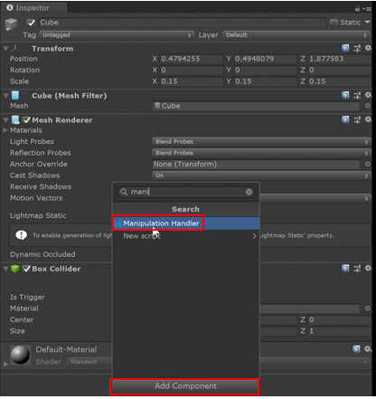

>The manipulation handler is a component that lets you adjust settings for how objects behave when  manipulated. This includes rotation, scaling, moving, and constraining movement on a specific axis. 

2. Restrict one cube so that it can only be scaled. Select one cube in the 3DObjectCollection object. In the Inspector panel, next to Two Handed Manipulation Type, click the drop-down menu and select Sscale. This makes it so that the user can only change the cube’s size.

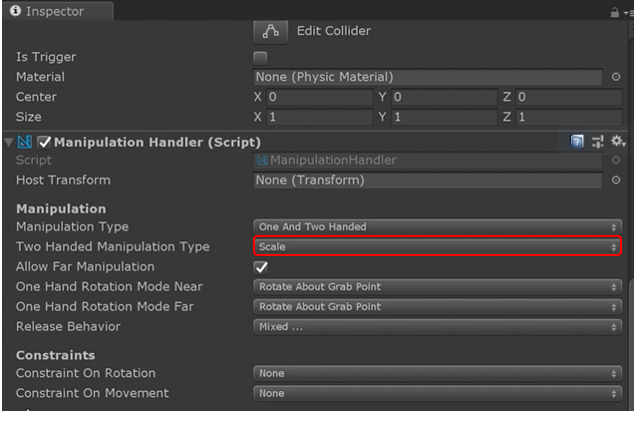

3. Change the color of each cube so that we can differentiate between them. 
-	Go to the Project panel and scroll down until you see MixedRealityToolkit.SDK then select it.
-	Select the Standard Assets folder.
-	Click on the Materials folder.
-	Drag a different material onto each of your cubes. 

>Note: You can choose any color for your cubes. For our example, we are going to use glowingcyan, glowingorange, and green. Feel free to experiment with different colors. To add the color to the cube, click the cube you want to change, then drag the material to the mesh renderer's material field in the cube's Inspector panel. 

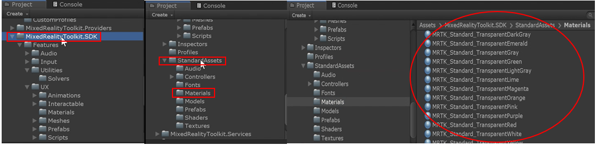

4. Select another cube in the 3DObjectCollection object and make it so that its movement is constrained to the fixed distance from the head. To do this, on the right of Constraint on Movement, click on the drop-down menu and select Fix Distance from the Head. This makes it so that the user can only move the cube within their field of vision. 

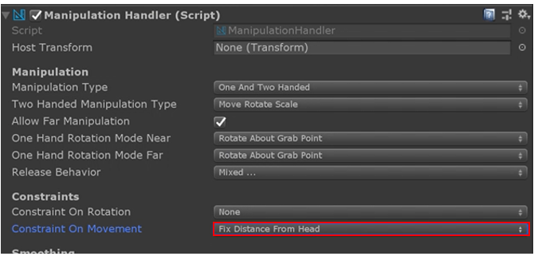

Goal of the next few steps: We will enable grab and interaction with our 3D objects, and apply different manipulation settings.

5. Select the Cheese object, and click Add Component from Inspector panel. 

6. Search in the search box for Near Interaction Grabbable, and select the script. This component allows users to reach out and grab the objects with tracked hands. Objects can also be allowed to be manipulated from a distance, unless the Allow Far Manipulation checkbox is unchecked denoted by green circle in image below.

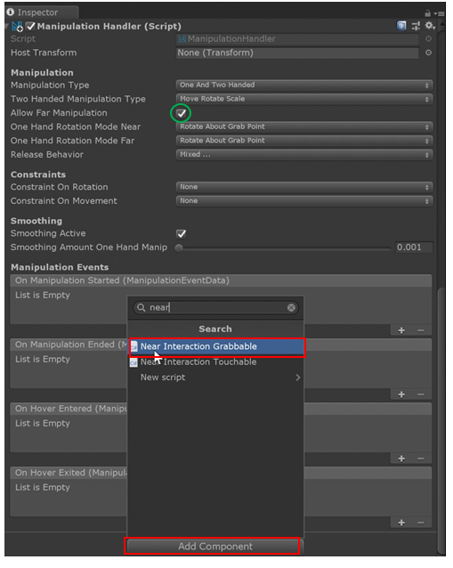

7. Add Near Interaction Grabbable to the Octa object, Platonic object, Earth Core, Lunar Module, and Coffee Cup by repeating Steps 5 and 6 on those objects.

8. Remove the ability of far manipulation from the Octa object. To do this, select the Octa in the hierarchy, and uncheck the Allow far Manipulation checkbox (marked by a green circle). This makes it so that users can only interact with the octa directly using tracked hands.

>Note: For the full documentation of the manipulation handler component and it's associated settings, please refer to the [MRTK Documentation](https://microsoft.github.io/MixedRealityToolkit-Unity/Documentation/README_ManipulationHandler.html).

9. Ensure that the Near Interaction Grabbable component has been added to the earth core, the lunar module and the coffee cup (see Step 7).

10. For the lunar module, change the Manipulation Handler settings so that it rotates about the object's center for both near and far interaction as shown in the image below.

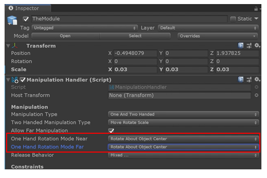

11: For the earth core, change the release behavior to nothing. This makes it so that once the earth core is released from the users’ grasp, it doesn’t continue to move. 

> Note: This setting is useful for scenarios such as creating a ball that you can throw. Keeping the velocity and the angular velocity makes it so that once the ball is released, it will continue to move at the velocity it was released at, similar to how a physical ball would behave.

### Adding Bounding Boxes
Bounding boxes make it easier and more intuitive to manipulate objects with one hand for both direct manipulation (near interaction) and ray-based manipulation (far interaction.) Bounding boxes provide handles that can be grabbed for scaling and rotating objects along a specific axis.
>Note: Before you can add a bounding box to an object, you first need to have a collider on the object (e.g., a box collider), as we did previously in this lesson. Colliders can be added by selecting the object, and in the object's inspector panel selecting Add Component>Box Collider.
>

1. Add a box collider to the Earth Core object if one does not already exist. Box Collider and setup are not required if using the prefab provided in the Base Module Assets folder per the instructions given.) In the case of the earth core, we will need to add the box collider to the, node_id30, object underneath the earth core, as shown in the image below. Select node_id30 from the object's Inspector tab, click Add Component, and search for box collider. 

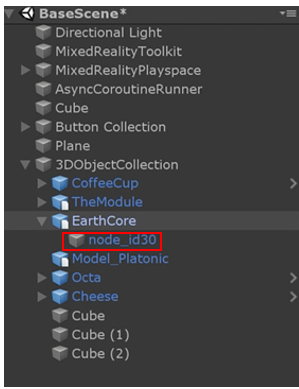

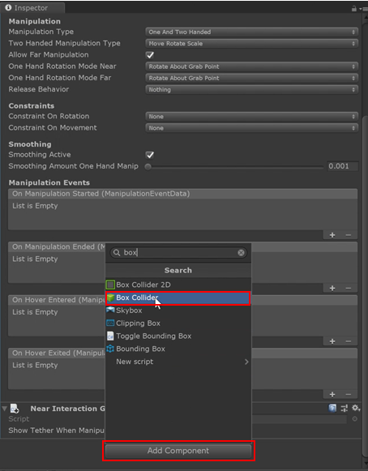

> Note: Make sure that you visualize the box collider so that it’s not too big or too small. It should be roughly the same size as the object it’s surrounding (in this example, the earth core). Adjust the box collider as needed by selecting the Edit Collider option in the box collider. You can either changing the x, y, and z values or drag the bounding box handlers in the Editor Scene window. 

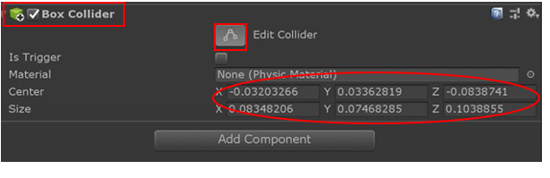

2. Add a bounding box to the earth core's node_id30 object. To do this, select the node_id30 object from the 3DObjectCollection. In the inspector tab, click Add Component, and search for bounding box. Ensure that the bounding box, box collider, and manipulation scripts (manipulation handler, near interaction grabbable) are all on the same game object.

3.  In the bounding box's Behavior section, select Activate on Start from the Activation drop-down list. To review additional details regarding the various activation options and other bounding box options, please see the [MRTK's bounding box documentation](<https://microsoft.github.io/MixedRealityToolkit-Unity/Documentation/README_BoundingBox.html>)

   

   *In the next few steps, we will also change how the bounding box looks by adjusting the default box material, the material while it’s being grabbed as well as the visualization of handles (corner and side handles). The MRTK contains several options to customize the bounding box.*

4. In the Project panel, search for boundingbox, and you’ll see a list of materials denoted by a blue sphere in the search results as shown in the image below. 

5. Drag the boundingbox material into the box material slot on the bounding box component. Also grab the boundingboxgrabbed material, and put that in the box grabbed material slot on the bounding box component.

6. Drag the MRTK_BoundingBox_ScaleWidget material into the scale handle prefab slot on the bounding box component. 

7. Drag the MRTK_BoundingBox_RotateWidget material into the rotation handle slot on the bonding box component.

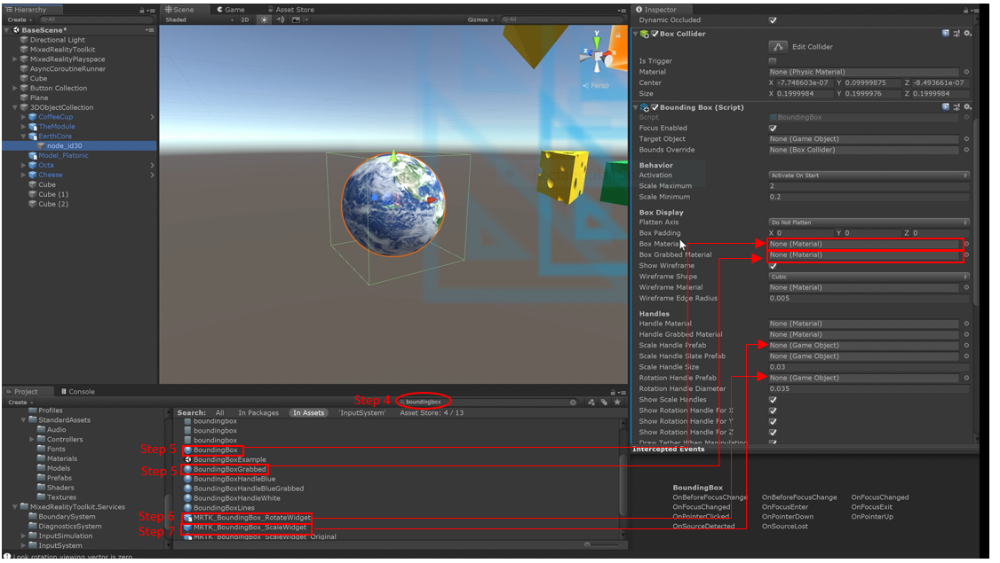

8. Make sure the bounding box is targeting the right object. In the bounding box component, there is the target object and bounds override scripts. Make sure to drag the object that has the bounding box around it to both of these slots. In this example, drag the node_id30 object to both these slots as shown in the image below.

> When you start or play the application, your object will be surrounded by a blue frame. You’re welcome to drag the corners of that frame to resize the object. If we want the scaling handles and the rotation handles to be larger and more visible, we recommend using the default bounding box settings (avoiding Steps 4 -through 7.) 

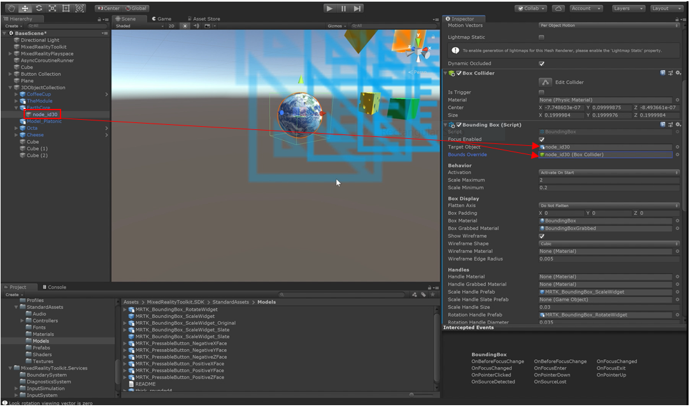

9. To return to the default bounding box visualization, in the Inspector panel of the bounding box's object, select the rotation handle prefab and press Delete. You will see a bounding box visualization similar to the image below. Note: the bounding box visualizations only appears when in play mode.

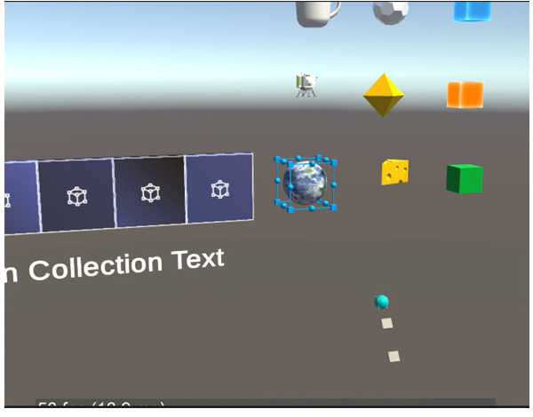

### Adding Touch Effects
In this example, we are going to play a sound effect when you touch an object with your hand.

1. Add an audio source component to your game object. Select the Octa object in your scene hierarchy. In the inspector panel, click the Add Component button, search for and select audio source. We’ll use this audio source to play a sound effect in a later step. 

>Note: Ensure that the Octa object has a box collider on it.

2. Add the Near Interaction Touchable” component. Click the Add Component button in the Inspector panel, and search for near interaction touchable. Select it to add the component. NOTE: Fix screenshot to highlight that we're adding the component, and not just highlighting the box collider.

>Note: Previously, we added near interaction grabbable. The difference between this and near interaction touchable is that the grabbable interaction is intended for an object to be grabbed and interacted with. The touchable component is intended for the object to be touched. Both components can be used together for a combination of interactions.

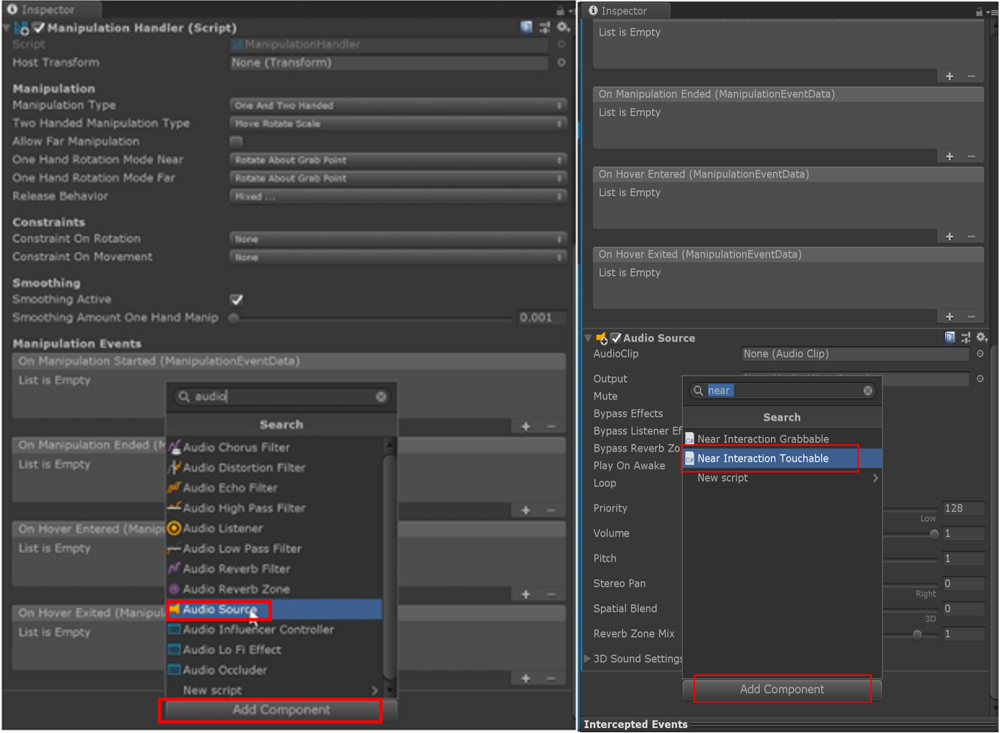

3. Add in the Hand Interaction Touch script. Note that this script is included with the Unity scene you imported as part of this demo , and it is not included in the oriTinal MRTK. Just like the previous step, click Add Component, and search for hand interaction touch to add it. 
   Notice that you have three options with the script: 

   - On touch completed. This will trigger when you touch and release the object. 
   - On touch started. This will trigger when the object is touched. 
   - On touch updated. This will periodically trigger while your hand is touching the object. 

   For this example, we will be working with the On Touch Started setting.

4. Click the + button on the On Touch Started option as shown in the image below. Drag the Octa object into the empty field. 

5. In the drop-down that says No Function (above green rectangle in the image below), select AudioSource>PlayOneShot. We will add an audio clip to this field using the concepts below:

   - The MRTK does provide a small list of audio clips. Feel free to explore these in your project panel. You will find them under the MixedRealityToolkit.SDK folder and then the Sstandard Assets folder. There you will see an Audio folder where all the audio clips are.
   - For this example, we are going to use the MRTK_Gem audio clip. 
   - To add an audio clip, simply drag the clip you want from the project panel into the AudioSource.PlayOneShot (marked by green box in the example above) in the inspector panel.

   Now when the user reaches out and touches the Octa object, the audio track“MRTK_Gem will play. The Hand Interaction Touch script will also adjust the color of the object when touched. 

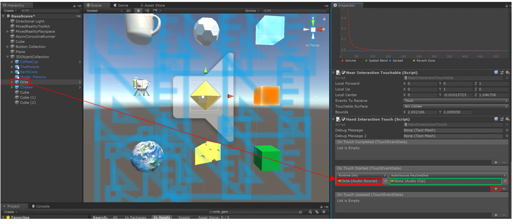

### Congratulations 
In this lesson, you learned how to organize 3D objects in a grid collection and how to manipulate 3D objects  (scaling, rotating, and moving) using near interaction (directly grabbing with tracked hands) and far interaction (using gaze rays or hand rays.) You also learned how to put bounding boxes around 3D objects, and learned how to use and customize the gizmos on the bounding boxes. Finally, you learned how to trigger events when touching an object.

[Next Lesson: Advanced Input](mrlearning-base-ch5.md)

