# 5. Interacting with 3D objects

In this tutorial, you will learn about basic 3D content and user experience, such as organizing 3D objects as part of a collection, bounding boxes for basic manipulation, near and far interaction, and touch and grab gestures with hand tracking.

## Objectives

* Create a panel of 3D objects which will be used for the other learning objectives
* Implement bounding boxes
* Configure 3D objects for basic manipulation such as move, rotate, and scale
* Explore near and far interaction
* Learn about additional hand tracking gestures, such as grab and touch

## Importing the tutorial assets

Download and import the Unity custom package:

* [MRTK.HoloLens2.Unity.Tutorials.Assets.GettingStarted.2.3.0.2.unitypackage](https://github.com/microsoft/MixedRealityLearning/releases/download/getting-started-v2.3.0.2/MRTK.HoloLens2.Unity.Tutorials.Assets.GettingStarted.2.3.0.2.unitypackage)

After you have imported the tutorial assets your Project window should look similar to this:

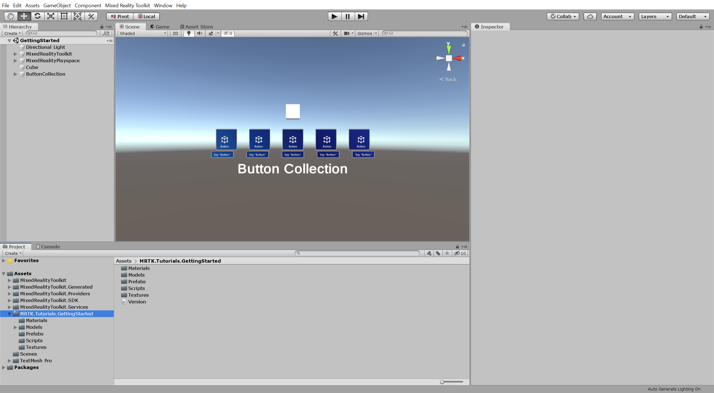

> [!TIP]
> For a reminder on how to import a Unity custom package, you can refer to the [Import the Mixed Reality Toolkit](mrlearning-base-ch1.md#import-the-mixed-reality-toolkit) instructions.

## Decluttering the scene view

To make it easier to work with your scene, set the **scene visibility** for the **Cube** and **ButtonCollection** objects to off by clicking the **eye** icon to the left of the objects. This hides the object in the Scene window without changing their in-game visibility:

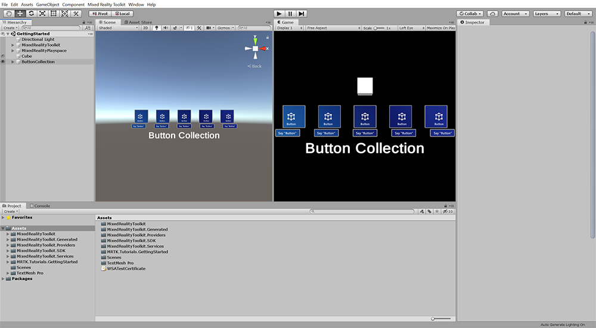

> [!TIP]
> To learn more about the Scene Visibility controls and how you can use them to optimize your scene view and workflow, you can visit Unity's <a href="https://docs.unity3d.com/Manual/SceneVisibility.html" target="_blank">Scene Visibility</a> documentation.

## Organizing 3D objects in a collection

In this section, you will create a panel of 3D objects which you will use when exploring various ways of interacting with 3D objects in the following sections of this tutorial. Specifically, you will configure the 3D objects to be positioned on a 3 x 3 grid.

Similarly to when you [created a panel of buttons](mrlearning-base-ch2.md#creating-a-panel-of-buttons-using-mrtks-grid-object-collection), the main steps you will take to achieve this are:

1. Parent the 3D objects to a parent object
2. Add and configure the Grid Object Collection (Script) component

### 1. Parent the 3D objects to a parent object

In the Hierarchy window, **create an empty object**, give it a suitable name, for example, **3DObjectCollection**, and position it in a suitable location, for example, X = 0, Y = -0.2, Z = 2.

In the Project window, navigate to **Assets** > **MRTK.Tutorials.GettingStarted** > **Prefabs**, then **parent** the following prefabs to the **3DObjectCollection**:

* Cheese
* CoffeeCup
* EarthCore
* Octa
* Platonic
* TheModule

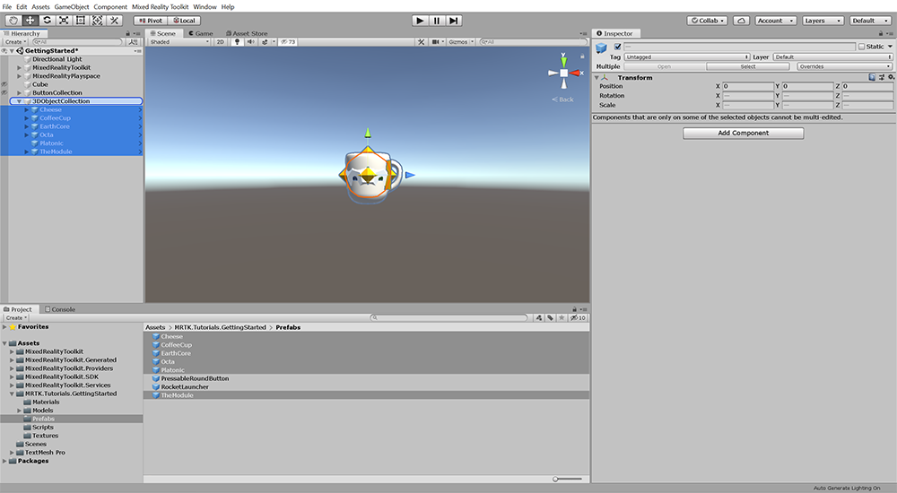

In the Hierarchy window, **create three cubes** as a child objects of the **3DObjectCollection** and set their Transform **Scale** to X = 0.15, Y = 0.15, Z = 0.15:

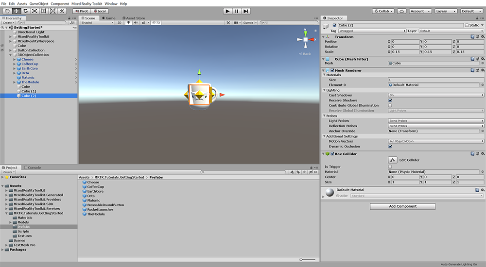

> [!TIP]
> For a reminder on how to do the steps listed above, you can refer to the [Creating user interface and configure Mixed Reality Toolkit](mrlearning-base-ch2.md) tutorial.

Reposition the cubes so you can see each cube:

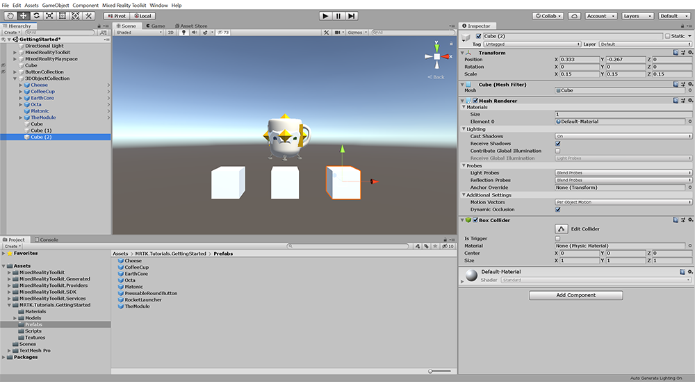

In the Project window, navigate to **Assets** > **MixedRealityToolkit.SDK** > **StandardAssets** > **Materials** to see materials provided with the MRTK.

**Click-and-drag** a suitable material on to each cube's Mesh Renderer **Materials** Element 0 property, for example:

* MRTK_Standard_GlowingCyan
* MRTK_Standard_GlowingOrange
* MRTK_Standard_Green

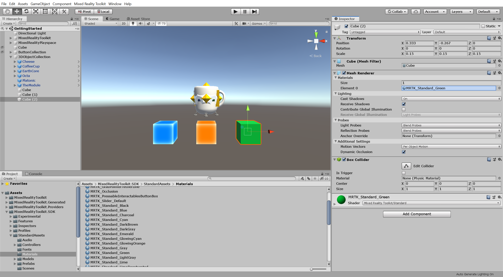

### 2. Add and configure the Grid Object Collection (Script) component

Add a **Grid Object Collection (Script)** component to the **3DObjectCollection** object, and configure it as follows:

* Change **Sort Type** to **Child Order** to ensure the child objects are sorted in the order you have placed them under the parent object

Then click the **Update Collection** button to apply the new configuration:

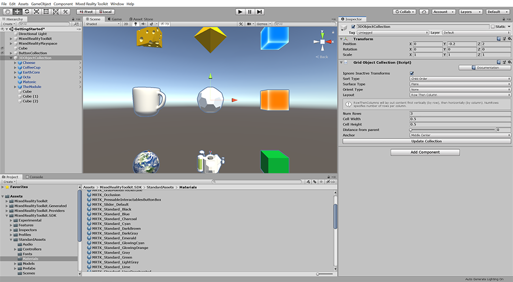

## Manipulating 3D objects

In this section, you will add the ability to manipulate all the 3D objects in the panel you created in the previous section. Additionally, for the prefab objects, you will enable users to reach out and grab these objects with tracked hands. Then you will explore a few manipulation behaviors that you can apply to your objects.

The main steps you will take to achieve this are:

1. Add the Manipulation Handler (Script) component to all the objects
2. Add the Near Interaction Grabbable (Script) component to the prefab objects
3. Configure the Manipulation Handler (Script) component

> [!IMPORTANT]
> To be able to **manipulate an object**, the object must have the following components:
>
> * **Collider** component, for example, a Box Collider
> * **Manipulation Handler (Script)** component
>
> To be able to **manipulate** and **grab an object with tracked hands**, the object must have the following components:
>
> * **Collider** component, for example, a Box Collider
> * **Manipulation Handler (Script)** component
> * **Near Interaction Grabbable (Script)** component

### 1. Add the Manipulation Handler (Script) component to all the objects

In the Hierarchy window, select the **Cheese** object, hold down the **Shift** key, and then select the **Cube () 2** object and add the **Manipulation Handler (Script)** component to all the objects:

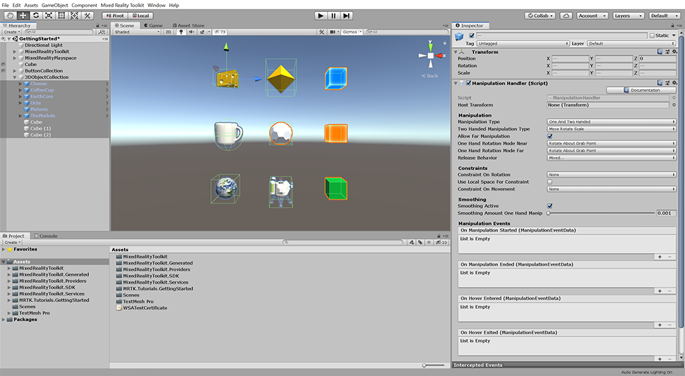

> [!NOTE]
> For the purpose of this tutorial, colliders have already been added to the prefabs. For Unity primitives, such as the Cube objects, the Collider component is automatically added when the object is created. In the image above, the colliders are represented by the green outlines. To learn more about colliders, you can visit Unity's <a href="https://docs.unity3d.com/Manual/CollidersOverview.html" target="_blank">Collider</a> documentation.

### 2. Add the Near Interaction Grabbable (Script) component to the prefab objects

In the Hierarchy window, select the **Cheese** object, hold down the **Shift** key, and then select the **TheModule** object and add the **Near Interaction Grabbable (Script)** component to all the objects:

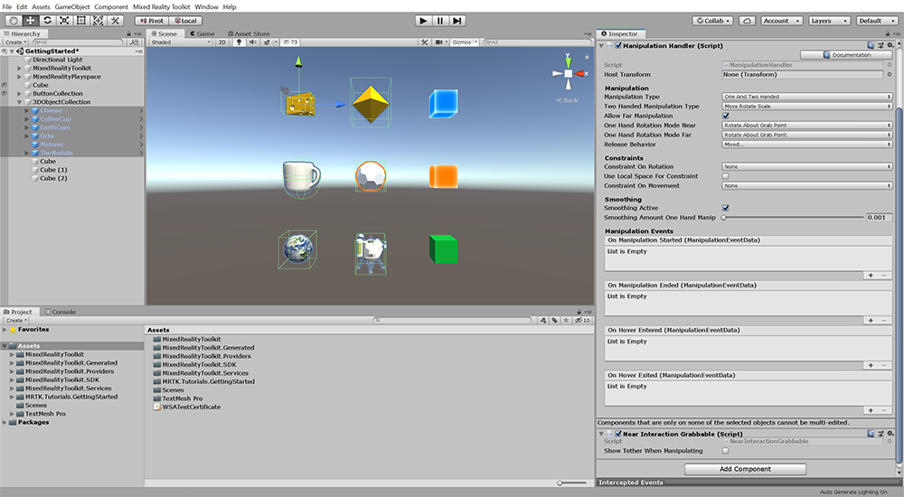

### 3. Configure the Manipulation Handler (Script) component

#### Default manipulation

For the **Cube** object, leave all properties at default, to experience the default manipulation behavior:

> [!TIP]
> To reset a component to its default values, you can select the component's Settings icon and select Reset.

#### Restrict manipulation to scale only

For the **Cube (1)** object, change **Two Handed Manipulation Type** to **Scale** to only allow the user to change the object's size:

#### Constrain the movement to a fixed distance from the user

For the **Cube (2)** object, change **Constraint On Movement** to **Fix Distance From Head** so that when the object is moved, it stays at the same distance from the user:

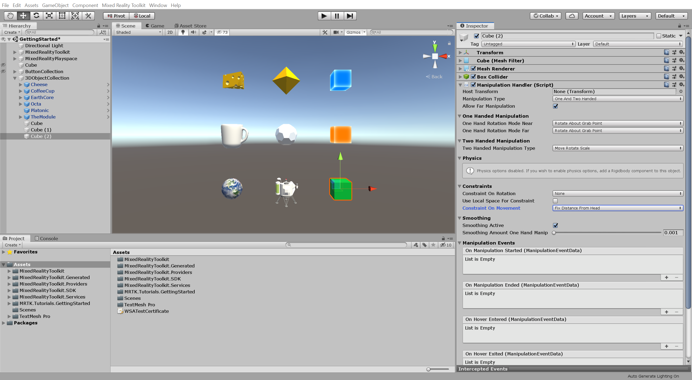

#### Default grabbable manipulation

For the **Cheese**, **CoffeCup**, and **EarthCore** objects, leave all properties at default, to experience the default grabbable manipulation behavior:

#### Remove the ability of far manipulation

For the **Octa** object, un-check the **Allow Far Manipulation** checkbox to make it so the user can only interact with the object directly using tracked hands:

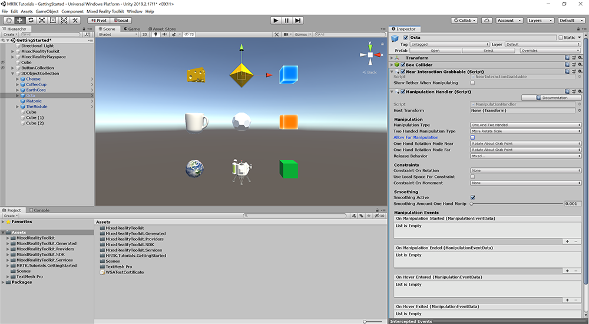

#### Make an object rotate around its center

For the **Platonic** object, change **One Hand Rotation Mode Near** and **One Hand Rotation Mode Far** to **Rotate About Object Center** to make it so when the user rotates the object with one hand, it rotates around the object's center:

#### Keep movement after object is released

For the **TheModule** object, add a **Rigidbody** component to enable physics, and then un-check the **Use Gravity** checkbox so the object is not affected by gravity:

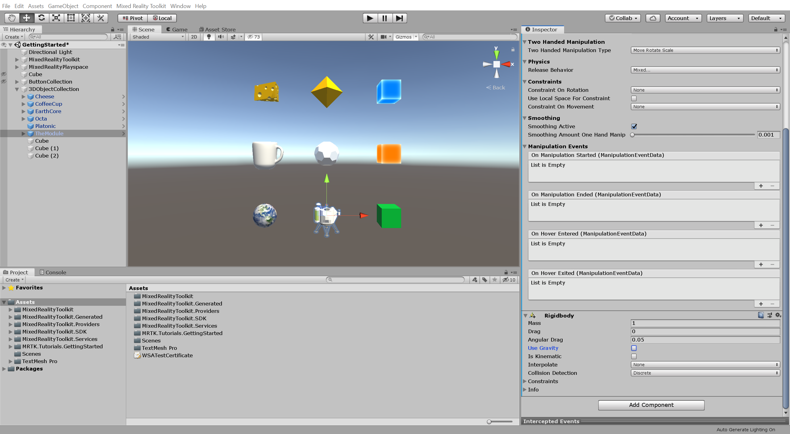

Back on the Manipulation Handler (Script) component, verify that the **Release Behavior** is set to both **Keep Velocity** and **Keep Angular Velocity** so that once the object is released from the user's hand, it continues to move:

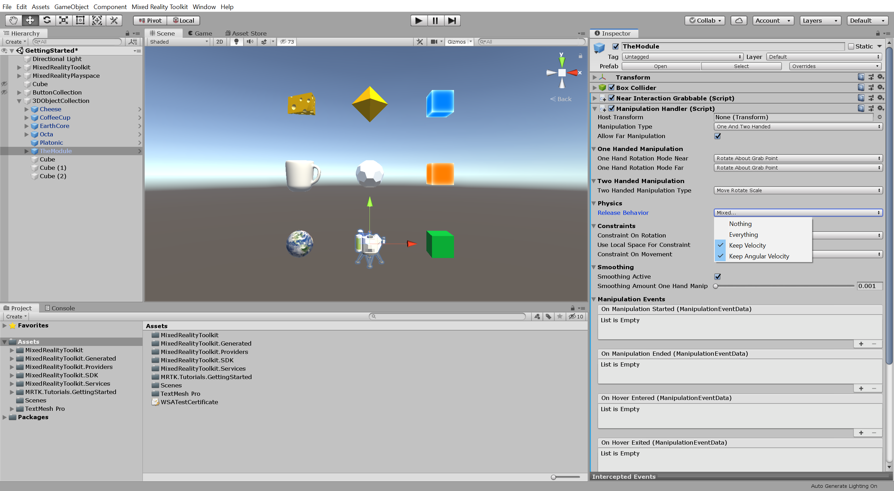

To learn more about the Manipulation handler component and its associated properties, you can visit the [Manipulation handler](https://microsoft.github.io/MixedRealityToolkit-Unity/Documentation/README_ManipulationHandler.html) guide in the [MRTK Documentation Portal](https://microsoft.github.io/MixedRealityToolkit-Unity/README.html).

## Adding bounding boxes

Bounding boxes make it easier and more intuitive to manipulate objects with one hand for both near and far interaction by providing handles that can be used for scaling and rotating.

In this example, you will add a bounding box to the EarthCore object so this object can now be interacted with using the object manipulation you configured in the previous section, as well as, scaled and rotated using the bounding box handles.

> [!IMPORTANT]
> To be able to use a **bounding box**, the object must have the following components:
>
> * **Collider** component, for example, a Box Collider
> * **Bounding Box (Script)** component

### 1. Add the Bounding Box (Script) component to the EarthCore object

In the Inspector window, select the **EarthCore** object and add the **Bounding Box (Script)** component to the EarthCore object:

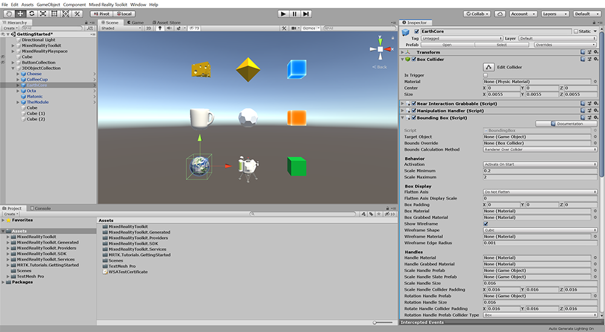

> [!NOTE]
> The Bounding Box visualizations is created at run time and therefore not visible before you enter Game mode.

### 2. Visualize and test the bounding box using the in-editor simulation

Press the Play button to enter Game mode. Then press and hold the spacebar to bring up the hand and use the mouse to interact with the bounding box:

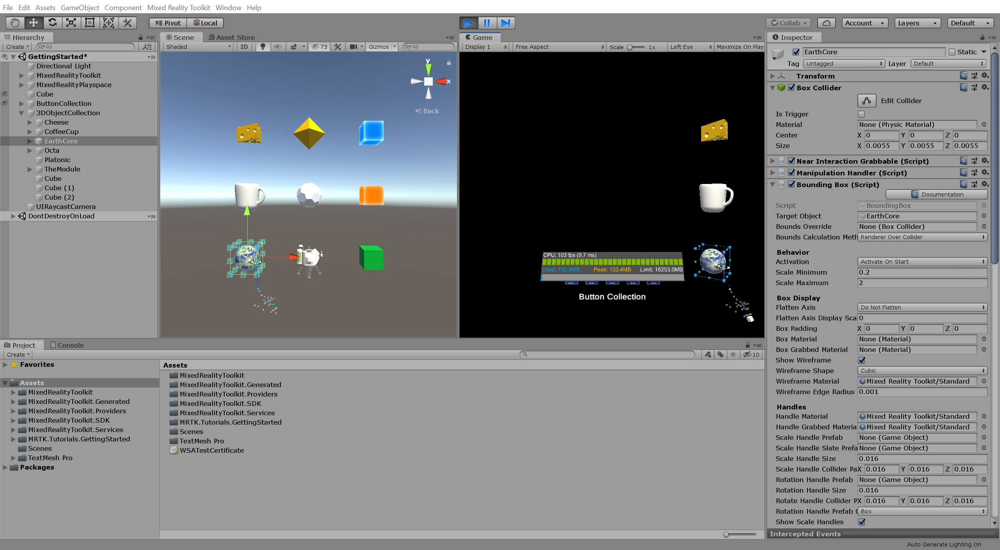

To learn more about the Bounding Box component and its associated properties, you can visit the [Bounding box](https://microsoft.github.io/MixedRealityToolkit-Unity/Documentation/README_BoundingBox.html) guide in the [MRTK Documentation Portal](https://microsoft.github.io/MixedRealityToolkit-Unity/README.html).

## Adding touch effects

In this example, you will enable events to be triggered when you touch an object with your hand. Specifically, you will configure the Octa object to play a sound effect when the user touches it.

The main steps you will take to achieve this are:

1. Add an Audio Source component to the object
2. Add the Near Interaction Touchable (Script) component to the object
3. Add the Hand Interaction Touch (Script) component to the object
4. Implement the On Touch Started event
5. Test the touch interaction using the in-editor simulation

> [!IMPORTANT]
> To be able to **trigger touch events**, the object must have the following components:
>
> * **Collider** component, preferably a Box Collider
> * **Near Interaction Touchable (Script)** component
> * **Hand Interaction Touch (Script)** component

> [!NOTE]
> The Hand Interaction Touch (Script) component is not part of MRTK. It was imported with this tutorial's assets and originally part of the MixedReality Toolkit Unity Examples.

### 1. Add an Audio Source component to the object

In the Hierarchy window, select the **Octa** object, add an **Audio Source** component to the Octa object, and then change **Spatial Blend** to 1 to enable spatial audio:

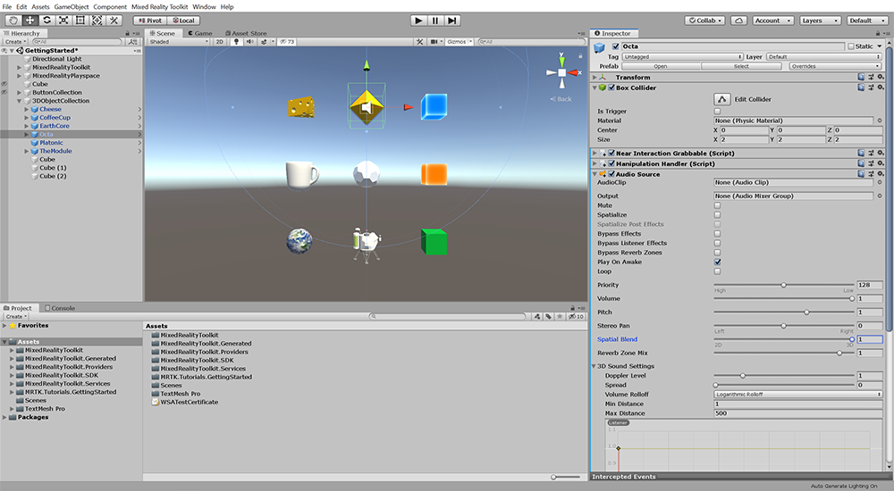

### 2. Add the Near Interaction Touchable (Script) component to the object

With the **Octa** object still selected, add the **Near Interaction Touchable (Script)** component to the Octa object, and then click the **Fix Bounds** and **Fix Center** buttons to update the Local Center and Bounds properties of the Near Interaction Touchable (Script) to match the BoxCollider:

### 3. Add the Hand Interaction Touch (Script) component to the object

With the **Octa** object still selected, add the **Hand Interaction Touch (Script)** component to the Octa object:

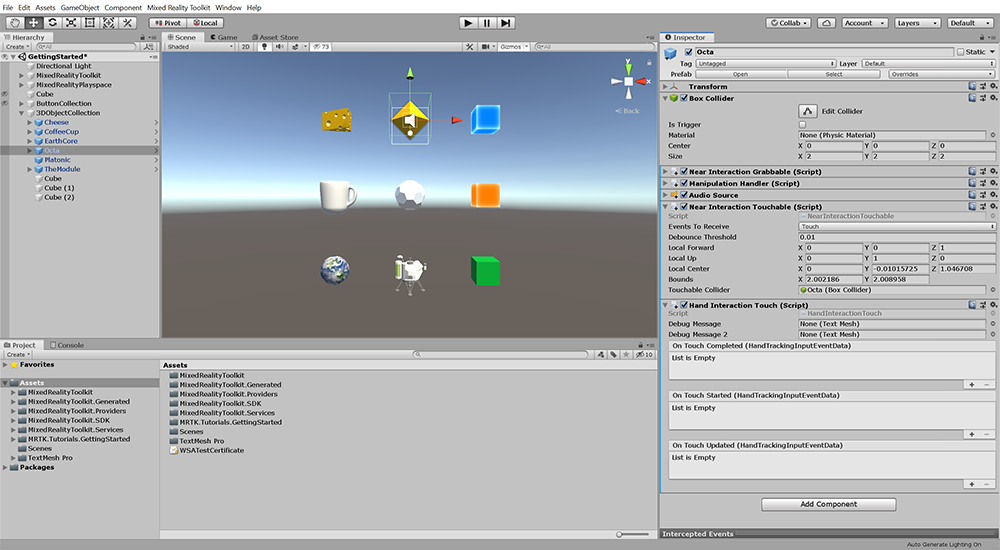

### 4. Implement the On Touch Started event

On the **Hand Interaction Touch (Script)** component, click the small **+** icon to create a new **On Touch Started ()** event. Then configure the **Octa** object to receive the event and define **AudioSource.PlayOneShot** as the action to be triggered:

Navigate to **Assets** > **MixedRealityToolkit.SDK** > **StandardAssets** > **Audio** to see audio clips provided with the MRTK, and then assign a suitable audio clip to the **Audio Clip** field, for example, the MRTK_Gem audio clip:

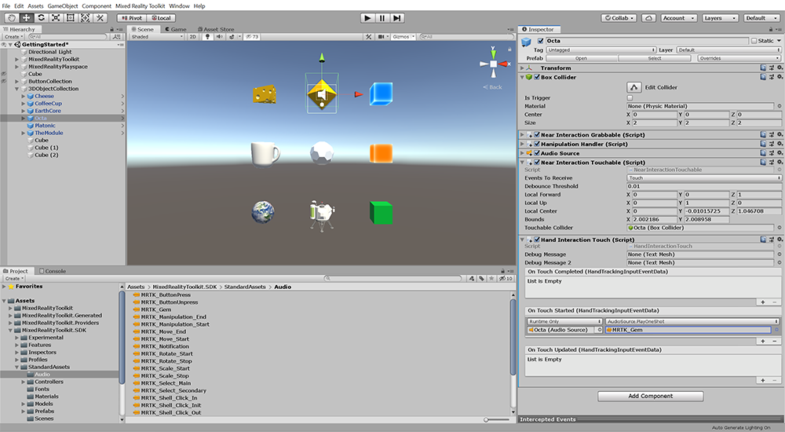

> [!TIP]
> For a reminder on how to implement events, you can refer to the [Hand tracking gestures and interactable buttons](mrlearning-base-ch2.md#hand-tracking-gestures-and-interactable-buttons) instructions.

### 5. Test the touch interaction using the in-editor simulation

Press the Play button to enter Game mode. Then press and hold the spacebar to bring up the hand and use the mouse to touch the Octa object and trigger the sound effect:

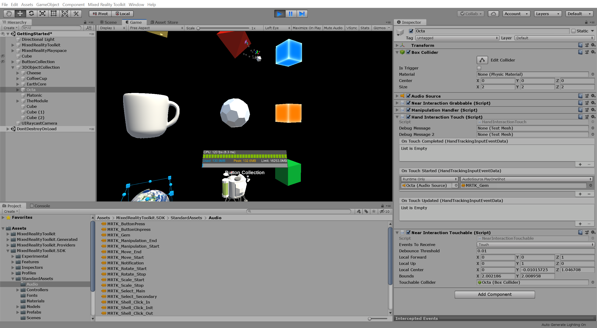

> [!NOTE]
> As you saw when testing the touch interaction, and as shown in the image above, the Octa object color pulsated while it was touched. This effect is hard coded into the Hand Interaction Touch (Script) component and not a result of the event configuration you completed in the steps above.
>
> If you want to disable this effect, you can, for example, comment out or line 32 'TargetRenderer = GetComponentInChildren<Renderer>();' which will result in the TargetRenderer remaining null and the color not pulsating.

## Congratulations

In this tutorial, you learned how to organize 3D objects in a grid collection and how to manipulate these objects (scaling, rotating, and moving) using near interaction (directly grabbing with tracked hands) and far interaction (using gaze rays or hand rays). You also learned how to put bounding boxes around 3D objects, and learned how to use and customize the handles on the bounding boxes. Finally, you learned how to trigger events when touching an object.

[Next Lesson: 6. Exploring advanced input options](mrlearning-base-ch5.md)
