# 6.Exploring advanced input options

In this tutorial, we explore several advanced input options for the HoloLens 2, including the use of voice commands, panning gesture, and eye tracking. 

## Objectives

- Trigger events using voice commands and keywords
- Use tracked hands to pan textures and 3D objects with tracked hands
- Leverage HoloLens 2 eye tracking capabilities to select objects

## Instructions

### Enabling Voice Commands

In this section, we will implement two voice commands. First, we'll introduce the ability to toggle the frame rate diagnostics panel by saying "toggle diagnostics". Second, we'll look at the ability to play a sound with a voice command. To begin, we'll explore the MRTK profiles and settings responsible for configuring voice commands. 

1. In the Base Scene hierarchy, select MixedRealityToolkit. In the Inspector panel, scroll down to                                                                                                                                                                              Input System settings. Double click to open up the input system profile. Clone the input system profile to make it editable as we learned in [Lesson 1](mrlearning-base-ch1.md) 

In the input system profile, there are a variety of settings. For voice commands, select Speech Command Settings. 

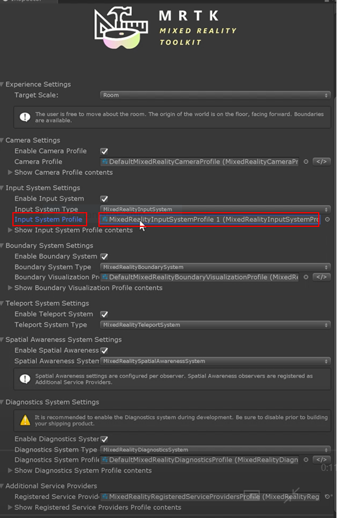

2. Clone the speech commands profile to make it editable as we learned in [Lesson 1](mrlearning-base-ch1.md). Double click on the speech command profile where you’ll notice a range of settings. For a full description of these settings, refer to the [MRTK speech documentation](<https://microsoft.github.io/MixedRealityToolkit-Unity/Documentation/Input/Speech.html>). 

>Note: By default, the general behavior is auto-start. This can be changed to manual-start if desired. But for this example we are going to keep it on auto-start. The MRTK comes with several default voice commands, such as menu, toggle diagnostics, and toggle profiler. We will use, the keyword “toggle diagnostics,” in order to turn on and off the diagnostics framerate counter. We will also add a new voice command in the steps below.
>
> 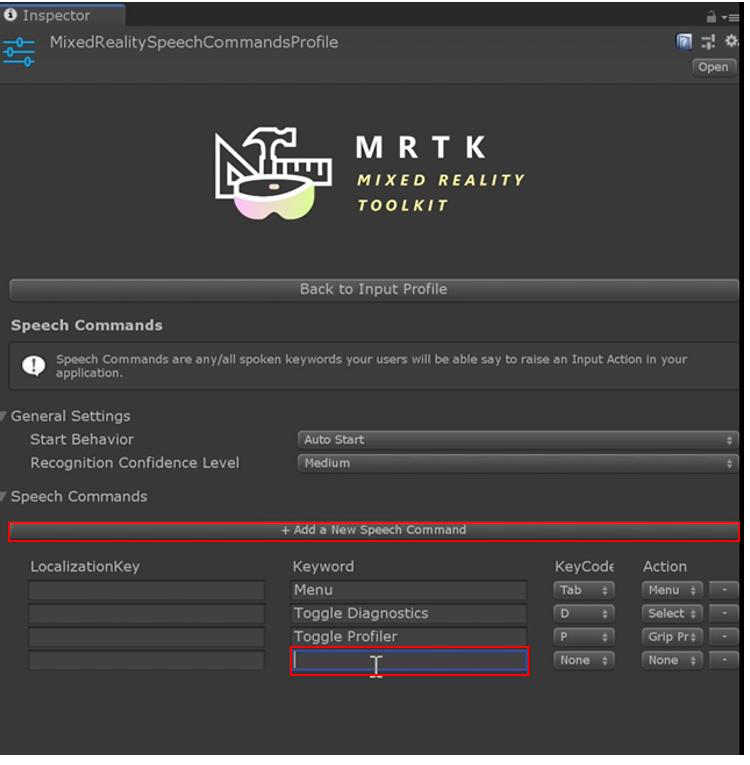

3. Add a new voice command. To add a new voice command, click on the + Add a New Speech Command button. You'll see a new line that appears down below the list of existing voice commands. Type in the voice command you want to use. In this example we are going to use the command “play music".

>Tip: You can also set a keycode for speech commands. This allows for voice commands to trigger events upon the press of a keyboard key. 	

4. Add the ability to respond to voice commands. Select any object in the Base Scene hierarchy that does not have any other input scripts attached to it (e.g. no manipulation handler). In the Inspector panel, click Add Component. Type in “speech input handler” Select it.

   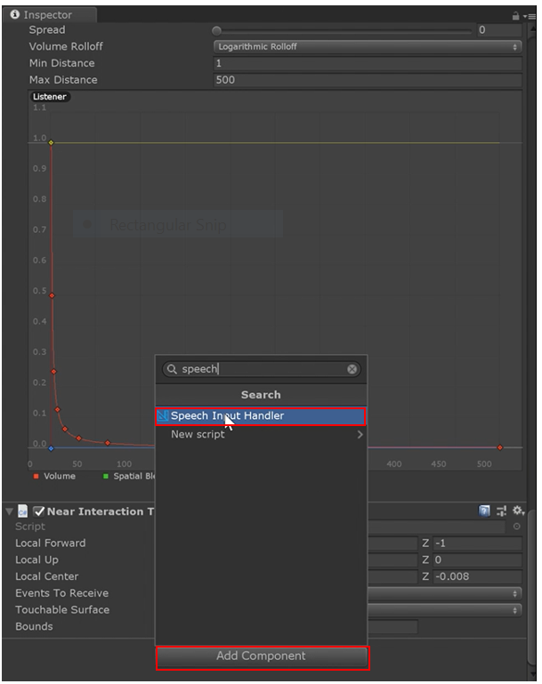

   

By default, you will see two checkboxes. One is the Is Focus Required checkbox. What this means is as long as you are pointing at the object with a gaze ray--eye-gaze, head-gaze, controller-gaze, or hand-gaze--the voice command will be triggered. Uncheck this checkbox so that the user does not have to look at the object to use the voice command.

5. Add the ability to respond to a voice command. To do this, click the + button that’s in the Speech Input Handler, and select the keyword you want to respond to.

   > Note: These keywords are populated based on the profile you edited in the previous step.

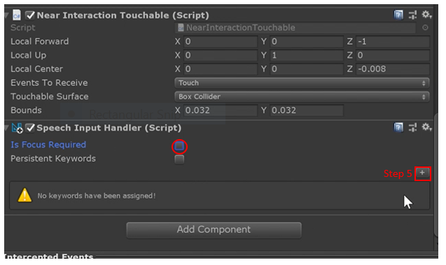

6. Next to Keyword, you'll see a dropdown menu. Select Toggle Diagnostics so that whenever the user says the phrase, “toggle diagnostics”, it triggers an action. Note that you might need to expand Element 0 by pressing the arrow next to it.

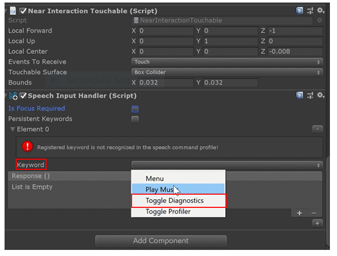

7. Add the Diagnostics Demo Control script to toggle the framerate counter diagnostic on and off. To do this, press Add Component, and search for Diagnostics Demo Controls script, and add it from the menu. This script can be added to any object. But for simplicity, we will add it to the same object as the speech input handler. 

   > Note: This script is only included with these modules, and is not included with the original MRTK.

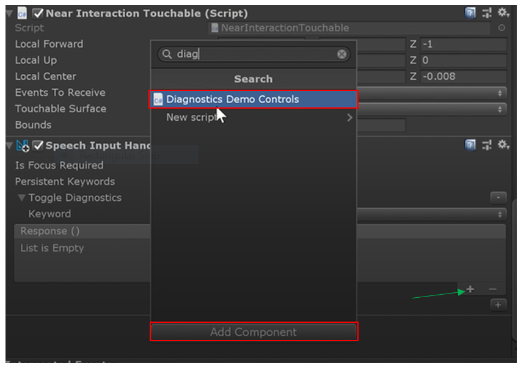

8. Add a new response in the speech input handler. To do this click the + button underneath where it says response () (marked by green arrow in the picture above).

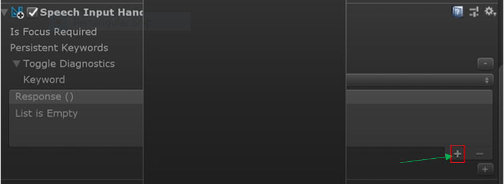

9. Drag the object that has the Diagnostics Demo Controls script to the new response you just created in Step 8.
    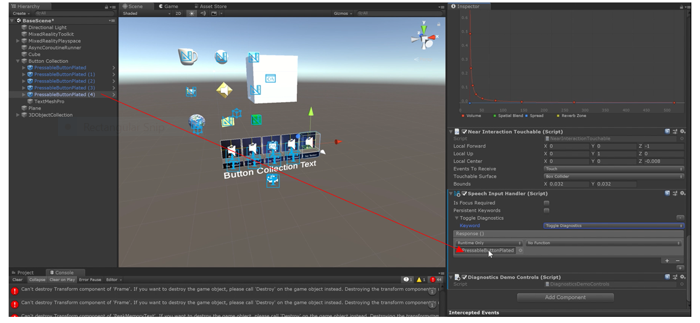

10. Now select the "No Function" dropdown list, and select Diagnostic Demo Control. Then select the "On Toggle Diagnostics ()" function which toggles your diagnostics on and off.  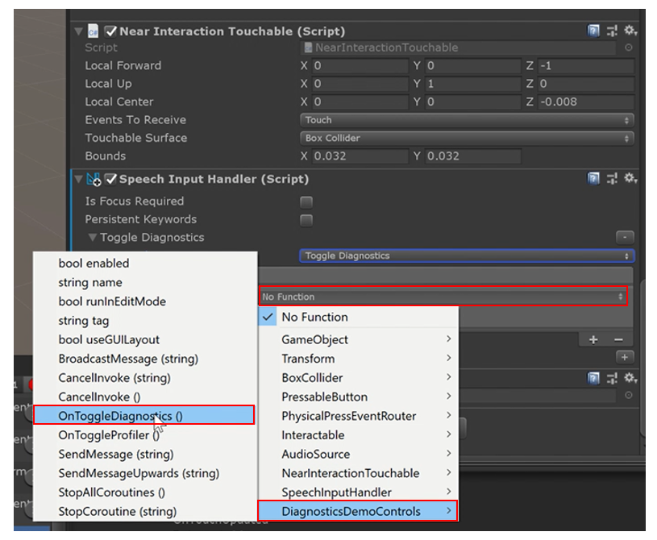
    
> Note that before building to your device you need to enable mic settings. To do this, click File, and go to Build Settings, Player Settings, and ensure that the microphone capability is set.

Next, we will add the ability to play an audio file from voice command using the Octa object. Recall from [lesson 4](mrlearning-base-ch4.md) that we added the ability to play an audio clip from touching the Octa object. We will leverage this same audio source for our music voice command.

11. Select the Octa object in the Base Scene hierarchy.

12. Add another speech input handler (repeat Steps 4 and 5), but with the octa object. 

13. Instead of adding the Toggle Diagnostics voice command from step 6, add the Play Music voice command as shown in the image below.
    
     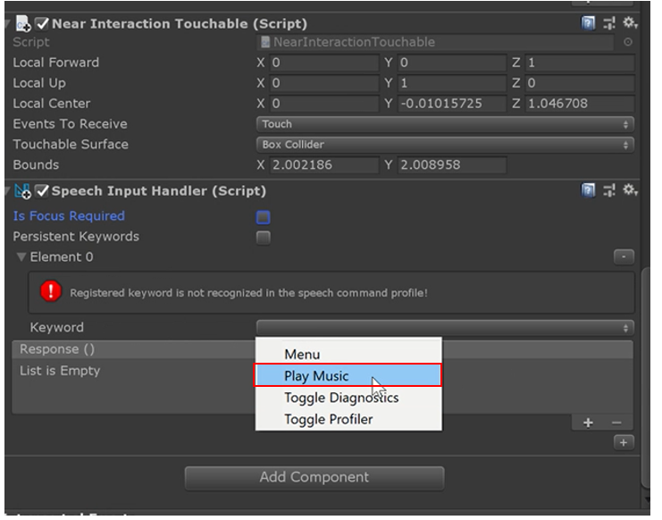
    
    
    
14. As with Steps 8 and 9, add a new response, and drag the Octa object to the empty Response slot.

15. Select the dropdown menu that says No Function. Then select Audio Source, and select PlayOneShot (AudioClip).

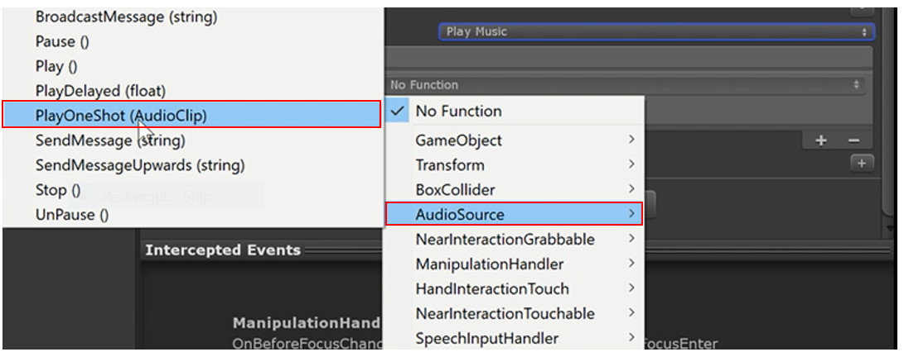

16. For this example we are going to use the same audio clip from [Lesson 4](mrlearning-base-ch4.md). Go into your Project panel, search for “MRTK_Gem” audio clip, and drag it into the audio source slot as shown in the image below. Now your application will respond to the voice commands “toggle diagnostics” to toggle the Frame Rate Counter panel and Play Music to play the MRTK_Gem song.
     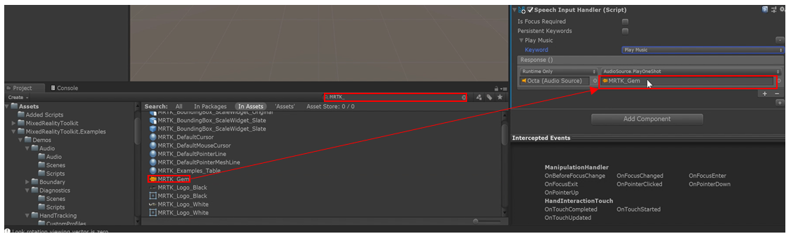

### The Pan Gesture 

In this section, we will learn how to use the pan gesture. This is useful for scrolling by using your finger or hand to scroll through content. You can also use the pan gesture to rotate objects, to cycle through a collection of 3D objects, or even to scroll a 2D UI. We will also learn how to use the pan gesture to warp a texture, and how to move a collection of 3D objects.

1. Create a quad. In your Base Scene hierarchy, right click, select "3D Object", and select Quad.

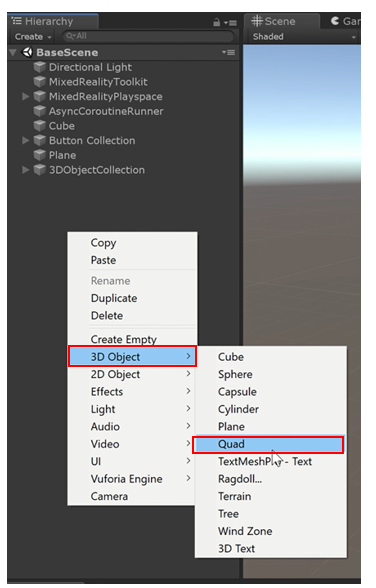

2. Reposition the quad as appropriate. For our example, we set the x = 0, the y = 0 and the z = 1.5 away from the camera for a comfortable position from HoloLens 2.

   > Note: If the quad blocks or is in front of any content from the previous lessons, be sure to move it so that it doesn’t block any of the other objects.

3. Apply a material to the quad. This material will be the material we will be scrolling through with the pan gesture. 

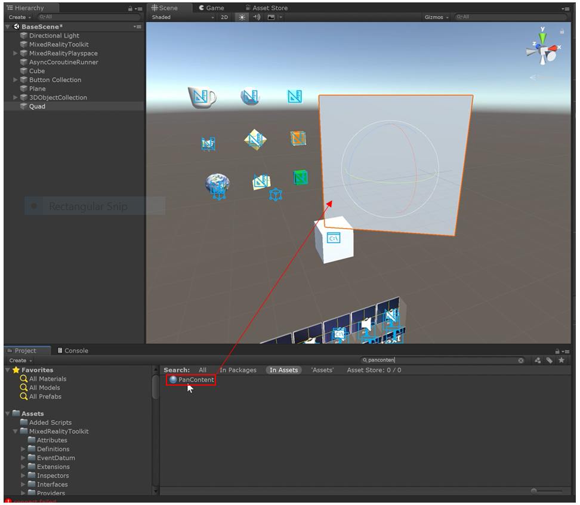

4. In your Projects panel, type in the search box “pan content”. Drag that material on to the quad in your scene. 

> Note: The Pan Content material is not included in the MRTK, but an asset in this module's asset package as imported in previous lessons. 

> Note: When you add the pan content, it may look stretched. You can fix this by adjusting the values x, y and z values of the size of the quad until you are satisfied with the way it looks.

To use the pan gesture, you will need a collider on your object. You may see the quad already has a mesh collider. However, the mesh collider is not ideal, because it is extremely thin and difficult to select. We suggest replacing the mesh collider with a box collider.

5. Right click the mesh collider that’s on the quad from the Inspector panel. Then remove it by clicking Remove Component.
    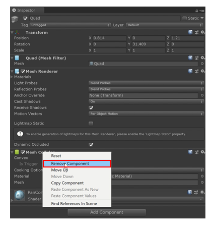
6. Now add the box collider by clicking Add Component, and searching “box collider” The default added box collider is still too thin, so click the Edit Collider button to edit. When it’s pressed in, you can adjust the size using the x, y and z values or the elements in the scene editor. For our example, we want to extend the box collider a little behind the quad. In the scene editor, drag the box collider from the back, outwards (see the image below). This lets the user not only use their finger, but their entire hand to scroll. 
    
7. Make it interactive. Since we want to interact with the quad directly, we want to use the Near Interaction Touchable component that we used this in Lesson 4 for playing music from the Octa object. Click Add Component, and search for “near interaction touchable” and select it as shown in the images below. 

8. Add the ability to recognize the pan gesture. Click Add Component, and type “hand interaction pan” You will have a choice between hand ray (allowing you to pan from a distance) and index finger. For this example, leave it at index finger. 
    

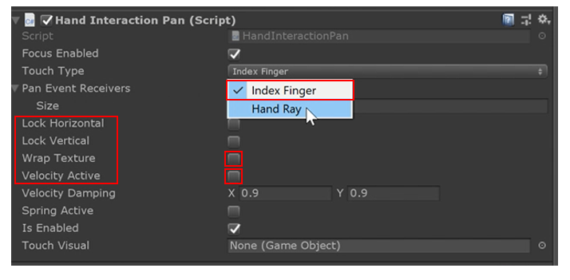

9. In the Hand interaction Pan script, the Lock Horizontal and Lock Vertical checkboxes locks movements, respectively. The Wrap Texture settings makes the texture (texture mapping) follow the user's pan movements. For this example, you'll check that box. There is also Velocity Active, which, if unchecked, the pan gesture will not work. Check this box as well. Now you will have a pan-enabled quad.

   

   Next, we will learn how to pan 3D objects. 

10. Right click the quad object, select 3D object, and click Cube. Scale the cube so that it’s roughly x = 0.1, y = 0.1 and z = 0.1. Copy that cube three times by right clicking the cube and pressing duplicate, or by pressing control/command D. Space them out evenly. Your scene should look similar to the image below.

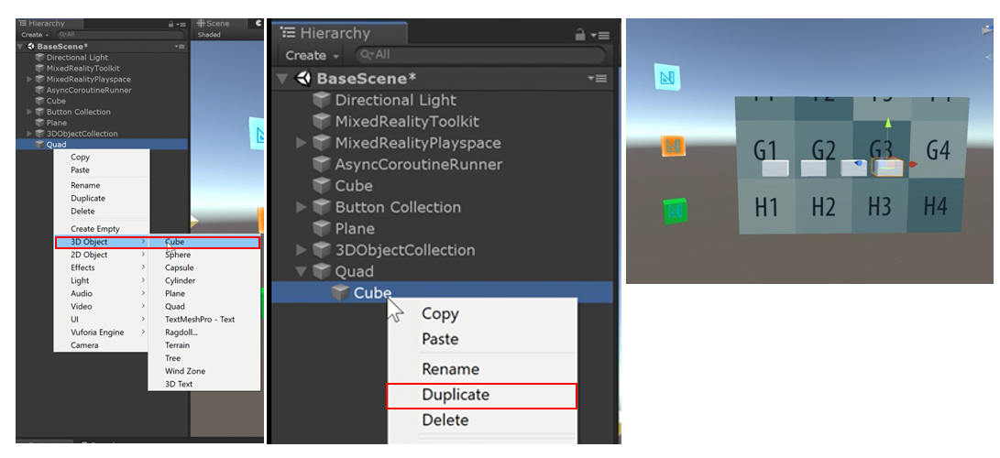

11. Select the quad again, and under the hand interaction pan script, set the pan actions to each of the cubes. Under Pan Event Receivers, we want to specify the number of objects receiving the event. Since there are four cubes, type “4” and press enter. Four empty fields should appear.

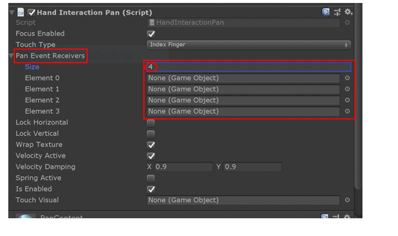

12. Drag each of the cubes into each of the empty element slots.
     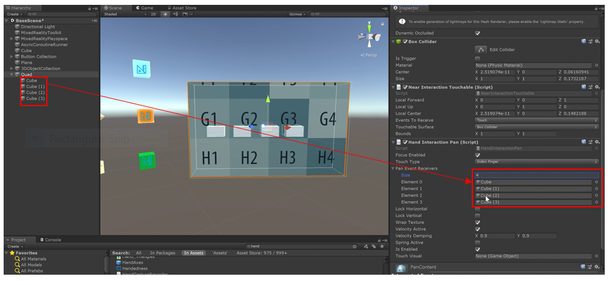
    
13. Add the Move with Pan script to all of the cubes by pressing and holding control/command, and select each object. From the Inspector panel, click Add Component, and search for “move with pan.” Click the script, and it is added to each cube. Now the 3D objects will move with your pan gesture. If you remove the mesh render on your quad, you should now have an invisible quad where you can pan through a list of 3D objects.

### Eye Tracking

In this section, we will explore how to enable eye tracking in our demo. We will slowly spin our 3D menu items when they are being gazed upon with your eye gaze. We will also trigger a fun effect when the gazed-upon item is selected.

1. Ensure the MRTK profiles are properly configured. As of this writing, the mixed reality toolkit profile configuration does not include eye tracking capabilities by default. To add eye tracking capabilities, follow the instructions in the "Setting up the MRTK profiles required for Eye Tracking" section as outlined in the [Mixed Reality Toolkit Documentation](https://microsoft.github.io/MixedRealityToolkit-Unity/Documentation/EyeTracking/EyeTracking_BasicSetup.html#setting-up-the-mrtk-profiles-required-for-eye-tracking  ). Ensure that eye tracking is properly configured by following any remaining steps in the documentation link above, including enabling eye tracking in GazeProvider (the component attached to camera), and enabling the simulation of eye tracking in the Unity editor. Note that future versions of the MRTK might include eye tracking by default.

    The link above provides brief instructions for:

    - Creating the Eye Gaze Data Provider for use in the MRTK profile
    - Enabling eye tracking in the Gaze Provider
    - Setting up an eye tracking simulation in the editor
    - Editing the Visual Studio solution's capabilities to allow eye tracking in the built application

2. Add the Eye Tracking Target component to target objects. To allow an object to respond to eye gaze events, we'll need to add the EyeTrackingTarget component on each object that we want to interact with by using eye gaze. Add this component to each of the nine 3D objects that are part of the grid collection. Tip: Select multiple items in the hierarchy to bulk-add the EyeTrackingTarget component.
    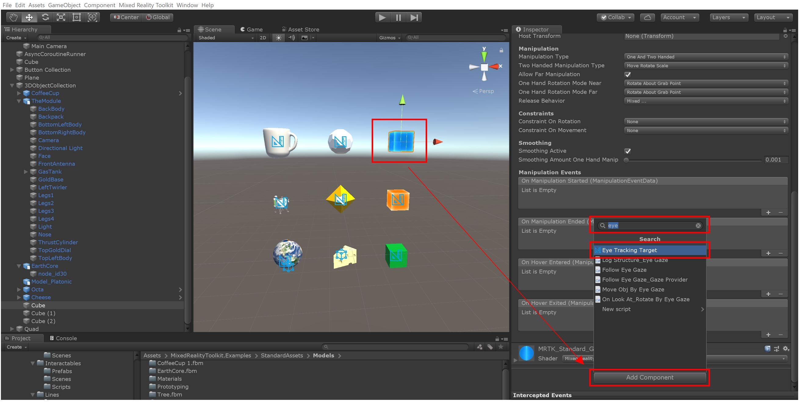

3. Next we will add the EyeTrackingTutorialDemo script for some exciting interactions. The EyeTrackingTutorialDemo script is included as part of this tutorial series repository. It is not included by default with the Mixed Reality Toolkit. For each 3D object in the grid collection, add the EyeTrackingTutorialDemo script by searching for the component in the Add Component menu.
   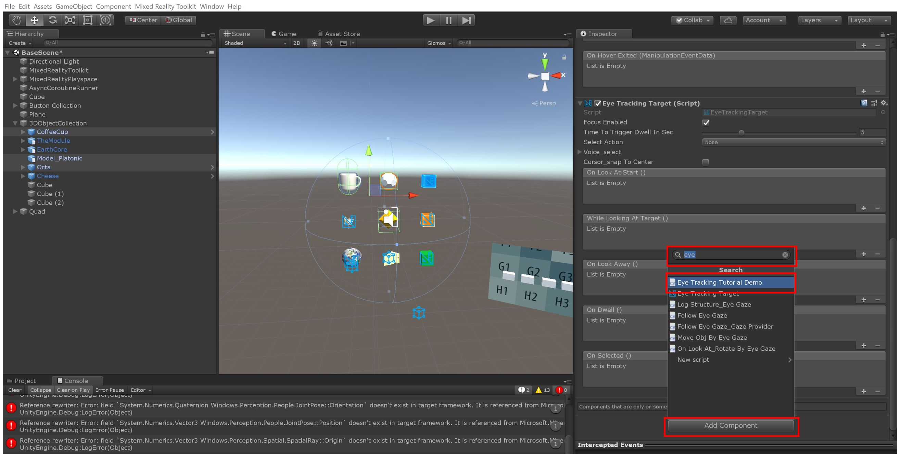

4. Spin the object while looking at the target. We want to configure our 3D object to spin while we are looking at it. To do this, insert a new field in the While Looking At Target() section of the EyeTrackingTarget component as shown in the image below. 

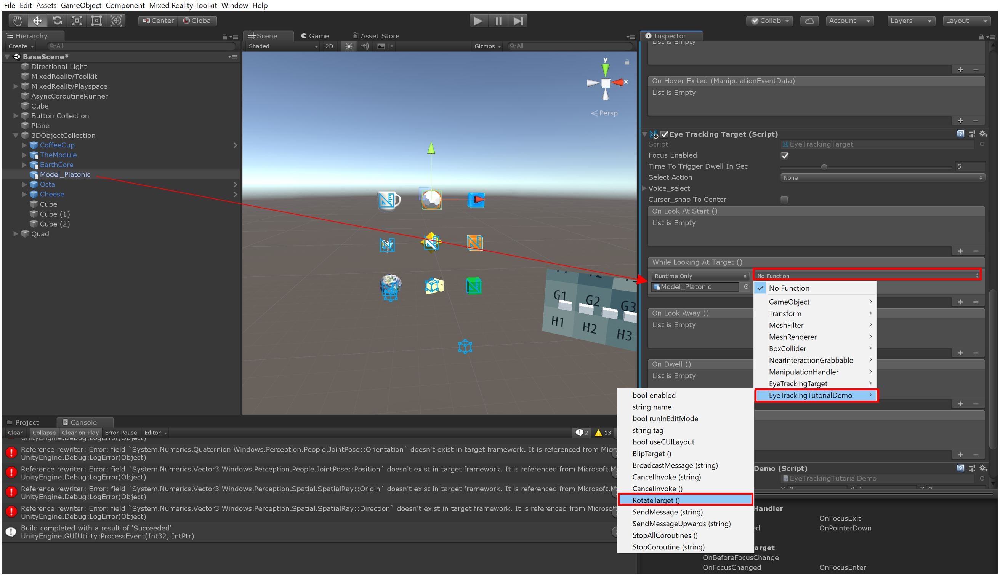

In newly created field, add the current Game Object to the empty field, and select EyeTrackingTutorialDemo>RotateTarget() as shown in the image below. Now the 3D object is configured to spin when it is being gazed upon with eye tracking. 

5. Add in the ability to “blip target” that is being gazed at upon select by air-tap or saying “select”. Similar to Step 4, we want to trigger EyeTrackingTutorialDemo>BlipTarget() by assigning it to the game object’s Select() field of the EyeTrackingTarget component as shown in the figure below. With this now configured, you will notice a slight blip in the game object whenever you trigger a select action, such as air-tap or the voice command “select”. 
    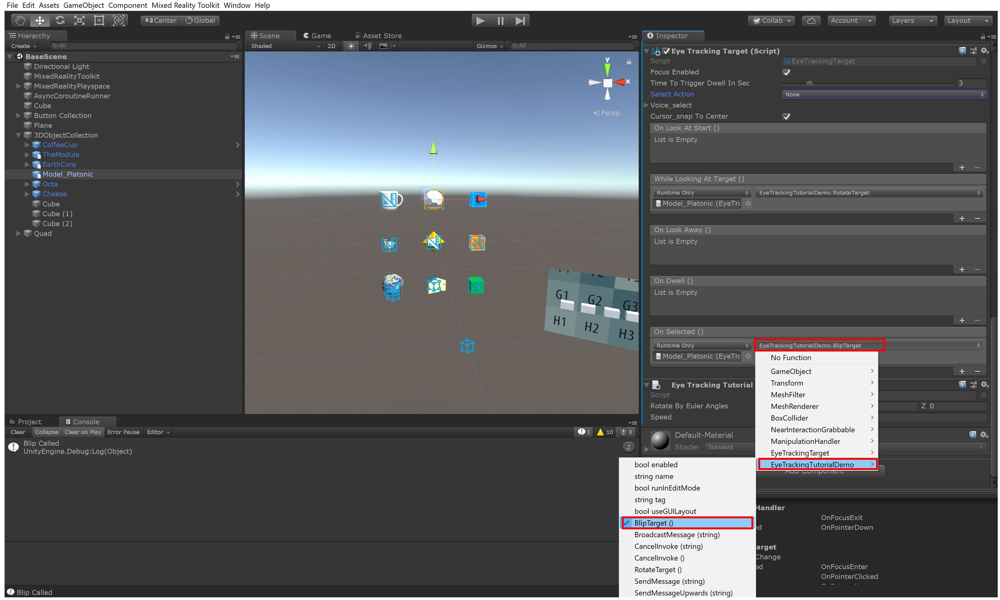
6. Ensure eye tracking capabilities are properly configured before building to HoloLens 2. As of this writing, Unity does not yet have the ability to set the gaze input for eye tracking capabilities. Setting this capability is required for eye tracking to work in HoloLens 2. Follow these instructions on the mixed reality toolkit documentation to enable the gaze input capability: https://microsoft.github.io/MixedRealityToolkit-Unity/Documentation/EyeTracking/EyeTracking_BasicSetup.html#testing-your-unity-app-on-a-hololens-2 

### Congratulations! 
You’ve successfully added basic eye tracking capabilities to your application. These actions are only the beginning of a world of possibilities with eye tracking. This chapter also concludes Lesson 5, where we learned about advanced input functionality, such as voice commands, panning gestures, and eye tracking. 

[Next Lesson: Lunar Module Assembly Sample Experience](mrlearning-base-ch6.md)

