# 6. Exploring advanced input options

In this tutorial, you will explore a few advanced input options for HoloLens 2, including the use of voice commands, panning gesture, and eye tracking.

## Objectives

* Trigger events using voice commands and keywords
* Use tracked hands to pan textures and 3D objects with tracked hands
* Leverage HoloLens 2 eye tracking capabilities to select objects

## Enabling Voice Commands
<!-- TODO: Consider changing to 'Enabling Speech Commands -->

In this section, you will implement a speech command to let the user play a sound on the Octa object. For this, you will create a new speech command and then configure the event so it triggers the desired action when the speech command keyword is spoken.

The main steps you will take to achieve this are:

1. Clone the default Input System Profile
2. Clone the default Speech Commands Profile
3. Create a new speech command
4. Add and configure the Speech Input Handler (Script) component
5. Implement the Response event for the speech command

### 1. Clone the default Input System Profile
In the Hierarchy window, select the **MixedRealityToolkit** object, then in the Inspector window, select the **Input** tab and clone the **DefaultHoloLens2InputSystemProfile** to replace it with your own customizable **Input System Profile**:

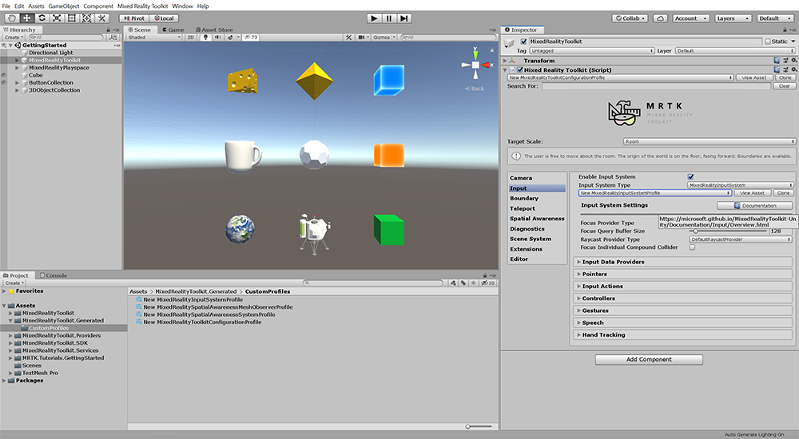

Select the **MixedRealityToolkit** object from the Hierarchy tab, then click the **Input** tab in the Inspector window and expand the **Pointers** section. Clone the **DefaultMixedRealityInputPointerProfile**, replace it with your own customizable **Input Pointer Profile**, and check that **Is Eye Tracked Enabled** is true in the Gaze Settings section. 

> [!TIP]
> For a reminder on how to clone MRTK profiles, you can refer to the [How to configure the Mixed Reality Toolkit Profiles](mrlearning-base-ch2.md#how-to-configure-the-mixed-reality-toolkit-profiles-change-spatial-awareness-display-option) instructions.

### 2. Clone the default Speech Commands Profile

Expand the **Speech** section and clone the **DefaultMixedRealitySpeechCommandsProfile** to replace it with your own customizable **Speech Commands Profile**:

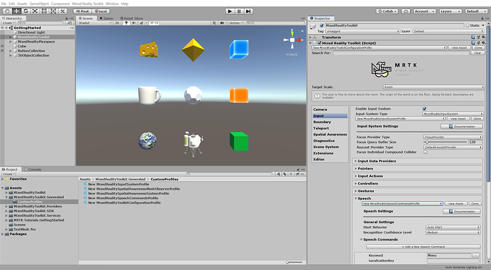

### 3. Create a new speech command

In the **Speech Commands** section, click the **+ Add a New Speech Command** button to add a new speech command to the bottom of the list of existing speech commands, then in the **Keyword** field enter a suitable word or phrase, for example **Play Music**:

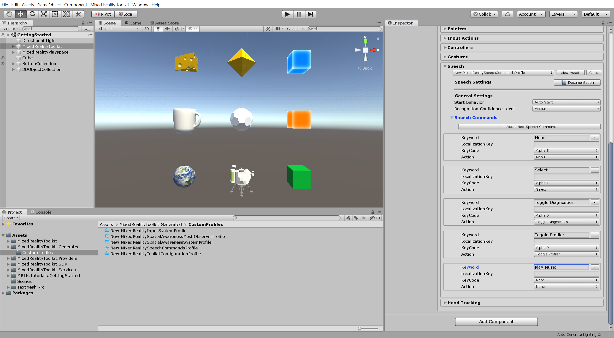

> [!TIP]
> If your computer doesn't have a microphone and you would like to test the speech command using the in-editor simulation, you can assign a KeyCode to the speech command which will let you trigger it when the corresponding key is pressed.

### 4. Add and configure the Speech Input Handler (Script) component

In the Hierarchy window, select the **Octa** object and add the **Speech Input Handler (Script)** component to the Octa object. Then uncheck the **Is Focus Required** checkbox so the user is not required to look at the Octa object to trigger the speech command:

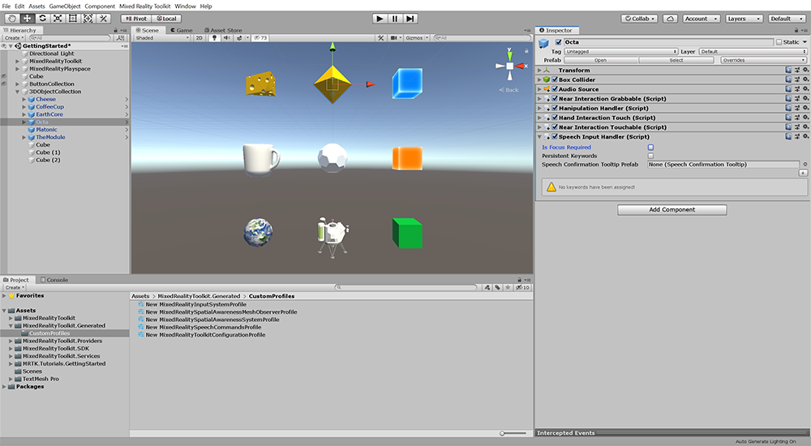

### 5. Implement the Response event for the speech command

On the Speech Input Handler (Script) component, click the small **+** button to add a keyword element to the list of keywords:

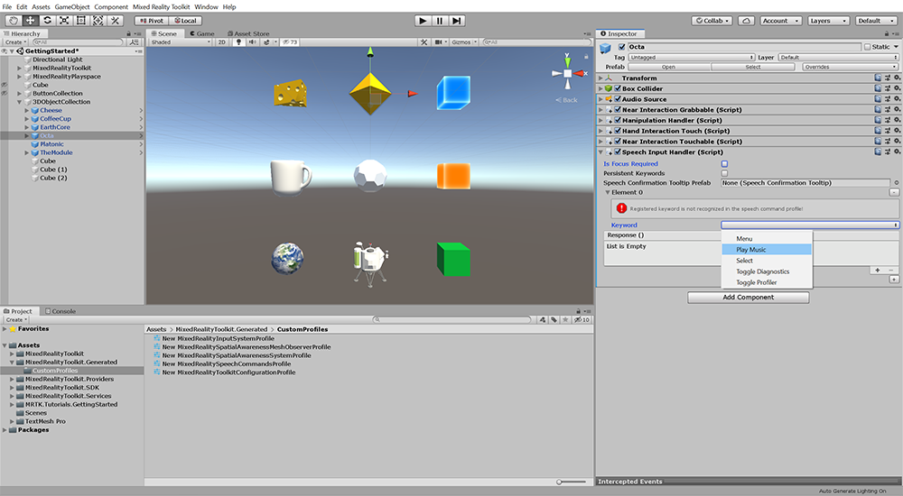

Click the newly created **Element 0** to expand it, and then, from the **Keyword** dropdown, choose the **Play Music** keyword you created earlier:

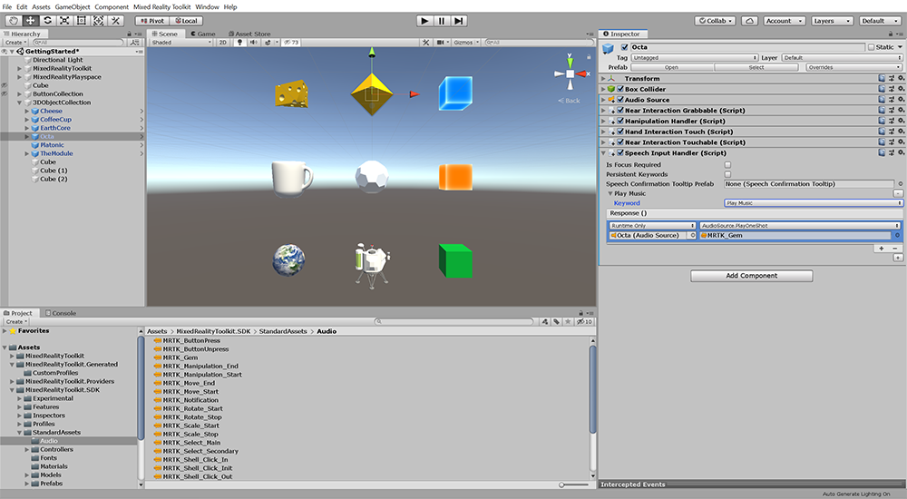

> [!NOTE]
> The keywords in the Keyword dropdown are populated based on the keywords defined in the Speech Commands list in the Speech Commands Profile.

Create a new **Response ()** event, configure the **Octa** object to receive the event, define **AudioSource.PlayOneShot** as the action to be triggered, and assign a suitable audio clip to the **Audio Clip** field, for example, the MRTK_Gem audio clip:

> [!TIP]
> For a reminder on how to implement events and assign an audio clip, you can refer to the [Implement the On Touch Started event](mrlearning-base-ch4.md#4-implement-the-on-touch-started-event) instructions.

## The Pan Gesture

The pan gesture is useful for scrolling by using your finger or hand to scroll through content. In this example, you will first learn how to scroll a 2D UI and then expand on that to be able to scroll through a collection of 3D objects.

The main steps you will take to achieve this are:

1. Create a Quad object that can be used for panning
2. Add the Near Interaction Touchable (Script) component
3. Add the Hand Interaction Pan Zoom (Script) component
4. Add 2D content to be scrolled
5. Add 3D content to be scrolled
6. Add the Move With Pan (Script) component

> [!NOTE]
> The Move With Pan (Script) component is not part of MRTK. It was provided with this tutorial's assets.

### 1. Create a Quad object that can be used for panning

In the Hierarchy window, right-click at an empty area and select **3D Object** > **Quad** to add a quad to your scene. Give it a suitable name, for example, **PanGesture**, and position it in a suitable location, for example, X = 0, Y = -0.2, Z = 2.

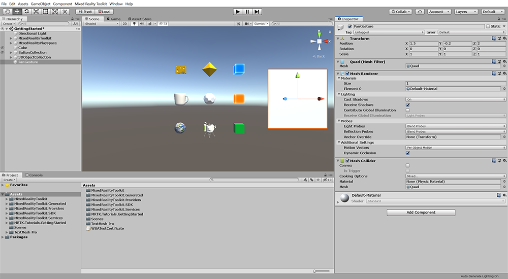

> [!TIP]
> For a reminder on how to add Unity primitives, such as a 3D quad, to your scene, you can refer to the [Add a cube to the scene](mrlearning-base-ch2.md#2-add-a-cube-to-the-scene) instructions.

As with any other interaction, the the pan gesture also requires a collider. By default, a Quad has a mesh collider. However, the mesh collider is not ideal because it is extremely thin. To make it easier for the user to interact with the collider, we will replace the mesh collider with a box collider.

With the PanGesture object still selected, click the **Mesh Collider** component's **Settings** icon and select **Remove Component** to remove the Mesh Collider:

In the Inspector window, use the **Add Component** button to add a **Box Collider**, then change the Box Collider **Size** Z to 0.15 to increase the thickness of the box collider:

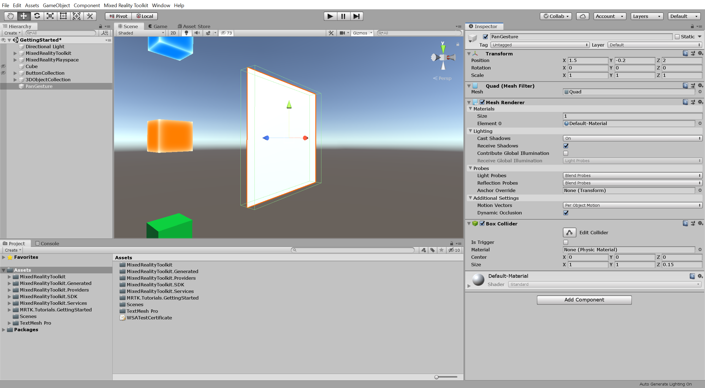

### 2. Add the Near Interaction Touchable (Script) component

With the **PanGesture** object still selected, add the **Near Interaction Touchable (Script)** component to the PanGesture object, and then click the **Fix Bounds** and **Fix Center** buttons to update the Local Center and Bounds properties of the Near Interaction Touchable (Script) to match the BoxCollider:

### 3. Add the Hand Interaction Pan Zoom (Script) component

With the **PanGesture** object still selected, add the **Hand Interaction Pan Zoom (Script)** component to the PanGesture object, and then check the **Lock Horizontal** checkbox to allow vertical scrolling only:

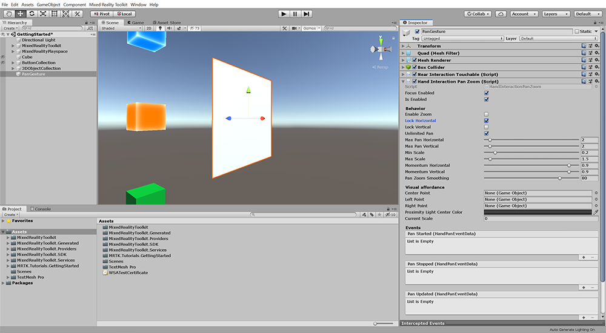

### 4. Add 2D content to be scrolled

In the Project panel, search for the **PanContent** material and then click-and-drag it on to the **PanGesture** object's Mesh Renderer **Material** Element 0 property:

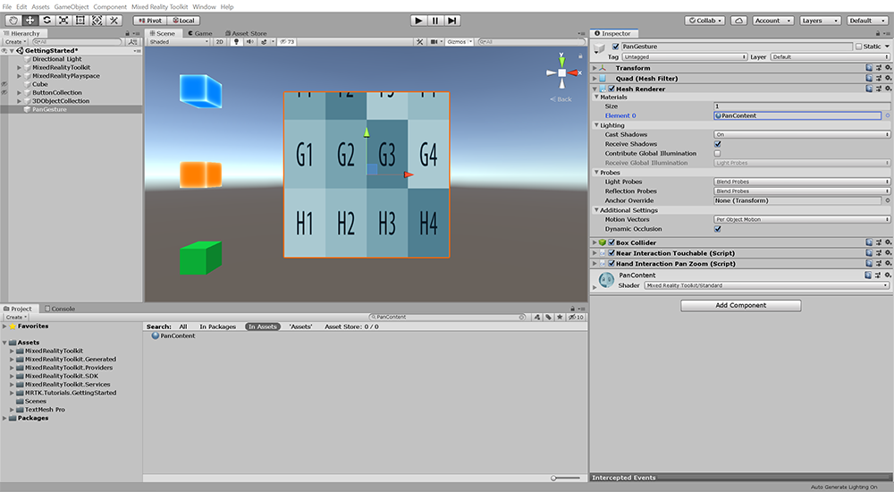

In the Inspector window, expand the newly added **PanContent** material component, and then change it's **Tiling** Y value to 0.5 so it matches the X value and the tiles appear square:

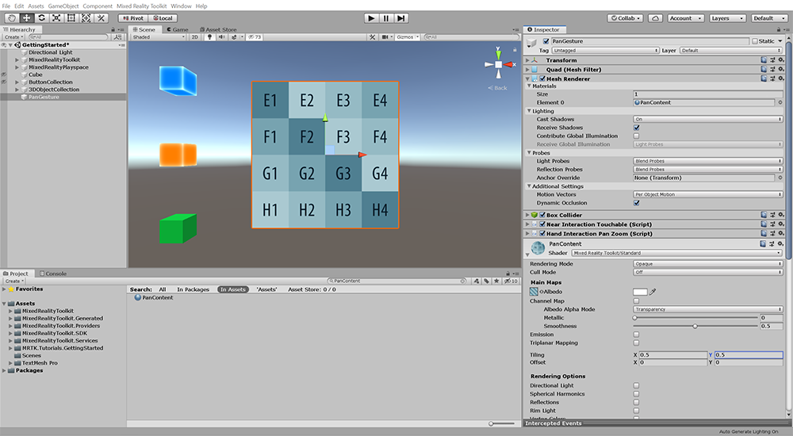

If you now enter Game mode, you can test scrolling the 2D content using the pan gesture in the in-editor simulation:

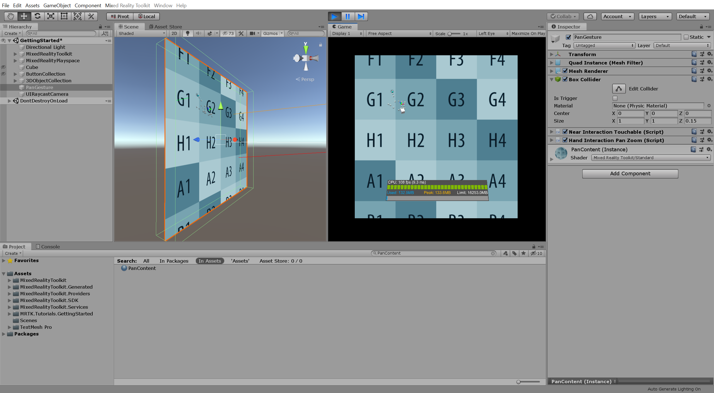

### 5. Add 3D content to be scrolled

In the Hierarchy window, **create four cubes** as a child objects of the **PanGesture** object and set their Transform **Scale** to X = 0.15, Y = 0.15, Z = 0.15:

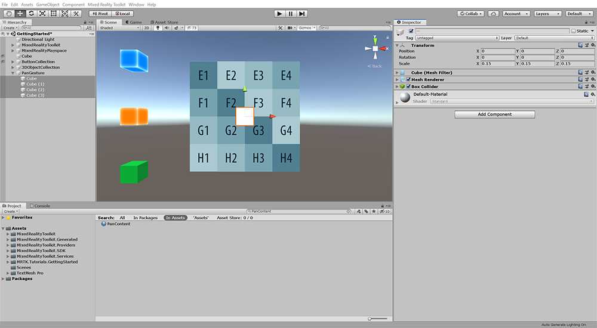

To space the cubes out evenly, and save some time, add the **Grid Object Collection (Script)** component, to the cubes' parent object, i.e. the **PanGesture** object, and configure the Grid Object Collection (Script) as follows:

* Change **Num Rows** to 1 to have all the cubes aligned on one single row
* Change **Cell Width** to 0.25 to space out the cubes within the row

Then click the **Update Collection** button to apply the new configuration:

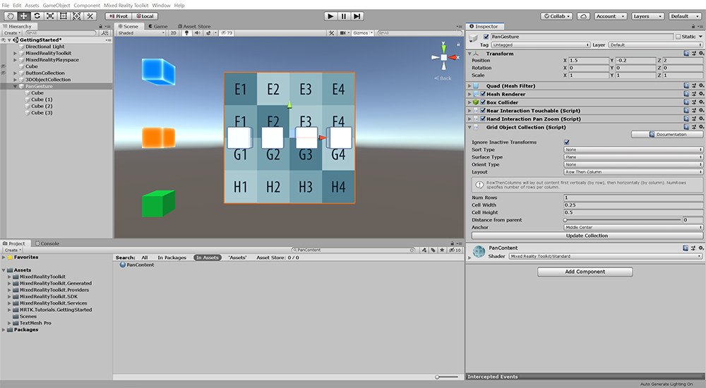

### 6. Add the Move With Pan (Script) component

In the Hierarchy window, select all the **Cube child objects**, then in the Inspector window, use the **Add Component** button to add the **Move With Pan (Script)** component to all the cubes:

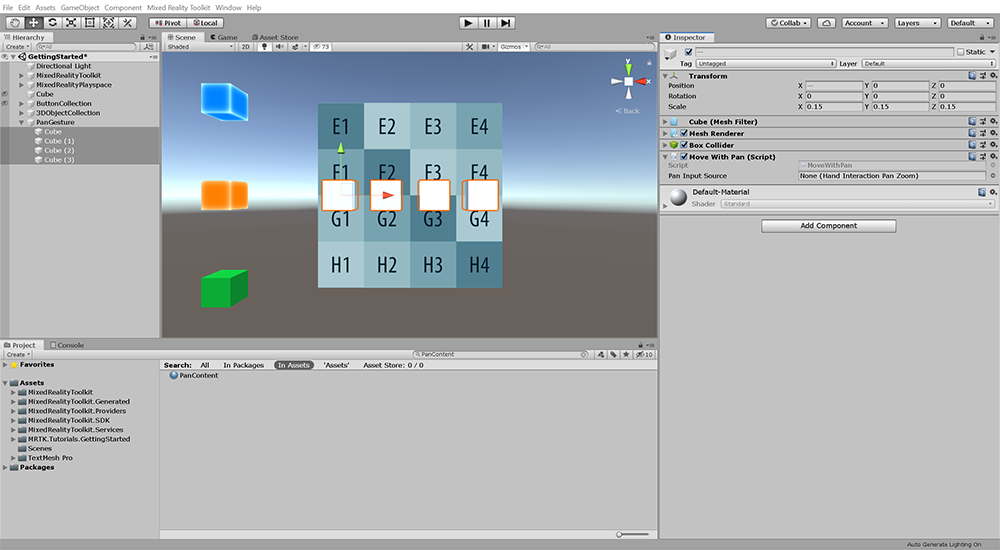

> [!TIP]
> For a reminder on how to select multiple objects in the Hierarchy window, tou can refer to the [Add the Manipulation Handler (Script) component to all the objects](mrlearning-base-ch4.md#1-add-the-manipulation-handler-script-component-to-all-the-objects) instructions.

With all the cubes still selected, click-and-drag the **PanGesture** object to the **Pan Input Source** field:

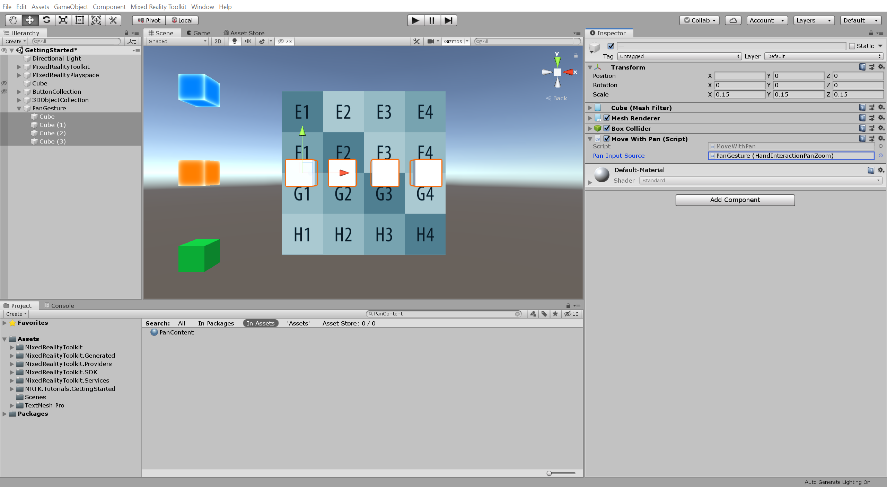

> [!TIP]
> The Move With Pan (Script) component on each cube listens for the Pan Updated event sent by the HandInteractionPanZoom (Script) component on the PanGesture object, which you assigned as the Pan Input Source in the step above, and updates each cube's position accordingly.

In the Hierarchy window, select the **PanGesture** object, then in the inspector **un-check** the **Mesh Renderer** checkbox to disable the Mesh Renderer component:

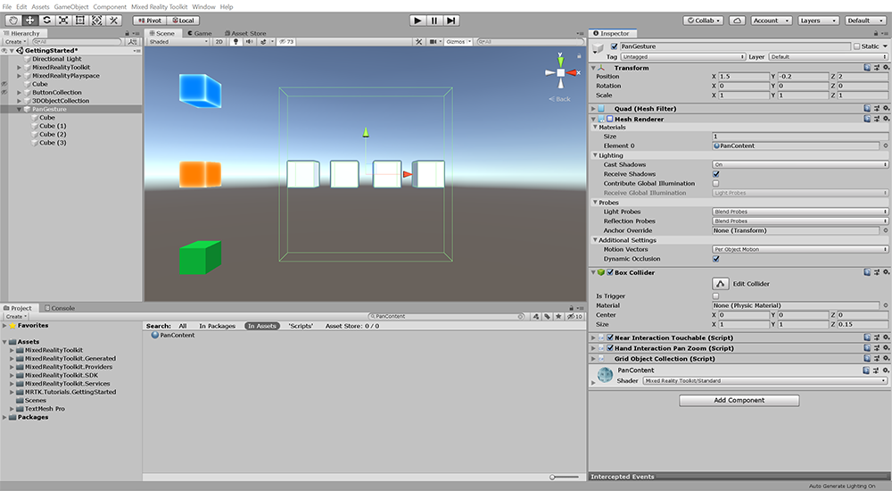

If you now enter Game mode, you can test scrolling the 3D content using the pan gesture in the in-editor simulation:

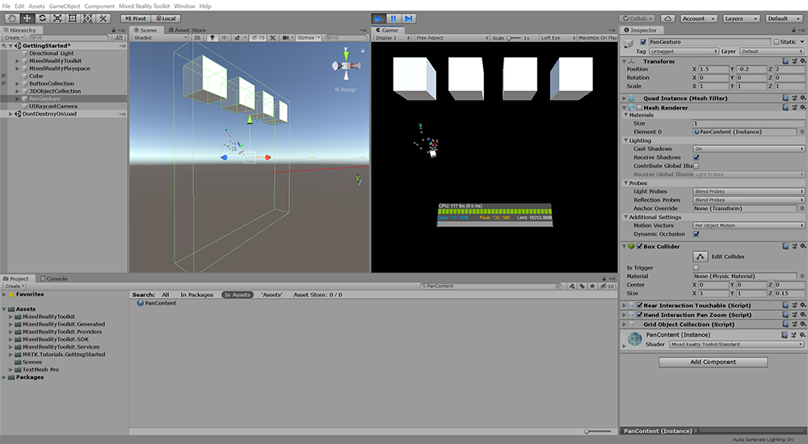

## Eye Tracking

In this section, you will explore how to enable eye tracking in your project. For this example, you will implement functionality to make each object in the 3DObjectCollection spin slowly while being looked at by the user's eye gaze, as well as, trigger a blip effect when the object being looked at is selected by air-tap or speech command.

The main steps you will take to achieve this are:

1. Add the Eye Tracking Target (Script) component to all target objects
2. Add the Eye Tracking Tutorial Demo (Script) component  to all target objects
3. Implement the While Looking At Target event
4. Implement the On Selected event
5. Enable simulated eye tracking for in-editor simulations
6. Enable Gaze Input in the Visual Studio project's app capabilities

### 1. Add the Eye Tracking Target (Script) component to all target objects

In the Hierarchy window, expand the **3DObjectCollection** object and select all the **child objects**, then in the Inspector window, use the **Add Component** button to add the **Eye Tracking Target (Script)** component to all the child objects:

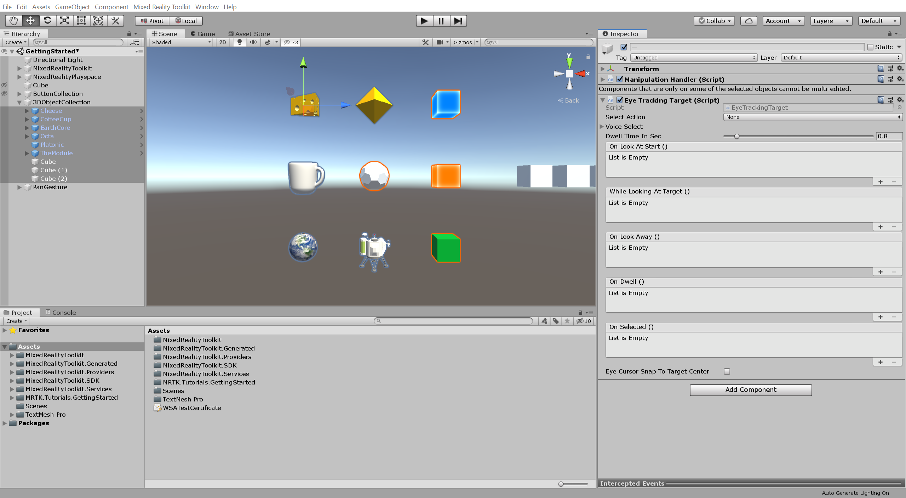

With all the **child objects** still selected, configure the **Eye Tracking Target (Script)** component as follows:

* Change **Select Action** to **Select**, to define the air-tap action for this object as Select
* Expand **Voice Select** and set the voice command list **Size** to 1, and then, in the new element list that appear, change **Element 0** to **Select**, to define the speech command action for this object as Select

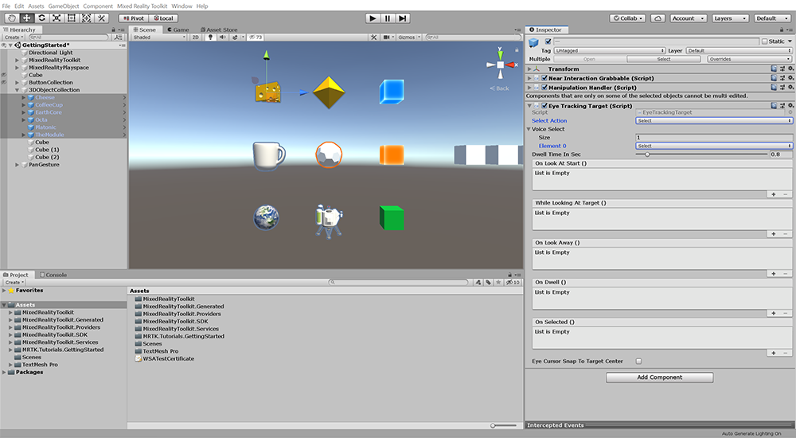

### 2. Add the Eye Tracking Tutorial Demo (Script) component  to all target objects

With all the **child objects** still selected, use the **Add Component** button to add the **Eye Tracking Tutorial Demo (Script)** component to all the child objects:

> [!NOTE]
> The Eye Tracking Target (Script) component is not part of MRTK. It was provided with this tutorial's assets.

### 3. Implement the While Looking At Target event

In the Hierarchy window, select the **Cheese** object, then create a new **While Looking At Target ()** event, configure the **Cheese** object to receive the event, and define **EyeTrackingTutorialDemo.RotateTarget** as the action to be triggered:

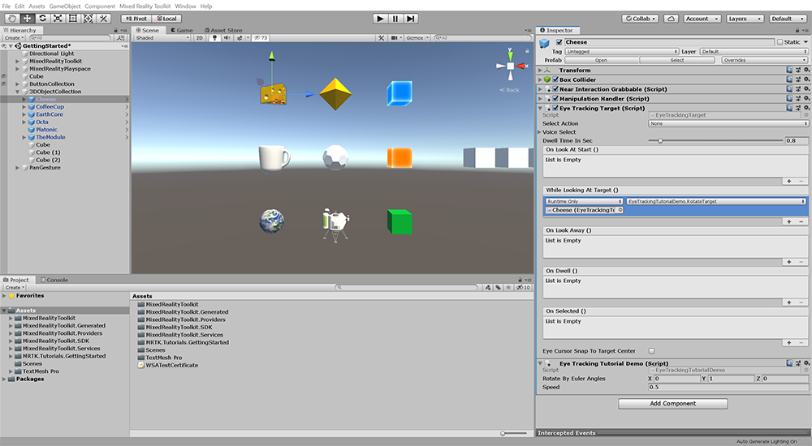

**Repeat** for each of the child objects in the 3DObjectCollection.

> [!TIP]
> For a reminder on how to implement events, you can refer to the [Hand tracking gestures and interactable buttons](mrlearning-base-ch2.md#hand-tracking-gestures-and-interactable-buttons) instructions.

### 4. Implement the On Selected event

In the Hierarchy window, select the **Cheese** object, then create a new **On Selected ()** event, configure the **Cheese** object to receive the event, and define **EyeTrackingTutorialDemo.BlipTarget** as the action to be triggered:

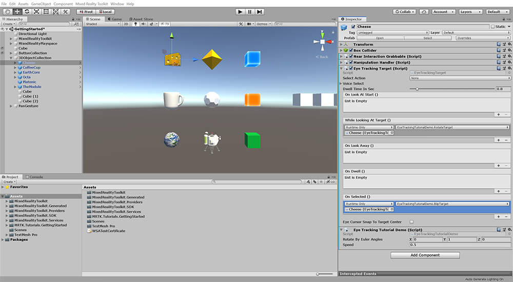

**Repeat** for each of the child objects in the 3DObjectCollection.

### 5. Enable simulated eye tracking for in-editor simulations

In the Hierarchy window, select the **MixedRealityToolkit** object, then in the Inspector window, select the **Input** tab, expand the **Input Data Providers** section and then the **Input Simulation Service** section, and clone the **DefaultMixedRealityInputSimulationProfile** to replace it with your own customizable **Input Simulation Profile**:

> [!TIP]
> For a reminder on how to clone MRTK profiles, you can refer to the [How to configure the Mixed Reality Toolkit Profiles](mrlearning-base-ch2.md#how-to-configure-the-mixed-reality-toolkit-profiles-change-spatial-awareness-display-option) instructions.

In the **Eye Simulation** section, check the **Simulate Eye Position** checkbox to enable eye tracking simulation:

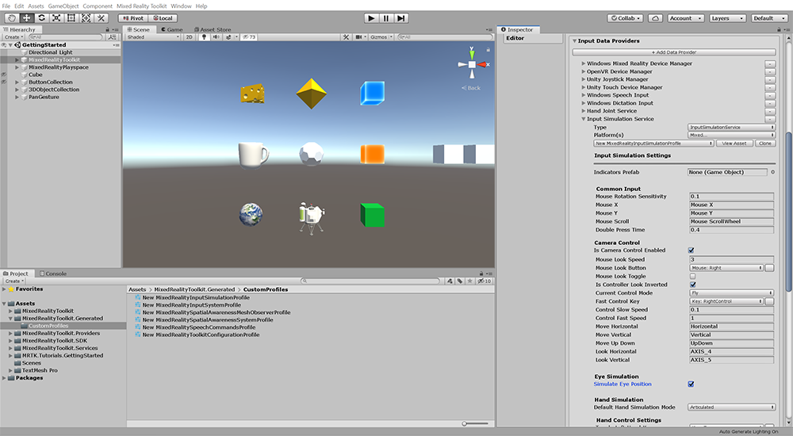

If you now enter Game mode, you can test the spin and blip effects you implemented by adjusting the view so the cursor hits one of the objects and using hand interaction or speech command to select the object:

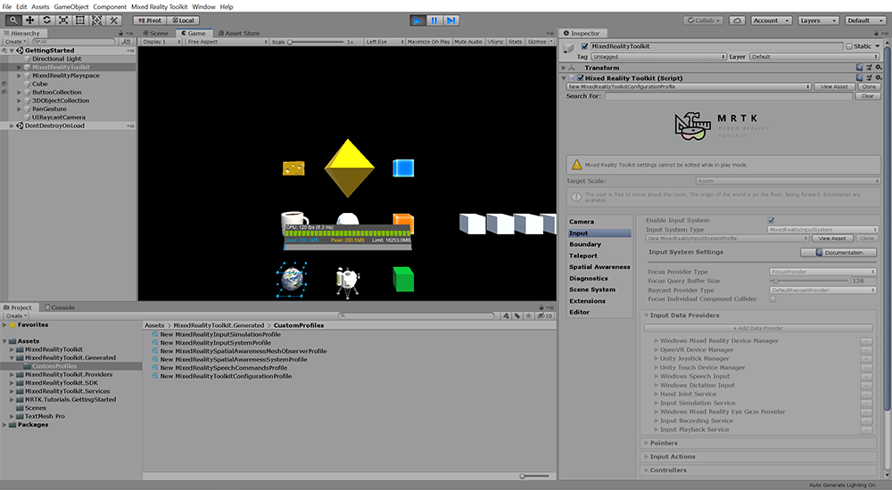

> [!NOTE]
> If you did not use the DefaultHoloLens2ConfigurationProfile to clone your customizable MRTK configuration profile, as instructed in the [Configure the Mixed Reality Toolkit](mrlearning-base-ch1.md#configure-the-mixed-reality-toolkit) instructions, eye tracking may not be enable in your project and will need to be enabled. For that, you can refer to the [Getting started with eye tracking in MRTK](https://microsoft.github.io/MixedRealityToolkit-Unity/Documentation/EyeTracking/EyeTracking_BasicSetup.html) instructions.

### 6. Enable Gaze Input in the Visual Studio project's app capabilities

Before building and deploying your app from Visual Studio to your device, Gaze Input has to been enabled in the project's app capabilities. For this, you can follow the [Testing your Unity app on a HoloLens 2](https://microsoft.github.io/MixedRealityToolkit-Unity/Documentation/EyeTracking/EyeTracking_BasicSetup.html#testing-your-unity-app-on-a-hololens-2) instructions.

## Congratulations

You have successfully added basic eye tracking capabilities to your application. These actions are only the beginning of a world of possibilities with eye tracking. In this tutorial, you also learned about other advanced input features, such as voice commands and panning gestures.

[Next Lesson: 7. Creating a Lunar Module sample application](mrlearning-base-ch6.md)
