# MR Learning Base Module - Lunar Module Assembly Sample Experience

In this lesson, we will combine multiple concepts learned from previous lessons to create a unique sample experience. We will create a lunar module assembly application whereby a user will need to use tracked hands to pick up lunar module parts and attempt to assemble a lunar module. We will use pressable buttons to toggle placement hints, to reset our experience, and to launch our lunar module into space! In future tutorials, we will continue to build upon this experience, including powerful multi-user use-cases that leverages Azure Spatial Anchors for spatial alignment.

## Objectives

- Combine multiple concepts from previous lessons to create a unique experience
- Learn how to toggle objects
- Trigger complex events using pressable buttons
- Use rigidbody physics and forces
- Explore the use of tool tips

## Instructions

### Configuring the Lunar Module

In this chapter, we will be introduced to the various components needed to create our sample experience.

1. Add the lunar module assembly prefab to your Base Scene. To do this, in your project tab, search for "Rocket Launcher_Tutorial." You may also find the prefab in Assets>BaseModuleAssets>Prefabs. You may see two rocket launcher prefabs; one with the name "tutorial" and another with the name "complete." Drag the "Rocket Launcher_Tutorial" prefab to your Base Scene. Feel free to position the placement of the prefab in your scene.
   Note: The "Rocket Launcher_Complete" prefab is the completed launcher, provided for reference. 

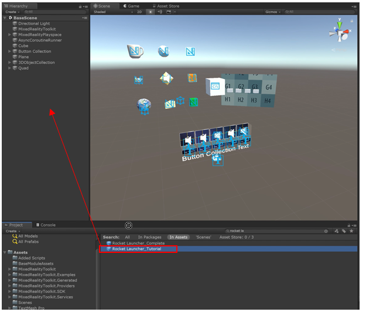

If you expand the "Rocket Launcher_Tutorial" game object in your hierarchy, and further expand the "Lunar Module" object, you will see several child objects that have a material called "x-ray." The "x-ray" material allows for a slightly translucent color which we will use as placement hints for the user. 

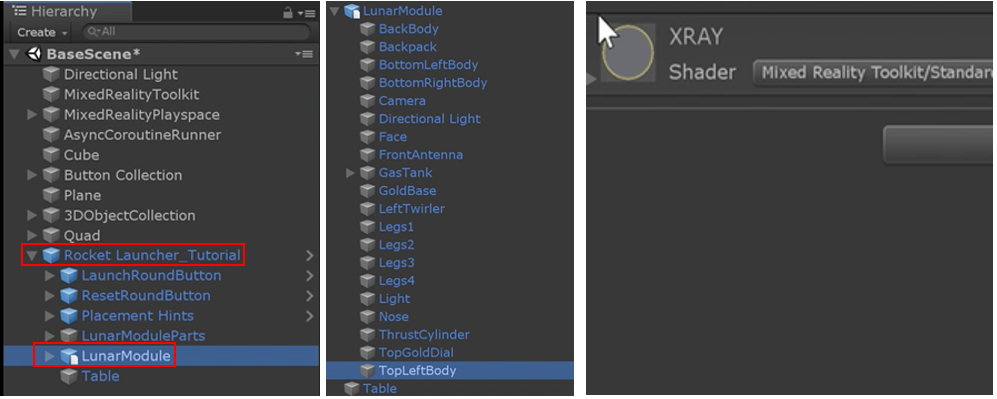
There are five parts to the lunar module that the user is going to interact with, as shown in the image below:

1.	The Rover Enclosure
2.	The Fuel Tank
3.	The Energy Cell
4.	The Docking Portal 
5.	The External sensor

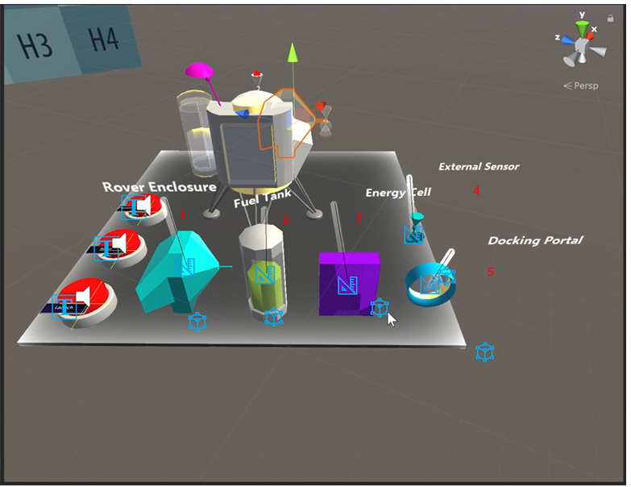

> Note: The game object names that you see in your base scene hierarchy do not correspond to the names of the objects in the scene.

Step 2: Add an audio source to the lunar module. Make sure the lunar module is selected in your base scene hierarchy and click "Add Component." Search for "Audio Source" and add it to the object. Leave it blank for now. We will use this to play the launching sound later.
 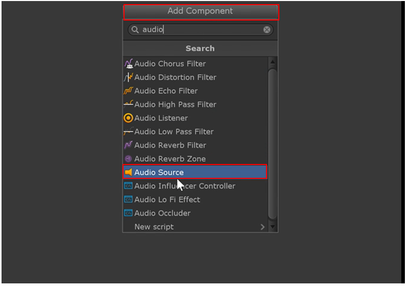
Step 3: Add the script "toggle placement hints." Click "Add Component" and search for "Toggle Placement Hints." This is a custom script that allows you to turn on and off the translucent hints (objects with the x-ray material) mentioned earlier. 
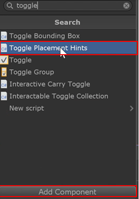
Step 4: Since we have 5 objects, type in "5" for the game object array size. Then you should see 5 new elements appear. 

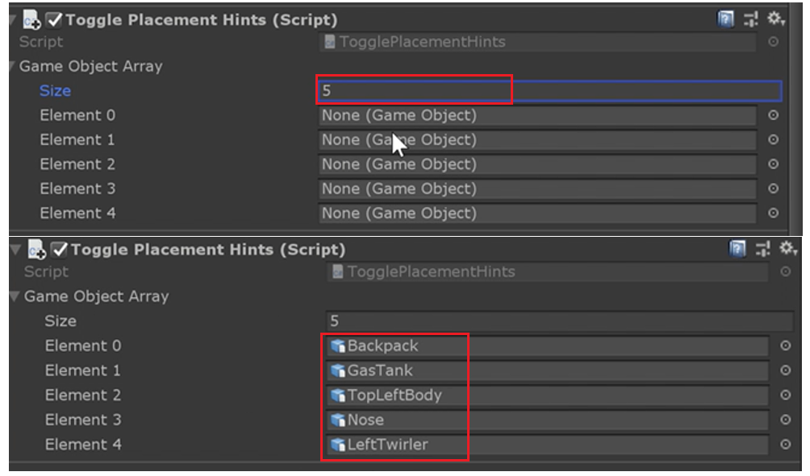

Drag each of the translucent objects into the boxes that say "None (Game Object)." 
Drag the following objects from the lunar module in your base scene: 

•	Backpack

•	GasTank

•	Topleftbody

•	Nose

•	LeftTwirler

 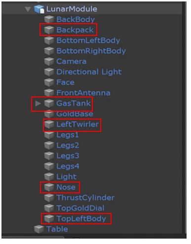

Now the "toggle placement hints" script is configured. This will allow us to turn the hints on and off.

Step 5: Add the "launch lunar module" script. Click the "Add Component" button, search for "launch lunar module" and select it. This script will be responsible for launching the lunar module. When we press a configured button, it will add an upward force to the lunar module's rigid body component and will cause the module to launch upwards. If you are indoors, the lunar module may crash against your ceiling mesh. But if you are outdoors, it will fly in to space indefinitely. 

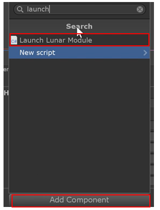

Step 6: Adjust the thrust so that the lunar module will fly up gracefully. Try a value of 0.01. Leave the "Rb" field blank. Rb stands for rigid body, and this field will be automatically populated during runtime.

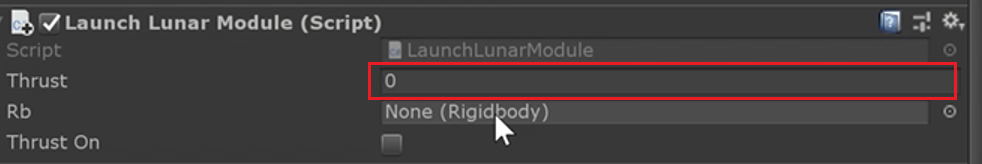

### Lunar Module Parts Overview
The Lunar Module parts parent object is the collection of the objects that the user will interact with. The game object names (with scene labeled names in paretheses) are provided in the list below:

- Backpack (Fuel Tank)
- GasTank (Energy Cell)
- TopLeftBody (Rover Enclosure)
- Nose (Docking Portal)
- LeftTwirler (External Sensor)

Notice that each of these objects has the manipulation handler, as discussed in lesson 4. With the manipulation handler, users are able to grab and manipulate the object. Also note that the setting "two handed manipulation type" is set to "move and rotate." This only permits the user to move the object and not change its size, which is the desired functionality for an assembly application.
In addition, far manipulation is unchecked to allow only for direct interaction of module parts.

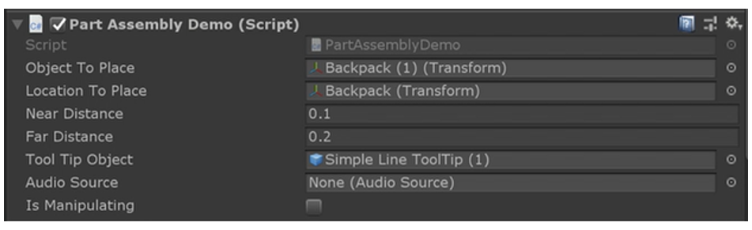

The part assembly demo script (shown above) is the scrip that manages the objects to be placed on to the lunar module by the user. 

The "Object To Place" field is the transform that is selected (n the case of the image above, the backpack/fuel tank) with the object that it can connect to. 

The "Near Distance" and "Far Distance" settings are responsible for determining the proximity to which parts will snap in place or be released. For example, the backpack/fuel tank would need to be 0.1 units away from the lunar module to snap into place. The "Far Distance" sets the location where the object needs to be to detach from the lunar module. In this case, the user’s hand must grab the backpack/fuel tank and pull it 0.2 units away from the lunar module to remove it from snapping back into place.

The "Tool Tip Object" is the tool tip label in the scene. When the objects are snapped in place, the label will be disabled. 

The Audio Source will be automatically grabbed. 

### Placement Hints Buttons
In [Lesson 2](mrlearning-base-ch2.md), you learned how to place and configure buttons to do things like change the color of an item or make it play a sound when it is pushed. We will continue to use those principles as we configure our buttons for toggling placement hints. 

The goal is to configure our button so that every time the user presses the placement hint button, it will toggle visibility of the translucent placement hints. 

Step 1: Move the Lunar Module to the empty "runtime only" slot in the inspector panel while the Placement Hints object is selected in your base scene hierarchy. 
 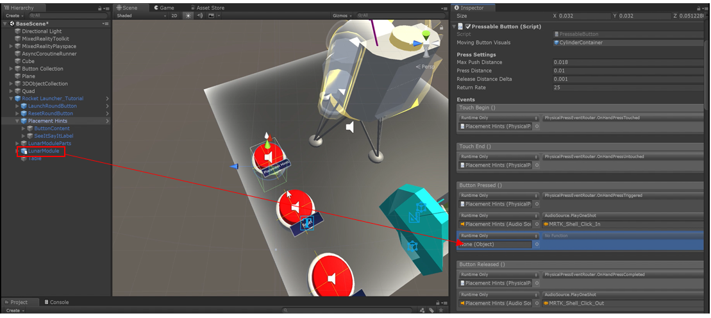
Step 2: Now click the dropdown list where it says, "no function." Go down to "TogglePlacementHints," and under that menu select "ToggleGameObjects ()." ToggleGameObjects() will toggle the placement hints on and off so that they are visible or invisible every time the button is pressed.
 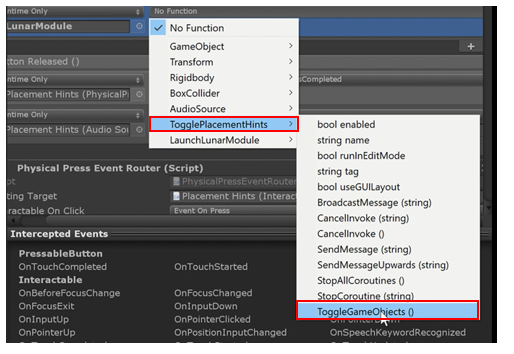

### Configuring the Reset Button

There will be situations where the user makes a mistake, or accidently throws the object away, or just wants to rest the experience. The reset button will add the ability to restart the experience. 

Step 1: Select the reset button. In the base scene, it’s named "ResetRoundButton." 

Step 2: Drag the lunar module from the base scene hierarchy into the empty slot under "button pressed" the inspector panel.
 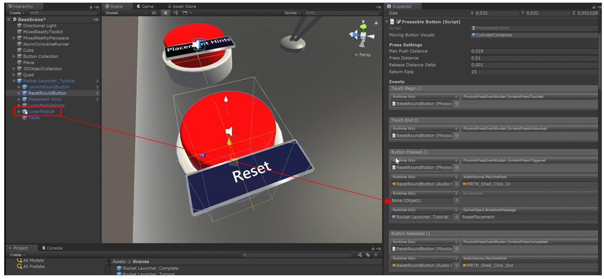

Step 3: Select the dropdown menu that says, "no function" and hover over "LaunchLunarModule." Now select "resetModule ()."

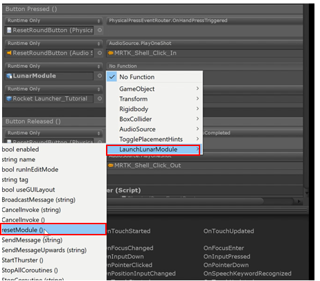

> Note: You will notice that by default the "GameObject.BroadcastMessage" is configured to "ResetPlacement." This will broadcast a message called "ResetPlacement" for every child object of RocketLauncher_Tutorial. Any object that has a method for "ResetPlacement()" will respond to that message by resetting it's position. 

### Launching the Lunar Module
This chapter we will be configuring the launch button. This will permit the user to press the button and launch the Lunar Module into space.

Step 1: Select the launch button (in the base scene it’s named "LaunchRoundButton"). Drag the Lunar Module to the empty slot under "Touch End" in the inspector panel.
 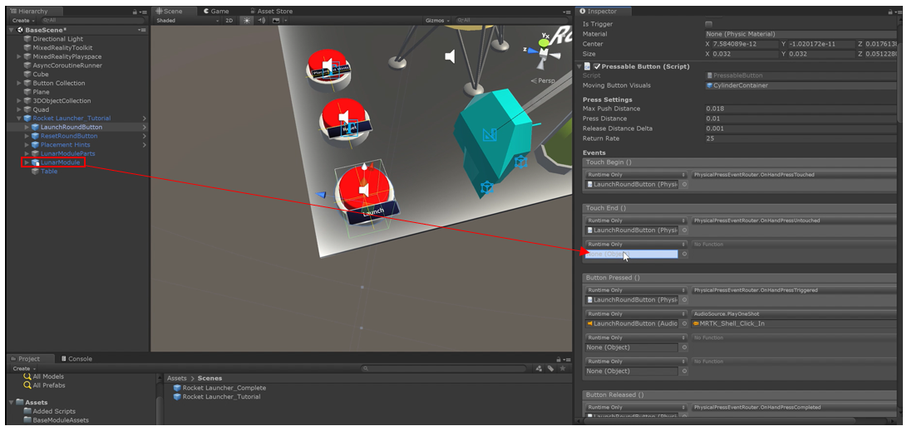
Step 2: Select the dropdown menu that says, "no function." Hover over "LaunchLunarModule" and select "StopThruster ()." This will control how much thrust the user wants to give to the Lunar Module. 
 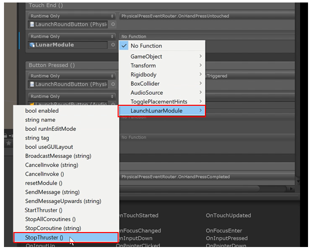
Step 3: Under "ButtonPressed()", add the Lunar Module (click, hold, and drag) to the empty slot. 

Step 4: Click the dropdown menu that says, "no function" and hover over "LaunchLunarModule" and select "StartThruster ()." 
 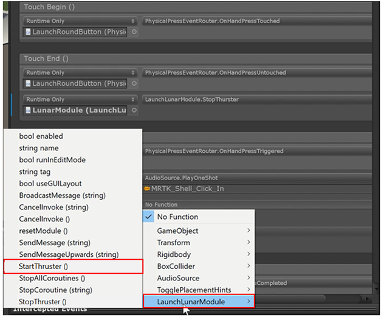
Step 5: Add music to the Lunar Module so that when the rocket takes off, the music will play. To do this, drag the Lunar Module to the next empty slot under "Button Pressed()".

Step 6: Select the dropdown menu that says, "no function" and hover over "AudioSource" and select "PlayOneShot (AudioClip)." Feel free to explore the variety of sounds included with the MRTK. For this example, we are going to stick with "MRTK_Gem."
 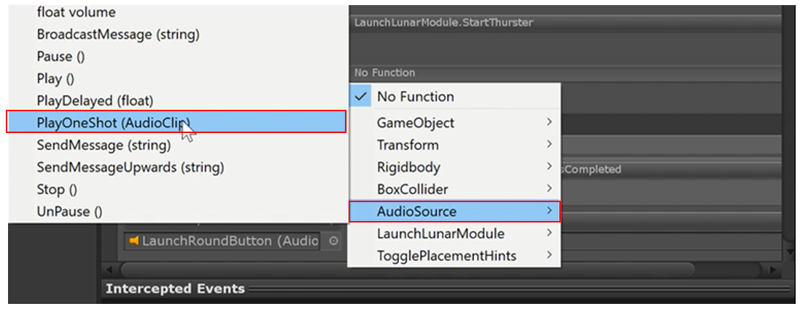

### Congratulations 
You have fully configured this application! Now when you press play, you can fully assemble the Lunar Module, toggle hints, launch the Lunar Module, and reset it to do it all over again.
