# 7. Creating a Lunar Module sample application
<!-- TODO: Rename to 'Creating a Rocket Launcher sample application' -->

In this tutorial, multiple concepts are combined from previous lessons to create a unique sample experience. You will learn how to create a part assembly application whereby a user needs to use tracked hands to pick up parts and attempt to assemble a lunar module. You will use pressable buttons to toggle placement hints on and off, to reset the experience, and to launch the lunar module into space!

In future tutorials, you will continue to build upon this experience, which includes powerful multi-user use cases that leverage Azure Spatial Anchors for spatial alignment.

## Objectives

* Combine multiple concepts from previous lessons to create a unique experience
* Learn how to toggle objects
* Trigger complex events using pressable buttons
* Use rigidbody physics and forces
* Explore the use of tool tips

## Lunar Module Parts overview
<!-- TODO: Rename to 'Implementing the part assembly functionality' -->

In this section, you will create a simple part assembly challenge where the user's goal is to place five parts that are spread out on the table at the correct location on the Lunar Module.

The main steps you will take to achieve this are:

1. Add the Rocket Launcher prefab to the scene
2. Enable object manipulation for all the parts
3. Add and configure the Part Assembly Demo (Script) component

> [!NOTE]
> The Part Assembly Demo (Script) component is not part of MRTK. It was provided with this tutorial's assets.

### 1. Add the Rocket Launcher prefab to the scene

In the Project window, navigate to the **Assets** > **MRTK.Tutorials.GettingStarted** > **Prefabs** > **RocketLauncher** folder, drag the **RocketLauncher** prefab into the Hierarchy window to add it to your scene, and then position it at a suitable location, for example:

* Transform Position X = 1.5, Y = -0.4, Z = 0, so it is positioned to the right of the user at waist height
* Transform Rotation X = 0, Y = 180, Z = 0, so the main features of the experience faces the user

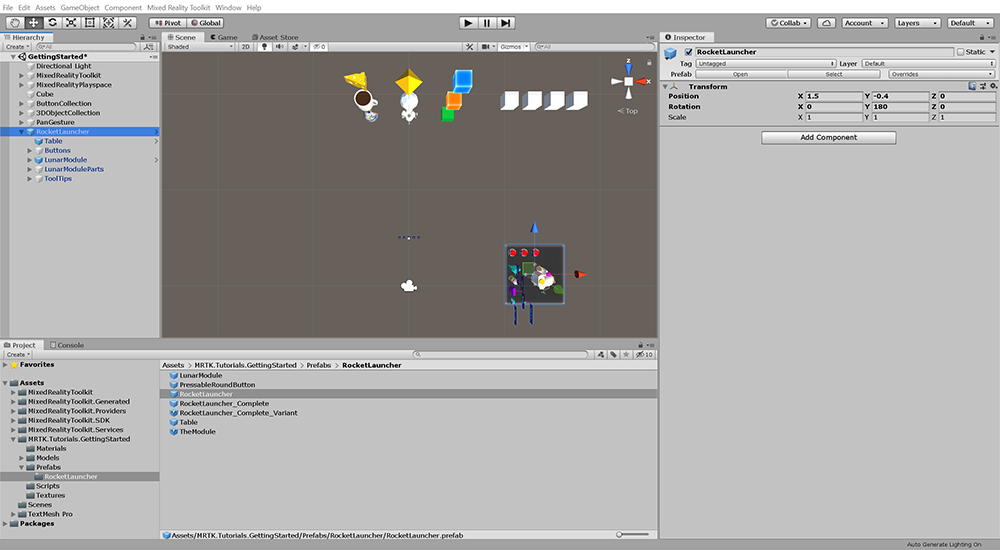

### 2. Enable object manipulation for all the parts

In the Hierarchy window, locate the RocketLauncher > **LunarModuleParts** object and select all the **child objects**, add the **Manipulation Handler (Script)** component and the **Near Interaction Grabbable (Script)** component, and then configure the Manipulation Handler (Script) as follows:

* Change **Two Handed Manipulation Type** to Move Rotate so scaling is disabled
* Un-check the **Allow Far Manipulation** checkbox to only allow near interaction

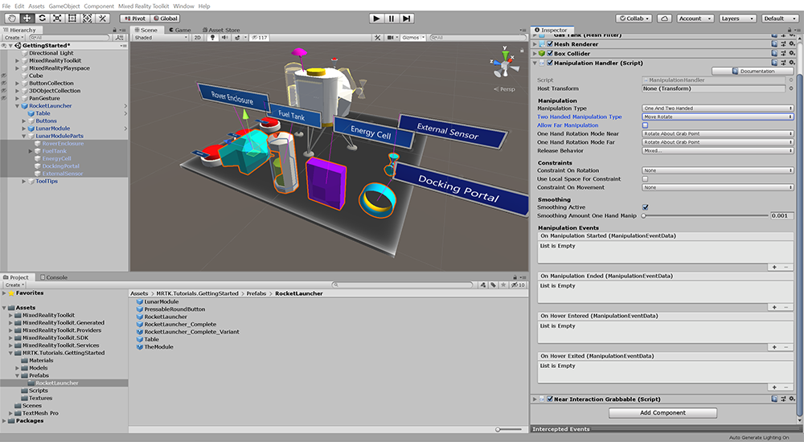

> [!TIP]
> For a reminder, with step by step instructions, on how to implement object manipulation, you can refer to the [Manipulating 3D Objects](mrlearning-base-ch4.md#manipulating-3d-objects) instructions.

### 3. Add and configure the Part Assembly Demo (Script) component

With all the LunarModuleParts child objects still selected, add an **Audio Source** component and then configure it as follows:

* Assign a suitable audio clip to the **AudioClip** field, for example, MRKT_Scale_Start
* Un-check the **Play On Awake** checkbox, so the audio clip does not automatically play when the scene loads
* Change **Spatial Blend** to 1, to enable spatial audio

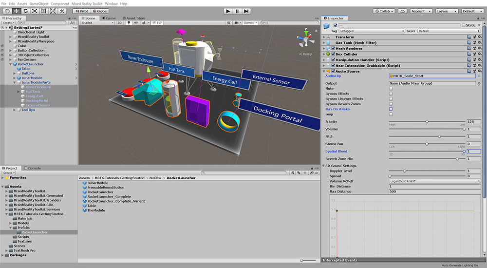

With all the LunarModuleParts child objects still selected, add the **Part Assembly Demo  (Script)** component:

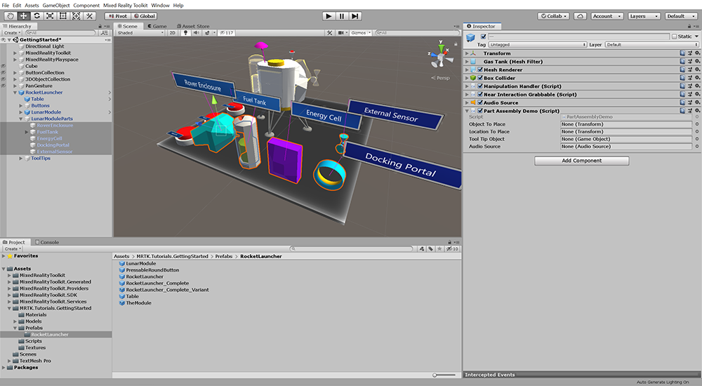

In the Hierarchy window, select the **RoverEnclosure** object and configure its **Part Assembly Demo (Script)** component as follows:

* To the **Object To Place** field, assign the object itself, in this case, the **RoverEnclosure** object
* To the **Location To Place** field, assign the corresponding PlacementHints object, in this case, the **RoverEnclosure_PlacementHints** object
* To the **Tool Tip Object** field, assign the corresponding ToolTipObject, in this case, the **RoverEnclosure_ToolTip** object
* To the **Audio Source** field, assign the object itself, in this case, the **RoverEnclosure** object

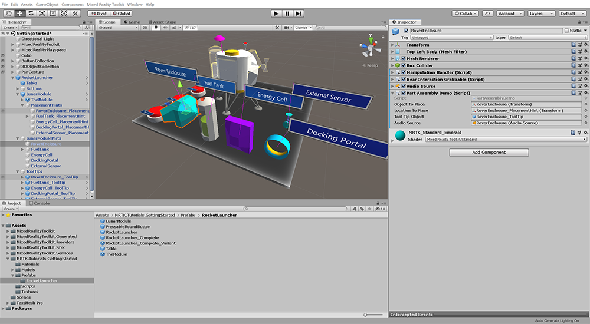

**Repeat** for each of the other LunarModuleParts child objects, i.e. FuelTank, EnergyCell, DockingPortal, and ExternalSensor.

If you now enter Game mode and move an 'Object To Place' close to it's corresponding 'Location To Place' you will notice:

* The object will snap into place and be parented under the LunarModule object so it becomes part of the Lunar Module
* The Audio Source on the object will play the assigned Audio Clip at the location of the object
* The corresponding Tool Tip object will be hidden

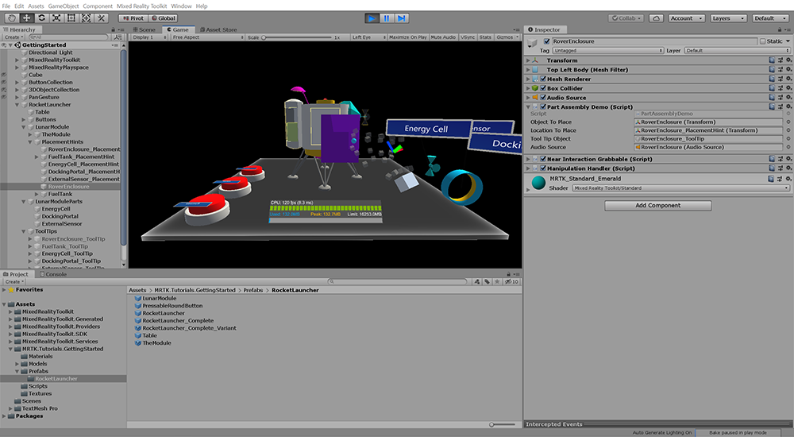

> [!TIP]
> For a reminder on how to use the in-editor input simulation, you can refer to the [Using the In-Editor Hand Input Simulation to test a scene](https://microsoft.github.io/MixedRealityToolkit-Unity/Documentation/GettingStartedWithTheMRTK.html#using-the-in-editor-hand-input-simulation-to-test-a-scene) guide in the [MRTK Documentation Portal](https://microsoft.github.io/MixedRealityToolkit-Unity/README.html).

## Configuring the Lunar Module

In this section, you will add additional features to the Rocket Launcher application so the user can:

* Interact with the Lunar Module
* Launch the Lunar Module into space and play a sound when it is launched
* Reset the application so the Lunar Module and all the part are placed back to their original position
* Hide the placement hints to make the part assembly challenge more difficult.

The main steps you will take to achieve this are:

1. Enable object manipulation
2. Enable physics
3. Add an Audio Source component
4. Add and configure the Launch Lunar Module (Script) component
5. Add and configure the Toggle Placement Hints (Script) component

> [!NOTE]
> The Launch Lunar Module (Script) component and the Toggle Placement Hints (Script) component are not part of MRTK. They were provided with this tutorial's assets.

### 1. Enable object manipulation

In the Hierarchy window, select the RocketLauncher > **LunarModule** object, add the **Manipulation Handler (Script)** component and the **Near Interaction Grabbable (Script)** component, and then configure the Manipulation Handler (Script) as follows:

* Change **Two Handed Manipulation Type** to Move Rotate so scaling is disabled
* Un-check the **Allow Far Manipulation** checkbox to only allow near interaction

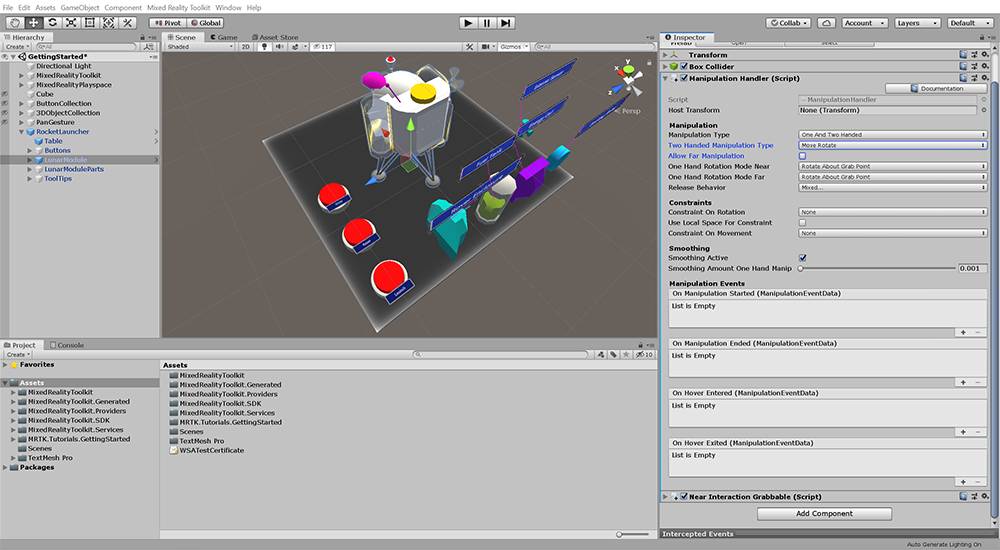

### 2. Enable physics

With the RocketLauncher > **LunarModule** object still selected, add a Rigidbody component and then configure it as follows:

* Un-check the **Use Gravity** checkbox so the Lunar Module is not affected by gravity
* Check the **Is Kinematic** checkbox so the Lunar Module initially isn't affected by physic forces

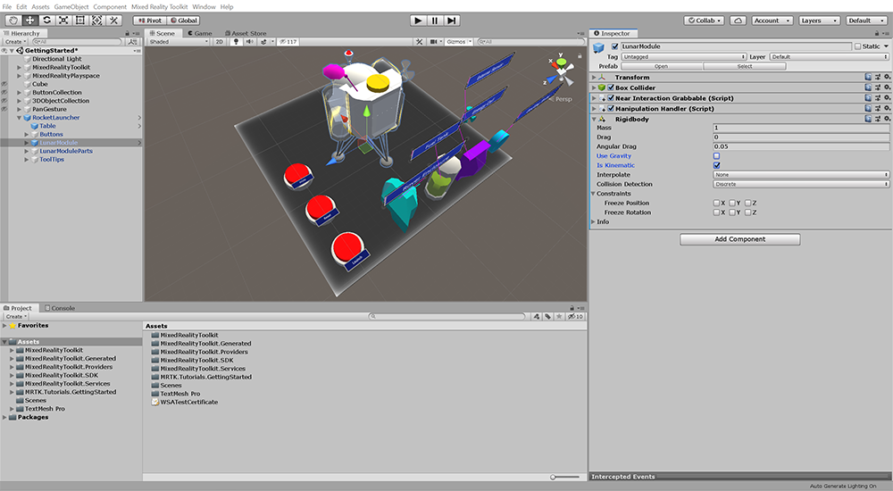

### 3. Add an Audio Source component

With the RocketLauncher > **LunarModule** object still selected, add an **Audio Source** component and then configure it as follows:

* Change **Spatial Blend** to 1 to enable spatial audio

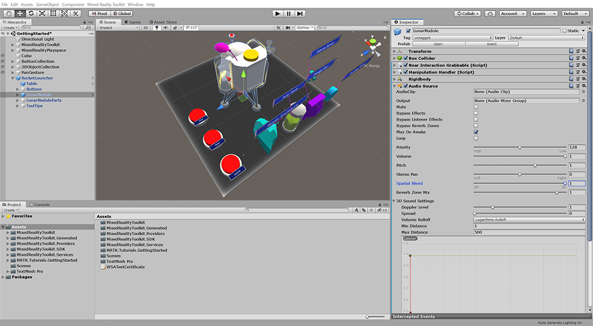

### 4. Add and configure the Launch Lunar Module (Script) component

With the RocketLauncher > **LunarModule** object still selected, add the **Launch Lunar Module (Script)** component and then configure it as follows:

* Change **Thrust** value so the Lunar Module will fly up gracefully when launched, for example, to 0.01

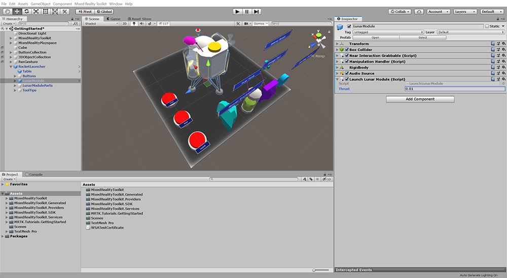

### 5. Add and configure the Toggle Placement Hints (Script) component

With the RocketLauncher > **LunarModule** object still selected, add the **Toggle Placement Hints (Script)** component and then configure it as follows:

* Set the Game Object Array **Size** property to 5
* Assign each of the **PlacementHints** object's **child objects** to the an **Element** field in the Game Object Array:

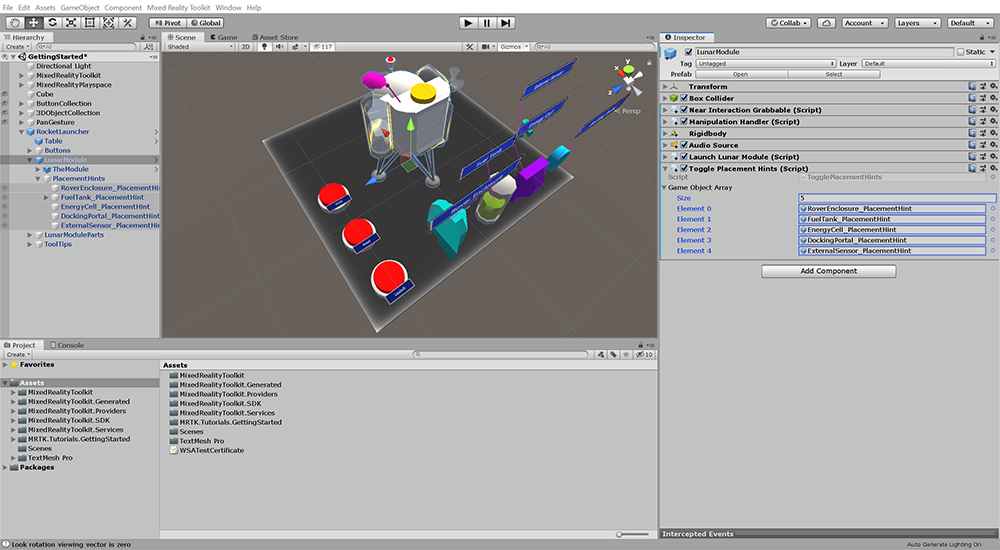

## Configuring the Launch button

In the Hierarchy window, select the RocketLauncher > Buttons > **LaunchButton** object, then on the **Pressable Button (Script)** component, create a new **Button Pressed ()** event, configure the **LunarModule** object to receive the event, and define **LaunchLunarModule.StartThruster** as the action to be triggered:

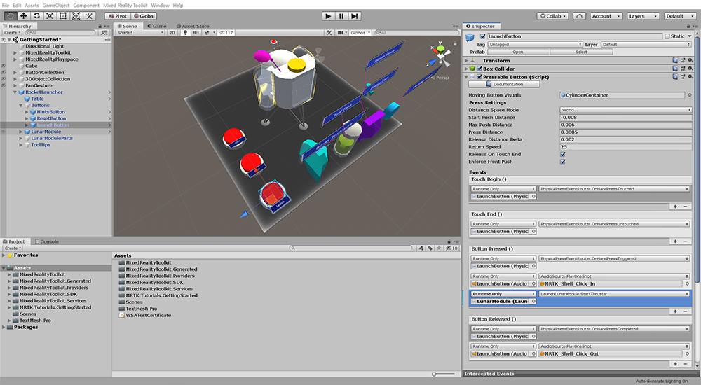

> [!TIP]
> For a reminder on how to implement events, you can refer to the [Hand tracking gestures and interactable buttons](mrlearning-base-ch2.md#hand-tracking-gestures-and-interactable-buttons) instructions.

With the RocketLauncher > Buttons > **LaunchButton** object still selected, on the **Pressable Button (Script)** component, create a new **Button Pressed ()** event, configure the **LunarModule** object to receive the event, define **AudioSource.PlayOneShot** as the action to be triggered, and assign a suitable audio clip to the **Audio Clip** field, for example, the MRTK_Gem audio clip:

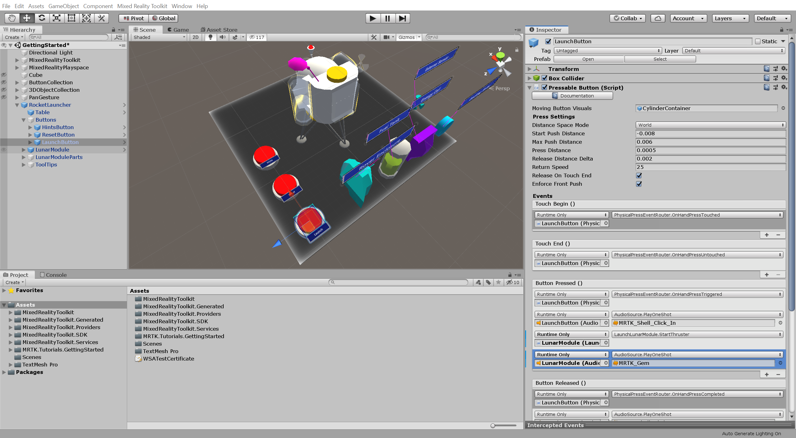

With the RocketLauncher > Buttons > **LaunchButton** object still selected, on the **Pressable Button (Script)** component, create a new **Touch Ended ()** event, configure the **LunarModule** object to receive the event, and define **LaunchLunarModule.StopThruster** as the action to be triggered:

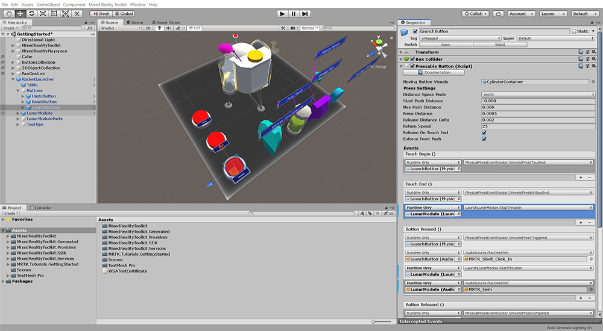

If you now enter Game mode and press the Launch button, you will hear the audio clip play, and if you hold the Launch button down for about a second or longer, you will see the Lunar Module launch into space:

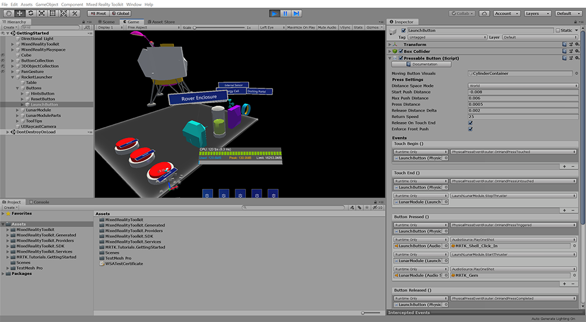

## Configuring the Reset button

In the Hierarchy window, select the RocketLauncher > Buttons > **ResetButton** object, then on the **Pressable Button (Script)** component, create a new **Button Pressed ()** event, configure the **LunarModule** object to receive the event, and define **LaunchLunarModule.ResetModule** as the action to be triggered:

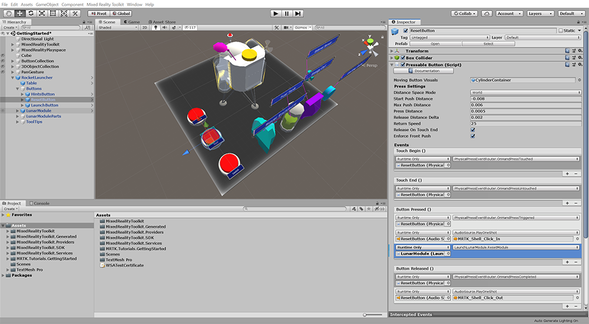

With the RocketLauncher > Buttons > **ResetButton** object still selected, on the **Pressable Button (Script)** component, create a new **Button Pressed ()** event, configure the **RocketLauncher** object to receive the event, define **GameObject.BroadcastMessage** as the action to be triggered, and enter **ResetPlacement** in message field:

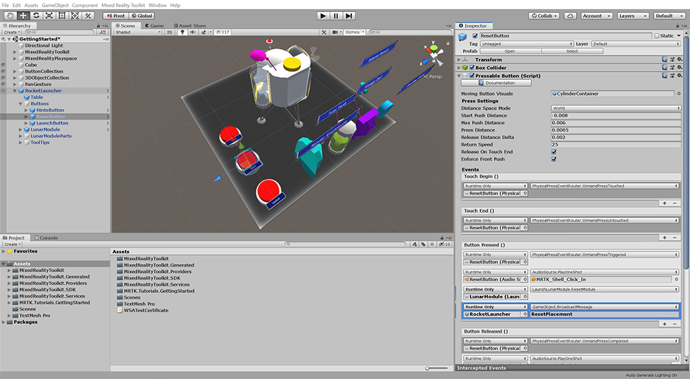

> [!TIP]
> The GameObject.BroadcastMessage action sends the ResetPlacement message from the RocketLauncher object to all its child object. Any child object that has the ResetPlacement function, which is defined in the Part Assembly Demo (Script) component you added to all the LunarModuleParts child object, will invoke the ResetPlacement function which resets that child object's placement.

If you now enter Game mode and press the Reset button you will hear the audio clip being played and see the Lunar Module being launched into space:

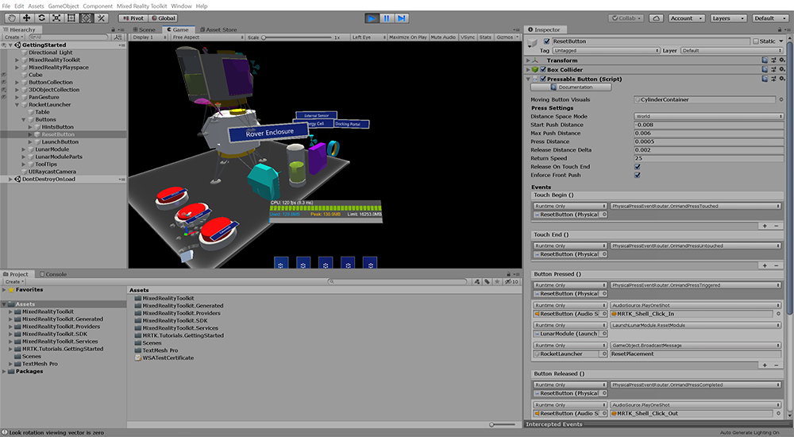

## Configuring the Placement Hints button
<!-- TODO: Rename to 'Configuring the Hints button'-->

In the Hierarchy window, select the RocketLauncher > Buttons > **HintsButton** object, then on the **Pressable Button (Script)** component, create a new **Button Pressed ()** event, configure the **LunarModule** object to receive the event, and define **TogglePlacementHints.ToggleGameObjects** the action to be triggered:

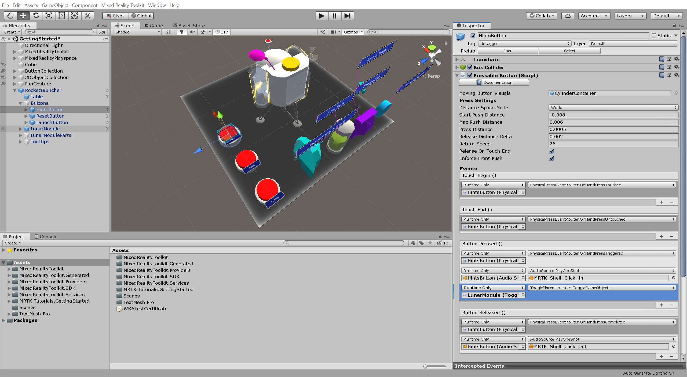

If you now enter Game mode you will notice that the translucent placement hints are disabled by default, but that you can toggle them on and off by pressing the Hints button:

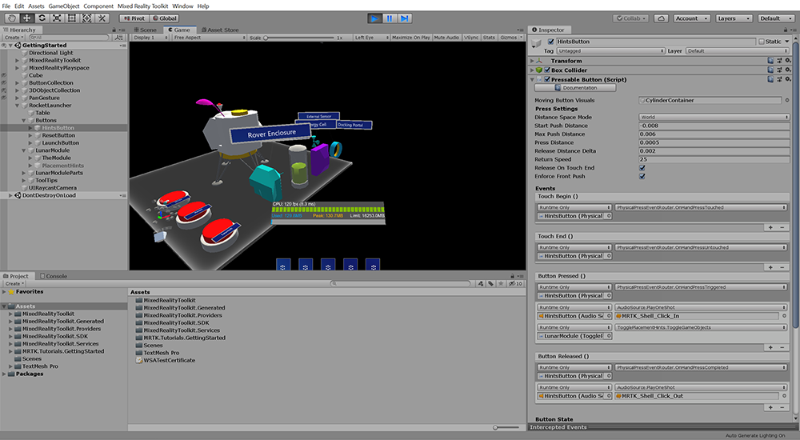

## Congratulations

You have fully configured this application. Now, your application allows users to fully assemble the Lunar Module, launch the Lunar Module, toggle hints, and reset the application to start again.
