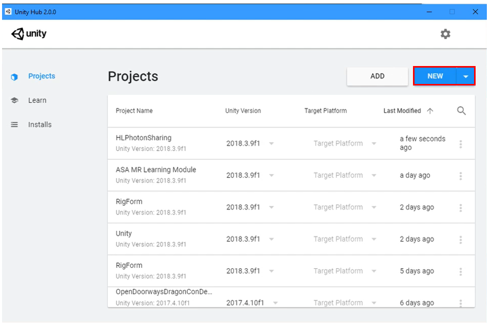

# Setting Up Photon

In this lesson, 

Objectives:

* Learn how to _____________________________________________

* Learn how to _________________________________________________

  

### Setting Up Photon

1. Set up a [Photon](https://dashboard.photonengine.com/en-US/Account/SignUp) account. Doing this will consist of inputing your email and going through some verification steps.
   

2. Once you are signed up, click on SDKs. Once you are on that page, click on "server," and make ensure it says, "self hosted." Then scroll down and click on "server" as seen in the second image below.

   

   

   
   
   3. That will cause a text box to appear labeled, "read me." Go ahead and read it. Once finished, click on the link next to "downloadSDK" to download it.

4. Double click the folder once it finishes downloading.  Once your file explorer opens revealing the SDK folder, copy the SDK folder.
   
   - Your next step would be to go into the windows C: drive and create a new folder called 'server.'
   
   
   
   - Now open up the folder, and paste the SDK folder you copied earlier.
   
   
   
5. Once that is completed, open the SDK folder and go to "deploy," then "bin_Win64," then double click on "photon control."

> Note: If you have any questions about IP address, or any other similar questions, you can find most of your information in the toolbar (as shown in the image below).
>
> 

6. Now that the server is set up and initiated, go back to the Photon website and click on the profile icon (boxed in the image below) and select "your applications."
   

7. Create an application ID by clicking the "create a new app" button.

   

   - Select "Photon RUN" from the dropdown menu under "photon type." Then give it a name, (something you would remember). In this example, we named it "HoloLensPhotonProject." Once finished, click "create."

   

8. Once that is done, return to your applications page and you should see something similar to the picture below. Click on the app ID and copy it. Paste is somewhere you can easily access.  
   

9. Create a new unity project. Open Unity Hub and click on "new." Name it "HLSharingProject." Then click create. 

   > note: This can take up to 2 minutes to load, based on your computer's speed.

> note: pick a place to save your project in your computer by changing the "location" option. Save it to a place you will remember and have easy access to.

10. Once the project loads, click on the "assets store." Then, in the search box shown in the image below, type in "PUN" and select the "Photon PUN-2 FREE" asset. 

    
    
    11. Download and import!
    
    

## Congratulations

You have successfully imported Photon into Unity. Your next step is to set up the project to make it sharable, and then allow connections with other users so that multiple users can see your work. 

[Next Lesson: Sharing(Photon) Lesson 2](placeholderlink)

