# Setting Up Photon

In this lesson, we will learn how to get ready for creating a shared experience by importing Photon Unity Networking (PUN) into your Unity project. Photon is one of several networking options available to Mixed Reality developers to create shared experiences. We we will learn how to create a Photon account, import Photon, and create an optional local server

Objectives:

* Learn how to create Photon account

* Learn how to find and import Photon Unity Networking

* Set up a local Photon server

  

### Setting Up Photon

1. Set up a [Photon](https://dashboard.photonengine.com/en-US/Account/SignUp) account. Navigate to the Photon Sign-up page by clicking on [this link](https://dashboard.photonengine.com/en-US/Account/SignUp). Follow the instructions on the sign-up page to create the account. 
   

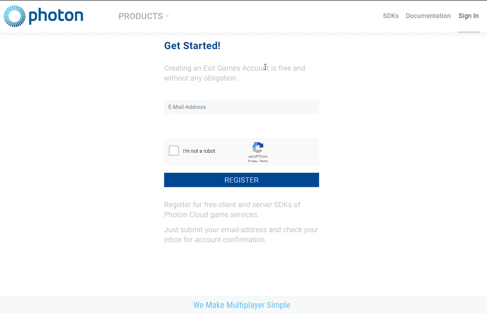

2. Once you are signed up, click on SDKs. Once you are on that page, click on "server," and make ensure it says, "self hosted." Then scroll down and click on "server" as seen in the second image below.

   

   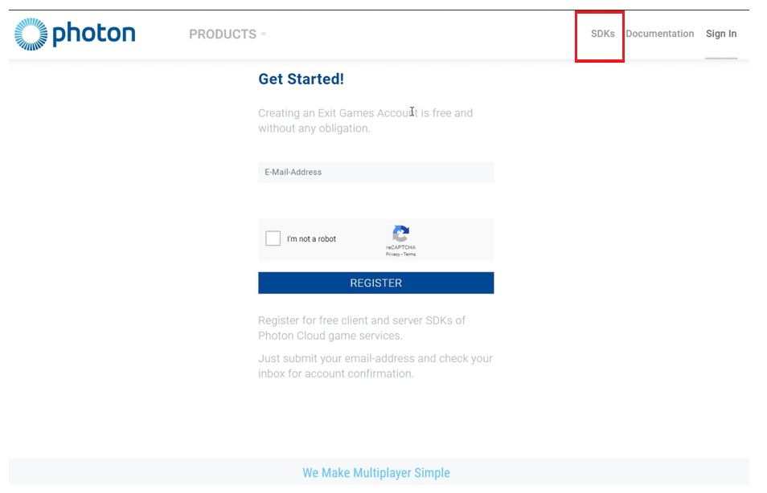

   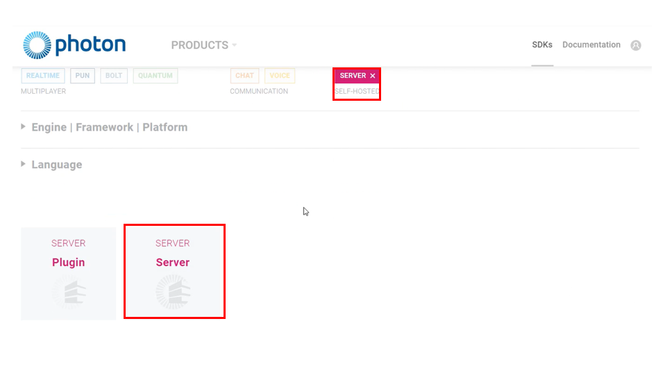
   
   3. That will cause a text box to appear labeled, "read me." Go ahead and read it. Once finished, click on the link next to "downloadSDK" to download it.

4. Double click the folder once it finishes downloading.  Once your file explorer opens revealing the SDK folder, copy the SDK folder.
   
   - Your next step would be to go into the windows C: drive and create a new folder called 'server.'
   
   
   
   - Now open up the folder, and paste the SDK folder you copied earlier.
   
   
   
5. Once that is completed, open the SDK folder and go to "deploy," then "bin_Win64," then double click on "photon control."

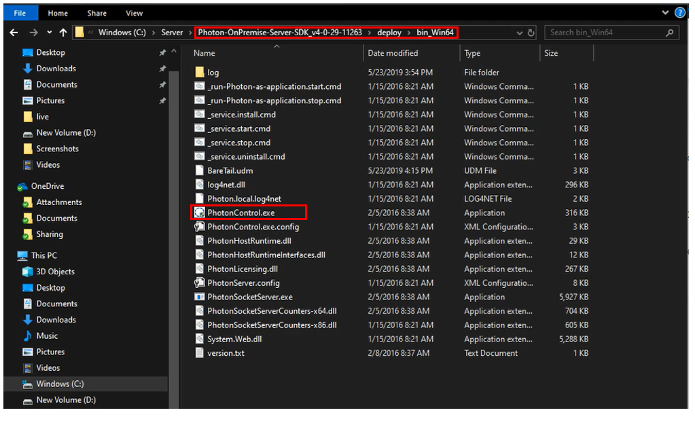

> Note: If you have any questions about IP address, or any other similar questions, you can find most of your information in the toolbar (as shown in the image below).
>
> 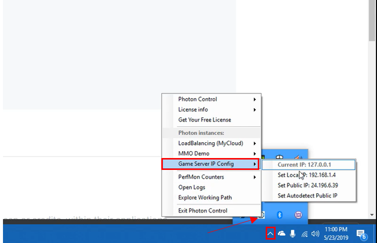

6. Now that the server is set up and initiated, go back to the Photon website and ensure that you are still signed in (or sign back in, if you are not.) Click on the profile icon (boxed in the top right corner of the image below) and select "your applications."
   

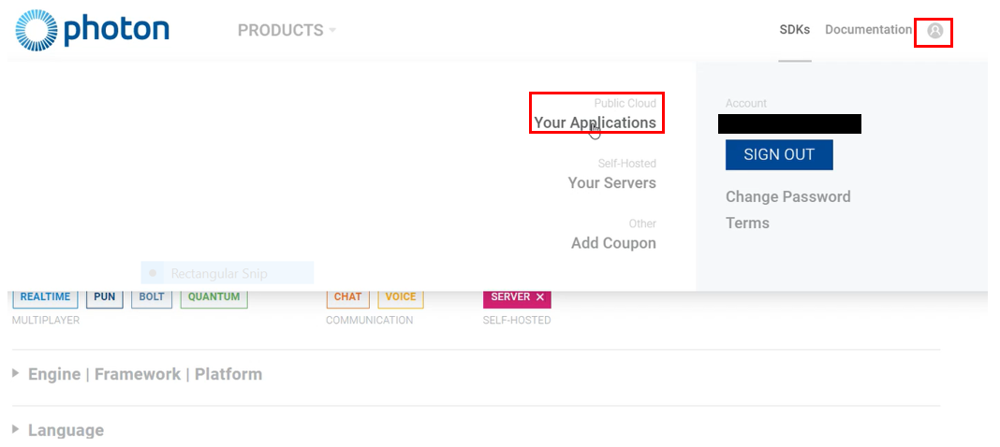

7. Create an application ID by clicking the "create a new app" button.

   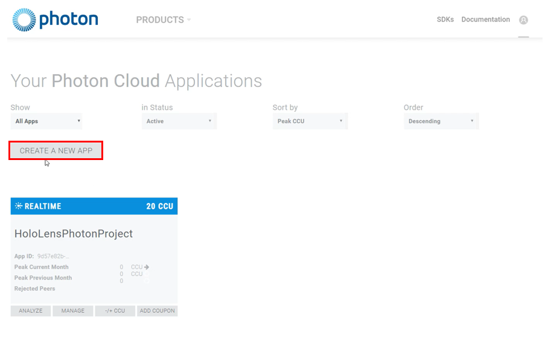

   - Select "Photon PUN" from the dropdown menu under "photon type." Then give it a name, in this example, we named it "HoloLensPhotonProject." Once finished, click the "CREATE" button.

   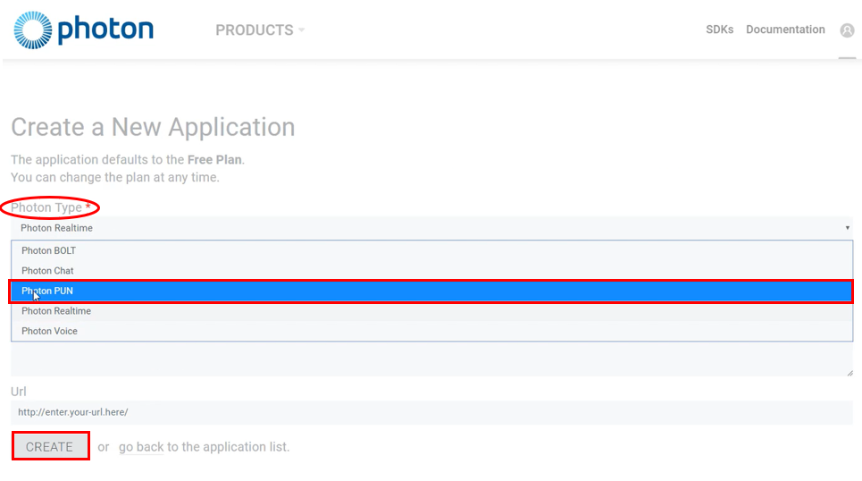

8. Once that is done, return to your applications page and you should see something similar to the picture below. Click on the app ID and copy it. Paste is somewhere you can easily access.  
   

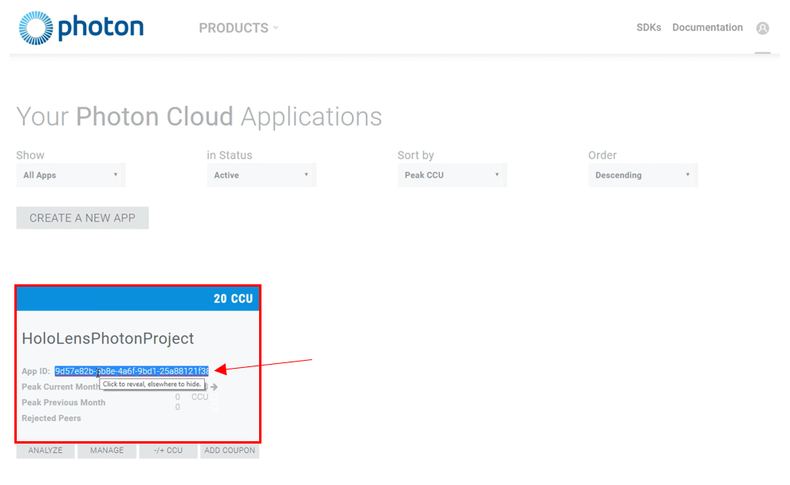

9. Create a new unity project and name it "HLSharingProject." For instructions on how to create a new Unity project, please refer to [the Base Module's "Create Unity Project" section](https://docs.microsoft.com/en-us/windows/mixed-reality/mrlearning-base-ch1#create-new-unity-project). 

10. Once the project loads, click on the "assets store" tab, as shown in the image below. Then, in the search box highlighted in the image below, type in "PUN" and select the "Photon PUN-2 FREE" asset from the search results. 

    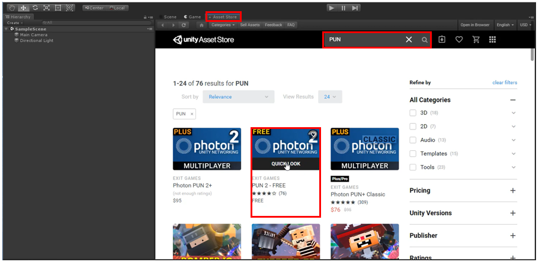
    
    11. Download and import this asset by
    
    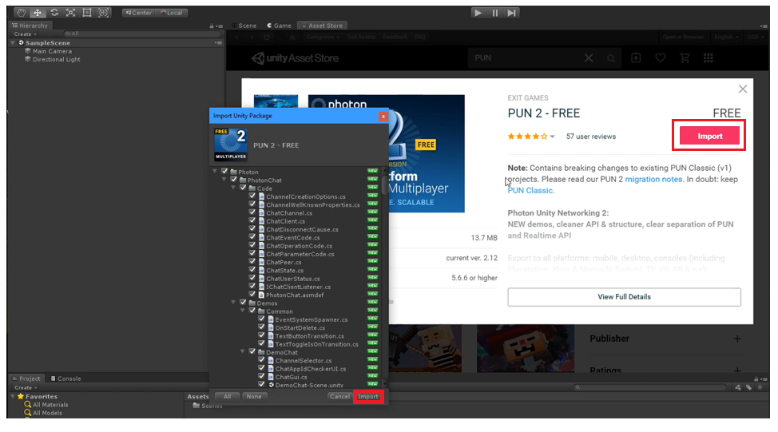

## Congratulations

You have successfully imported Photon into Unity. Your next step is to set up the project to make it sharable, and then allow connections with other users so that multiple users can see your work. 

[Next Lesson: Sharing(Photon) Lesson 2](mrlearning-sharing(photon)-ch2.md)

