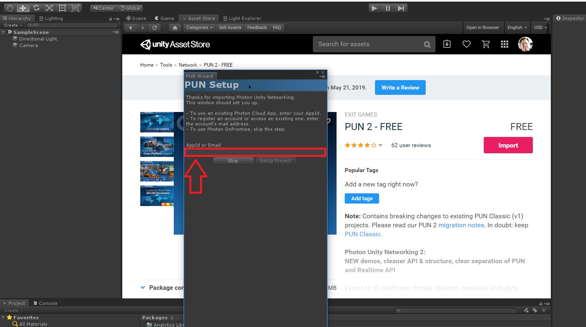
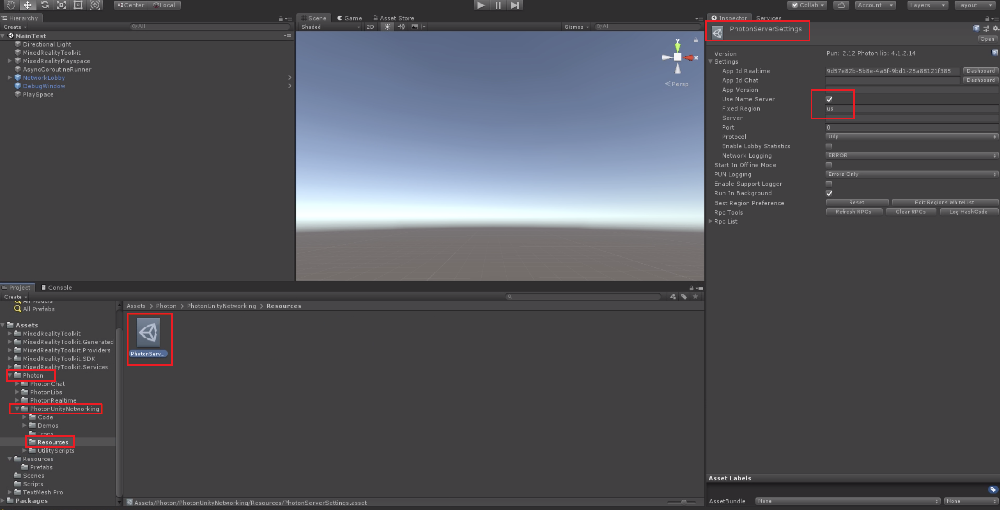

# 1. Setting up Photon Unity Networking

## Overview

In this tutorial, you will learn how to prepare for creating a shared experience by importing Photon Unity Networking (PUN) into your Unity project. Photon is one of several networking options available to Mixed Reality developers to create shared experiences. You will learn how to create a Photon account, import Photon, and create an optional local server

## Objectives

* Learn how to create a Photon account
* Learn how to find and import Photon Unity Networking
* Set up a local Photon server

## Prerequisites

>[!TIP]
>If you have not completed the [Getting started tutorials](mrlearning-base.md) and [Azure Spatial Anchors started tutorials](mrlearning-asa-ch1.md) tutorial series yet, it's recommended that you complete those tutorials first.

* A Windows 10 PC configured with the correct [tools installed](install-the-tools.md)
* Windows 10 SDK 10.0.18362.0 or later
* Some basic C# programming ability
* A HoloLens 2 device [configured for development](using-visual-studio.md#enabling-developer-mode)

>[!IMPORTANT]
>This tutorial series requires <a href="https://unity3d.com/get-unity/download/archive" target="_blank">Unity 2019.1</a> and the recommended version is Unity 2019.1.14. This supersedes any Unity version requirements or recommendations stated in the prerequisites linked above.

## Setting up Photon

1. Set up a [Photon](https://dashboard.photonengine.com//Account/SignUp) account. Navigate to the Photon Sign-up page by clicking on [this link](https://dashboard.photonengine.com//Account/SignUp). Follow the instructions on the sign-up page to create the account.

    

    

2. Create an application ID by clicking the Create a New App button.

    

3. Select Photon PUN from the dropdown menu under Photon Type. Then give it a name. In this example, we named it HoloLensPhotonProject. Once finished, click the Create button.

    

4. Return to your applications page and you should see something similar to the picture below. Click the application ID and copy it. Paste it somewhere you can easily access.  

    

5. Create a new unity project and name it HLSharingProject. For instructions on how to create a new Unity project, please refer to [the Base Module's "Create Unity Project" section](https://docs.microsoft.com//windows/mixed-reality/mrlearning-base-ch1#create-new-unity-project). 

6. Once the project loads, click the Assets Store tab, as shown in the image below. Then, in the search box highlighted in the image below, type in PUN, and select the Photon PUN 2 - FREE" asset from the search results.

    

7. Download and import this asset by pressing the Download and Import buttons.

    

8. Once Photon has completed the importing process, the Pun Wizard appears. Take the application ID (which should be in your clipboard) from step 4, paste it into the AppID box, and press the Setup Project button.

    

9. After successfully adding the AppID, navigate to Photon->PhotonUnityNetworking ->Resources->PhotonServerSettings in Assets. Select the Use Name Server option, and set the fixed region to US or your photon service region.

    

## Congratulations

You have successfully created a Photon account, set up a local Photon server, and imported PUN into Unity. Your next step is to set up the project and allow connections with other users so that multiple users can see your work.

[Next tutorial: 2. Getting Unity ready for development](mrlearning-sharing(photon)-ch2.md)
