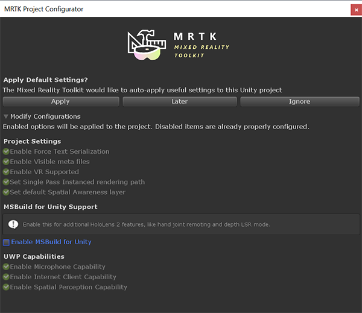
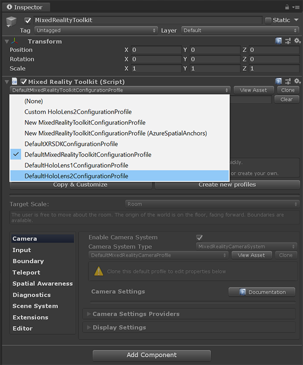

# 2. Getting Unity ready for development

In this tutorial, you will learn how to prepare and configure Unity for application development, including importing the Mixed Reality Toolkit, configuring build settings, and preparing your scene.

## Objectives

* Configure Unity for application development
* Import the Mixed Reality Toolkit
* Prepare your project scene

## Instructions

1. Download and save the Mixed Reality Toolkit Foundation unity package by clicking [here.](https://github.com/microsoft/MixedRealityToolkit-Unity/releases/download/v2.3.0/Microsoft.MixedReality.Toolkit.Unity.Foundation.2.3.0.unitypackage)

2. In Unity, click the Assets menu and select Import Package, then click on Custom Package.

    

3. Select the Unity package you just downloaded from the link provided in step 1. Once the import pop-up window appears in Unity, click the Import button to begin importing the MRTK. This may take several minutes.

    

    >[!NOTE]
    >The downloaded package is in your local folder, where you have saved the file. The image above does not portray where you will find the package.

    After the package has been imported, the MRTK Project Configurator window should appear. If it does not, open it by selecting Mixed Reality Toolkit > Utilities > Configure Unity Project in the Unity menu.

    In the MRTK Project Configurator window, expand the Modify Configurations section, uncheck the Enable MSBuild for Unity checkbox, ensure all other options are checked, and click the Apply button to apply the settings.

    

    > [!CAUTION]
    > MSBuild for Unity may not support all SDKs you will be using and can be challenging to disable after it has been enabled. Consequently, it is strongly recommended to not enable MSBuild for Unity.
    
4. Create a new scene. This can be done by clicking File and selecting New Scene". Save it as HLSharedProjectMain.

5. Under Mixed Reality Toolkit, click on Add to Scene and Configure.

    

6. Once that is complete, select Mixed-Reality Toolkit (MRTK) from the hierarchy. In the inspector panel, change the MRTK configuration profile to DefaultHoloLens2ConfigurationProfile.

    

7. Select Mixed-Reality Toolkit (MRTK) from the  hierarchy. In the inspector panel, look for the Mixed Reality Toolkit Script and press the "Copy & Customize" button  as shown in the figure below.  A pop will appear after this and select clone option in the pop up menu.

    

    

8. Scroll down and uncheck Enable Diagnostics system if you want to hide the diagnostics window. We recommend keeping the diagnostics window enabled during application development to monitor performance, and then disabling it during production or application demonstrations. 

    

9. Open the build settings by pressing control+shift+B or going to File->Build Settings. Notice that the program is currently set under the PC, Mac and Linux standalone platform. For HoloLens 2 development, set the platform to be Universal Windows Platform. Select it and click Switch Platform.

    

10. Once complete, click the box called Add Open Scenes. Now go to the Inspector panel and ensure that the check box to the right of Virtual Reality Supported (as shown in the image below) is checked. Also ensure that the check box next to scenes/HLSharedProjectMain is also checked, as shown in the image below.

    

11. Under the Publishing Settings section in the Inspector panel, scroll down to Capabilities and ensure the following check boxes are marked:

    

12. Import the listed custom packages:

    * [AzureSpatialAnchors.unitypackage](https://github.com/Azure/azure-spatial-anchors-samples/releases/download/v2.1.1/AzureSpatialAnchors.unitypackage) (version 2.1.1)
    * [MRTK.HoloLens2.Unity.Tutorials.Assets.GettingStarted.2.3.0.2.unitypackage](https://github.com/microsoft/MixedRealityLearning/releases/download/getting-started-v2.3.0.2/MRTK.HoloLens2.Unity.Tutorials.Assets.GettingStarted.2.3.0.2.unitypackage)
    * [MRTK.HoloLens2.Unity.Tutorials.Assets.AzureSpatialAnchors.2.3.0.0.unitypackage](https://github.com/microsoft/MixedRealityLearning/releases/download/azure-spatial-anchors-v2.3.0.0/MRTK.HoloLens2.Unity.Tutorials.Assets.AzureSpatialAnchors.2.3.0.0.unitypackage)
    * [MRTK.HoloLens2.Unity.Tutorials.Assets.MultiUserCapabilities.2.1.0.1.unitypackage](https://github.com/microsoft/MixedRealityLearning/releases/download/multi-user-capabilities-v2.1.0.1/MRTK.HoloLens2.Unity.Tutorials.Assets.MultiUserCapabilities.2.1.0.1.unitypackage)

    >[!TIP]
    >For a reminder on how to configure a Unity project for Azure Spatial Anchors, you can refer to the [Getting started with Azure Spatial Anchors](https://docs.microsoft.com/windows/mixed-reality/mrlearning-asa-ch1) tutorial which is part of the the [Azure Spatial Anchors](https://docs.microsoft.com/windows/mixed-reality/mrlearning-asa-ch1) tutorial series.

13. In the Project panel, go to the Prefabs folder. In the following steps, you will implement a few prefabs into the scene. In the Prefabs folder, click and drag the prefab, Debug Window into the hierarchy. Once finished, save the project by clicking File, then Save or press Control+S.

    

    You may notice a pop-up appear as you click on the prefab, asking you about TMP Essentials. Click Import TMP Essentials as they are needed. If this pop-up appears, you might need to delete the prefab from your hierarchy and re-drag it into your hierarchy to avoid potential text-related errors.

    

## Congratulations

Your Unity Project is now ready for Photon. In the coming tutorials, we'll build upon this scene and our Unity project towards a full shared experience.

[Next tutorial: 3. Connecting multiple users](mrlearning-sharing(photon)-ch3.md)
