# 2. Getting Unity ready for development 

In this tutorial, we learn how to prepare and configure Unity for application development, including importing the Mixed Reality Toolkit, configuring build settings, and preparing our scene.

## Objectives

- Configure Unity for application development

- Import the Mixed Reality Toolkit

- Prepare your project scene

## Instructions

1. Download and save the Mixed Reality Toolkit unity package by clicking [here.](https://github.com/microsoft/MixedRealityToolkit-Unity/releases/download/v2.0.0-RC2.1/Microsoft.MixedReality.Toolkit.Unity.Foundation-v2.0.0-RC2.1.unitypackage)

2. In Unity, click on the assets menu and select Import Package, then click on Custom Package.

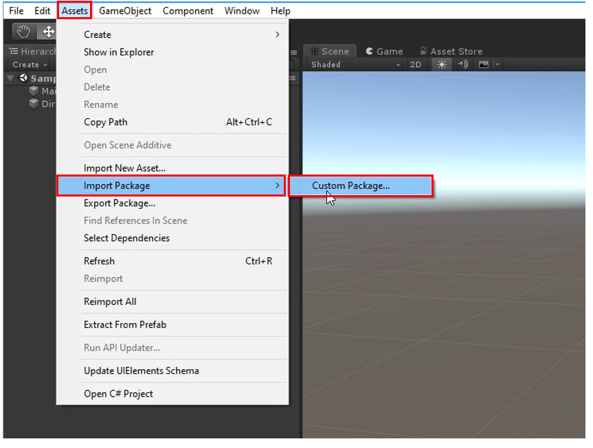

3. Select the Unity package you just downloaded from the link provided in step 1. Once the import pop-up window appears in Unity, click the Import button to begin importing. Importing the MRTK may take several minutes.

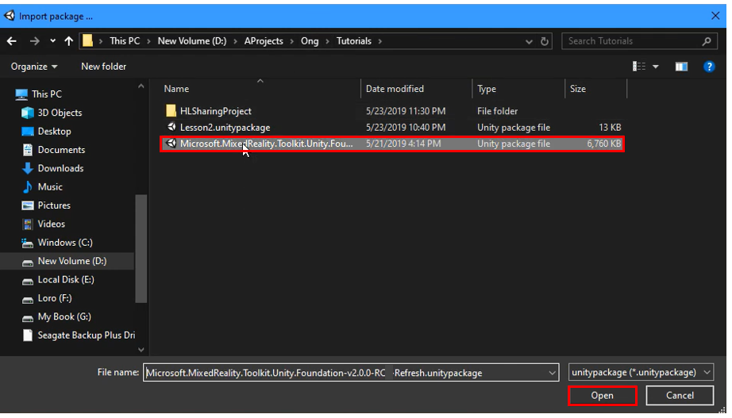

> Note: The downloaded package is in your local folder where you have saved the file. The image above does not portray where you will find the package.

4. Create a new scene. This can be done by clicking File, and selecting New Scene"). Save the scene as HLSharedProjectMain.

> Note: you may receive a pop-up that looks similar to the image below. For now, click No.
>
> 

5. Under Mixed Reality Toolkit, click on Add to Scene and Configure.

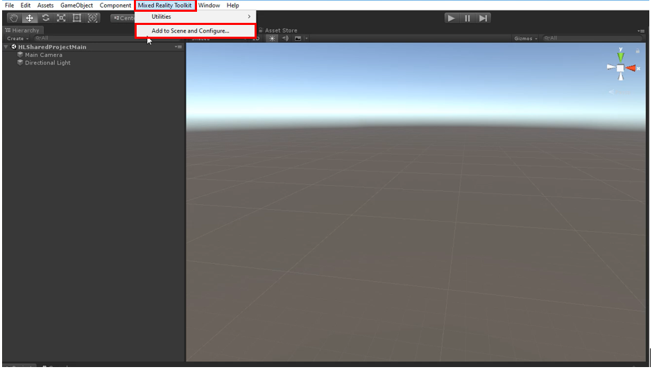

6. Once that is complete, a new configuration file appears, giving you the choice to customize the profile. Click Copy and Customize.

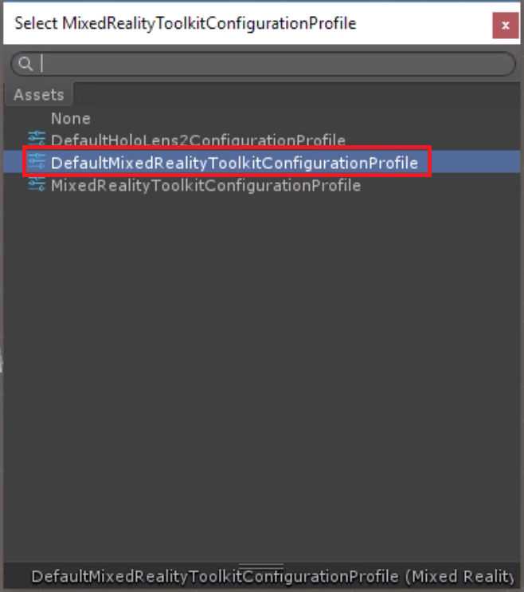

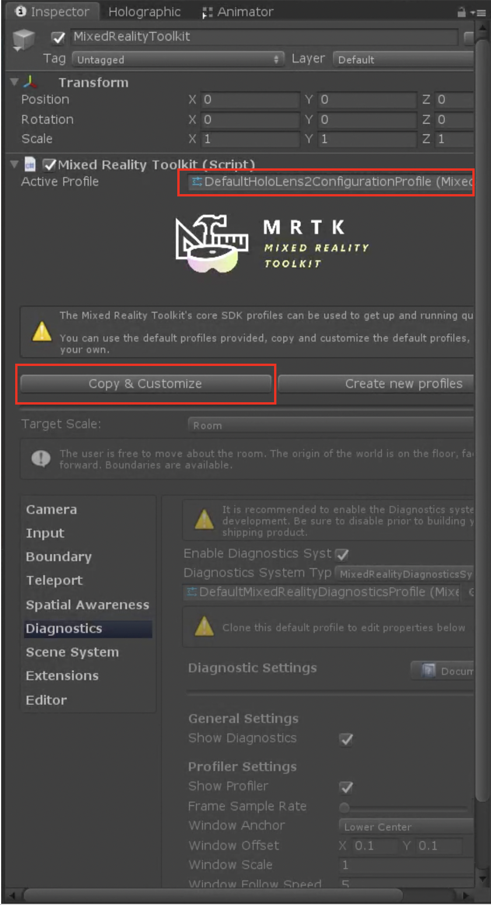

7. Scroll down and uncheck Enable Diagnostics system if you want to hide the diagnostics window. We recommend keeping the diagnostics window enabled during application development to monitor performance, and disabling it during production or application demonstrations. 

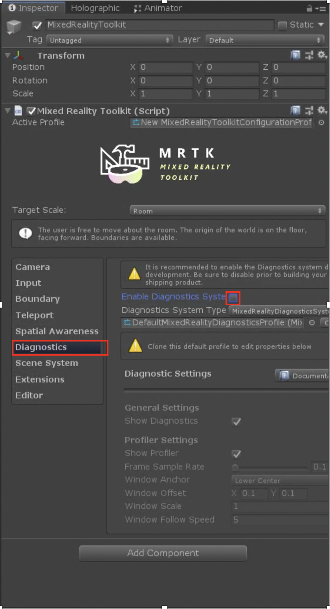

8. Open the build settings by pressing control+shift+B or going to File->Build Settings. Notice that the program is currently set under the PC, Mac and Linux standalone platform. For HoloLens 2 development, set the platform to be Universal Windows Platform. Select it and click Switch Platform.

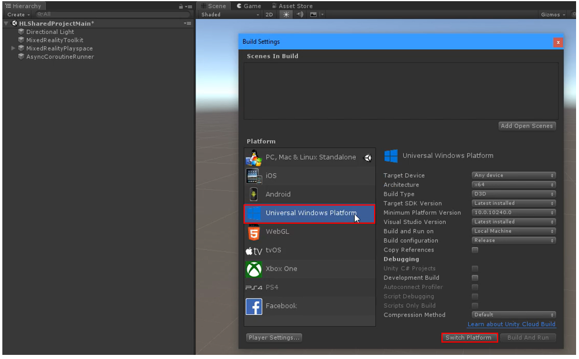

9. Once complete, click the box that says Add Open Scenes. Now go to the Inspector panel, and ensure that the check box to the right of Virtual Reality Supported (as shown in the image below) is checked. Also ensure that the check box next to scenes/HLSharedProjectMain is also checked as shown in the image below.

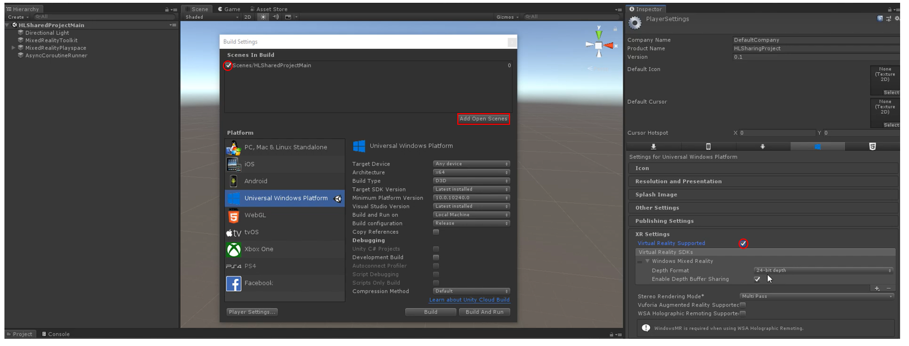

10. Under the Publishing Settings section in the Inspector panel, scroll down to Capabilities, and ensure the following check boxes are marked:

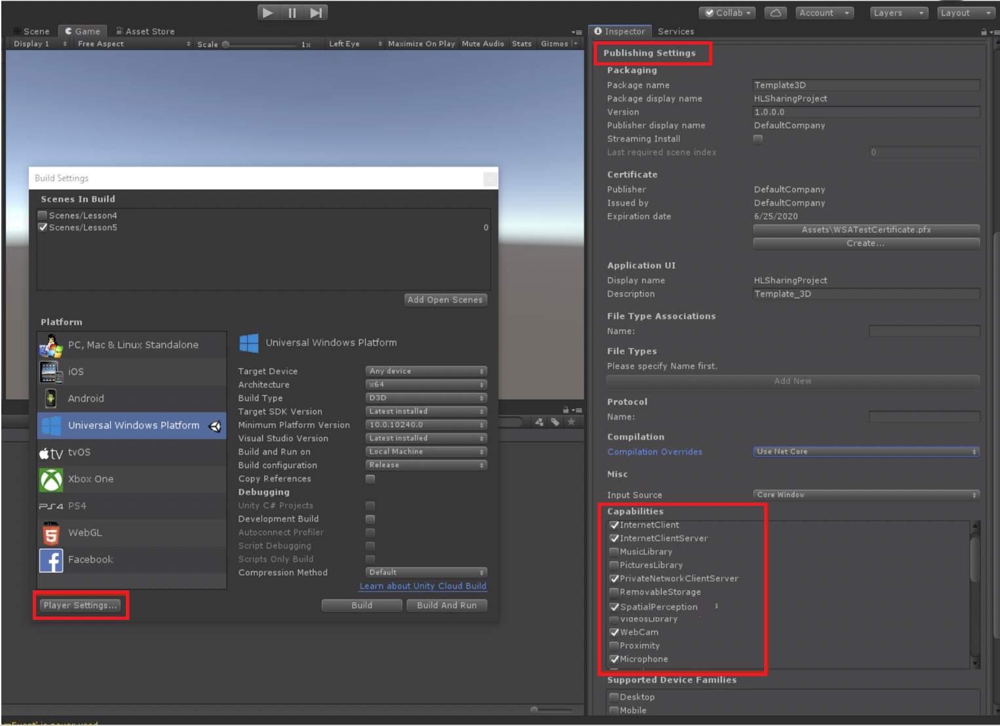

11. Import the custom package called SharingAssetCollection which can be downloaded [here.](https://github.com/microsoft/MixedRealityLearning/releases/tag/development)

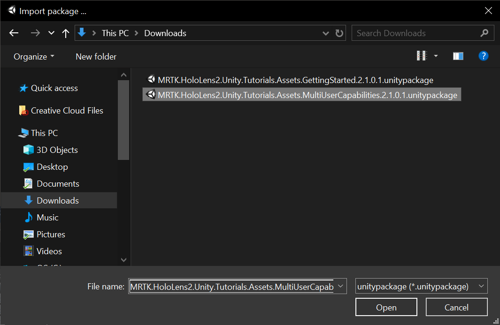

12. In the Project panel, go to the Prefabs folder. In next few steps you implement a few prefabs into the scene. In the Prefabs folder, click and drag the prefab, Debug Window into the hierarchy. Once finished, save the project by clicking File, then Save or press Control+S.

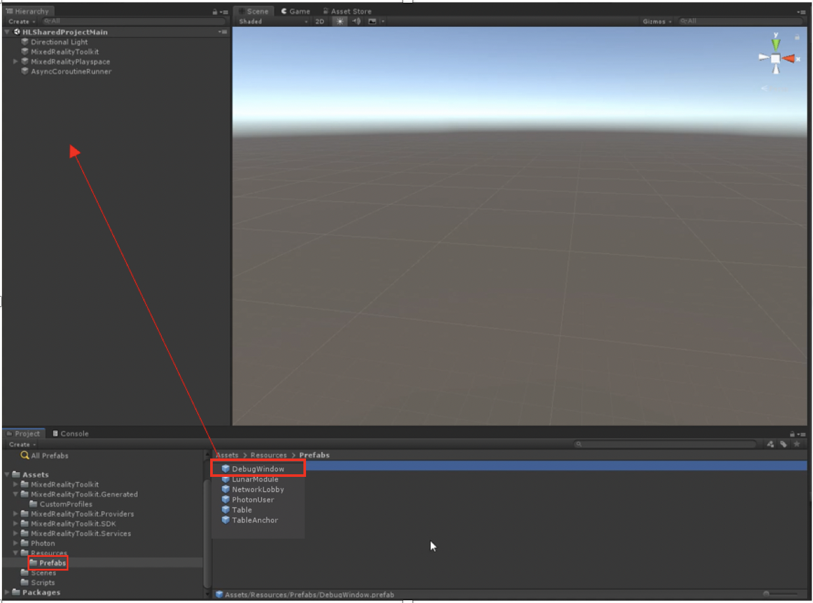

   > Note: You may notice a pop-up appear as you click on the prefab, asking you about TMP Essentials. Click Import TMP Essentials as they are needed. If this pop-up appears, you might need to delete the prefab from your hierarchy and re-drag it into your hierarchy to avoid potential text-related errors.
   >
>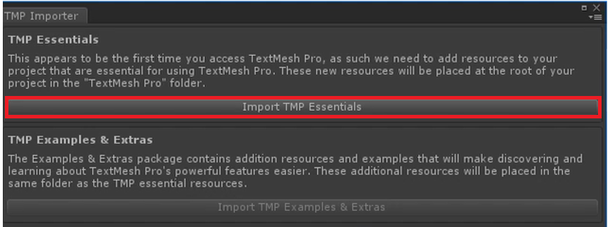

## Congratulations

Your Unity Project is now ready for Photon. In the coming tutorials, we'll build upon this scene and our Unity project towards a full shared experience.

[Next tutorial: 3. Connecting multiple users](mrlearning-sharing(photon)-ch3.md)

