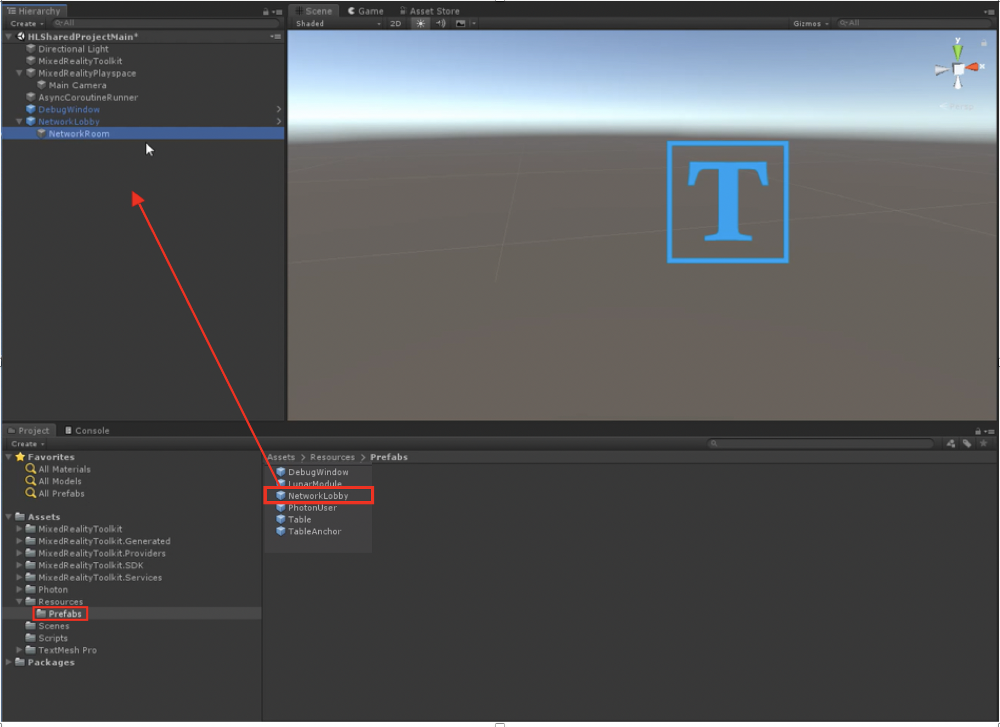
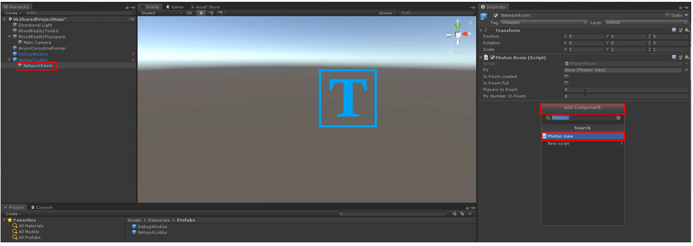
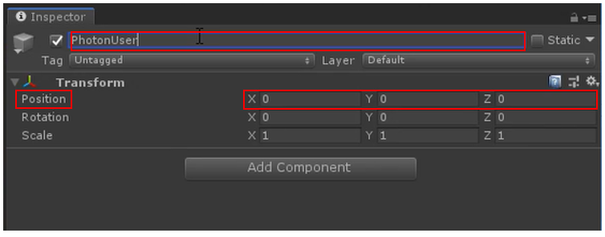
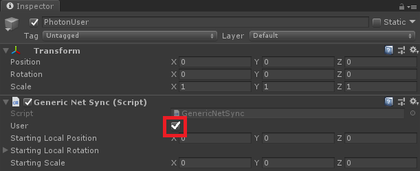
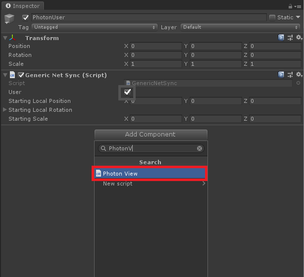
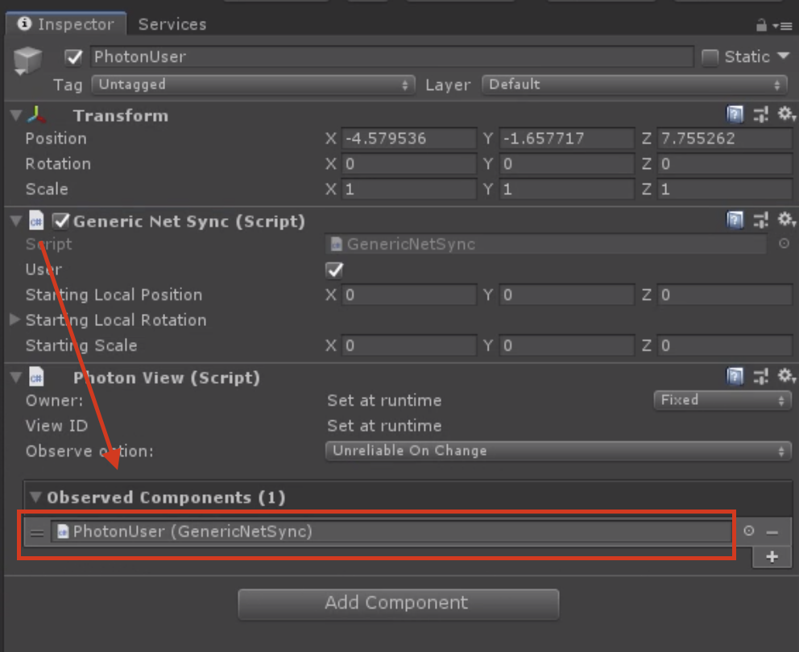
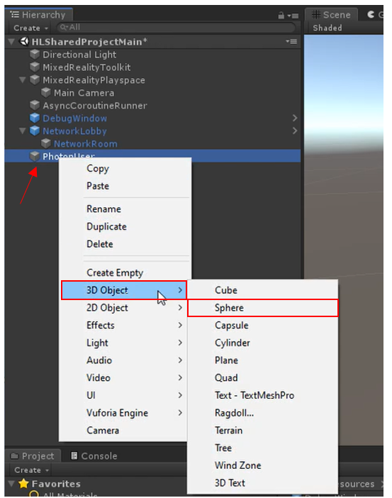
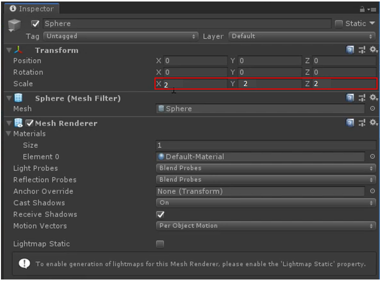
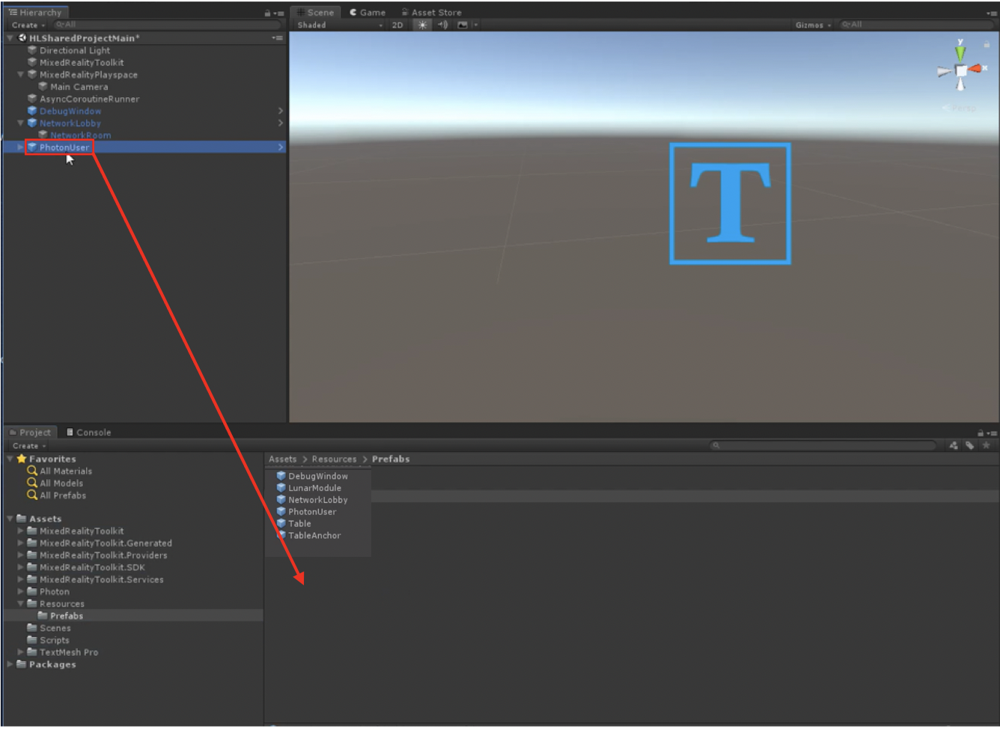
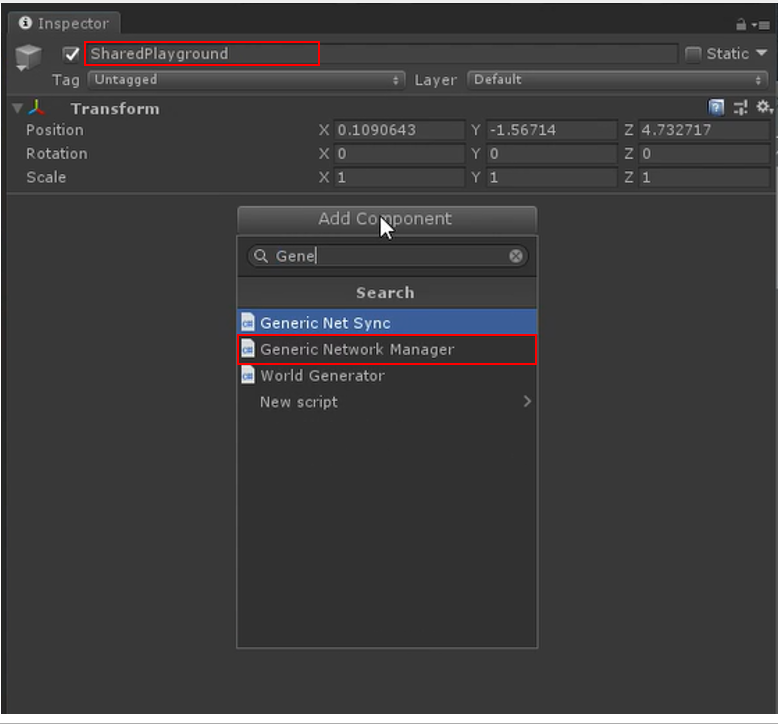

# **Connecting Multiple Users** 

In this lesson, we will learn how to connect multiple users as part of a live shared experience. By the end of this lesson, you will be able to open the application on multiple devices, and see "avatar" representations of each person that joins (avatars represented by a sphere.) 

Objectives:

- Configure PUN within your application
- Configure players
- Learn how to connect multiple users in a shared experience

### Instructions

1. In the Assets>Resources>Prefabs folder of the project panel, drag and drop the "NetworkLobby" prefab in to the hierarchy, as shown in the image below.

   

2. When you expand the prefab "NetworkLobby," you should see a child object called "NetworkRoom." With it selected, go into the inspector panel and click "Add Component." Search for "PhotonView" and add the component.

   

3. Create a new empty game object in the hierarchy (right click in the hierarchy and select "Empty" from the context menu). Ensure the positioning is set to x =0, y=0, z=0 and name the object, "PhotonUser."

   

4. Click on the "Add Component" button and type "Generic Net Sync" and select the Generic Net Sync class. Once the class appears, click on the "User" check box to turn it on. 

   

5. Again click on "Add Component" and then type "Photon View" and select the Photon View class that appears in the drop down list.

   

6. Now click on the File icon in for the Generic Net Sync class, then drag and drop it to the Photon View's "Observed Components" field.  

7. Next, we want to create spheres to represent each person that joins a shared experience. Right click the "PhotonUser" object you just created, go down to "3D Object" and click "Sphere." This will create a sphere game object as a child of the PhotonUser object.

   

8. Scale the sphere down to x=0.06, y=0.06, ad z=0.06.

   

9. Drag the "PhotonUser" game object into the "prefabs" folder in the project panel. Then, delete it from the scene. We have now created a prefab that will be used when spawning or instantiating new players in a shared experience.

   

> Note: ensure that the game object has successfully copied into the "prefabs" folder before deleting it from your hierarchy.

10. Create a new object in the hierarchy (using similar instructions to that of Step 3), and name it "SharedPlayground." Then, click "Add Component" and search for "generic network manager" and click it to add the Generic Network Manager component. Change the position of the object to x=0, y=0, and z =0.

    

## Congratulations

Once all the steps above are complete, and the build process is complete, when you press the play button and connect your HoloLens 2, you should see a sphere moving around as you move your head! This will be shown for any user that joins your Unity project!

[Next Lesson: Sharing(Photon) Lesson 4](mrlearning-sharing(photon)-ch4.md)

