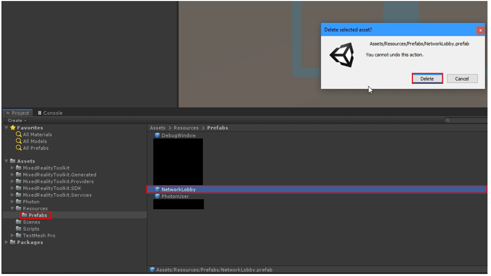
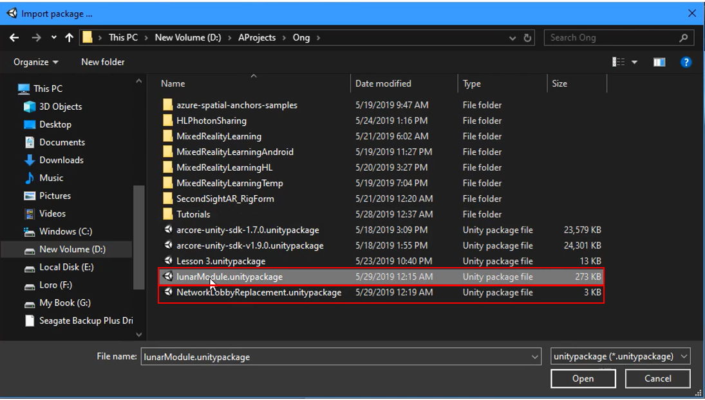
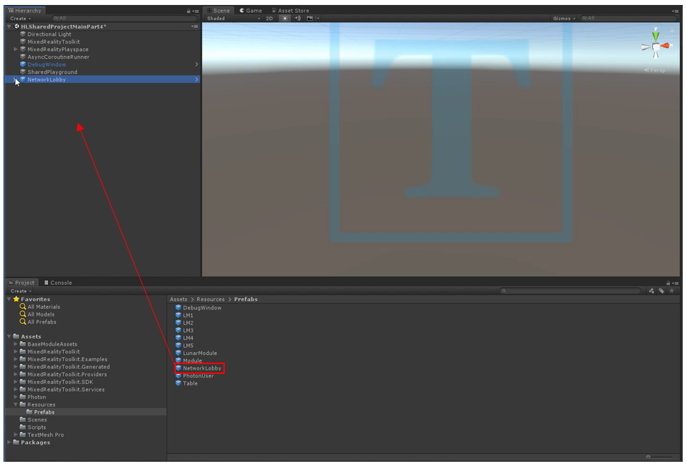
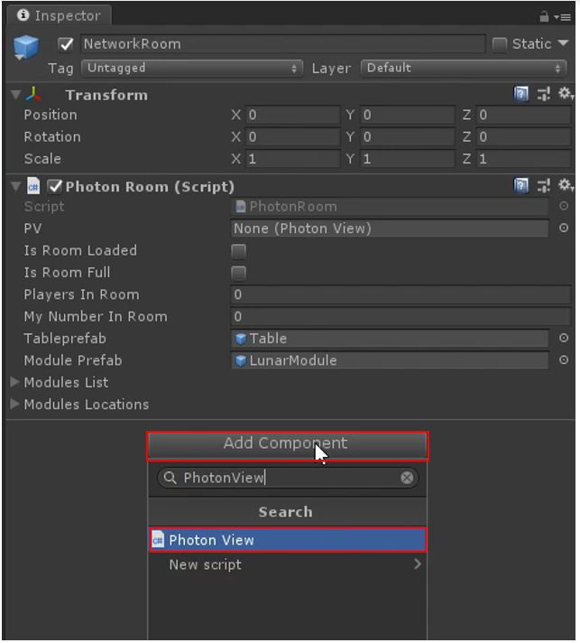
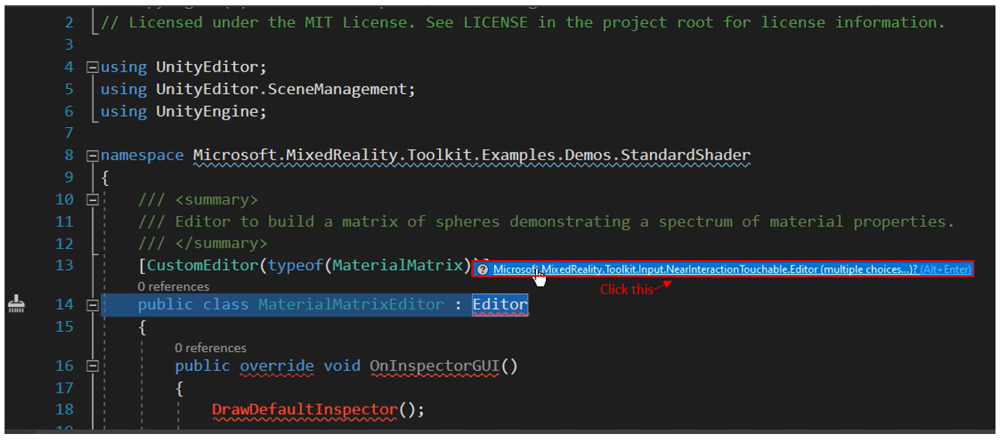
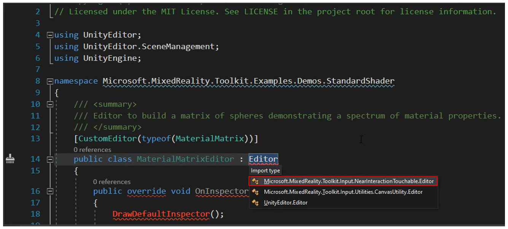
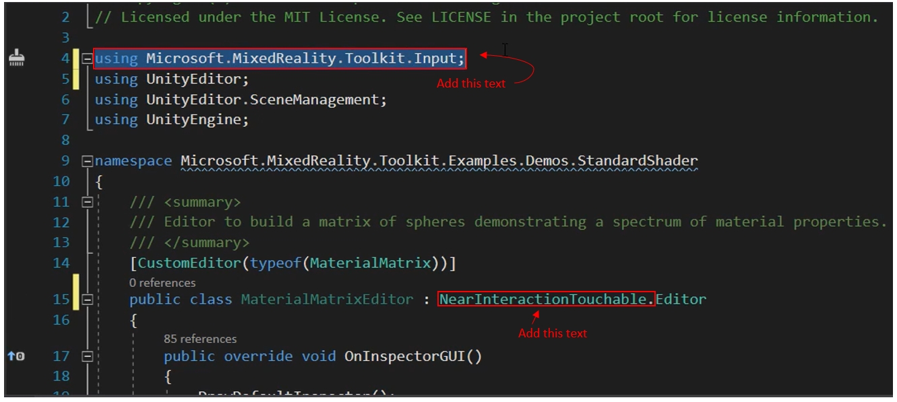

# **Shared Objects** 

1. Save the project from the previous lesson (control+S) and name it "HLSharedProjectMainPart4.unity" so that it's easier to find when you need it again.

2. Delete the "NetworkLobby" object (by selecting it and pressing delete). Also, go into the "prefabs" folder from lesson 2 and delete the "NetworkLobby" prefab from there as well.

3. Import a new custom package (like step 2 from the lesson 2) and import the [LunarModule.unitypackage](linkforModule1 lesson with the lunar module) and the [NetworkLobbyReplacement.unitypackage.](linkforNetworklobbyreplacement package here)

4. Now, in the "prefabs" folder, drag the new "NetworkLobby" prefab into the hierarchy . 

> note: the two packages we imported in the previous steps updated the "NetworkLobby" prefab. It saves you from a lot of typing!

5. Now, click the arrow to the left of "MixedRealityPlayspace" and move the child game object, "MainCamera" down into the "SharedPlayground" prefab. Then, delete the prefab "MixedRealityPlayspace" (to delete, select the prefab and tap "delete" on your keyboard).

6. Create a new game object set as a child object to the "SharedPlayground" parent object (to create a new object, right click on the parent object, and select "create  empty").
7. With the new object selected in your hierarchy, change the name of the object to "TableAnchor" in the inspector panel. Also, click "add component" and search for the "TableAnchor" component. Select it and add it to the object.

> note: set the positioning to x=1, y=-0.55, and z=2. Also, set the rotation to y=90. 
>
> 

8. Now in the project panel, in the "prefabs" folder, drag the "table" prefab into the "TableAnchor" child object you just created.

   

9. Select "NetworkRoom," a child object under "NetworkLobby" in the hierachy, and click "add component" in the inspector panel and search for "PhotonView" and add the script to the "*NetworkRoom*" object.

> note: sometimes users will get an error saying "Assets\MixedRealityToolkit.Examples\Demos\\StandardShader\\Scripts\\Editor\\MaterialMatrixEditor.cs(14,41): error CS0118: 'Editor' is a namespace but is used like a type." If you have recieved this error, follow the next step. If you have not, go to step 11.

10. Double click on the error message to go to visual studio. You will see a lot of overwhelming coding scripts, all you have to do is type in the following in the places marked in the images below:

> click on the boxed text in the image above.

> Select the boxed option in the image above.

> Add the 2 sections of text boxed in the image above.

11. Finally, in the "DebugWindow" object, change the width to 80 and the height to 10.

## Congratulations

Once this is complete, all users that join your Unity Project can move the Lunar Module around. When one user moves the object, another can see the object move around! 

[Next Lesson: Sharing(Photon) Lesson 5](mrlearning-sharing(photon)-ch5.md)

