# 4. Sharing object movements with multiple users

In this Tutorial, we learn how to share the movements of objects so that all participants of a shared session can collaborate together and view each others' interactions. This lesson builds upon the Lunar Launcher that was built as part of the [Base Module Tutorials](mrlearning-base.md).

Objectives:

- Bring in the lunar launcher as the 3D model to be shared
- Configure your project to share the movements of the 3D model.
- Learn how to build a basic multi-user collaborative application

### Instructions

1. Save the scene from the previous lesson (Control+S). You can name it, HLSharedProjectMainPart4.unity, so that it's easier to find when you need it.

2. From the Project window, in the Assets->Scripts folder, double click on GenericNetSync to open it in Visual Studio or which ever code editor you are using.  

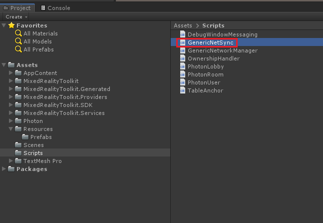

3. On Lines 34 and 38, remove the // to activate the code for the table that we will use in this lesson. next, Save the file. 

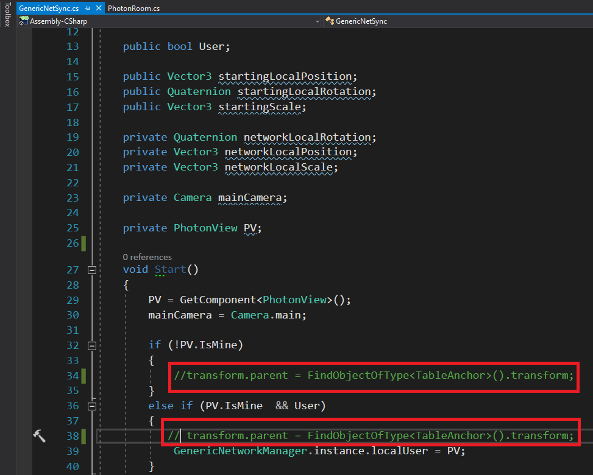

4. In the Project window, double click on the PhotonRoom.cs file in the Assets->Scripts folder to open it in Visual Studio. 

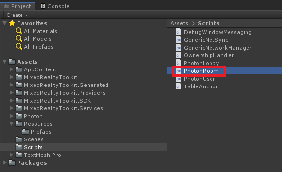

5. Just like in Step 3, we need to remove the // to activate the code at Lines 25, 26, and 106.

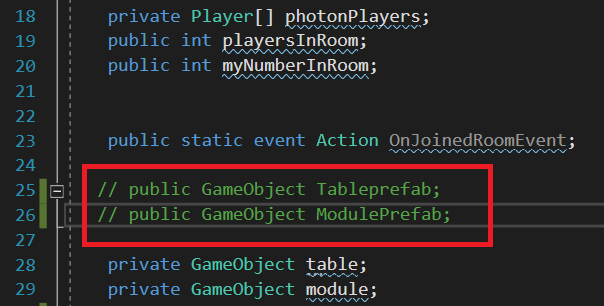 

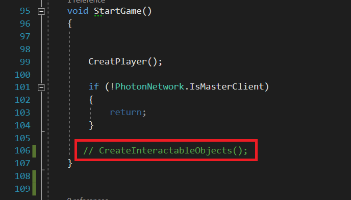

6. In the Hierarchy view, select the NetworkRoom object.

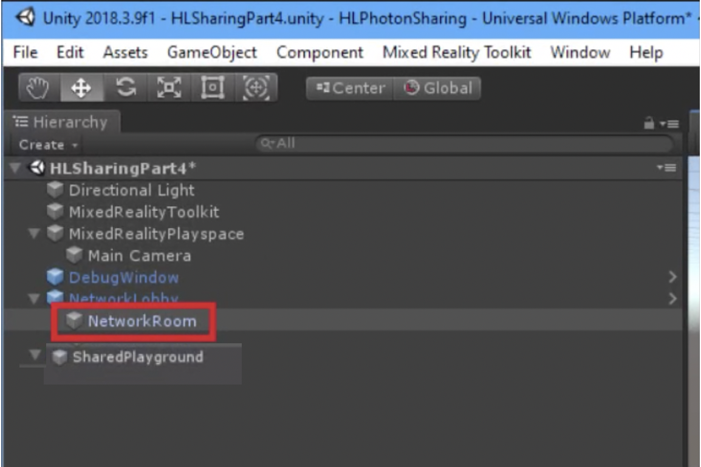

7. In the Project view, navigate to Assets->Resources->Prefabs. First, drag and drop the Table prefab to the Tableprefab slot on the PhotonRoom class. Next drag and drop the RocketLauncherCompleteVariantprefab to the Module Prefab slot on the PhotonRoom class.

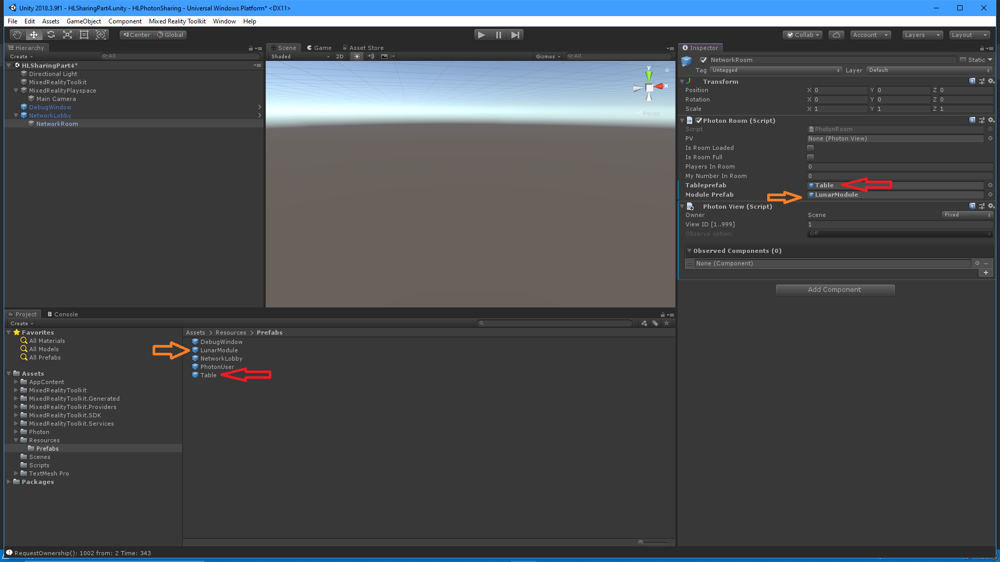

   Note: If you click on one of the prefab objects and release, the inspector will switch to that object. Click, drag, drop, and release each object to its appropriate slot.

8. Click the arrow to the left of MixedRealityPlayspace, and move the child game object, MainCamera down into the SharedPlayground prefab. Next, delete the prefab, MixedRealityPlayspace, to delete, select the prefab, and tap "delete" on your keyboard).
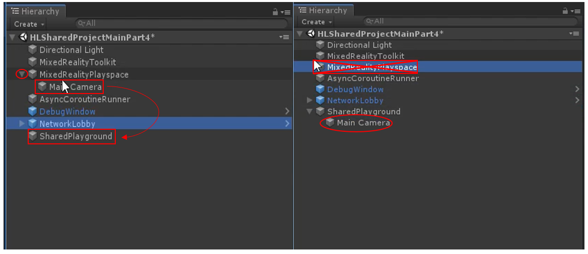

>Note:  Make sure that both the Main Camera and SharedPlayground positions are set to 0,0,0.
>

9. Create a new game object set as a child object to the SharedPlayground parent object to create a new object. Right click on the parent object, and select Create Empty. 

10. With the new object selected in your hierarchy, change the name of the object to TableAnchor in the Inspector panel. Also, click Add Component, and search for the TableAnchor component. Select it and add it to the object. 

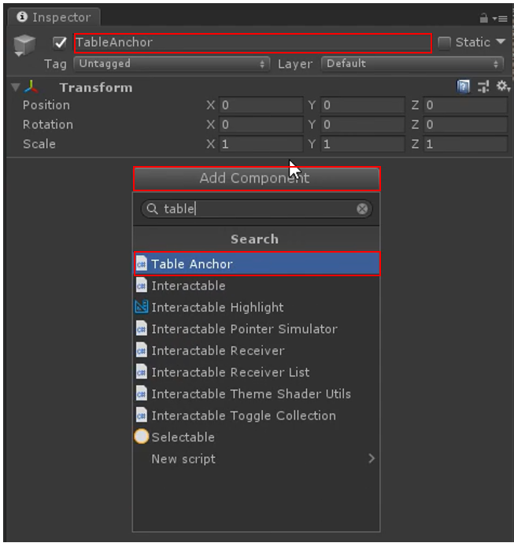

11. Now from the Project panel in the Prefabs folder, drag the Table prefab into the "TableAnchor" child object you just created.

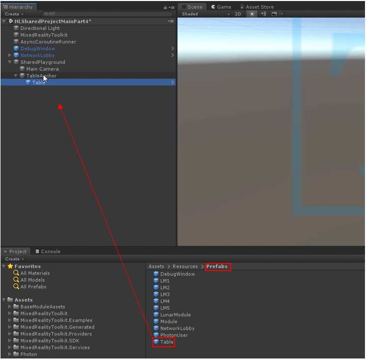

12. Finally, in the DebugWindow object, change the width to 50 and the height to 20.

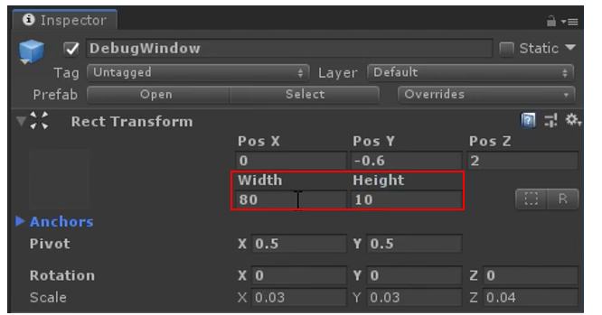

## Congratulations

Once this is complete, all users that join your Unity project can move the lunar launcher around. All movements are synchronized so that each user can see each others' interactions. These concepts serve as the fundamental building blocks for full-featured, shared collaboration experiences. 

Although all users are connected as part of a shared experience, and can see the relative movements of objects, the application is still unable to accurately align avatars and objects so that local users see each other and objects in the same place within the physical world. In order to anchor a local shared experiences, every device requires a common understanding of the physical environment. In this module, we'll achieve this by using [Azure Spatial Anchors](<https://azure.microsoft.com/en-us/services/spatial-anchors/>) (ASA) that will be implemented in the next lesson.

Before proceeding to the next lesson, we'll need to complete the ASA Learning Module that covers ASA basics, Azure account and resource creation, and other fundamental buildings blocks required before we can integrate this into our shared experience.

[Next Lesson: Sharing(Photon) Lesson 5](mrlearning-sharing(photon)-ch5.md)

