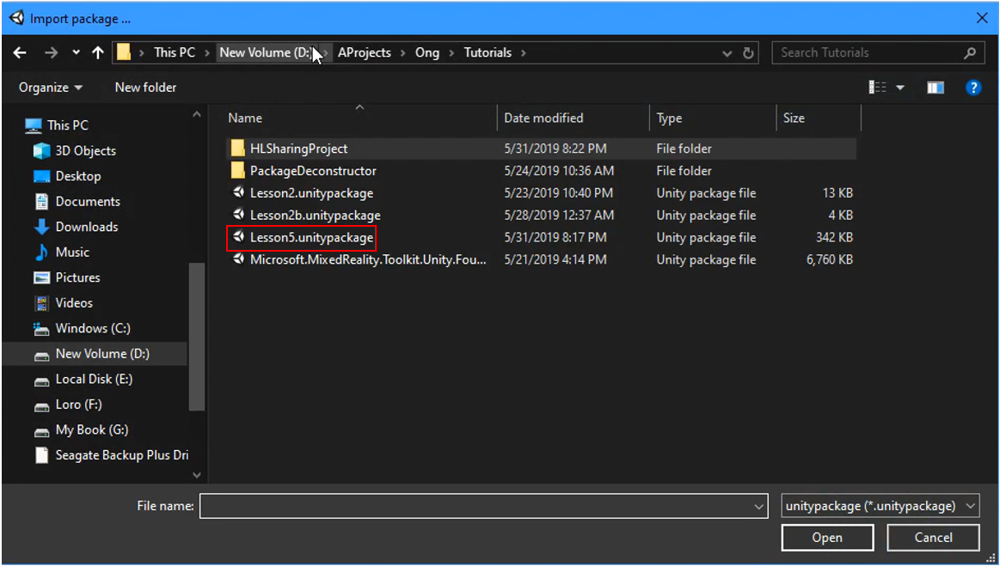
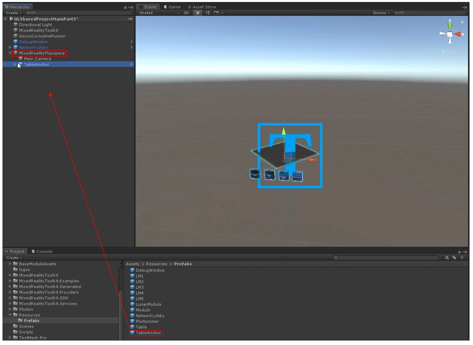

# **Part 5 (unsure about name)** 

1. Save the project from the previous lesson (control+S) and name it "HLSharedProjectMainPart5.unity" so that it's easier to find when you need it again.

2. Select the TableAnchor prefab underneath  the "MixedRealityPlayspace" parent object, and delete it.

3. Just like some of the previous lessons, import a new custom package that you can get [here.](placeholderlink)

4. Once it's imported, grab the newly updated table anchor (from the unity package imported in the previous step) from the "prefabs" folder in the project panel and drop it into the parent object "MixedRealityPlayspace."

5. Expand the "MixedRealityPlayspace" parent object, then the "TableAnchor" object, and expand the "buttons" object as well. 

6. Now in the hierarchy, select the "ShareAzureAnchorButton" and move your attention to the inspector panel. Scroll down to the dropdown menu shown in the image below, and select "AnchorModuleScript" and click on "ShareAnchorNetework()."

7. Much like step 6, select the "GetAzureAnchorButton" and move your attention back to the inspector panel. Scroll down to the dropdown menu shown in the image below, and select "AnchorModuleScript" and click on "GetSharedAnchorNetwork()." Then save.

## Congratulations

All of the sharing abilities are set up! Now, you can invite co-workers or friends to your Unity Project and have all users interact with everything you build in the project! Enjoy!

