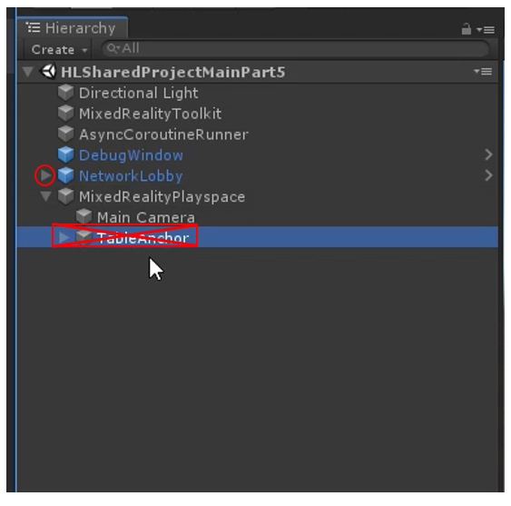
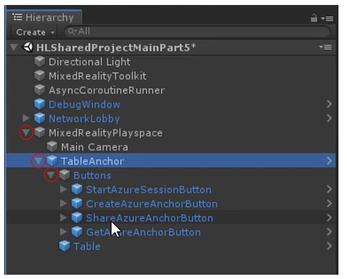
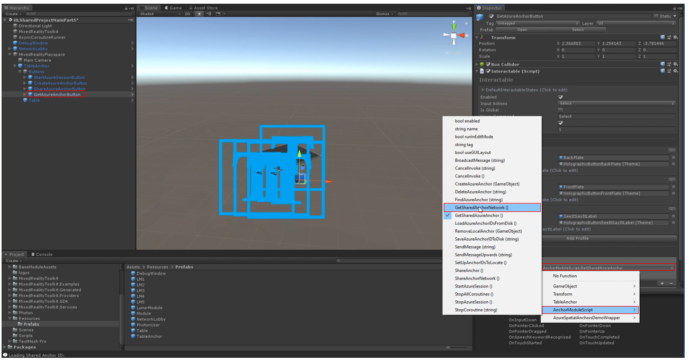

# 5. Integrating Azure Spatial Anchors into a shared experience

In this lesson, we learn how to integrate Azure Spatial Anchors (ASA) into our shared experience. ASA allows multiple co-located devices to have a common reference if their physical environment is to anchor virtual experiences such that all participants see objects in the same physical place.

Before proceeding with this lesson, we'll need to complete the ASA learning module, which will cover ASA basics, Azure account and resource creation, and other fundamental buildings blocks that are required before we can integrate ASA into our shared experience.

Objectives:

- Integrate ASA into a shared experience for multi-device alignment.
- Learn the fundamentals of how ASA works in the context of a local shared experience.

### Instructions

1. Save the project from the previous lesson (control+S) and name it "HLSharedProjectMainPart5.unity" so that it's easier to find when you need it again.

2. Select the TableAnchor prefab underneath the MixedRealityPlayspace parent object, and delete it.

3.  In the Project view, go to Assets->Resources->Prefabs, and drag the TableAnchor prefab on top of the SharedPlayground object to make it a child.
4.  Expand the MixedRealityPlayspace parent object, TableAnchor object, and expand the Buttons object as well. 

4. Now in the hierarchy, select ShareAzureAnchorButton, and move your attention to the Inaspector panel. Scroll down to the drop-down menu shown in the image below, and select AnchorModuleScript and click ShareAnchorNetework().

5. Select GetAzureAnchorButton (see Step 4), and move your attention back to the Inspector panel. Scroll down to the drop-down menu shown in the image below, and select AnchorModuleScript, and click GetSharedAnchorNetwork(), and save.

6. To test the sharing module, click on the "Start Azure ASA Session" button which will start the azure spatial anchors session and then create the azure anchor by clicking the "Create Azure Anchor" button and wait for sometime for the azure anchor to get created. Once the azure anchor is created then click on the "Share Azure Anchor" button to share the created azure anchor from the HoloLens.

7. To recieve the shared azure anchor in another HoloLens, click on the "Start Azure ASA Session" to start and get in to the current ASA session and click on "Get Azure Anchor" button to get the shared azure anchor from the other HoloLens.

   > Note: All details of the corresponding actions on the individual buttons will be displayed in the debug window.

## Congratulations

In this Lesson you learned how to integrate Azure's powerful new Spatial Anchors to align co-located devices in a shared experience! This lesson also concludes the Sharing Module. We learned how to set up a new Photon account, integrate Photon and PUN into a new Unity application, configuring avatars and shared objects, and finally aligning multiple participants using ASA. 

