# 1. Integrating and using speech recognition and transcription

This tutorial creates a Mixed Reality application that explores the use of Azure Cognitive Services Speech SDK with the HoloLens 2. When you complete this tutorial series, you will be able to use your device's microphone to transcribe speech to text in real time, translate your speech into other languages, and leverage the Speech SDK’s Intent feature to understand voice commands using artificial intelligence.

## Objectives

- Learn how to integrate the Azure Speech SDK into a HoloLens 2 application
- Learn how to use voice commands
- Learn how to use speech-to-text capabilities

## Instructions

### Getting Started

1. Start Unity, and create a new project. Enter the project name Speech SDK Learning Module. Choose a location for where to save your project. Click Create Project.

    

    >[!NOTE]
    >Ensure that the template is set to 3D, as shown in the image above.

2. Download the [Mixed Reality Toolkit](https://github.com/microsoft/MixedRealityToolkit-Unity/releases) Unity [foundation package version 2.1.0](https://github.com/microsoft/MixedRealityToolkit-Unity/releases/download/v2.1.0/Microsoft.MixedReality.Toolkit.Unity.Foundation.2.1.0.unitypackage) and save it to a folder on your PC. Import the package into your Unity project. For detailed instructions on how to do this, see the [Getting started tutorials - Lesson 2. Initializing your project and first application](mrlearning-base-ch1.md).

3. Download and import the Azure [Speech SDK](https://aka.ms/csspeech/unitypackage) for the Unity asset package. Import the Speech SDK package by clicking on Assets, selecting Import package, then selecting Custom Package. Find the Speech SDK package downloaded earlier, and open it to begin the importing process.

    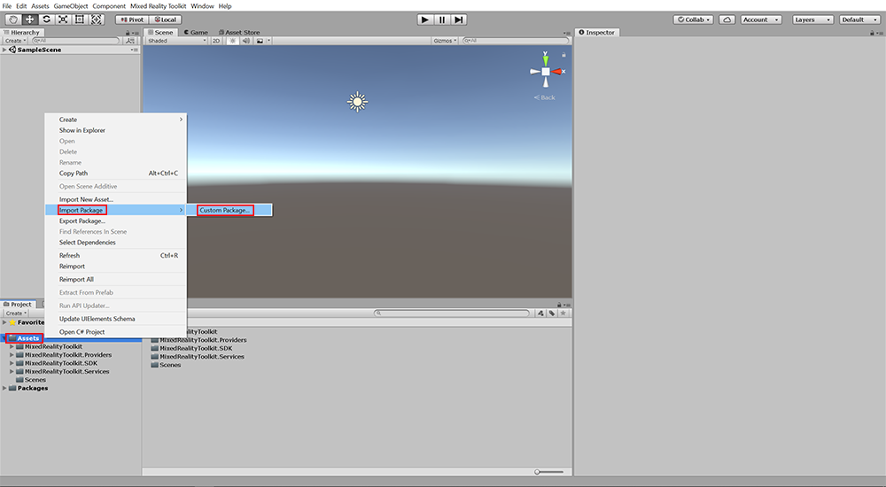

    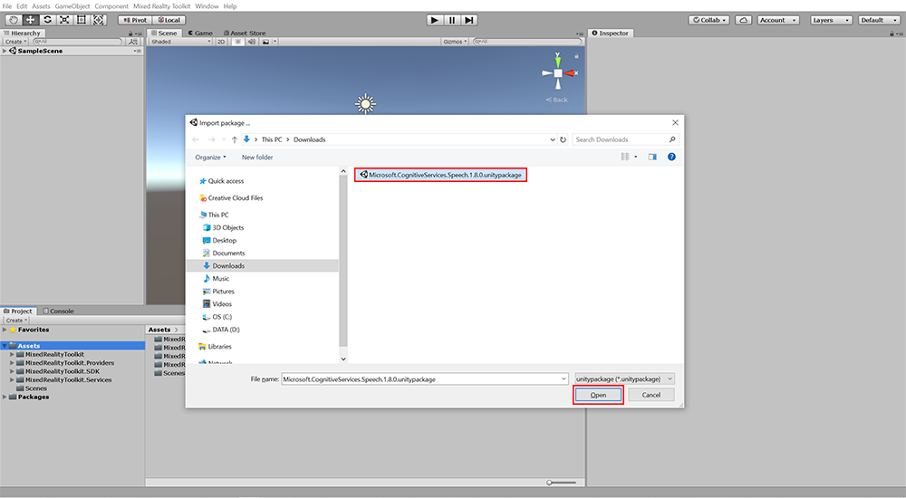

4. In the next pop-up window, click Import to begin importing the Speech SDK package. Ensure all items are checked, as shown in the image below.

    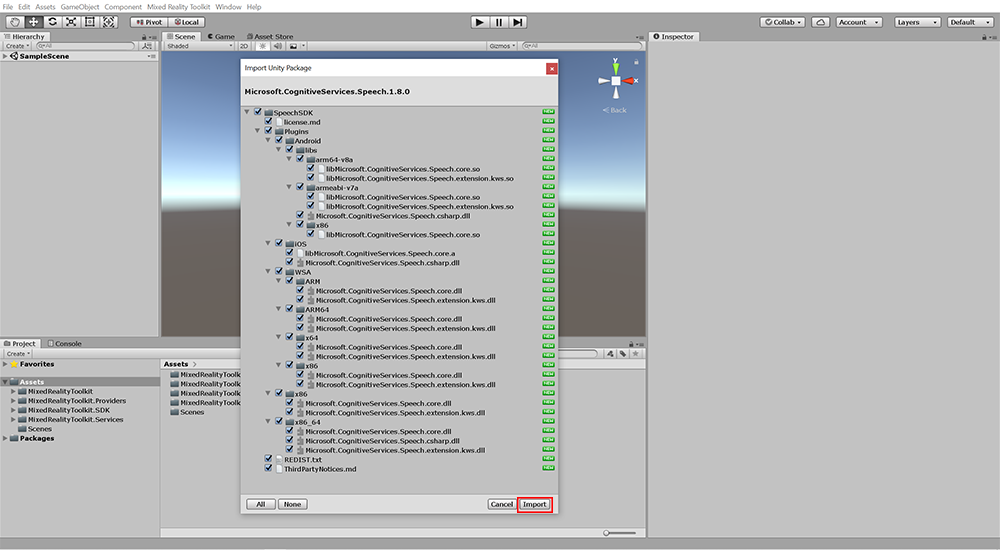

5. Download the Speech SDK Module asset pack, also known as the Lunarcom package, by clicking on [this link](https://github.com/microsoft/MixedRealityLearning/releases/tag/Speech_2). The Lunarcom asset package is a collection of assets and scripts developed for this lesson series to showcase a practical use of Azure's Speech SDK. It is a voice-command terminal that will ultimately interface with the lunar module assembly experience developed in the [Getting started tutorials - Lesson 7. Creating a Lunar Module sample application](mrlearning-base-ch6.md).

6. Import the Lunarcom asset package into your Unity project by following similar steps you took to import the Mixed Reality Toolkit and Speech SDK.

7. Configure the Mixed Reality Toolkit (MRTK).

    To do this, click on the Mixed Reality Toolkit panel in the top of your window, and then select Add to Scene and Configure.

    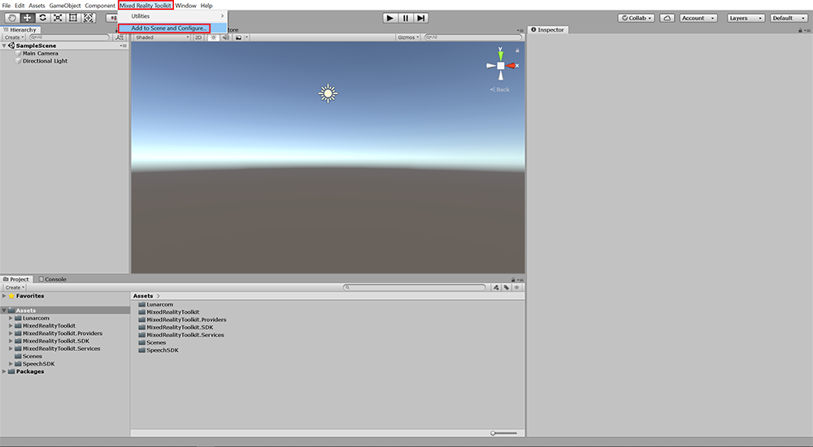

    In the popup that appears, select DefaultHoloLens2ConfigurationProfile to make it the Active Profile for the Mixed Reality Toolkit.

    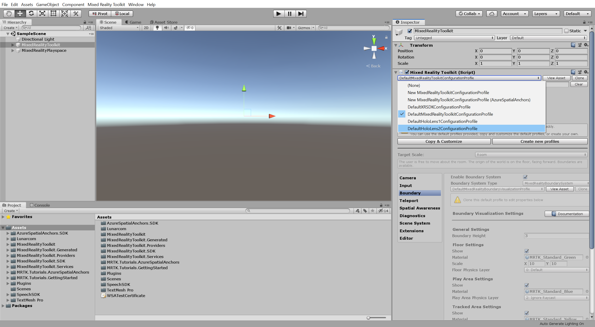

8. Your scene now has several new items in it from the MRTK. Save your scene under a different name by clicking on "file," then "save as" and name your scene SpeechScene.

    >[!NOTE]
    >If you press Play on your scene after you add the MRTK to your project, and it doesn't enter play mode, you might need to restart Unity.

9. With the MixedRealityToolkit object selected in your scene hierarchy, click Copy & Customize in the Inspector panel to open the Clone Profile popup. In the Clone Profile popup, enter a suitable name for your custom profile, for example, Custom HoloLens2ConfigurationProfile. Click Clone to create your custom configuration profile and set it as the active profile.

    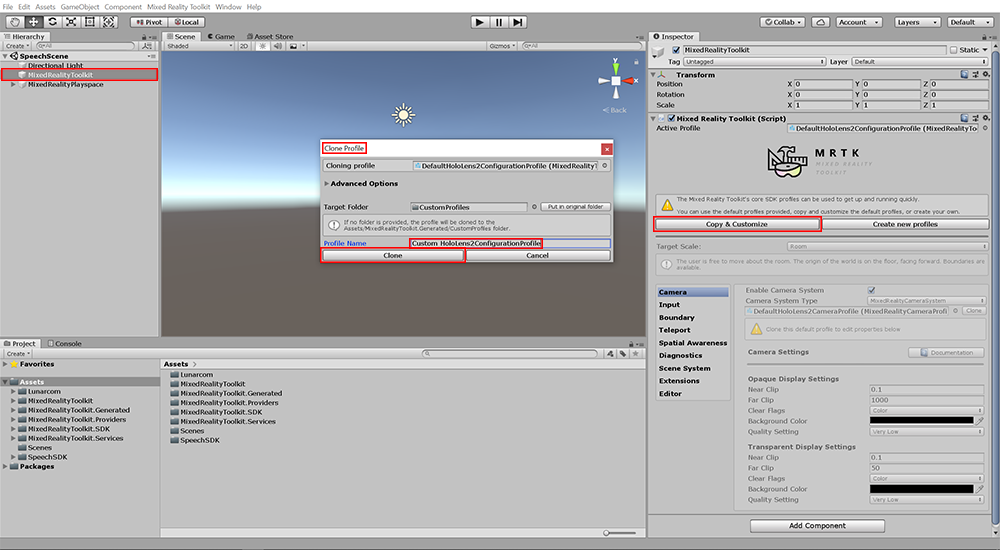

10. Also in the Inspector panel (with the MixedRealityToolkit object selected in your hierarchy), disable the diagnostics system by unchecking the box to the right of Enable Diagnostics System.

    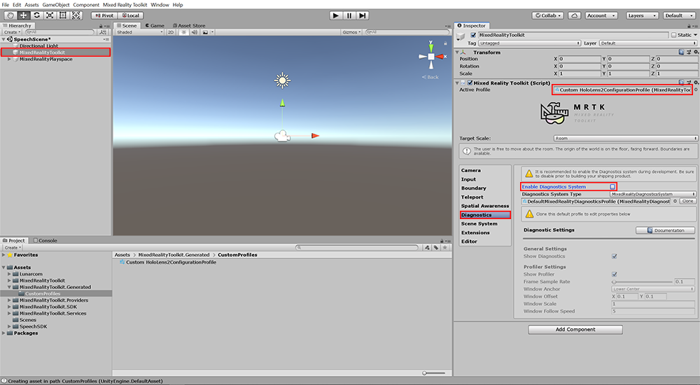

11. In this tutorial, we are using the input speech commands for speech recognition and transcription. Let's clone the input profile to make changes to speech settings.

    With the MixedRealityToolkit object still selected in your scene hierarchy, click the small Clone button in the Inspector panel to open the Clone Profile popup. In the Clone Profile popup, enter a suitable name for your custom profile, for example, Custom HoloLens2InputSystemProfile, and then click Clone to create your custom input system profile and set it as the active profile.

    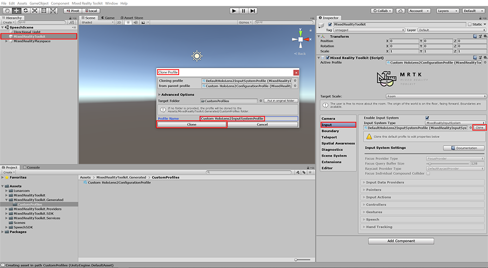

12. Once the input profile is cloned, expand the Speech section and follow the same process as in the previous step to clone the speech commands profile.

    

13. Under the Speech section, go to General Settings and change Start Behavior to Manual Start.

    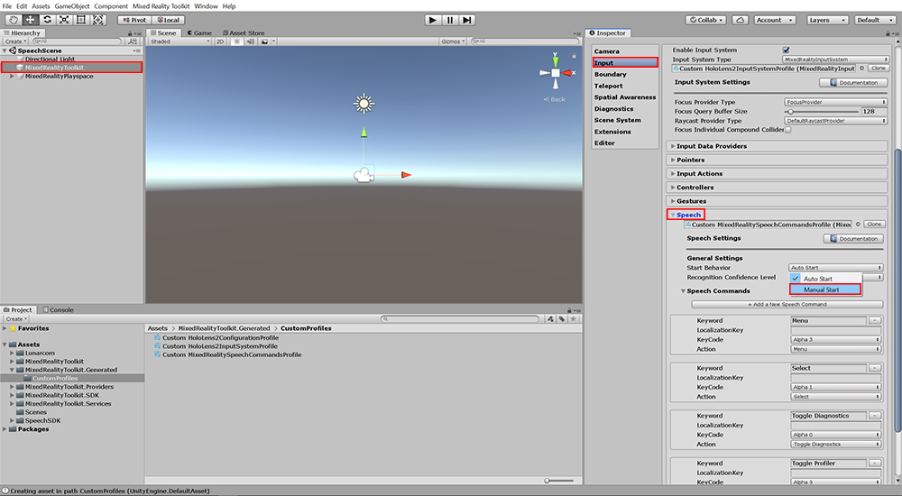

14. In the Project panel, expand the Lunarcom folder and drag the Lunarcom_Base prefab into your scene hierarchy.

    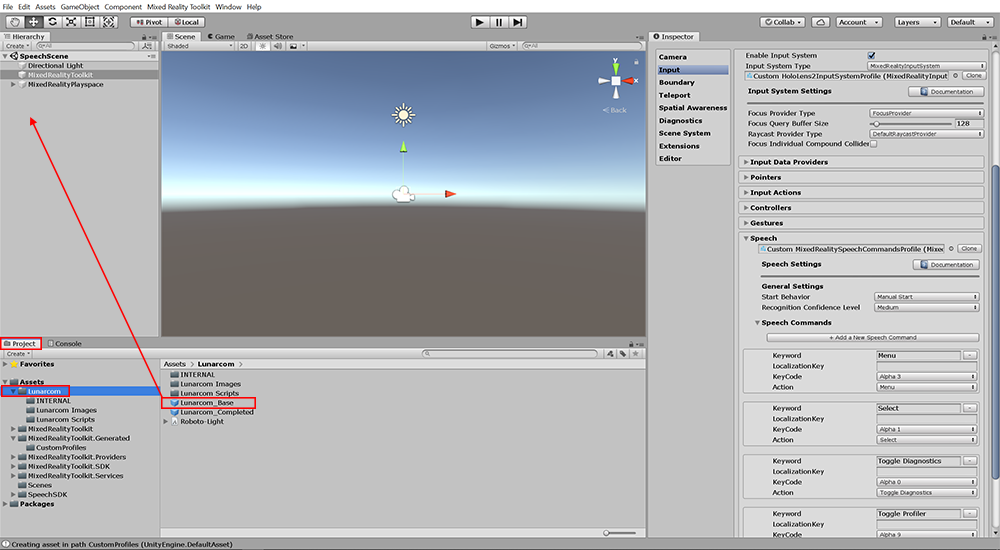

15. Select the Lunarcom_Base object in your hierarchy, and ensure that the position is set to x=0, y=0, and z=0, as well as the rotation set to x=0, y=0, and z=0. Set the scale to read x=0.008, y=0.008, and z=0.01.

    

16. Click Add Component, and search for and select Lunarcom Controller. This script is included in the Lunarcom asset pack that you imported in Step 6.

    

17. To connect our application to Azure Cognitive Services, you must enter a subscription key (also known as an API Key), for the Speech Service. Follow the instructions at [here](https://docs.microsoft.com/azure/cognitive-services/speech-service/get-started) to obtain a free subscription key. Once you obtain the subscription key, enter it into the Speech Service API Key field of the LunarcomController component in the Inspector panel, as shown in the image below.

18. Enter the Region that you chose when you signed up for the subscription key into the Speech Service Region field of the LunarcomController component in the Inspector panel. For example, for the region West US type in "westus".

    

19. In your hierarchy, expand the Lunarcom_Base object by clicking the arrow to the left of it. Then do the same for its child object, "Terminal, as shown in the image below.

20. While Lunarcom_Base is selected, click and drag Lunarcom Text from the hierarchy to the Output Text slot in the LunarcomController component in the Inspector panel, as shown in the image below.

21. Do the same thing with the Terminal object into the Terminal slot and the Connection Light object to the Connection Light Controller slot.

    

22. Click the arrow next to the Lunarcom Buttons section of the LunarcomController script in the Inspector panel, and change the size to 3. Press Enter or Return. This causes three new Element fields to appear.

    

23. Expand the Lunarcom Buttons by clicking the arrow next to it in your hierarchy, and using the same process as above, drag the Mic, Satellite, and Rocket gameobjects to the Element 0, 1, and 2 references, respectively, in the LunarcomController component in the Inspector panel.

    

24. Select the Lunarcom_Base" object in your hierarchy. Click Add Component in the inspector panel and search for and select Lunarcom Speech Recognizer. Repeat the same steps to add Lunarcom Wake Word Recognizer.

    

25. In the Wake Word slot, type in Activate Terminal. In the Dismiss Word slot, type Dismiss Terminal.

    

### Build your application to your device

1. Open the build settings window again by going to File>Build Settings.

    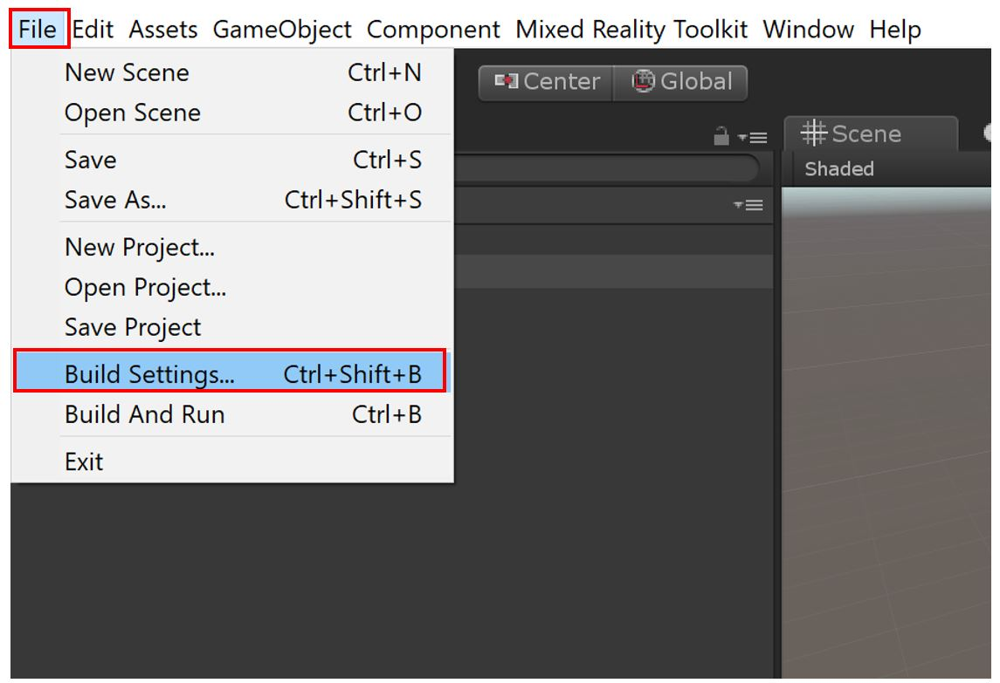

2. Ensure the scene you want to try is in the “Scenes in Build” list by clicking on the “Add Open Scenes” button.

3. Press the Player Settings button and go to Publishing Settings. Under Capabilities, enable: Internet, Internet Client Server, Private Network Client Server, Microphone and Spatial Perception.

4. In the same Player Settings, go to XR settings  and select the Virtual Reality Supported to ON.

5. Press the Build button to begin the build process.

    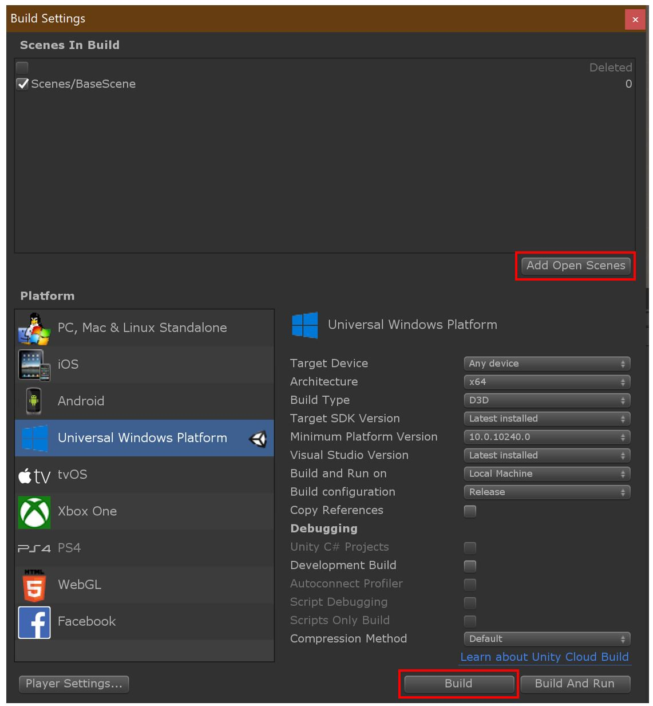

6. Create and name a new folder for your application. In the image below, a folder with the name “App” was created to contain the application. Click “Select Folder” to begin building to the newly created folder. After the build has completed, you may close the "Build Settings" window in Unity.

    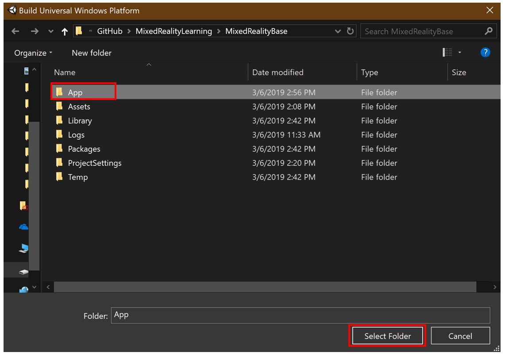

    >[!NOTE]
    >If the build fails, try building again or restarting Unity and building again. If you see an error such as "Error: CS0246 = The type or namespace name “XX” could not be found (are you missing a using directive or an assembly reference?)", you may need to install [Windows 10 SDK (10.0.18362.0)](<https://developer.microsoft.com//windows/downloads/windows-10-sdk>)

7. After the build is completed, open the newly created folder containing your newly built application files. Double-click on the “.sln” solution file to open the solution file in Visual Studio.

    >[!NOTE]
    >Be sure to open the newly created folder (i.e., the "App" folder, if following the naming conventions from the previous steps), as there will be a similarly named .sln file outside of that folder that is different from the .sln file inside the build folder. 

    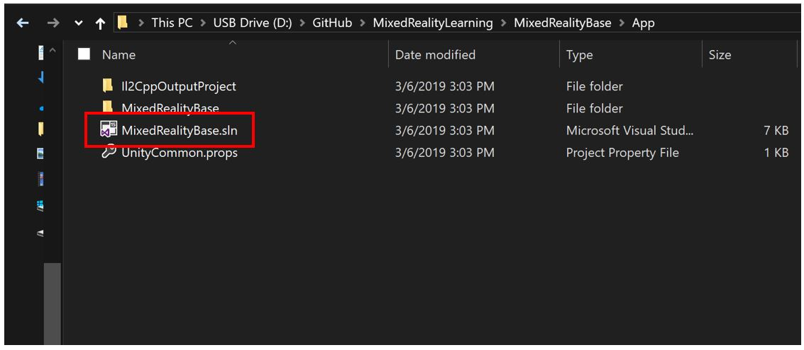

    >[!NOTE]
    >If Visual Studio asks you to install new components, ensure that all prerequisite components are installed as specified in [the "Install the Tools" page](install-the-tools.md)

8. Plug your HoloLens 2 into your PC with the USB cable. While these lesson instructions assume you will be deploying a testing with a HoloLens 2 device, you may also choose to deploy to the [HoloLens 2 emulator](using-the-hololens-emulator.md) or choose to create an [app package for sideloading](<https://docs.microsoft.com//windows/uwp/packaging/packaging-uwp-apps>)

9. Before building to your device, ensure that the device is in Developer Mode. If this is your first time deploying to the HoloLens 2, Visual Studio may ask you to pair your HoloLens 2 with a pin. Please follow [these instructions](https://docs.microsoft.com//windows/mixed-reality/using-visual-studio) if you need to enable developer mode or pair with Visual Studio.

10. Configure Visual Studio for building to your HoloLens 2 by selecting the “Release” configuration and the “ARM” architecture.

    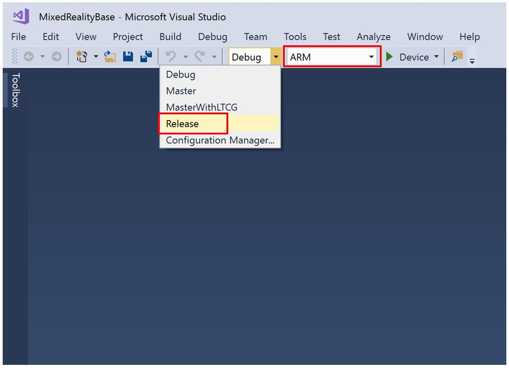

11. The final step is to build to your device by selecting Debug>Start without Debugging. Selecting “Start without Debugging” will cause the application to immediately start on your device upon a successful build, but without Debugging information appearing in Visual Studio. This also means that you can disconnect your USB cable while your application is running on your HoloLens 2 without stopping the application. You may also select Build>Deploy Solution to deploy to your device without having the application automatically start.

    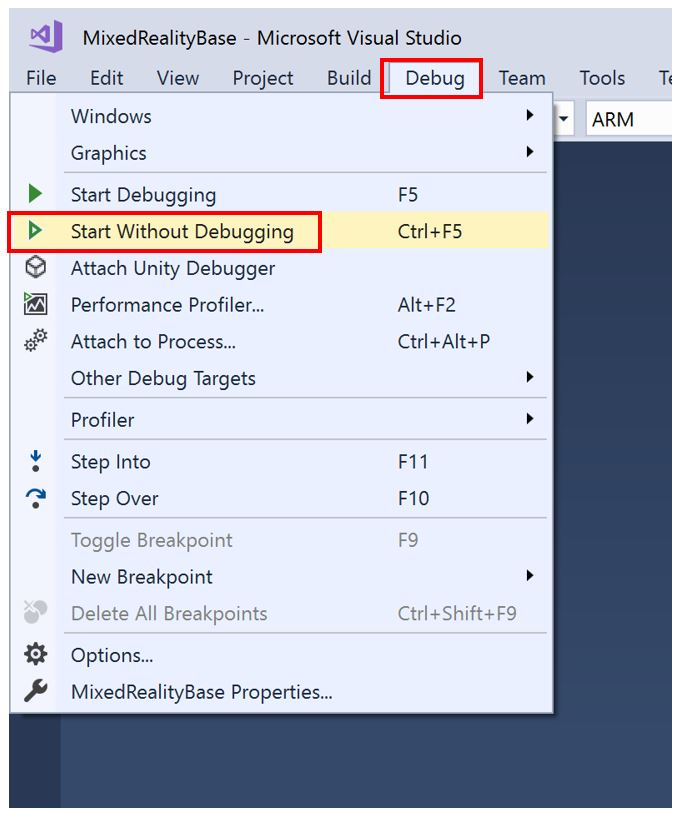

## Congratulations

You've set up voice recognition in your application, powered by Azure. Run the application to ensure all functions and features are working properly. Start with saying the wake word you typed in Step 22, Activate Terminal. Select the Microphone button to start voice recognition. Begin speaking. You will see your words transcribed in the terminal as you speak. Press the Microphone button a second time to stop voice recognition. Say Dismiss Terminal to hide the Lunarcom terminal. In the next lesson, you'll learn how to dynamically switch to using device-powered voice recognition for situations where Azure's speech SDK isn't available due to the HoloLens 2 being offline.

[Next tutorial: 2. Adding an offline mode for local speech-to-text translation](mrlearning-speechSDK-ch2.md)
