# Speech SDK Learning Module

In this tutorial you will create a [Unity](https://unity3d.com/) application that explores the Azure Cognitive Services Speech SDK.  When finished you will be able to use your computer's microphone to transcribe speech to text in real time, translate your speech into multiple languages, and even take advantage of Speech SDK’s Intent feature that provides for more flexible, AI-driven uses. If you are not familiar with Unity, it is recommended to study the [Unity User Manual](https://docs.unity3d.com/Manual/UnityManual.html) before starting your application development.

Objectives:

- Learn how to _____________________________________________
- Learn how to _________________________________________________

## Instructions

### Getting Started

1. Start Unity and create a new project. Enter the project name “Speech SDK Learning Module.” Choose a location for where to save your project. Then click "create project."

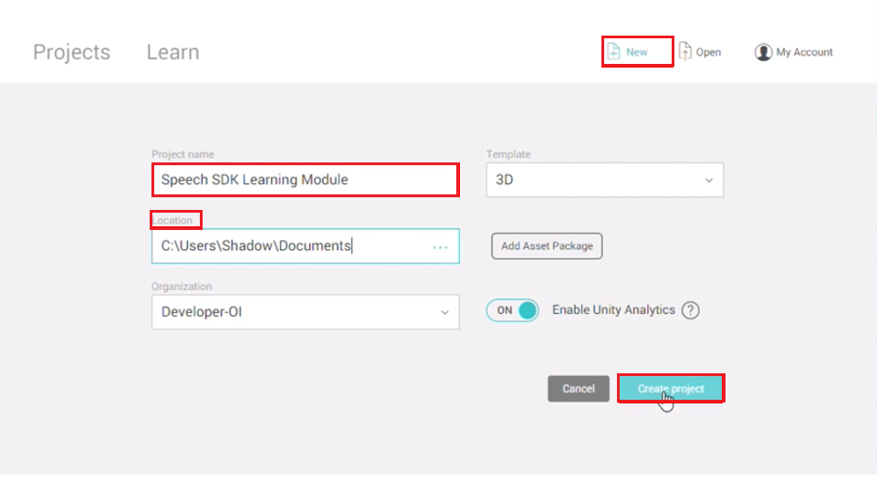

> note: ensure that the template is set to "3D."

2. Download the [Mixed Reality Toolkit](https://github.com/Microsoft/MixedRealityToolkit-Unity/releases/download/v2.0.0-RC1/Microsoft.MixedReality.Toolkit.Unity.Foundation-v2.0.0-RC1.unitypackage) Unity package and save it to a folder on your PC. Import the package into your Unity project. For more detailed instructions on how to do this, please see [base module lesson 1](link for base lesson). 

3. Download the [Speech SDK](https://aka.ms/csspeech/unitypackage) for Unity asset package. Import the Speech SDK package by clicking on "assets," selecting "import package," then selecting "custom package." Find the Speech SDK package downloaded earlier and open it to begin the importing process.

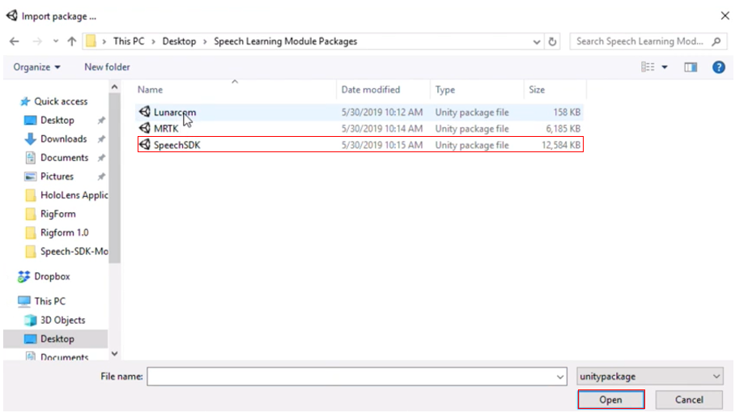

4. In the next pop-up window, click “Import” to begin importing the Speech SDK package. Ensure all items are checked, as shown in the image below.

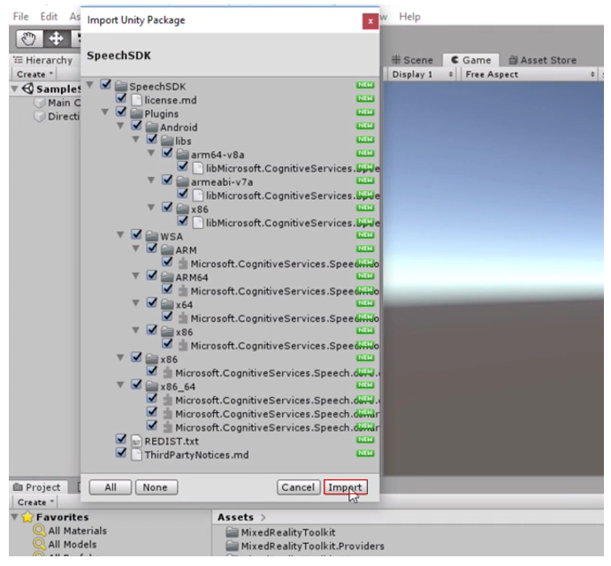

5. Download the [Lunarcom](https://github.com/levilais/Speech-SDK-Module/raw/master/Speech SDK Module/Lunarcom.unitypackage) asset package. Now do the same thing as in step 3, but with the Lunarcom asset package instead of the Speech SDK package.
6. In the next pop-up window, click “Import” to begin importing the Lunarcom. Just like before, ensure all items are checked, just like the image shown in step 4.
7. Configure the Mixed Reality Toolkit (MRTK). To do this, click on the "Mixed Reality Toolkit" panel in the top of your window, and then select "Add to Scene and Configure."

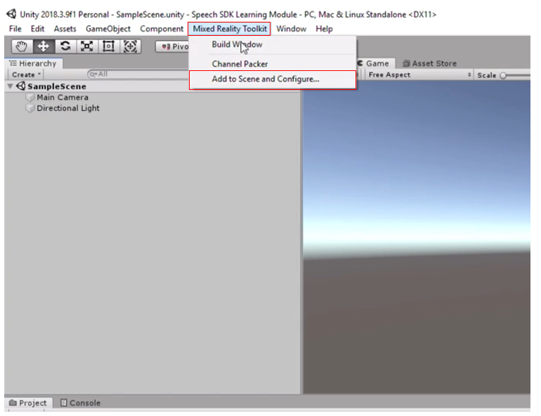

8. Your scene will now have several new items and modifications in it from the MRTK. Save your scene under a different name by clicking on "file," then "save as" and name your scene “SpeechScene”. Feel free to organize some files to neatly contain all of your projects.

   > note: if you press the play button on your scene after you add the MRTK to your project, and it doesn't enter the  "play" mode, you may need to restart Unity. 

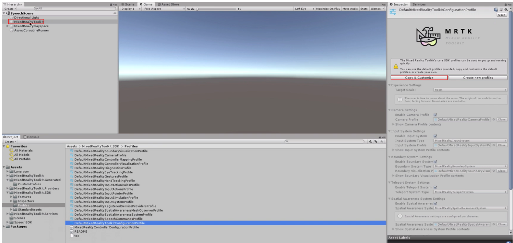

9. With the “MixedRealityToolkit" object selected in your hierarchy, click "copy and customize" in the inspector panel.

10. Also in the inspector panel, disable the diagnostics system by unchecking the box to the right of "enable diagnostics system."

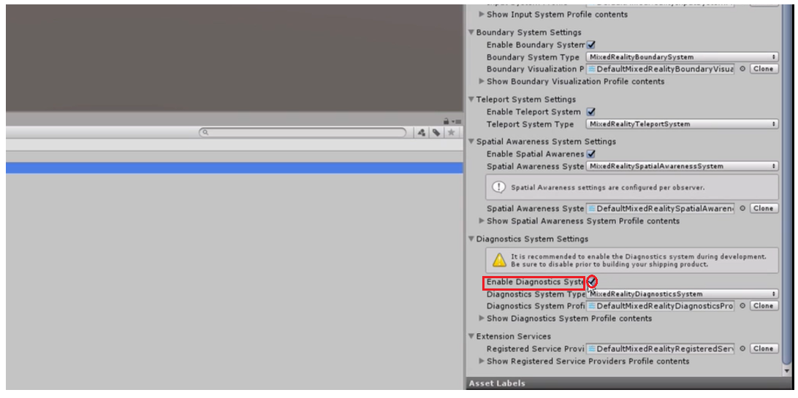

11. In the project panel, open up the "Lunarcom" folder and drag the "Lunarcom_Base" prefab into your hierarchy.

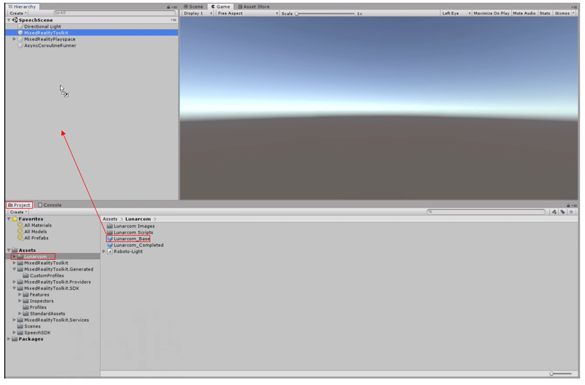

12. Select the "Lunarcom_Base" object in your hierarchy and ensure that the position is set to x=0, y=0, and z=0, as well as the rotation set to x=0, y=0, and z=0. Set the scale to read x=0.008, y=0.008, and z=0.01.

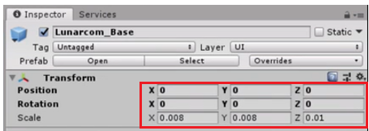

13. Click "add component" and search for and select “LunarcomController.”

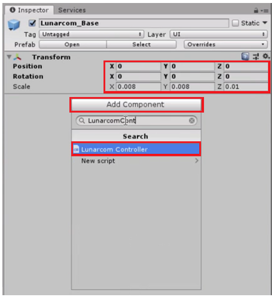

14. In order to connect our app to Azure Cognitive Services, you must enter a "subscription key" for the Speech Service. you can get one for free [here](https://docs.microsoft.com/en-us/azure/cognitive-services/speech-service/get-started). Enter it into the “Speech Service API Key” field of the "LunarcomController" component in the inspector panel.

15. Enter the Region that you chose when you signed up for the subscription key into the “Speech Service Region” field of the "LunarcomController" component in the inspector panel.

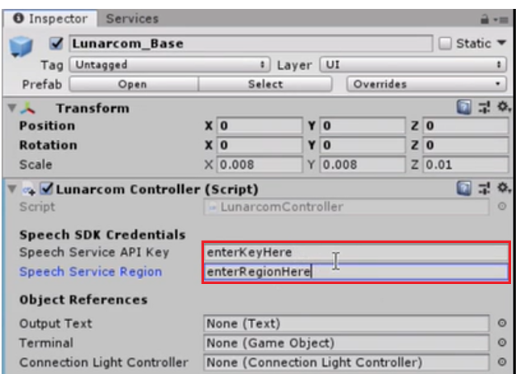

16. In your hierarchy, expand the "Lunarcom_Base" object by clicking the arrow to the left of it, then do the same for its child object, "Terminal."

17. While "Lunarcom_Base" is selected, click and drag “Lunarcom Text” from the hierarchy to the "Output Text" slot in the "LunarcomController" component in the inspector panel.
18. Now do the same thing with the "Terminal" object into the "terminal" slot and the "Connection Light" object to the "Connection Light Controller" slot.

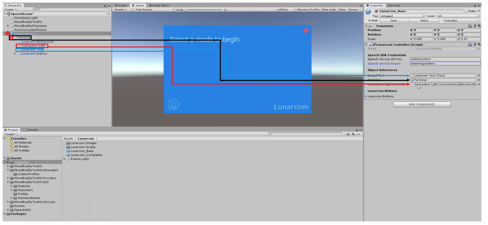

19. Click the arrow next to the "Lunarcom Buttons" section of the "LunarcomController" in the inspector panel and change the size to 3 and press “enter.”

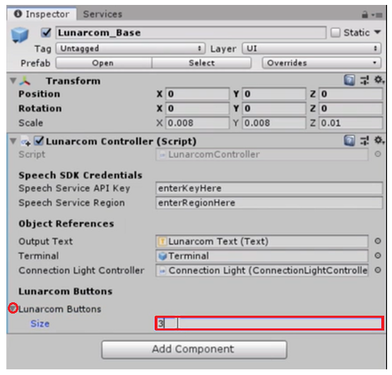

20. Expand the "Lunarcom Buttons" by clicking the arrow next to it in your hierarchy and, using the same process as above, drag the Mic, Satellite, and Rocket buttons to the Element 0, 1, and 2 references in the "LunarcomController" component in the inspector panel.

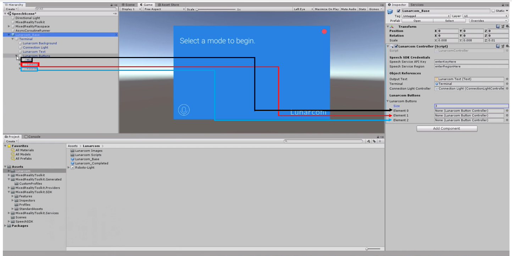

21. Select the "Lunarcom_Base" object in your hierarchy. Click “Add Component” in the inspector panel and search for and select “LunarcomWakeWordRecognizer.”

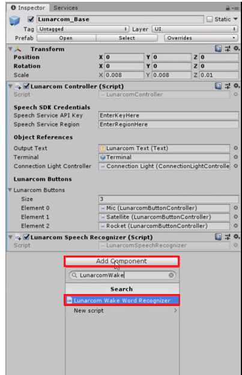

22. In the "wake word" slot, type in "Activate Terminal." Also, in the "dismiss word" slot, type in "Dismiss Terminal."

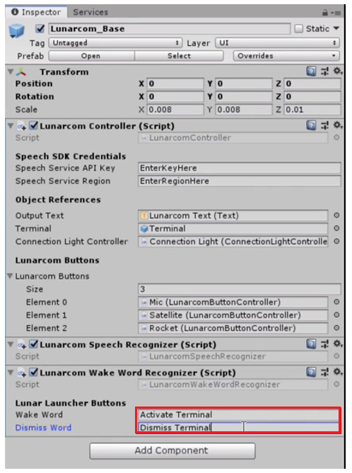

## Congratulations

You've officially set up vocal recognition in your application! Now, run the application to ensure all functions are working properly. Start with saying the wake word you typed in step 22. Then, press the microphone button and begin speaking. Press the microphone button a second time to stop the recognition. Once everything checks out, you're good to move on to Lesson 2!

[Next Lesson: Speech SDK Lesson 2](placeholderlink)

