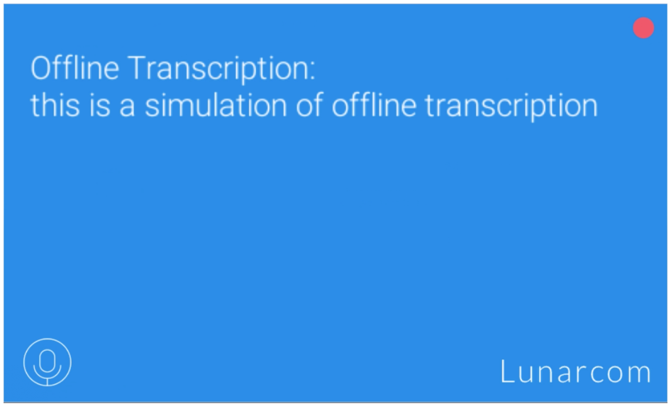

# Speech SDK Learning Module - Offline Speech Recognition

In this lesson you will learn how to leverage on-device speech capabilities in the event your device is disconnected from the internet or unable to access Azure cloud services. 

## Objectives

- Learn how to enable on-device voice commands to fall back on when you are offline
- Learn about speech input options in the Mixed Reality Toolkit
- Learn how to toggle between on-device speech input and Azure's Speech SDK systems

## Instructions

1. Select the "Lunarcom_Base" object in the hierarchy and click “Add Component” in the inspector panel. Search for and select the "Lunarcom Offline Recognition." This script is responsible for managing the on-device speech recognition system.

2. Click the dropdown in the “LunarcomOfflineRecognizer” script and select “Enabled” for the "Simulated Offline Mode" option. This will toggle the project to use the on-device speech recognizer instead of Azure's Speech SDK.

3. Now, press play on the Unity Editor and test it. Press the microphone in the bottom left hand corner in the scene and begin speaking. 

> Note: because we’re offline, the Wake Word functionality has been disabled. So, you will have to physically click the microphone every time you wish to have your speech recognized while offline. 

Below is an example of what your scene could look like:

## Congratulations

In this lesson you learned how to leverage on-device speech capabilities for situations when your device is disconnected from the internet or unable to access Azure cloud services. 

[Next Lesson: SpeechSDK Lesson 3](mrlearning-speechSDK-ch3.md)

