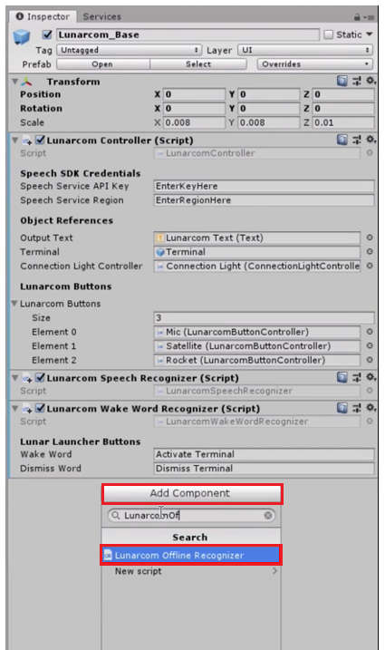
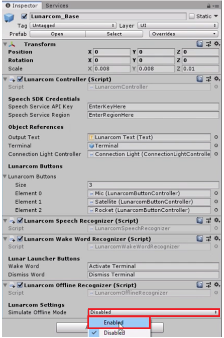

## Lesson 2

In Lesson 2, we will add an Offline mode that will allow us to perform local speech-to-text translation when we are unable to connect to the Azure service and we will *simulate* a disconnected state.

1. Select the "Lunarcom_Base" object in the hierarchy and click “Add Component” in the inspector panel. Search for and select the "Lunarcom Offline Recognition."

2. Click the dropdown in the “LunarcomOfflineRecognizer” and select “Enabled.” This will program the project to act like the user doesn't have connection. 

3. Now, press play on the Unity Editor and test it. Press the microphone in the bottom left hand corner in the scene and begin speaking. 

> note: because we’re offline, the Wake Word functionality has been disabled. So, you will have to physically click the microphone every time you wish to have your speech recognized while offline. 

## Congratulations

The offline mode has been enabled! Now when you're away from any form of internet, you can still work on your project with Speech-SDK! 

[Next Lesson: SpeechSDK Lesson 3](link placeholder)

