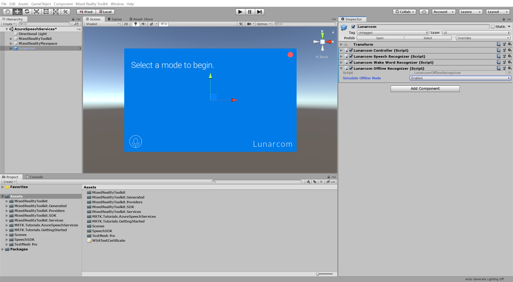
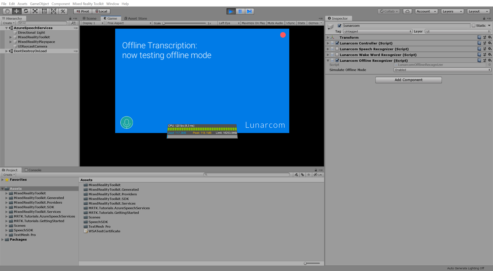

# 2. Adding an offline mode for local speech-to-text translation
<!-- TODO: Consider renaming to 'Adding an offline mode for local speech-to-text transcription' -->

In this tutorial, you will add an offline mode that lets you perform local speech-to-text transcription when you are unable to connect to the Azure service. You will also simulate a disconnected state

## Objectives

* Learn how to integrate an offline mode for local speech-to-text transcription

## Instructions

In the Hierarchy window, select the **Lunarcom** object, then in the Inspector window, use the **Add Component** button to add the **Lunarcom Offline Recognizer (Script)** component to the Lunarcom object and configure it as follows:

* Change the **Simulate Offline Mode** to **Enabled** to enable offline mode

> [!NOTE]
> The Lunarcom Offline Recognizer (Script) component is not part of MRTK. It was provided with this tutorial's assets.

If you now enter Game mode, you can test the speech recognition in offline mode by first pressing the microphone button. Then, assuming your computer has a microphone, when you say something, your speech will be transcribed on the terminal panel:

> [!NOTE]
> Because offline mode is enabled, the wake word functionality has been automatically disabled and the terminal panel is enabled by default.

## Congratulations

The offline mode has been enabled. Now, when your device is offline, you can still work on your project with the speech SDK.

[Next Tutorial: 3. Adding the Azure Cognitive Services speech translation component](mrlearning-speechSDK-ch3.md)
